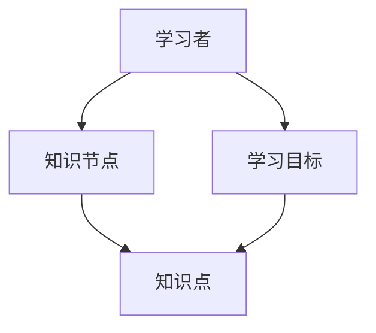
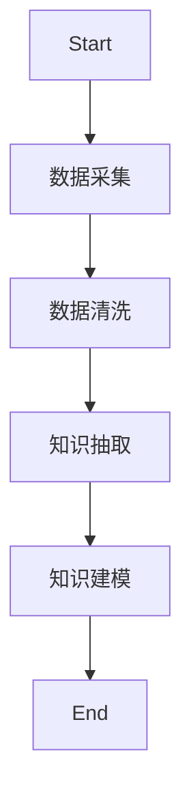
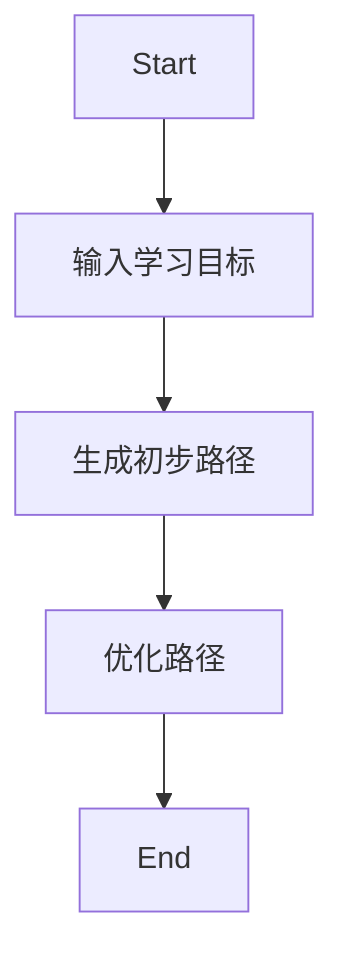
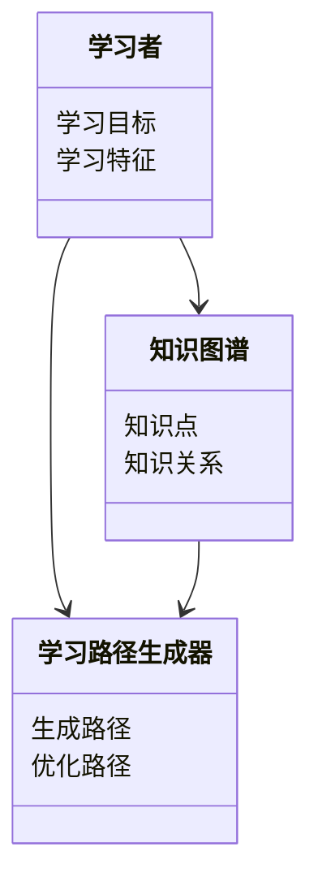

                 


# 个性化学习路径规划AI Agent：LLM辅助的教育定制

> 关键词：个性化学习，AI Agent，LLM，教育技术，知识图谱，学习路径规划

> 摘要：本文探讨了基于大语言模型（LLM）的个性化学习路径规划AI Agent的设计与实现。通过分析学习者特征、构建知识图谱、设计算法模型，结合系统架构和项目实战，详细阐述了如何利用AI技术实现教育定制化，为学习者提供高效、个性化的学习方案。

---

## 第1章：背景介绍与问题分析

### 1.1 个性化学习的背景与意义

#### 1.1.1 当前教育体系的挑战
传统教育体系通常采用统一的教学方式，难以满足每个学习者的个性化需求。学习者的认知水平、兴趣爱好和学习目标存在显著差异，而标准化的教学模式难以兼顾这些差异。

#### 1.1.2 个性化学习的重要性
个性化学习能够根据学习者的特征和需求，提供量身定制的学习方案，从而提高学习效率和效果。通过个性化学习路径规划，学习者可以更高效地掌握知识，减少无效学习时间。

#### 1.1.3 AI技术在教育中的应用潜力
AI技术，尤其是大语言模型（LLM），在教育领域的应用为个性化学习提供了新的可能性。LLM可以通过自然语言处理和知识推理，帮助学习者制定个性化的学习计划，并提供实时反馈和建议。

---

### 1.2 学习路径规划的核心问题

#### 1.2.1 学习者特征分析
学习者特征包括认知水平、学习风格、兴趣爱好、学习目标等。这些特征是个性化学习路径规划的基础。

#### 1.2.2 知识体系构建
知识体系的构建需要将知识点组织成一个结构化的图谱，以便AI Agent能够理解知识之间的关系，并根据学习者的特征推荐合适的学习路径。

#### 1.2.3 学习目标设定
学习目标是个性化学习路径规划的核心。通过分析学习者的短期和长期目标，AI Agent可以生成符合目标的学习计划。

---

### 1.3 个性化学习路径规划的实现路径

#### 1.3.1 数据驱动的分析方法
通过收集和分析学习者的行为数据、学习记录和评估结果，AI Agent可以更好地理解学习者的需求和特点。

#### 1.3.2 AI算法的应用场景
AI算法在学习路径规划中的应用包括知识图谱构建、学习者画像生成、路径优化等。

#### 1.3.3 LLM在教育中的独特价值
LLM具有强大的自然语言处理能力和知识推理能力，能够帮助学习者更好地理解和掌握知识，同时提供个性化的学习建议和反馈。

---

### 1.4 本章小结

本章介绍了个性化学习的重要性及其在教育中的应用潜力，分析了学习路径规划的核心问题，并探讨了AI技术在其中的关键作用。接下来将详细阐述个性化学习路径规划的核心概念与理论基础。

---

## 第2章：核心概念与理论基础

### 2.1 个性化学习路径规划的原理

#### 2.1.1 学习者画像构建
学习者画像是基于学习者特征构建的虚拟模型，用于描述学习者的认知水平、兴趣爱好和学习目标等。

#### 2.1.2 知识图谱的构建与应用
知识图谱是一种结构化的知识表示方法，通过节点和边描述知识点之间的关系。知识图谱的构建是个性化学习路径规划的基础。

#### 2.1.3 学习路径生成算法
学习路径生成算法基于学习者画像和知识图谱，生成符合学习者需求的学习路径。

---

### 2.2 LLM在教育中的核心作用

#### 2.2.1 LLM的自然语言处理能力
LLM能够理解和生成自然语言，帮助学习者更好地理解和掌握知识。

#### 2.2.2 LLM的知识推理能力
LLM可以通过知识推理，帮助学习者发现知识之间的联系，并生成合理的学习路径。

#### 2.2.3 LLM的个性化交互能力
LLM可以通过个性化的交互方式，为学习者提供实时反馈和建议。

---

### 2.3 系统的核心概念与联系

#### 2.3.1 实体关系图（ER图）


#### 2.3.2 知识图谱构建流程图


---

### 2.4 本章小结

本章详细阐述了个性化学习路径规划的核心概念和理论基础，分析了LLM在教育中的核心作用，并通过实体关系图和知识图谱构建流程图展示了系统的核心概念与联系。接下来将探讨算法原理与数学模型。

---

## 第3章：算法原理与数学模型

### 3.1 算法原理

#### 3.1.1 基于LLM的学习路径生成算法


#### 3.1.2 基于强化学习的路径优化算法
强化学习通过不断试错，优化学习路径的效率和效果。

#### 3.1.3 算法流程图


---

### 3.2 数学模型与公式

#### 3.2.1 知识图谱表示模型
知识点之间的关系可以通过图论中的边表示，例如：
$$
E = \{ (u, v, r) \mid u, v \in V, r \in R \}
$$
其中，\( V \) 是知识点集合，\( R \) 是关系集合。

#### 3.2.2 学习路径生成模型
学习路径生成模型可以表示为：
$$
P = f(L, K)
$$
其中，\( L \) 是学习者特征，\( K \) 是知识图谱，\( f \) 是生成路径的函数。

---

### 3.3 本章小结

本章详细讲解了个性化学习路径规划的算法原理和数学模型，通过流程图和公式展示了系统的核心算法。接下来将探讨系统分析与架构设计方案。

---

## 第4章：系统分析与架构设计

### 4.1 问题场景介绍

个性化学习路径规划系统需要解决的问题包括：
1. 如何高效构建知识图谱？
2. 如何准确分析学习者特征？
3. 如何生成最优学习路径？

---

### 4.2 项目介绍

个性化学习路径规划系统是一个基于AI技术的教育辅助系统，旨在为学习者提供个性化的学习方案。

---

### 4.3 系统功能设计

#### 4.3.1 领域模型


---

### 4.4 本章小结

本章分析了个性化学习路径规划系统的需求和架构，设计了系统的功能模块和交互流程。接下来将探讨项目实战和具体实现。

---

## 第5章：项目实战

### 5.1 环境安装

需要安装的环境包括：
1. Python 3.8+
2. PyTorch
3. Transformers库

---

### 5.2 系统核心实现

#### 5.2.1 数据预处理
```python
def preprocess_data(data):
    # 数据清洗和特征提取
    pass
```

#### 5.2.2 知识图谱构建
```python
def buildKnowledgeGraph():
    # 从数据中抽取知识点和关系
    pass
```

#### 5.2.3 学习路径生成
```python
def generateLearningPath():
    # 基于知识图谱生成学习路径
    pass
```

---

### 5.3 案例分析

以一个学习者为例，展示系统如何生成个性化学习路径。

---

### 5.4 本章小结

本章通过具体实现展示了个性化学习路径规划系统的可行性，分析了系统的核心模块和实现步骤。

---

## 第6章：最佳实践与小结

### 6.1 应用案例

个性化学习路径规划系统在教育领域的成功应用案例。

---

### 6.2 效果评估

评估系统的效果，包括学习效率和学习效果的提升。

---

### 6.3 注意事项

在使用系统时需要注意的事项，例如数据隐私保护等。

---

### 6.4 未来展望

个性化学习路径规划系统的未来发展方向。

---

## 作者：AI天才研究院 & 禅与计算机程序设计艺术

---

**摘要**：本文系统性地探讨了基于LLM的个性化学习路径规划AI Agent的设计与实现。通过分析学习者特征、构建知识图谱、设计算法模型，结合系统架构和项目实战，详细阐述了如何利用AI技术实现教育定制化，为学习者提供高效、个性化的学习方案。

