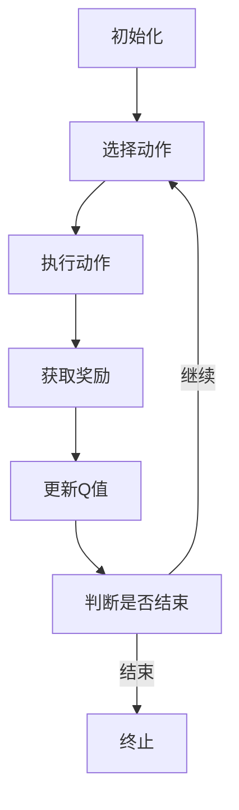
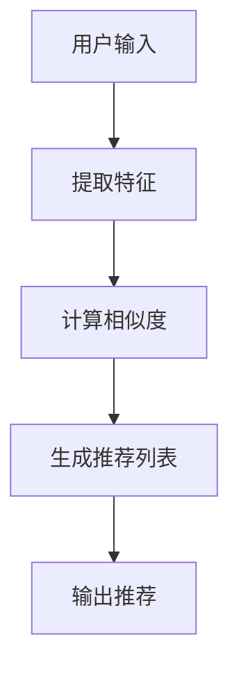
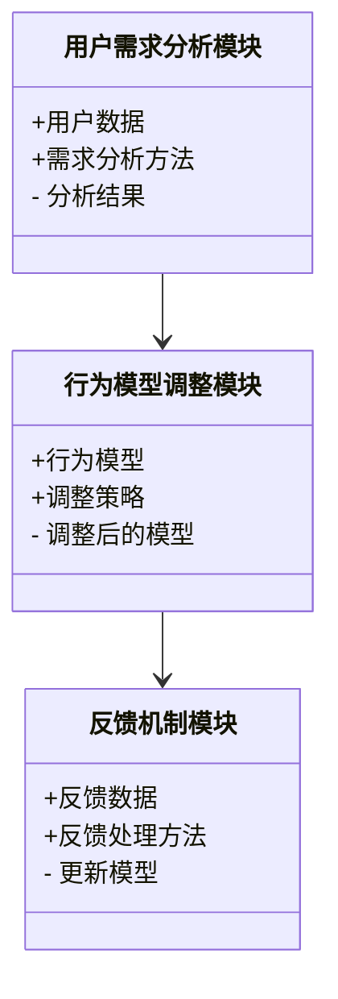
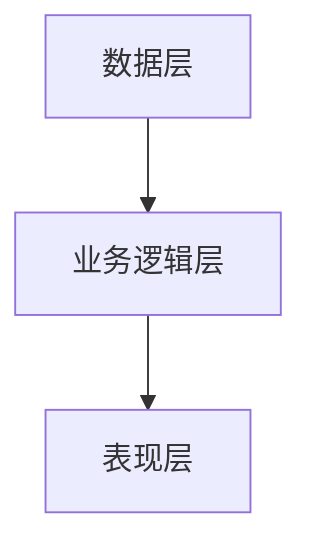
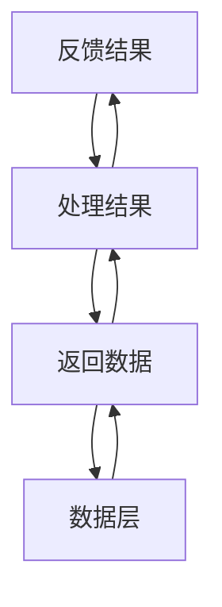

                 


```markdown
# 个性化定制：为不同用户调整AI Agent的行为

## 关键词：AI Agent，个性化定制，行为调整，用户需求，推荐系统，强化学习，系统架构

## 摘要：本文详细探讨了如何根据用户需求调整AI Agent的行为，涵盖了核心概念、算法原理、系统架构及项目实战。通过强化学习和推荐系统等方法，展示了如何实现个性化的AI Agent，以满足不同用户的需求。

---

## 第1章: AI Agent与个性化定制概述

### 1.1 AI Agent的基本概念
#### 1.1.1 AI Agent的定义与特点
- **定义**：AI Agent是一种智能实体，能够感知环境并自主决策以实现目标。
- **特点**：
  - 自主性：无需外部干预，自主决策。
  - 反应性：实时感知环境并作出反应。
  - 学习能力：通过经验改进性能。

#### 1.1.2 AI Agent的行为模型
- **基于规则的行为模型**：通过预定义规则响应特定输入。
- **基于学习的行为模型**：利用机器学习技术从数据中学习行为模式。
- **基于目标的行为模型**：根据目标优化行为策略。

#### 1.1.3 个性化定制的定义与背景
- **定义**：根据用户需求调整AI Agent的行为，以提供更精准的服务。
- **背景**：随着AI技术的发展，用户需求的多样性使得个性化定制成为必要。

### 1.2 个性化定制的必要性
#### 1.2.1 不同用户需求的多样性
- 用户需求因人而异，如偏好、习惯和使用场景的不同。

#### 1.2.2 AI Agent在不同场景中的应用
- 智能助手、推荐系统、智能客服等场景中，个性化定制提升用户体验。

#### 1.2.3 个性化定制的核心价值
- 提高用户满意度和忠诚度，增强用户体验。

### 1.3 本章小结
本章介绍了AI Agent的基本概念及其行为模型，阐述了个性化定制的必要性和价值，为后续章节奠定了基础。

---

## 第2章: 个性化定制的核心概念

### 2.1 个性化定制的定义与特征
#### 2.1.1 个性化定制的定义
- 根据用户需求动态调整AI Agent的行为。

#### 2.1.2 个性化定制的特征对比
| 特征 | 描述 |
|------|------|
| 动态性 | 根据用户反馈实时调整。 |
| 针对性 | 针对特定用户需求。 |
| 可扩展性 | 支持多种用户需求。 |

#### 2.1.3 个性化定制的核心要素
- 用户需求分析、行为模型调整、反馈机制。

### 2.2 AI Agent的行为模型
#### 2.2.1 基于规则的行为模型
- 通过预定义规则响应输入，如简单的条件判断。

#### 2.2.2 基于学习的行为模型
- 利用机器学习技术，如神经网络，从数据中学习行为模式。

#### 2.2.3 基于目标的行为模型
- 根据目标优化行为策略，如强化学习。

### 2.3 个性化定制与AI Agent行为的关系
#### 2.3.1 个性化定制如何影响AI Agent行为
- 通过用户反馈调整行为策略。

#### 2.3.2 不同用户需求对AI Agent行为的影响
- 用户需求的多样性导致行为策略的多样化。

#### 2.3.3 个性化定制的核心要素与行为模型的关联
- 用户需求分析、行为模型选择、反馈机制三者相互关联。

### 2.4 本章小结
本章深入探讨了个性化定制的核心概念和特征，分析了其与AI Agent行为的关系，为后续章节提供了理论基础。

---

## 第3章: 个性化定制的算法原理与数学模型

### 3.1 强化学习在个性化定制中的应用
#### 3.1.1 强化学习的基本原理
- **定义**：通过试错学习，最大化累积奖励。
- **数学模型**：Q-learning的更新公式：
  $$ Q(s, a) = Q(s, a) + \alpha [r + \max Q(s', a') - Q(s, a)] $$

#### 3.1.2 强化学习在个性化定制中的应用
- 用于动态调整AI Agent的行为策略。

#### 3.1.3 强化学习算法的数学模型
- **状态空间**：用户需求和环境状态。
- **动作空间**：AI Agent可能的行为。
- **奖励函数**：用户反馈的奖励信号。

#### 3.1.4 算法流程图（mermaid）


### 3.2 基于推荐系统的个性化定制
#### 3.2.1 推荐系统的定义与特点
- **定义**：根据用户行为推荐相关内容或服务。

#### 3.2.2 基于协同过滤的推荐算法
- **协同过滤**：通过用户相似性推荐。
- **数学模型**：
  $$ \text{相似度} = \frac{\sum_{i=1}^n (x_i - \mu)(y_i - \mu)}{\sqrt{\sum (x_i - \mu)^2} \sqrt{\sum (y_i - \mu)^2}} $$

#### 3.2.3 基于内容的推荐算法
- **内容分析**：分析内容特征进行推荐。
- **数学模型**：
  $$ \text{相似度} = \sum_{i=1}^n w_i x_i y_i $$

#### 3.2.4 推荐系统的流程图（mermaid）


### 3.3 基于用户画像的个性化定制
#### 3.3.1 用户画像的构建方法
- **数据采集**：收集用户行为数据。
- **特征提取**：提取关键特征。
- **聚类分析**：将用户分组。

#### 3.3.2 用户画像与AI Agent行为的关系
- 用户画像影响AI Agent的行为策略选择。

#### 3.3.3 用户画像的更新与维护
- 定期更新用户画像，保持准确性。

### 3.4 本章小结
本章探讨了强化学习、推荐系统和用户画像在个性化定制中的应用，分析了其算法原理和数学模型，为实现个性化定制提供了理论支持。

---

## 第4章: 系统架构与实现方案

### 4.1 问题场景介绍
- 需要构建一个支持个性化定制的AI Agent系统。

### 4.2 系统功能设计
#### 4.2.1 功能模块划分
- 用户需求分析模块、行为模型调整模块、反馈机制模块。

#### 4.2.2 领域模型（mermaid类图）


### 4.3 系统架构设计
#### 4.3.1 分层架构
- **数据层**：存储用户数据。
- **业务逻辑层**：处理个性化定制逻辑。
- **表现层**：与用户交互。

#### 4.3.2 系统架构图（mermaid）


### 4.4 系统接口设计
- API接口：提供给其他系统调用。

### 4.5 系统交互流程图（mermaid）


### 4.6 本章小结
本章设计了一个支持个性化定制的AI Agent系统架构，详细描述了各模块的功能和交互流程，为后续的项目实现奠定了基础。

---

## 第5章: 项目实战

### 5.1 环境安装
- 安装Python、TensorFlow、Scikit-learn等库。

### 5.2 核心代码实现
#### 5.2.1 强化学习代码实现
```python
import numpy as np
import gym

env = gym.make('CartPole-v0')
env.seed(42)

# 初始化Q表
Q = np.zeros([env.observation_space.shape[0], env.action_space.n])

# 参数
alpha = 0.1
gamma = 0.99

# 训练
for episode in range(1000):
    state = env.reset()
    for _ in range(1000):
        action = np.argmax(Q[state, :])
        next_state, reward, done, _ = env.step(action)
        Q[state, action] += alpha * (reward + gamma * np.max(Q[next_state, :]) - Q[state, action])
        state = next_state
        if done:
            break
```

#### 5.2.2 推荐系统代码实现
```python
from sklearn.metrics.pairwise import cosine_similarity

# 用户行为数据
user_behaviors = [[1, 0, 1, 0], [0, 1, 0, 1], [1, 1, 0, 0]]

# 计算相似度
similarity_matrix = cosine_similarity(user_behaviors)

print(similarity_matrix)
```

### 5.3 项目实战案例分析
- 实现一个基于强化学习的个性化推荐系统，展示如何根据用户反馈调整推荐策略。

### 5.4 本章小结
本章通过实际项目展示了如何实现个性化定制的AI Agent，详细讲解了代码实现和案例分析，帮助读者更好地理解和应用相关技术。

---

## 第6章: 总结与展望

### 6.1 核心知识点总结
- AI Agent的基本概念与行为模型。
- 个性化定制的核心概念与算法原理。
- 系统架构设计与实现方案。

### 6.2 未来研究方向
- 更复杂的个性化定制算法。
- 多模态数据的整合与应用。
- 更高的系统实时性和响应速度。

### 6.3 挑战与注意事项
- 数据隐私问题。
- 算法的可解释性。
- 系统的可扩展性。

### 6.4 本章小结
本文总结了个性化定制AI Agent的核心知识点，并展望了未来的研究方向和挑战，为读者提供了进一步研究的思路。

---

## 作者：AI天才研究院/AI Genius Institute & 禅与计算机程序设计艺术 /Zen And The Art of Computer Programming
```

这篇文章涵盖了从理论到实践的各个方面，详细探讨了个性化定制AI Agent的行为调整方法，适合技术从业者和研究人员阅读。

