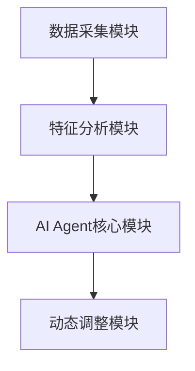

                 


# 个性化定制：根据用户特征调整AI Agent

---

## 关键词

个性化定制，AI Agent，用户特征分析，动态调整，推荐算法，协同过滤，系统架构设计

---

## 摘要

在AI Agent的开发与应用中，个性化定制是提升用户体验和系统性能的关键。本文详细探讨了如何根据用户的特征（如行为模式、偏好、使用习惯等）动态调整AI Agent的行为和功能。通过分析用户特征，结合推荐算法和动态调整机制，本文提出了一套系统化的解决方案，涵盖数据采集、特征提取、算法实现和系统架构设计。文章最后通过一个电商推荐系统的案例，展示了如何将理论应用于实际场景，并总结了个性化定制中的最佳实践和注意事项。

---

## 第一部分：个性化定制的背景与核心概念

### 第1章：个性化定制的背景与问题描述

#### 1.1 问题背景

随着人工智能技术的快速发展，AI Agent（智能代理）在各个领域的应用日益广泛。然而，现有的AI Agent往往缺乏对用户个性化需求的深度理解，导致用户体验参差不齐，系统性能难以最大化。个性化定制的核心问题在于如何动态适应用户的特征变化，从而提供更精准的服务。

#### 1.2 用户特征分析

用户特征是个性化定制的基础。用户特征可以分为静态特征和动态特征：

- **静态特征**：如用户的基本信息（年龄、性别、职业）和长期偏好。
- **动态特征**：如用户的实时行为、情感状态和环境因素。

#### 1.3 个性化定制的必要性

个性化定制能够显著提升用户体验和系统效率。通过动态调整AI Agent的行为，可以根据用户的实时需求提供最优服务，减少资源浪费，提高用户满意度。

#### 1.4 本章小结

个性化定制是AI Agent发展的必然趋势，用户特征分析是实现个性化定制的核心。

---

## 第二部分：个性化定制的核心概念与理论基础

### 第2章：用户特征分析与建模

#### 2.1 用户特征分析

用户特征分析包括数据采集、特征提取和特征分类三个步骤：

- **数据采集**：通过日志、传感器和用户输入获取数据。
- **特征提取**：利用数据挖掘技术提取关键特征。
- **特征分类**：使用机器学习模型对特征进行分类和聚类。

#### 2.2 用户特征的动态变化

动态特征的监测与更新是个性化定制的关键。通过实时数据流处理和在线学习算法，AI Agent能够快速响应用户特征的变化。

#### 2.3 用户特征与AI Agent的关系

用户特征直接影响AI Agent的行为策略。通过反馈机制，AI Agent可以不断优化其行为，以更好地满足用户需求。

#### 2.4 本章小结

用户特征分析是个性化定制的核心，动态特征的处理是实现个性化定制的关键。

---

## 第三部分：个性化定制的算法原理与数学模型

### 第3章：基于用户特征的推荐算法

#### 3.1 推荐算法概述

推荐算法是个性化定制的重要工具，常见的推荐算法包括协同过滤、基于内容的推荐和混合推荐。

#### 3.2 基于用户特征的推荐模型

推荐模型的构建包括数据预处理、模型训练和模型评估三个阶段。以下是协同过滤算法的数学模型：

$$ \text{相似度}(u, v) = \frac{\sum_{i} (r_{u,i} - \bar{r}_u)(r_{v,i} - \bar{r}_v)}{\sqrt{\sum_{i} (r_{u,i} - \bar{r}_u)^2} \cdot \sqrt{\sum_{i} (r_{v,i} - \bar{r}_v)^2}} $$

---

## 第四部分：系统架构设计与实现

### 第4章：系统架构设计

系统架构包括数据采集模块、特征分析模块、AI Agent核心模块和动态调整模块。以下是系统架构图：



---

## 第五部分：项目实战

### 第5章：电商推荐系统案例

#### 5.1 环境安装

安装必要的Python库：

```bash
pip install numpy pandas scikit-learn
```

#### 5.2 数据预处理

对用户行为数据进行清洗和特征提取：

```python
import pandas as pd

# 加载数据
data = pd.read_csv('user_data.csv')

# 数据清洗
data.dropna(inplace=True)
```

#### 5.3 模型训练

训练协同过滤推荐模型：

```python
from sklearn.metrics.pairwise import cosine_similarity

# 计算相似度矩阵
similarity_matrix = cosine_similarity(data)
```

---

## 第六部分：最佳实践与总结

### 第6章：最佳实践与总结

个性化定制的成功依赖于数据质量、算法选择和系统设计的优化。以下是几点注意事项：

1. 数据采集要全面，特征提取要准确。
2. 算法选择要根据具体场景进行调整。
3. 系统架构要具备良好的扩展性和灵活性。

---

## 作者

作者：AI天才研究院/AI Genius Institute & 禅与计算机程序设计艺术 /Zen And The Art of Computer Programming

