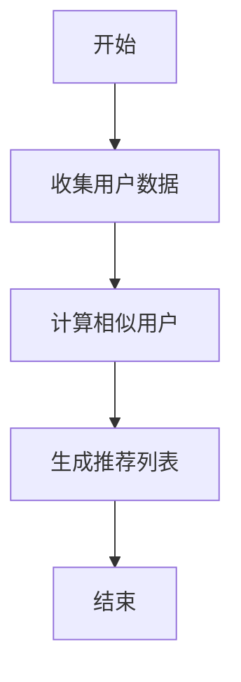
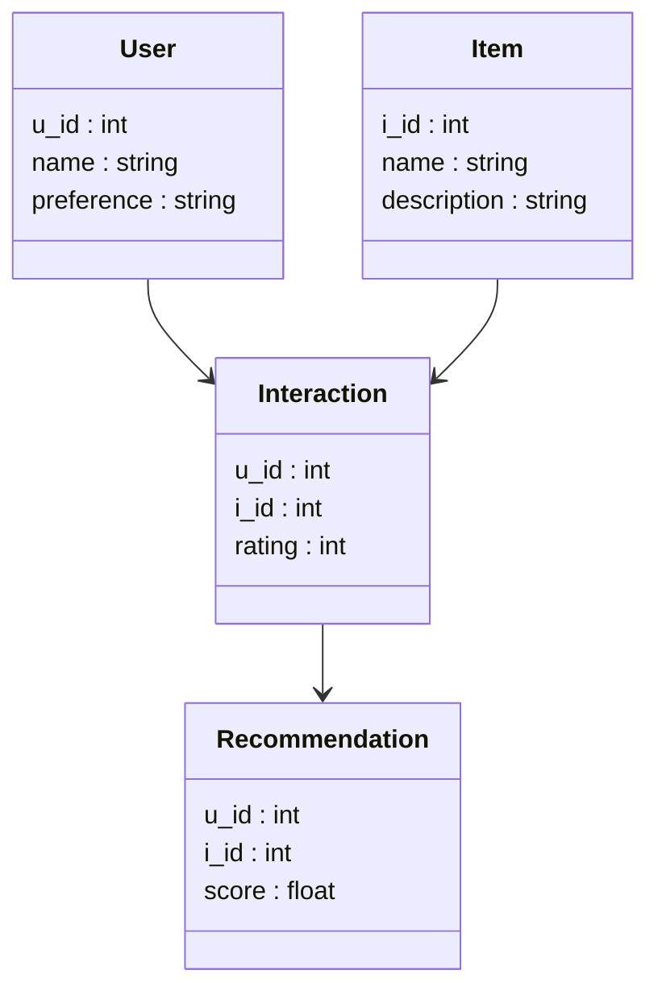
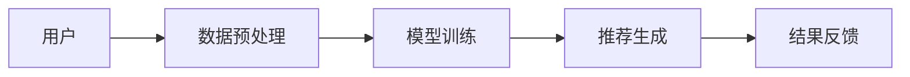
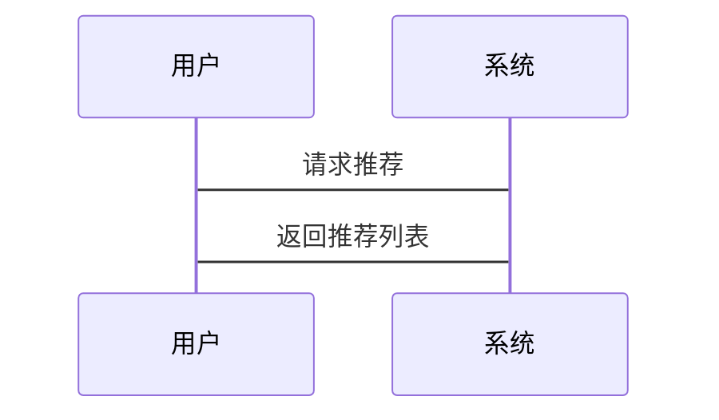

                 


# 个性化推荐 AI Agent：基于 LLM 的精准营销系统

> 关键词：个性化推荐、AI Agent、大语言模型、精准营销、推荐系统

> 摘要：本文深入探讨了基于大语言模型（LLM）的个性化推荐系统在精准营销中的应用。通过分析个性化推荐的核心概念、AI Agent的作用机制、LLM在推荐系统中的应用，以及具体的算法实现和系统架构设计，本文旨在为读者提供从理论到实践的全面指南。通过实际案例分析和系统实现，帮助读者理解如何利用AI技术提升营销效果。

---

# 第一部分: 背景与概述

## 第1章: 个性化推荐与AI Agent概述

### 1.1 个性化推荐的背景与概念

#### 1.1.1 个性化推荐的定义与特点
个性化推荐是一种基于用户行为、偏好和历史数据，通过算法生成符合用户需求的内容或产品推荐的技术。其核心目标是通过分析用户行为数据，预测用户的兴趣和需求，从而提供个性化的推荐结果。个性化推荐具有实时性、精准性和动态性等特点。

#### 1.1.2 AI Agent的基本概念
AI Agent（人工智能代理）是一种能够感知环境、执行任务并做出决策的智能实体。在精准营销中，AI Agent可以通过分析用户数据，主动为用户推荐相关内容或产品。AI Agent的核心能力包括数据处理、决策制定和自主学习。

#### 1.1.3 个性化推荐在精准营销中的应用
个性化推荐在精准营销中的应用广泛，包括电商推荐、内容推荐、广告投放等领域。通过个性化推荐，企业可以提高用户满意度和转化率，降低营销成本。

### 1.2 问题背景与描述

#### 1.2.1 传统营销方式的局限性
传统营销方式通常采用通用的广告投放和批量营销策略，难以满足用户的个性化需求。这种方式可能导致用户兴趣匹配度低，转化率低下。

#### 1.2.2 用户需求的多样化与个性化
现代用户需求日益多样化，用户对产品和服务的个性化需求日益增长。传统营销方式难以满足这种多样化的需求，需要借助智能化技术实现精准匹配。

#### 1.2.3 精准营销的核心问题与挑战
精准营销的核心问题在于如何高效地匹配用户需求与产品服务。其主要挑战包括数据获取与处理、算法优化、实时性要求高等。

### 1.3 问题解决与边界

#### 1.3.1 个性化推荐的解决方案
个性化推荐通过分析用户行为数据和偏好，利用算法生成个性化推荐结果。其核心步骤包括数据采集、特征提取、模型训练和推荐生成。

#### 1.3.2 AI Agent在精准营销中的角色
AI Agent在精准营销中扮演着数据处理、推荐生成和用户交互的角色。它能够实时分析用户行为，动态调整推荐策略，提升推荐的精准度和用户满意度。

#### 1.3.3 个性化推荐的边界与外延
个性化推荐的边界在于用户隐私保护和数据安全。其外延包括情感计算、行为分析等高级技术，能够进一步提升推荐的智能化水平。

### 1.4 核心概念结构与组成

#### 1.4.1 个性化推荐的核心要素
个性化推荐的核心要素包括用户数据、推荐算法、推荐结果和用户反馈。

#### 1.4.2 AI Agent的系统架构
AI Agent的系统架构包括感知层、决策层和执行层，分别负责数据采集、策略制定和任务执行。

#### 1.4.3 精准营销的实现路径
精准营销的实现路径包括数据采集、模型训练、策略制定和效果评估。

---

## 第2章: 大语言模型（LLM）与推荐系统

### 2.1 大语言模型的基本原理

#### 2.1.1 LLM的定义与特点
大语言模型是一种基于深度学习的自然语言处理模型，具有强大的语言理解和生成能力。其特点包括大规模数据训练、多任务学习能力和自适应性。

#### 2.1.2 LLM的核心算法与训练方法
大语言模型的核心算法包括Transformer和BERT等。训练方法采用自监督学习，通过预测任务优化模型性能。

#### 2.1.3 LLM的应用场景
大语言模型在文本生成、问答系统、机器翻译等领域有广泛应用。在推荐系统中，主要用于文本理解和生成个性化内容。

### 2.2 推荐系统的分类与特点

#### 2.2.1 协同过滤推荐
协同过滤推荐是基于用户相似性或物品相似性进行推荐。用户协同过滤通过寻找相似用户的行为模式，推荐相似用户喜欢的内容。物品协同过滤则基于物品的属性相似性进行推荐。

#### 2.2.2 基于内容的推荐
基于内容的推荐通过分析物品本身的特征，如文本描述、图像特征等，生成推荐结果。这种方法适用于内容推荐场景，如新闻推荐和视频推荐。

#### 2.2.3 混合推荐模型
混合推荐模型结合了协同过滤和基于内容的推荐方法，利用两者的优势，提升推荐的准确性和多样性。

### 2.3 LLM在推荐系统中的应用

#### 2.3.1 LLM驱动的文本推荐
大语言模型可以用于生成个性化的文本内容推荐，如新闻标题生成和文章推荐。通过分析用户偏好，模型可以生成符合用户兴趣的内容。

#### 2.3.2 LLM与协同过滤的结合
大语言模型可以与协同过滤算法结合，利用模型生成的文本特征，优化推荐结果。例如，通过分析用户评论和评分，模型可以生成更精准的推荐列表。

#### 2.3.3 LLM在精准营销中的优势
大语言模型在精准营销中的优势包括强大的文本理解和生成能力，能够生成个性化营销文案，提升用户点击率和转化率。

---

# 第二部分: 核心概念与联系

## 第3章: LLM与推荐系统的原理与联系

### 3.1 LLM的核心原理

#### 3.1.1 概念属性特征对比表
以下是大语言模型与推荐系统的对比表：

| 概念       | LLM特征 | 推荐系统特征 |
|------------|---------|-------------|
| 输入数据   | 文本、图像等 | 用户行为数据、物品特征 |
| 输出结果   | 文本生成、翻译等 | 推荐列表、评分预测 |
| 核心算法   | Transformer、BERT | 协同过滤、内容推荐 |
| 应用场景   | NLP任务 | 个性化推荐 |

#### 3.1.2 ER实体关系图
以下是推荐系统的ER实体关系图：

```mermaid
erd
  user(u_id, name, preference)
  item(i_id, name, description)
  interaction(u_id, i_id, rating)
  recommendation(u_id, i_id, score)
```

### 3.2 推荐系统的算法原理

#### 3.2.1 协同过滤算法的流程图
以下是协同过滤算法的流程图：



#### 3.2.2 基于内容的推荐算法
基于内容的推荐算法通过分析物品的特征，生成推荐结果。例如，对于新闻推荐，模型分析文章的关键词和主题，推荐相似主题的文章。

#### 3.2.3 混合推荐模型的实现
混合推荐模型结合了协同过滤和基于内容的推荐方法。例如，先通过协同过滤找到相似用户，再结合内容特征生成推荐结果。

---

## 第4章: 推荐系统的算法原理

### 4.1 协同过滤算法的实现

#### 4.1.1 基于用户的协同过滤
基于用户的协同过滤通过计算用户之间的相似度，推荐相似用户喜欢的物品。例如，通过计算用户的余弦相似度，生成推荐列表。

#### 4.1.2 基于物品的协同过滤
基于物品的协同过滤通过计算物品之间的相似度，推荐相似物品。例如，通过计算电影的相似度，推荐用户喜欢的其他电影。

#### 4.1.3 混合协同过滤的实现
混合协同过滤结合了基于用户和基于物品的协同过滤方法。例如，通过加权平均的方法，综合考虑用户的相似性和物品的相似性。

### 4.2 推荐系统的数学模型

#### 4.2.1 余弦相似度公式
余弦相似度用于衡量两个向量之间的相似程度。公式如下：

$$
\cos\theta = \frac{\sum{a_i b_i}}{\sqrt{\sum{a_i^2}} \sqrt{\sum{b_i^2}}}
$$

#### 4.2.2 点积相似度公式
点积相似度用于衡量两个向量的相似程度，公式如下：

$$
\text{点积相似度} = \sum{a_i b_i}
$$

---

## 第5章: 系统分析与架构设计

### 5.1 系统功能设计

#### 5.1.1 领域模型
以下是推荐系统的领域模型：



### 5.2 系统架构设计

#### 5.2.1 系统架构图
以下是推荐系统的架构图：



#### 5.2.2 接口设计
推荐系统需要与前端和后端进行交互。前端发送用户请求，后端接收请求，处理数据并返回推荐结果。

#### 5.2.3 交互流程图
以下是推荐系统的交互流程图：



---

## 第6章: 项目实战

### 6.1 环境安装

#### 6.1.1 安装Python
安装Python 3.x版本，并安装所需的库，如numpy、pandas、scikit-learn。

#### 6.1.2 安装推荐系统库
安装协同过滤库，如scipy和scikit-learn。

### 6.2 系统核心实现

#### 6.2.1 协同过滤算法实现
以下是协同过滤算法的Python代码：

```python
import numpy as np
from sklearn.metrics.pairwise import cosine_similarity

# 示例数据
users = ['u1', 'u2', 'u3']
items = ['i1', 'i2', 'i3']
ratings = {
    'u1': {'i1': 5, 'i2': 4, 'i3': 3},
    'u2': {'i1': 4, 'i2': 5, 'i3': 2},
    'u3': {'i1': 3, 'i2': 2, 'i3': 5}
}

# 计算相似度矩阵
user_ids = list(ratings.keys())
item_ids = list(ratings[user_ids[0]].keys())

# 转换为矩阵形式
matrix = np.zeros((len(user_ids), len(item_ids)))
for i, user in enumerate(user_ids):
    for j, item in enumerate(item_ids):
        matrix[i][j] = ratings[user].get(item, 0)

# 计算余弦相似度
similarity_matrix = cosine_similarity(matrix)

# 找出相似用户
def find_similar_users(user_idx, similarity_matrix, threshold=0.7):
    similar_users = []
    for i in range(len(similarity_matrix[user_idx])):
        if similarity_matrix[user_idx][i] > threshold and i != user_idx:
            similar_users.append(i)
    return similar_users

# 生成推荐列表
def generate_recommendations(user_idx, similarity_matrix, ratings_matrix, threshold=0.7):
    similar_users = find_similar_users(user_idx, similarity_matrix, threshold)
    recommendation_scores = {}
    for user in similar_users:
        for item in range(len(ratings_matrix[user])):
            if ratings_matrix[user][item] > 0:
                recommendation_scores[item] += ratings_matrix[user][item]
    return recommendation_scores

# 示例推荐
user_idx = 0
recommendations = generate_recommendations(user_idx, similarity_matrix, matrix)
print(recommendations)
```

#### 6.2.2 代码实现解读
上述代码实现了基于用户的协同过滤算法，计算用户相似度矩阵，并生成推荐列表。首先，将用户评分数据转换为矩阵形式，然后计算余弦相似度，最后根据相似用户的历史评分生成推荐结果。

#### 6.2.3 实际案例分析
以电商推荐为例，假设用户购买历史包括书籍、电子产品和服装，推荐系统可以根据用户的购买记录和偏好，推荐相关商品。

---

## 第7章: 最佳实践

### 7.1 小结
个性化推荐和AI Agent在精准营销中的应用前景广阔。通过大语言模型和推荐系统的结合，可以实现更加智能化和个性化的营销策略。

### 7.2 注意事项
在实际应用中，需要注意用户隐私保护和数据安全。同时，需要根据具体场景选择合适的推荐算法，优化模型性能。

### 7.3 拓展阅读
推荐进一步阅读《推荐系统导论》和《大语言模型的应用与实践》等书籍，深入了解推荐系统的理论和实践。

---

# 作者：AI天才研究院/AI Genius Institute & 禅与计算机程序设计艺术 /Zen And The Art of Computer Programming

