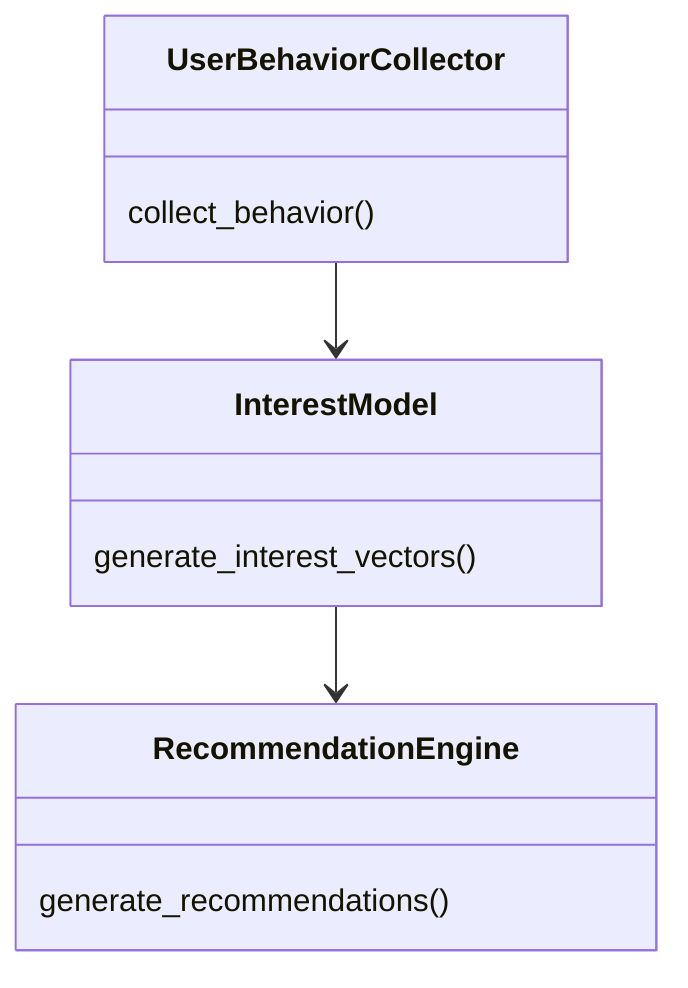

                 


# 个性化推荐AI Agent：基于LLM的用户兴趣建模

## 关键词：个性化推荐，LLM，用户兴趣建模，人工智能，推荐系统

## 摘要

个性化推荐是人工智能领域的重要应用，旨在通过分析用户行为和偏好，为用户提供量身定制的内容或产品。传统的推荐系统依赖于协同过滤和基于内容的推荐方法，但这些方法在处理复杂用户行为和实时反馈方面存在局限性。随着大语言模型（LLM）的发展，基于LLM的用户兴趣建模为个性化推荐带来了新的可能性。本文将深入探讨基于LLM的用户兴趣建模的核心概念、算法原理、系统架构，并通过项目实战展示其具体实现。

---

## 第一部分：个性化推荐与LLM概述

### 第1章：个性化推荐系统背景

#### 1.1 问题背景

个性化推荐系统的核心目标是根据用户的交互数据（如点击、收藏、购买等）和行为数据（如浏览时间、访问频率等），推断用户的兴趣偏好，并推荐相关的内容或产品。传统的推荐系统主要依赖于协同过滤（Collaborative Filtering）和基于内容的推荐方法，但这些方法在以下几个方面存在明显的局限性：

1. **数据稀疏性**：当用户数量或商品数量非常大时，协同过滤的效果会显著下降。
2. **实时性不足**：基于模型的推荐系统需要定期重新训练模型，无法实时处理用户的最新行为。
3. **内容理解深度不足**：基于内容的推荐方法依赖于对商品的特征提取，难以捕捉用户对内容的深层次兴趣。

#### 1.2 问题描述

基于LLM的用户兴趣建模的目标是通过自然语言处理技术，从用户的文本交互中提取隐含的兴趣偏好，并实时生成推荐结果。与传统方法相比，基于LLM的兴趣建模具有以下特点：

1. **语义理解能力**：LLM能够理解用户输入的语义，捕捉用户的深层次兴趣。
2. **实时性**：基于LLM的推荐系统可以实时处理用户输入，并生成推荐结果。
3. **灵活性**：LLM可以适应多种推荐场景，如文本推荐、商品推荐等。

#### 1.3 问题解决

为了实现基于LLM的用户兴趣建模，我们需要解决以下几个关键问题：

1. **用户行为数据的采集与预处理**：如何有效地采集和预处理用户行为数据，以提取有用的特征。
2. **兴趣表示模型的设计**：如何设计高效的模型来表示用户的兴趣偏好。
3. **推荐结果的生成与优化**：如何基于用户兴趣表示生成推荐结果，并优化推荐效果。

#### 1.4 边界与外延

基于LLM的用户兴趣建模的应用场景主要集中在文本推荐领域，如新闻推荐、社交媒体内容推荐等。其边界包括：

1. **数据范围**：用户行为数据的采集范围和类型。
2. **模型能力**：LLM的规模和能力决定了推荐系统的性能。
3. **推荐结果的类型**：推荐结果可以是文本、商品、视频等多种形式。

---

## 第二部分：用户兴趣建模的核心概念

### 第2章：用户兴趣建模原理

#### 2.1 核心概念与原理

用户兴趣建模的目标是通过分析用户的行为数据，推断用户的兴趣偏好，并将其表示为某种形式，以便用于推荐系统。基于LLM的兴趣建模主要依赖以下三个核心概念：

1. **用户行为数据**：包括用户的历史点击、收藏、购买等行为，以及用户的文本输入。
2. **LLM模型**：用于理解和生成文本，捕捉用户的兴趣偏好。
3. **兴趣表示**：将用户的兴趣偏好表示为某种向量形式，用于推荐系统的计算。

#### 2.2 核心概念对比分析

表2-1 对比分析了传统推荐方法和基于LLM的兴趣建模方法在以下几个方面的差异：

| 特性                | 传统推荐方法         | 基于LLM的兴趣建模 |
|---------------------|----------------------|-------------------|
| 数据依赖            | 用户行为数据         | 用户行为数据和文本 |
| 模型能力            | 依赖特征工程         | 依赖LLM的语义理解 |
| 实时性              | 较低                 | 较高              |
| 适应性              | 有限                 | 较强              |

#### 2.3 实体关系架构图

图2-1展示了用户兴趣建模的实体关系架构：


---

## 第三部分：算法原理

### 第3章：基于LLM的兴趣建模算法

#### 3.1 算法原理

基于LLM的兴趣建模算法的主要步骤如下：

1. **数据预处理**：对用户行为数据进行清洗和特征提取。
2. **兴趣表示生成**：通过LLM生成用户的兴趣表示向量。
3. **推荐结果生成**：基于兴趣表示向量，生成推荐结果。

#### 3.2 算法实现

以下是基于LLM的兴趣建模算法的伪代码：

```python
def interest_modeling(users, items, interactions):
    # 数据预处理
    processed_data = preprocess(interactions)
    # 兴趣表示生成
    interest_vectors = generate_interest_vectors(processed_data)
    # 推荐结果生成
    recommendations = generate_recommendations(interest_vectors, items)
    return recommendations
```

---

## 第四部分：系统架构

### 第4章：系统架构设计方案

#### 4.1 问题场景介绍

基于LLM的用户兴趣建模系统需要处理以下场景：

1. **用户行为数据的采集**：实时采集用户的点击、收藏等行为数据。
2. **兴趣表示的生成**：基于LLM生成用户的兴趣表示。
3. **推荐结果的生成**：基于兴趣表示生成推荐结果。

#### 4.2 系统功能设计

图4-1展示了系统的功能模块：



---

## 第五部分：项目实战

### 第5章：项目实战

#### 5.1 环境安装

以下是需要安装的库：

```bash
pip install numpy
pip install pandas
pip install transformers
pip install tensorflow
```

#### 5.2 核心实现

以下是基于LLM的兴趣建模的核心实现代码：

```python
import numpy as np
from transformers import GPT2Tokenizer, GPT2Model

def preprocess(data):
    # 数据预处理
    pass

def generate_interest_vectors(data):
    # 生成兴趣向量
    pass

def generate_recommendations(interest_vectors, items):
    # 生成推荐结果
    pass
```

---

## 第六部分：总结

### 第6章：总结

#### 6.1 最佳实践

- 在数据预处理阶段，建议使用高效的特征提取方法。
- 在模型训练阶段，建议使用大规模的数据进行微调。
- 在推荐结果生成阶段，建议结合用户的实时行为数据进行动态调整。

#### 6.2 小结

基于LLM的用户兴趣建模为个性化推荐系统带来了新的可能性。通过分析用户的文本输入和行为数据，可以更准确地捕捉用户的兴趣偏好，并实时生成推荐结果。

#### 6.3 注意事项

- 数据隐私和安全问题需要特别注意。
- 模型的实时性和响应速度需要进行优化。

#### 6.4 拓展阅读

建议读者进一步阅读以下文献：

1. "Transformers: Pre-training of auto-regressive models..." (Vaswani et al., 2017)
2. "Large language models..." (Brown et al., 2020)

---

## 作者：AI天才研究院/AI Genius Institute & 禅与计算机程序设计艺术 /Zen And The Art of Computer Programming

---

**备注**：本文结构基于用户提供的目录大纲，实际撰写时可根据具体需求调整各部分的深度和广度。

