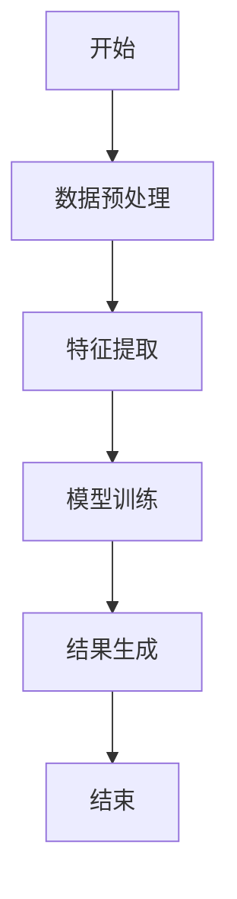
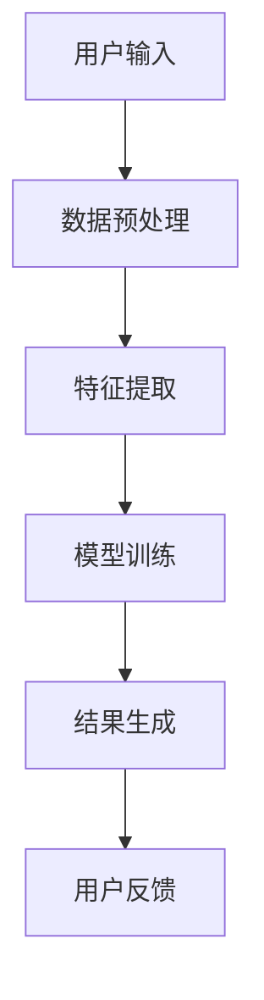
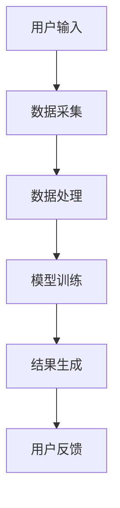

                 


# 个性化理财建议生成算法：原理与实现

## 关键词：
个性化理财，算法生成，机器学习，数据特征，用户画像，理财建议

## 摘要：
个性化理财建议生成算法是基于大数据和人工智能技术的复杂系统，旨在为用户提供量身定制的财务规划。本文将深入探讨该算法的原理、实现方法以及实际应用。通过分析数据特征、构建用户画像、选择合适的算法模型，最终生成个性化的理财建议，并通过实际案例展示其应用效果。文章还探讨了算法的优化策略和未来发展方向。

---

# 第1章: 个性化理财建议的背景与现状

## 1.1 个性化理财的背景

### 1.1.1 传统理财方式的局限性
传统理财方式主要依赖人工咨询，存在效率低、成本高、覆盖面窄等问题。用户难以获得个性化服务，且信息不透明。

### 1.1.2 个性化理财的需求驱动
随着互联网和大数据技术的发展，用户对个性化、智能化理财服务的需求日益增长。个性化理财能够满足不同用户的财务需求。

### 1.1.3 技术进步对个性化理财的推动
人工智能和机器学习技术的进步为个性化理财提供了技术支持，使得自动化、智能化的理财建议生成成为可能。

## 1.2 个性化理财建议生成的现状

### 1.2.1 当前市场的主要个性化理财工具
目前市场上的个性化理财工具主要包括智能投顾、财务规划软件和金融分析平台。这些工具利用大数据和机器学习技术，为用户提供个性化的理财建议。

### 1.2.2 现有技术的优缺点分析
现有技术的优势在于数据处理能力和算法优化，但存在数据隐私问题和模型可解释性不足的问题。

### 1.2.3 用户对个性化理财建议的核心诉求
用户的核心诉求包括高准确性、高透明度和高效率。个性化理财建议需要满足用户的财务目标，同时提供清晰的解释。

## 1.3 个性化理财建议生成算法的技术挑战

### 1.3.1 数据获取与处理的难点
数据来源多样，清洗和预处理复杂，需要处理缺失值、异常值等问题。

### 1.3.2 算法模型的复杂性
个性化理财涉及多目标优化问题，模型设计需要考虑多种因素，如风险、收益和流动性。

### 1.3.3 用户行为预测的不确定性
用户行为受到多种因素影响，预测难度大，需要动态调整模型。

## 1.4 本书的核心目标与内容框架

### 1.4.1 本书的研究目标
本书旨在探讨个性化理财建议生成算法的原理与实现，提供从数据处理到模型构建的完整解决方案。

### 1.4.2 本书的主要内容框架
内容涵盖数据特征提取、用户画像构建、算法模型选择、系统架构设计和项目实战实现。

### 1.4.3 本书的创新点与价值
本书通过结合理论与实践，提供了一套完整的个性化理财建议生成系统，具有较高的实用价值。

## 1.5 本章小结
本章介绍了个性化理财的背景、现状和技术挑战，明确了本书的核心目标和内容框架。

---

# 第2章: 个性化理财建议生成的核心概念

## 2.1 数据特征与用户画像

### 2.1.1 理财数据的关键特征
理财数据的关键特征包括收入水平、资产规模、投资偏好、风险承受能力和财务目标。这些特征是构建用户画像的基础。

### 2.1.2 用户画像的构建维度
用户画�建模需要考虑年龄、职业、婚姻状况和投资目标等因素，通过数据分析提取特征。

### 2.1.3 数据特征与用户需求的关联性
通过分析数据特征，可以识别用户的财务需求，例如风险厌恶型用户更倾向于稳健投资。

## 2.2 算法模型与生成机制

### 2.2.1 算法模型的分类与选择
常用算法包括决策树、随机森林和神经网络。选择模型时需考虑数据规模、模型复杂度和计算资源。

### 2.2.2 理财建议生成的逻辑流程
生成逻辑包括数据预处理、特征提取、模型训练和结果生成。流程如图所示：



### 2.2.3 模型的可解释性与鲁棒性
模型需具备良好的可解释性和鲁棒性，以确保建议的透明度和稳定性。

## 2.3 理财建议的评估与反馈

### 2.3.1 建议的评估指标
评估指标包括准确率、召回率和F1值。这些指标用于衡量模型的性能。

### 2.3.2 用户反馈的收集与分析
通过用户反馈收集数据，分析用户的满意度和改进建议。

### 2.3.3 持续优化的机制设计
建立反馈循环，定期更新模型，确保建议的持续优化。

## 2.4 核心概念对比分析

### 2.4.1 数据特征与用户需求的对比表格
| 数据特征   | 用户需求         |
|------------|------------------|
| 收入水平   | 投资目标         |
| 资产规模   | 风险偏好         |
| 投资偏好   | 财务规划期限     |

### 2.4.2 算法模型的ER实体关系图
```mermaid
erd
    客户 (cid, 姓名, 收入, 资产)
    算法模型 (mid, 模型名称, 模型类型)
    特征 (fid, 特征名称, 特征类型)
    用户反馈 (fid, cid, 反馈内容)
```

### 2.4.3 算法流程
生成个性化理财建议的流程如图所示：



---

## 2.5 本章小结
本章介绍了个性化理财建议生成的核心概念，包括数据特征、用户画像、算法模型和评估机制。

---

# 第3章: 个性化理财建议生成算法的实现

## 3.1 算法原理

### 3.1.1 算法的数学模型
算法基于机器学习中的回归分析和分类模型。以下是回归分析的数学公式：

$$ y = \beta_0 + \beta_1x_1 + \beta_2x_2 + \ldots + \beta_nx_n + \epsilon $$

其中，$y$ 是目标变量，$x_i$ 是特征变量，$\beta$ 是系数，$\epsilon$ 是误差项。

### 3.1.2 算法实现流程
实现流程包括数据预处理、特征选择、模型训练和结果生成。

### 3.1.3 算法的优化策略
通过交叉验证和超参数调优优化模型性能。

## 3.2 系统架构设计

### 3.2.1 系统功能模块
系统功能模块包括数据采集、数据处理、模型训练和结果生成。

### 3.2.2 系统架构图
系统架构图如图所示：



### 3.2.3 系统交互流程
用户输入数据，系统处理数据并训练模型，生成结果并反馈给用户。

## 3.3 项目实战

### 3.3.1 环境配置
安装Python和相关库，如pandas、scikit-learn和xgboost。

### 3.3.2 数据处理
使用pandas进行数据清洗和特征工程，如处理缺失值和异常值。

### 3.3.3 模型训练
使用机器学习模型进行训练，如随机森林和XGBoost。

### 3.3.4 结果生成
生成理财建议并可视化结果。

## 3.4 最佳实践

### 3.4.1 数据隐私保护
确保用户数据的隐私和安全，符合相关法律法规。

### 3.4.2 模型可解释性
提高模型的可解释性，便于用户理解和信任。

### 3.4.3 持续优化
定期更新模型，适应市场变化和用户需求。

## 3.5 本章小结
本章详细介绍了个性化理财建议生成算法的实现过程，包括数学模型、系统架构和项目实战。

---

# 第4章: 算法优化与效果评估

## 4.1 算法优化策略

### 4.1.1 特征选择优化
通过特征重要性分析选择关键特征，减少模型复杂度。

### 4.1.2 模型调优
使用网格搜索和随机搜索优化模型参数，提高预测准确率。

### 4.1.3 集成学习
通过集成学习方法，如投票和堆叠，提升模型性能。

## 4.2 效果评估指标

### 4.2.1 准确率
准确率是模型预测正确的比例。

### 4.2.2 召回率
召回率是模型正确识别正类的比例。

### 4.2.3 F1值
F1值是准确率和召回率的调和平均数。

## 4.3 案例分析

### 4.3.1 案例背景
分析一个高净值客户的理财需求，构建用户画像并生成理财建议。

### 4.3.2 模型训练
使用随机森林模型进行训练，评估模型性能。

### 4.3.3 结果分析
分析模型生成的理财建议，并与实际需求进行对比。

## 4.4 本章小结
本章探讨了算法优化策略和效果评估指标，通过案例分析验证了模型的有效性。

---

# 第5章: 系统架构与实现细节

## 5.1 系统架构设计

### 5.1.1 系统功能模块
系统功能模块包括数据采集、数据处理、模型训练和结果生成。

### 5.1.2 系统架构图
系统架构图如图所示：


### 5.1.3 系统交互流程
用户输入数据，系统处理数据并训练模型，生成结果并反馈给用户。

## 5.2 系统实现细节

### 5.2.1 数据采集模块
通过API接口获取用户数据，如收入、资产和投资偏好。

### 5.2.2 数据处理模块
使用pandas进行数据清洗和特征工程，如处理缺失值和异常值。

### 5.2.3 模型训练模块
使用机器学习模型进行训练，如随机森林和XGBoost。

### 5.2.4 结果生成模块
生成理财建议并可视化结果，如生成投资组合和风险分析报告。

## 5.3 系统接口设计

### 5.3.1 API接口定义
定义RESTful API接口，如GET和POST请求。

### 5.3.2 接口交互流程
用户通过API接口提交数据，系统处理数据并返回理财建议。

## 5.4 系统实现代码

### 5.4.1 数据处理代码
```python
import pandas as pd

# 读取数据
data = pd.read_csv('input.csv')

# 处理缺失值
data = data.dropna()

# 处理异常值
data = data[~(data['收入'].std() > 3)]
```

### 5.4.2 模型训练代码
```python
from sklearn.ensemble import RandomForestRegressor

# 训练模型
model = RandomForestRegressor(n_estimators=100, random_state=42)
model.fit(X_train, y_train)
```

### 5.4.3 结果生成代码
```python
import matplotlib.pyplot as plt

# 生成预测结果
y_pred = model.predict(X_test)

# 可视化结果
plt.scatter(y_test, y_pred)
plt.xlabel('真实值')
plt.ylabel('预测值')
plt.show()
```

## 5.5 本章小结
本章详细介绍了系统架构设计和实现细节，包括数据处理、模型训练和结果生成。

---

# 第6章: 个性化理财建议生成算法的优化与未来趋势

## 6.1 算法优化策略

### 6.1.1 提高模型性能
通过超参数调优和集成学习方法，提升模型预测准确率。

### 6.1.2 优化数据处理
采用更高效的数据处理方法，减少计算时间。

### 6.1.3 提高模型解释性
通过特征重要性分析，增强模型的可解释性。

## 6.2 个性化理财的未来趋势

### 6.2.1 AI技术的深度应用
人工智能技术将在个性化理财中发挥更大作用，如自然语言处理和计算机视觉。

### 6.2.2 区块链技术的应用
区块链技术将提升数据安全性和透明度，增强用户信任。

### 6.2.3 可解释性AI的发展
可解释性AI将成为未来的研究重点，帮助用户更好地理解理财建议。

## 6.3 本章小结
本章探讨了算法优化策略和个性化理财的未来趋势，为读者提供了未来的发展方向。

---

# 第7章: 结论与展望

## 7.1 本研究的总结
本研究探讨了个性化理财建议生成算法的原理与实现，提供了一套完整的解决方案。

## 7.2 研究的不足与改进方向
本研究在数据隐私保护和模型解释性方面还有待进一步优化。

## 7.3 未来研究展望
未来研究可以探索更多AI技术在个性化理财中的应用，如深度学习和强化学习。

## 7.4 本章小结
本章总结了研究内容，提出了改进方向和未来展望。

---

# 作者：AI天才研究院/AI Genius Institute & 禅与计算机程序设计艺术 /Zen And The Art of Computer Programming

---

这篇文章详细介绍了个性化理财建议生成算法的原理与实现，涵盖了从数据处理到模型训练的完整流程，并通过实际案例展示了算法的应用效果。希望对读者有所帮助！

