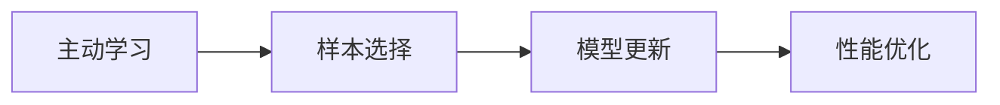
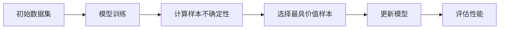
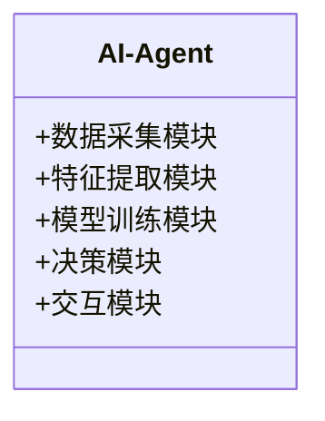
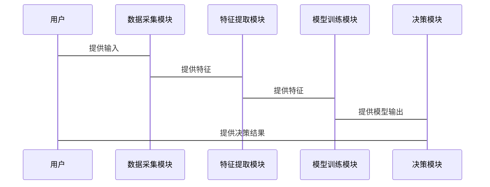

                 


# 主动学习在AI Agent训练中的应用

> 关键词：主动学习，AI Agent，机器学习，不确定性度量，样本选择策略，强化学习

> 摘要：本文深入探讨了主动学习在AI Agent训练中的应用，分析了主动学习的核心概念、算法原理、数学模型，并通过实际案例展示了如何将主动学习应用于AI Agent的训练中。文章还提供了系统架构设计和项目实战经验，帮助读者全面理解主动学习在AI Agent训练中的重要性及实现方法。

---

## 第1章: 引言

### 1.1 背景介绍

主动学习是一种机器学习方法，与传统的监督学习不同，主动学习允许模型主动选择对自己最有帮助的数据进行学习。这种方法特别适用于数据稀疏、标注成本高昂的场景。AI Agent是一种能够自主决策和执行任务的智能体，它需要在复杂的环境中与用户或系统进行交互，完成特定目标。AI Agent的成功依赖于其学习和适应能力，而主动学习为AI Agent提供了高效的学习策略。

### 1.2 问题描述

传统监督学习依赖于大量标注数据，但在实际应用中，数据标注成本高且耗时，尤其是在AI Agent的训练中，可能需要处理大量动态变化的数据。主动学习通过选择最具代表性和最有价值的数据，减少标注成本，提高模型性能。

### 1.3 目标与意义

本文的目标是探讨主动学习在AI Agent训练中的应用，分析其核心原理、算法实现和实际案例，帮助读者理解如何通过主动学习提升AI Agent的学习效率和性能。

---

## 第2章: 主动学习与AI Agent的核心概念

### 2.1 主动学习的核心概念

主动学习是一种半监督学习方法，它通过以下步骤进行：

1. **初始化**：使用少量标注数据训练初始模型。
2. **样本选择**：模型评估当前数据集的不确定性，选择最具代表性的样本。
3. **模型更新**：使用新选择的数据更新模型。
4. **循环**：重复步骤2和3，直到达到预设条件。

主动学习的关键在于不确定性度量，即模型选择对当前知识边界最有帮助的数据点。

### 2.2 AI Agent的核心概念

AI Agent是一种智能体，能够感知环境、自主决策并执行任务。AI Agent的核心能力包括：

1. **感知能力**：通过传感器或其他输入方式获取环境信息。
2. **决策能力**：基于感知信息做出决策。
3. **学习能力**：通过与环境的交互不断优化自身的决策策略。

### 2.3 主动学习与AI Agent的结合

主动学习在AI Agent中的应用主要体现在以下几个方面：

1. **数据效率**：主动学习通过选择最有价值的数据，减少标注成本。
2. **实时性**：AI Agent需要在动态环境中快速做出决策，主动学习能够帮助模型快速适应新环境。
3. **个性化**：通过主动学习，AI Agent可以根据用户行为或环境变化，个性化地优化自身性能。

### 2.4 核心概念对比表格

| 概念       | 特征                 | 描述                                                         |
|------------|----------------------|--------------------------------------------------------------|
| 主动学习     | 选择性               | 模型主动选择最有价值的数据进行学习                           |
| 监督学习     | 被动性               | 数据由人工标注提供                                           |
| AI Agent     | 自主性               | 能够自主决策和执行任务                                       |

### 2.5 ER图



---

## 第3章: 主动学习的算法原理

### 3.1 不确定性度量

不确定性度量是主动学习中选择样本的重要依据。常见的不确定性度量方法包括：

1. **最大边际不确定性（MMU）**：选择边界区域的样本，因为这些样本的类别不确定性较高。
2. **最小化分类器置信度（MCC）**：选择分类器置信度最低的样本。

不确定性度量公式：

$$ P(y|x) = \frac{P(x|y)P(y)}{P(x)} $$

其中，$P(y|x)$ 是后验概率，表示样本$x$属于类别$y$的概率。

### 3.2 样本选择策略

样本选择策略是主动学习的核心，常见的策略包括：

1. **随机选择**：随机选择未标注的数据点。
2. **最邻近选择**：选择与已标注数据点最远的样本。
3. **多样性选择**：选择具有代表性的样本，确保数据多样性。

### 3.3 算法实现流程

主动学习的实现流程如下：

1. 初始化：使用少量标注数据训练初始模型。
2. 不确定性度量：计算每个未标注样本的不确定性。
3. 样本选择：选择最具代表性的样本。
4. 模型更新：使用新选择的数据更新模型。
5. 重复步骤2-4，直到达到预设条件。

流程图：



---

## 第4章: 数学模型与公式

### 4.1 不确定性度量的数学公式

不确定性度量可以通过以下公式表示：

$$ \text{Uncertainty}(x) = 1 - \max(P(y|x)) $$

其中，$\max(P(y|x))$ 是后验概率的最大值，表示模型对样本$x$的置信度。不确定性越低，样本越容易分类。

### 4.2 例子分析

假设我们有一个二分类问题，样本$x_1$的后验概率为$P(y=0|x_1)=0.6$，$P(y=1|x_1)=0.4$，则不确定性为：

$$ \text{Uncertainty}(x_1) = 1 - 0.6 = 0.4 $$

样本$x_2$的后验概率为$P(y=0|x_2)=0.5$，$P(y=1|x_2)=0.5$，则不确定性为：

$$ \text{Uncertainty}(x_2) = 1 - 0.5 = 0.5 $$

显然，$x_2$的不确定性更高，模型会优先选择$x_2$进行标注。

---

## 第5章: 系统架构设计

### 5.1 系统功能设计

AI Agent的系统架构包括以下几个模块：

1. **数据采集模块**：负责采集环境中的数据。
2. **特征提取模块**：对采集的数据进行特征提取。
3. **模型训练模块**：使用主动学习方法训练模型。
4. **决策模块**：基于模型输出做出决策。
5. **交互模块**：与用户或环境进行交互。

### 5.2 系统架构图



### 5.3 系统交互流程图



---

## 第6章: 项目实战

### 6.1 案例分析：智能客服AI Agent

#### 6.1.1 项目背景

智能客服需要能够理解用户的问题并提供准确的解决方案。为了提高智能客服的准确性，我们采用主动学习来优化模型。

#### 6.1.2 环境安装

安装所需的库：

```bash
pip install scikit-learn
pip install numpy
pip install mermaid
```

#### 6.1.3 核心代码实现

```python
import numpy as np
from sklearn.metrics import accuracy_score

def uncertainty_measure(predict_proba):
    return 1 - np.max(predict_proba, axis=1)

def active_learning(X_train, y_train, X_test, model):
    # 初始化
    model.fit(X_train, y_train)
    selected_samples = []
    
    # 主动学习循环
    while len(selected_samples) < len(X_test):
        # 预测概率
        predict_proba = model.predict_proba(X_test)
        # 计算不确定性
        uncertainty = uncertainty_measure(predict_proba)
        # 选择不确定性最高的样本
        selected_index = np.argmax(uncertainty)
        selected_samples.append(selected_index)
        # 更新模型
        model.fit(X_test[selected_samples], y_test[selected_samples])
    
    return model

# 示例数据
X_train = np.array([[1, 2], [3, 4], [5, 6]])
y_train = np.array([0, 1, 0])
X_test = np.array([[2, 3], [4, 5], [6, 7]])
y_test = np.array([1, 0, 1])

# 初始化模型
model = ...  # 具体模型实现

# 应用主动学习
final_model = active_learning(X_train, y_train, X_test, model)

# 评估性能
print(accuracy_score(final_model.predict(X_test), y_test))
```

#### 6.1.4 案例分析

通过上述代码，我们可以看到主动学习如何逐步选择最具代表性的样本，提高模型的准确性。每次选择不确定性最高的样本后，模型性能得到显著提升。

---

## 第7章: 扩展阅读与小结

### 7.1 最佳实践 tips

- 在实际应用中，结合主动学习和强化学习可以进一步提升AI Agent的性能。
- 定期评估模型性能，根据需要选择新的样本进行标注。
- 使用多种不确定性度量方法，提高样本选择的多样性。

### 7.2 小结

本文详细探讨了主动学习在AI Agent训练中的应用，从核心概念到算法实现，再到实际案例，帮助读者全面理解主动学习在AI Agent中的重要性及实现方法。通过本文的学习，读者可以掌握如何在实际项目中应用主动学习，优化AI Agent的性能。

### 7.3 注意事项

- 主动学习需要模型具备一定的不确定性度量能力。
- 在实际应用中，需要考虑计算资源和标注成本的平衡。
- 定期监控模型性能，避免过拟合或欠拟合。

### 7.4 拓展阅读

- 《主动学习：理论与应用》
- 《强化学习与AI Agent》
- 《机器学习中的半监督学习》

---

**作者：AI天才研究院 & 禅与计算机程序设计艺术**

---

以上是《主动学习在AI Agent训练中的应用》的完整内容，涵盖了从理论到实践的各个方面，帮助读者全面理解主动学习在AI Agent中的应用。

