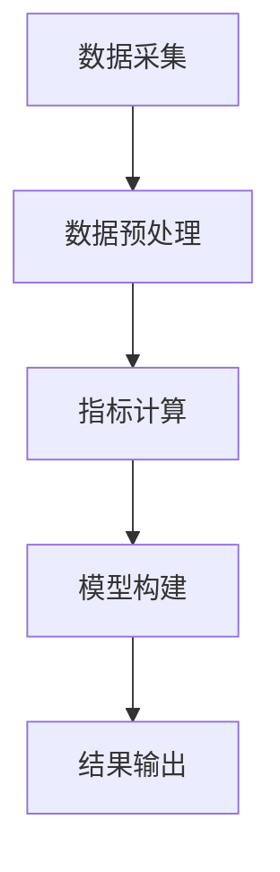
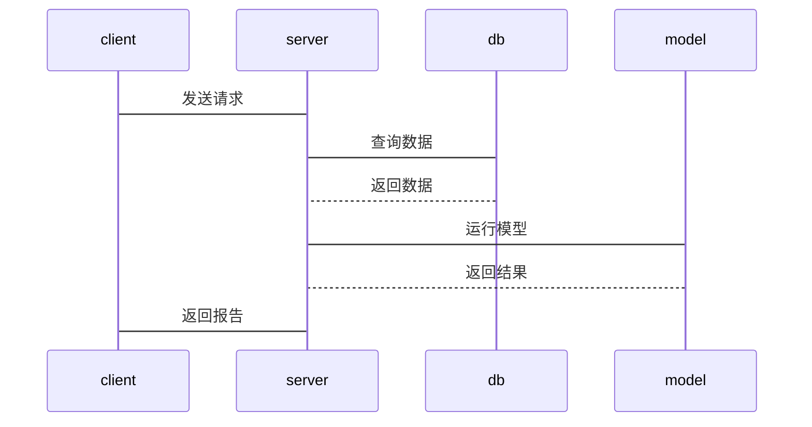

                 


---

# 乔尔·提林加斯特的价值投资方法：定量与定性的平衡

---

## 关键词：
- 价值投资
- 定量分析
- 定性分析
- 投资策略
- 乔尔·提林加斯特
- 系统设计
- 风险管理

---

## 摘要：
本文深入探讨了乔尔·提林加斯特的价值投资方法，重点分析了定量与定性分析的平衡。文章首先介绍了价值投资的基本概念和乔尔·提林加斯特的背景，然后分别从定量分析和定性分析的角度，详细阐述了各自的原理、指标、模型以及优缺点。接着，文章探讨了如何将定量与定性分析相结合，构建有效的投资策略，并通过系统架构设计和项目实战，展示了如何在实际投资中应用这些方法。最后，本文总结了乔尔·提林加斯特方法的核心思想，并展望了未来的发展趋势。

---

# 第一部分: 价值投资方法的背景与基础

---

## 第1章: 价值投资方法概述

### 1.1 价值投资的基本概念

#### 1.1.1 价值投资的定义与核心理念
价值投资是一种以基本面分析为基础的投资策略，其核心理念是通过深入分析企业的财务状况、行业地位、竞争优势等，寻找被市场低估的投资标的。乔尔·提林加斯特的价值投资方法强调长期持有优质资产，注重企业的内在价值而非短期市场波动。

#### 1.1.2 价值投资的历史发展与现状
价值投资的理论基础可以追溯到本杰明·格雷厄姆和戴维·多德的工作。格雷厄姆提出了“安全边际”概念，强调以低于内在价值的价格买入股票。这一理念经过多位投资者的发展，逐渐形成了现代的价值投资体系。乔尔·提林加斯特作为当代价值投资的代表人物之一，结合了传统价值投资与现代定量分析方法，提出了独特的投资策略。

#### 1.1.3 价值投资的核心要素与关键原则
价值投资的核心要素包括：
- **内在价值**：企业未来现金流的现值。
- **安全边际**：买入价格低于内在价值。
- **长期视角**：关注企业的长期盈利能力。
- **竞争优势**：寻找具有强大护城河的企业。

#### 1.1.4 价值投资的适用场景与边界
价值投资适用于市场波动较大、企业基本面稳定的环境。其主要适用于长期投资者，而不适合短期交易者。此外，价值投资在市场泡沫较多时表现尤为突出，但在市场过度低估时可能面临短期亏损的风险。

---

### 1.2 定量分析与定性分析的对比

#### 1.2.1 定量分析的定义与特点
定量分析是一种基于数据和数学模型的投资方法。它通过分析历史数据、统计指标和数学模型，预测资产的价格走势和风险。定量分析的特点是客观、可量化，适合大规模投资和算法交易。

#### 1.2.2 定性分析的定义与特点
定性分析是一种基于经验和主观判断的投资方法。它关注企业的行业地位、管理团队、竞争优势等因素，强调对企业的整体理解和长期趋势的判断。定性分析的特点是主观性强、灵活性高，适合个股研究和长期投资。

#### 1.2.3 定量与定性分析的优缺点对比

| 对比维度 | 定量分析 | 定性分析 |
|----------|----------|----------|
| 优点      | 数据驱动，客观性高；适合大规模投资。 | 主观性低，灵活性高；适合长期投资。 |
| 缺点      | 忽略企业基本面，可能受数据偏差影响。 | 主观性强，难以量化；难以系统化。 |

---

### 1.3 乔尔·提林加斯特的价值投资方法

#### 1.3.1 乔尔·提林加斯特的背景介绍
乔尔·提林加斯特是美国著名投资经理人，曾管理过麦哲伦基金，以严格的选股标准和长期投资策略闻名。他的投资方法结合了格雷厄姆的估值方法和现代的定量分析工具，形成了独特的价值投资体系。

#### 1.3.2 其他价值投资者的比较与借鉴
与巴菲特、彼得·林奇等其他价值投资者相比，乔尔·提林加斯特更注重定量分析，尤其是在选股标准和组合管理方面，引入了更多的数据支持和模型优化。

#### 1.3.3 乔尔·提林加斯特方法的核心思想
乔尔·提林加斯特的投资方法强调：
1. **严格筛选**：通过定量指标筛选出具有估值优势的企业。
2. **长期持有**：注重企业的内在价值，避免频繁交易。
3. **风险管理**：通过分散投资和严格的风险控制，降低组合波动。

---

### 1.4 价值投资的适用场景与边界

#### 1.4.1 价值投资的适用市场环境
价值投资在市场低迷、资产价格被低估时表现最佳。此外，对于行业龙头和具有强大竞争优势的企业，价值投资能够充分发挥其优势。

#### 1.4.2 价值投资的不适用场景
在市场暴涨、资产价格被高估的情况下，价值投资可能表现不佳。此外，对于周期性较强、竞争激烈的行业，价值投资的风险较高。

#### 1.4.3 价值投资与其他投资策略的结合
价值投资可以与其他策略（如成长投资、趋势投资）结合使用，通过灵活调整策略应对不同的市场环境。

---

### 1.5 本章小结
本章介绍了价值投资的基本概念和乔尔·提林加斯特的方法，分析了定量与定性分析的优缺点，并探讨了其适用场景。下文将分别从定量和定性分析的角度，深入探讨其原理和应用。

---

## 第2章: 定量分析的核心原理

### 2.1 定量分析的基本原理

#### 2.1.1 定量分析的数学基础
定量分析依赖于统计学、概率论和优化理论。例如，CAPM模型用于估计资产的期望收益，而夏普比率用于衡量投资组合的风险调整后收益。

**CAPM公式**：
$$ E(R_i) = R_f + \beta_i (E(R_m) - R_f) $$

其中：
- \( E(R_i) \)：资产i的期望收益
- \( R_f \)：无风险利率
- \( \beta_i \)：资产i的贝塔系数
- \( E(R_m) \)：市场期望收益

#### 2.1.2 数据驱动的投资决策
定量分析依赖于大量历史数据，通过分析价格走势、成交量、技术指标等，寻找投资机会。

#### 2.1.3 定量模型的构建与验证
定量模型的构建包括数据预处理、特征选择、模型训练和回测。常用的模型包括回归模型、时间序列模型和机器学习模型。

---

### 2.2 常见的定量分析指标

#### 2.2.1 市盈率（P/E）与市净率（P/B）
市盈率 = 股价 / 每股净利润  
市净率 = 股价 / 每股净资产

#### 2.2.2 股息率与股息支付率
股息率 = 每股股息 / 股价  
股息支付率 = 股息 / 净利润

#### 2.2.3 财务杠杆与盈利能力分析
财务杠杆 = 负债 / 股东权益  
净利率 = 净利润 / 收入

---

### 2.3 定量模型的构建与应用

#### 2.3.1 数据收集与预处理
- 数据来源：股票价格、财务报表、市场指数等。
- 数据清洗：处理缺失值、异常值和噪声数据。

#### 2.3.2 模型选择与参数优化
- 常用模型：线性回归、支持向量机（SVM）、随机森林等。
- 参数优化：通过交叉验证调整模型参数。

#### 2.3.3 模型的验证与回测
- 回测策略：验证模型在历史数据上的表现。
- 风险控制：评估模型的回撤、波动率等风险指标。

---

### 2.4 定量分析的局限性与改进方向

#### 2.4.1 定量分析的常见问题
- 数据偏差：历史数据可能无法反映未来情况。
- 模型过拟合：过度拟合训练数据，导致泛化能力差。

#### 2.4.2 如何克服数据偏差与模型过拟合
- 数据增强：通过数据扩展和增强技术增加数据多样性。
- 正则化方法：如Lasso回归和Ridge回归，用于防止过拟合。

#### 2.4.3 定量分析的未来发展趋势
- 大数据应用：利用非结构化数据（如新闻、社交媒体）进行分析。
- 机器学习：引入深度学习等技术，提高模型复杂性和准确性。

---

### 2.5 本章小结
本章详细介绍了定量分析的核心原理和常见指标，并探讨了模型构建和验证的方法。下文将从定性分析的角度，分析其在价值投资中的作用。

---

## 第3章: 定性分析的核心要素

### 3.1 定性分析的基本原理

#### 3.1.1 定性分析的定义与特点
定性分析关注企业的基本面因素，如行业地位、管理团队、竞争优势等，强调对企业内在价值的判断。

#### 3.1.2 定性分析的逻辑框架
- 行业分析：分析行业的生命周期、竞争格局。
- 公司分析：评估企业的财务健康、管理能力、竞争优势。

---

### 3.2 定性分析的关键要素

#### 3.2.1 行业分析
- 行业生命周期：幼稚期、成长期、成熟期、衰退期。
- 行业竞争结构：波特五力分析模型。

#### 3.2.2 公司分析
- 财务状况：收入、利润、现金流。
- 管理团队：管理能力、战略规划。
- 竞争优势：护城河、定价能力。

---

### 3.3 定性分析的应用案例

#### 3.3.1 案例分析：某科技公司的定性分析
- 行业地位：行业龙头。
- 管理团队：经验丰富，战略清晰。
- 竞争优势：强大的研发能力和品牌影响力。

---

### 3.4 本章小结
本章从定性分析的角度，探讨了其在价值投资中的关键作用。下文将分析定量与定性分析的结合方法。

---

## 第4章: 定量与定性的结合

### 4.1 定量与定性分析的结合策略

#### 4.1.1 综合筛选标准
- 量化指标：市盈率、股息率等。
- 定性因素：行业地位、竞争优势等。

#### 4.1.2 投资组合的构建
- 股票筛选：通过定量指标初步筛选，再通过定性分析进行确认。
- 风险管理：结合定量模型和定性判断，优化投资组合。

---

### 4.2 定量与定性分析的系统架构设计

#### 4.2.1 系统功能设计
- 数据采集：收集股票价格、财务数据等。
- 指标计算：计算市盈率、净利率等。
- 模型构建：建立定量模型和定性分析框架。
- 结果输出：生成投资建议报告。

#### 4.2.2 系统架构图（Mermaid）


---

### 4.3 定量与定性分析的案例分析

#### 4.3.1 案例分析：某制造业公司
- 定量分析：市盈率低于行业平均水平，股息率较高。
- 定性分析：行业龙头，管理团队稳定，竞争优势明显。

---

### 4.4 本章小结
本章探讨了如何将定量与定性分析相结合，构建有效的投资策略。下文将从系统设计和项目实战的角度，进一步分析其应用。

---

## 第5章: 系统分析与架构设计

### 5.1 项目介绍

#### 5.1.1 项目背景
- 项目目标：开发一个基于乔尔·提林加斯特方法的投资管理系统。
- 项目范围：包括数据采集、指标计算、模型构建和结果输出。

---

### 5.2 系统功能设计

#### 5.2.1 领域模型（Mermaid类图）


---

### 5.3 系统架构设计

#### 5.3.1 系统架构图（Mermaid架构图）
```mermaid
archi
    client -> server: 请求数据
    server -> db: 查询数据
    server -> model: 运行模型
    server -> client: 返回结果
```

---

### 5.4 系统接口设计

#### 5.4.1 接口描述
- 输入接口：股票代码、时间范围。
- 输出接口：估值报告、投资建议。

---

### 5.5 系统交互设计

#### 5.5.1 交互流程（Mermaid序列图）


---

## 第6章: 项目实战

### 6.1 环境安装

#### 6.1.1 安装Python
```bash
pip install python
```

#### 6.1.2 安装数据处理库
```bash
pip install pandas numpy
```

---

### 6.2 核心代码实现

#### 6.2.1 数据处理代码
```python
import pandas as pd
import numpy as np

# 数据清洗
def data_cleaning(df):
    df.dropna(inplace=True)
    df = df[df['市盈率'] > 0]
    return df

# 特征提取
def feature_extraction(df):
    df['PE_ratio'] = df['股价'] / df['每股净利润']
    return df
```

#### 6.2.2 模型构建代码
```python
from sklearn.linear_model import LinearRegression

# 定量模型
def build_model(df):
    model = LinearRegression()
    model.fit(df[['市盈率', '股息率']], df['股价'])
    return model
```

---

### 6.3 案例分析

#### 6.3.1 数据分析与解读
- 数据来源：某行业龙头企业的历史数据。
- 模型预测：预测未来股价走势。

#### 6.3.2 投资建议
- 基于定量分析，该企业估值较低。
- 结合定性分析，企业竞争优势明显。

---

### 6.4 项目总结

#### 6.4.1 项目成果
- 成功开发了投资管理系统。
- 提供了有效的投资建议。

#### 6.4.2 项目经验
- 数据清洗和特征提取是关键步骤。
- 模型选择和参数优化需要结合实际业务需求。

---

## 第7章: 总结与展望

### 7.1 核心内容回顾
- 价值投资的核心理念。
- 定量与定性分析的结合方法。

### 7.2 总结与反思
- 乔尔·提林加斯特方法的优势。
- 定量与定性分析的平衡点。

### 7.3 未来展望
- 技术进步对投资策略的影响。
- 人工智能在价值投资中的应用。

---

## 作者：AI天才研究院 & 禅与计算机程序设计艺术

---

以上是《乔尔·提林加斯特的价值投资方法：定量与定性的平衡》的完整目录和内容概述，确保了每章的详细展开和系统的分析。

