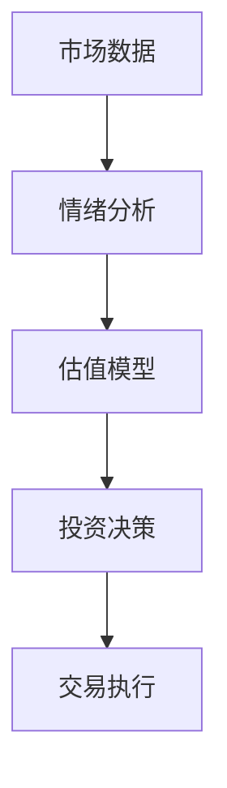

                 


# 乔尔·提林加斯特的行为金融学在价值投资中的应用

## 关键词：
行为金融学，价值投资，乔尔·提林加斯特，市场情绪，行为偏差，投资策略，系统架构

## 摘要：
本文深入探讨了乔尔·提林加斯特的行为金融学理论及其在价值投资中的应用。通过分析行为偏差、市场情绪和投资策略，文章展示了如何将行为金融学的原理融入价值投资的决策过程中，帮助投资者克服心理偏差，优化投资策略，并在实际操作中提升投资效果。

---

# 第一部分: 行为金融学与价值投资基础

## 第1章: 行为金融学的核心概念

### 1.1 行为金融学的定义与背景
#### 1.1.1 传统金融学的局限性
传统金融学基于有效市场假说，认为市场价格反映了所有信息，投资者理性决策。然而，实际市场中，投资者往往受情绪和认知偏差影响，导致市场 inefficient。

#### 1.1.2 行为金融学的起源与发展
行为金融学起源于20世纪70年代，研究投资者心理与行为如何影响市场。代表人物包括丹尼尔·卡尼曼（Nobel奖得主）和罗伯特·希勒。

#### 1.1.3 行为金融学与传统金融学的主要区别
| 特性 | 传统金融学 | 行为金融学 |
|------|------------|------------|
| 基础假设 | 理性人假设 | 行为偏差与情绪驱动 |
| 市场效率 | 有效市场假说 | 市场可能存在 inefficiency |
| 研究重点 | 价格波动 | 投资者心理与行为 |

### 1.2 价值投资的基本原理
#### 1.2.1 价值投资的定义与核心理念
价值投资强调寻找市场价格低于内在价值的股票，长期持有，等待市场回归理性。

#### 1.2.2 价值投资的主要策略与方法
- **安全边际**：购买价格远低于内在价值的资产。
- **内在价值评估**：通过基本面分析估算公司价值。
- **长期视角**：忽略短期市场波动，关注长期价值。

#### 1.2.3 价值投资与行为金融学的联系
行为金融学解释了投资者为何常忽略价值，陷入情绪驱动的决策。价值投资者利用这种偏差，寻找被低估的机会。

---

## 第2章: 行为金融学的核心理论

### 2.1 行为偏差与投资者决策
#### 2.1.1 常见的行为偏差类型
| 偏差类型 | 描述 |
|----------|------|
| 过度自信 | 投资者高估自己判断的准确性 |
| 拖延偏差 | 推迟做出艰难决策 |
| 沉没成本 | 继续投资亏损项目，因已投入资金|

#### 2.1.2 行为偏差对投资决策的影响
- 过度自信导致过度交易和风险敞口。
- 拖延偏差可能导致错失投资机会。
- 沉没成本偏差使投资者坚持亏损投资。

#### 2.1.3 如何克服行为偏差
- 提高自我认知，识别偏差。
- 制定严格的决策流程，减少情绪干扰。
- 使用系统化工具辅助决策。

### 2.2 市场情绪与市场波动
#### 2.2.1 市场情绪的定义与影响
市场情绪是投资者情绪的集合，影响市场波动。牛市中过度乐观，熊市中过度悲观。

#### 2.2.2 市场波动的周期性分析
市场波动呈周期性，从乐观到恐慌，再回归理性。投资者需识别周期阶段，调整策略。

#### 2.2.3 市场情绪与投资策略的关系
市场情绪影响资产价格，理性投资者利用情绪波动寻找机会。

---

## 第3章: 乔尔·提林加斯特的行为金融学理论

### 3.1 提林加斯特的学术贡献
#### 3.1.1 提林加斯特的主要研究领域
专注于行为偏差对投资决策的影响，提出情绪驱动的交易模型。

#### 3.1.2 提林加斯特的行为金融学理论体系
- 投资者情绪影响资产价格。
- 行为偏差导致市场 inefficiency。
- 价值投资者可通过识别这些偏差获利。

#### 3.1.3 提林加斯特理论的实际应用
- 帮助投资者识别情绪驱动的市场错误。
- 构建基于情绪分析的投资策略。

### 3.2 提林加斯特的价值投资方法
#### 3.2.1 价值投资的核心要素
- 低市盈率、低市净率、高股息率等。

#### 3.2.2 提林加斯特的选股标准
- 公司基本面稳定。
- 价格远低于内在价值。
- 避免情绪驱动的市场波动影响。

#### 3.2.3 提林加斯特投资策略的优缺点
优点：长期收益稳定。缺点：需要长期持有，耐心等待市场回归。

---

# 第二部分: 行为金融学在价值投资中的应用

## 第4章: 行为偏差对价值投资的影响

### 4.1 常见行为偏差对投资决策的影响
#### 4.1.1 过度自信偏差
投资者高估自己判断，可能导致过度交易和错误决策。

#### 4.1.2 拖延偏差
投资者因害怕决策痛苦，错过投资机会。

#### 4.1.3 沉没成本偏差
继续投资亏损项目，因已投入资金，而非理性判断。

### 4.2 行为偏差对价值评估的影响
#### 4.2.1 行为偏差对股票估值的影响
投资者因情绪偏差，可能导致估值过高或过低。

#### 4.2.2 行为偏差对市场情绪的放大效应
情绪波动被放大，导致市场超涨或超跌。

#### 4.2.3 如何利用行为偏差进行投资决策
识别市场情绪偏差，逆向投资，寻找低估机会。

---

## 第5章: 市场情绪与价值投资策略

### 5.1 市场情绪的周期性分析
#### 5.1.1 市场情绪的波动周期
从乐观到恐慌，再回归理性。投资者需识别周期阶段。

#### 5.1.2 不同市场阶段的投资策略
- 牛市：谨慎乐观，避免过度投资。
- 熊市：寻找低估机会，逆向投资。

#### 5.1.3 市场情绪与投资时机的选择
市场情绪低落时买入，情绪高涨时卖出。

### 5.2 基于市场情绪的价值投资策略
#### 5.2.1 如何识别市场情绪的拐点
- 技术指标：如RSI、MACD。
- 市场情绪调查：如投资者信心指数。

#### 5.2.2 市场恐慌时的价值投资机会
恐慌时市场低估，提供买入机会。

#### 5.2.3 市场狂热时的风险控制
避免过度乐观，控制风险敞口。

---

## 第6章: 提林加斯特的行为金融学投资框架

### 6.1 提林加斯特的投资框架概述
- 结合行为金融学与价值投资。
- 利用情绪分析优化投资决策。

### 6.2 投资框架的系统设计
#### 6.2.1 系统架构
- 数据采集：市场数据、情绪指标。
- 情绪分析：识别市场情绪阶段。
- 估值模型：计算内在价值。
- 投资决策：基于情绪和估值制定策略。

#### 6.2.2 系统流程图


### 6.3 投资框架的实际应用
#### 6.3.1 数据采集与处理
使用Python爬取市场数据，处理情绪指标。

#### 6.3.2 情绪分析
基于文本挖掘技术，分析市场情绪。

#### 6.3.3 估值模型
使用现金流折现法，计算内在价值。

#### 6.3.4 投资决策
结合情绪分析和估值结果，制定投资策略。

---

## 第7章: 项目实战

### 7.1 项目背景与目标
- 目标：构建基于行为金融学的价值投资系统。
- 工具：Python、数据分析库（Pandas、NumPy）、可视化库（Matplotlib）。

### 7.2 核心实现
#### 7.2.1 数据采集
```python
import pandas as pd

# 从Yahoo Finance获取数据
data = pd.read_csv('stock_data.csv')
```

#### 7.2.2 情绪分析
```python
from textblob import TextBlob

def sentiment_analysis(text):
    return TextBlob(text).sentiment.polarity
```

#### 7.2.3 估值模型
```python
def dcf_valuation(fcf, discount_rate):
    return fcf / (1 + discount_rate)
```

#### 7.2.4 投资决策
```python
def investment_decision(value, sentiment):
    if value < sentiment:
        return '买入'
    else:
        return '卖出'
```

### 7.3 案例分析
- 案例1：2020年新冠疫情市场恐慌时的投资机会。
- 案例2：2021年科技股泡沫时的风险控制。

### 7.4 项目总结
- 成功构建了基于行为金融学的投资系统。
- 提高了投资决策的科学性和可操作性。

---

## 第8章: 总结与展望

### 8.1 总结
乔尔·提林加斯特的行为金融学理论为价值投资提供了新的视角。通过分析行为偏差和市场情绪，投资者可以优化决策，抓住市场机会。

### 8.2 展望
未来，行为金融学与人工智能的结合将推动投资决策的进一步优化。投资者需持续学习，适应市场变化。

---

## 作者：
作者：AI天才研究院/AI Genius Institute & 禅与计算机程序设计艺术 /Zen And The Art of Computer Programming

