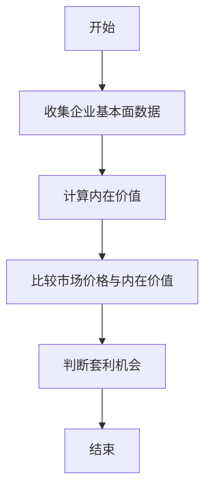
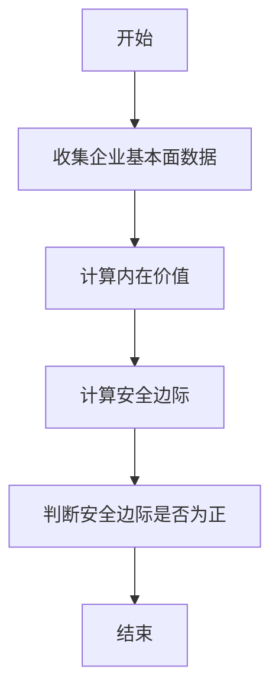
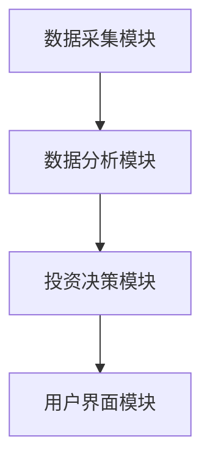
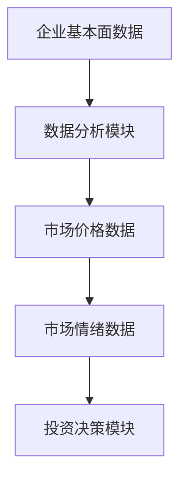

                 


# 乔尔·格林布拉特的价值投资教学方法

## 关键词：价值投资、格林布拉特、套利机会、安全边际、市场先生

## 摘要：本文深入探讨了乔尔·格林布拉特的价值投资教学方法，从其核心概念、数学模型、系统架构到实际项目实战，全面解析了这一经典投资方法的理论与实践。文章结合具体案例，详细阐述了套利机会评估、安全边际计算和市场先生行为的数学模型，并提供了完整的系统设计与实现方案，帮助读者全面掌握格林布拉特的价值投资方法。

---

## 第1章: 价值投资的基本概念

### 1.1 价值投资的定义与特点

#### 1.1.1 价值投资的定义
价值投资是一种基于对企业内在价值评估的投资策略，旨在通过寻找市场价格低于内在价值的资产，实现长期稳定的超额收益。其核心在于“买 cheap, 卖 dear”。

#### 1.1.2 价值投资的核心特点
- **安全边际**：买入价格低于内在价值，以降低风险。
- **长期视角**：关注企业的长期盈利能力，而非短期市场波动。
- **逆向思维**：在市场恐慌时寻找机会，在市场狂热时保持冷静。

#### 1.1.3 价值投资与其它投资方法的区别
| 投资方法 | 核心思想 | 适用场景 | 风险特征 |
|----------|----------|----------|----------|
| 价值投资 | 寻找市场价格低于内在价值的资产 | 市场恐慌或低估阶段 | 低风险，高收益潜力 |
| 股票投机 | 基于短期价格波动进行买卖 | 市场波动剧烈阶段 | 高风险，短期收益不确定性大 |
| 股票成长 | 投资于高成长性企业 | 高成长阶段 | 中高风险，收益取决于企业未来发展 |

---

### 1.2 乔尔·格林布拉特的生平与投资理念

#### 1.2.1 乔尔·格林布拉特的背景介绍
乔尔·格林布拉特（Joel Greenblatt）是一位传奇的价值投资者，他的投资理念源于对巴菲特价值投资思想的学习和实践。他以“寻找市场的烟屁股”而闻名，即寻找那些被市场遗忘但具有强大护城河和低估价值的企业。

#### 1.2.2 格林布拉特的价值投资理念
格林布拉特的核心理念是：  
**“买入便宜的，卖出昂贵的。”**  
他强调，投资的本质是寻找市场价格低于内在价值的机会，而不是关注市场的短期波动。

#### 1.2.3 格林布拉特投资方法的核心思想
- **套利机会**：寻找市场低估的资产，利用价格与价值的差距获利。
- **安全边际**：买入价格远低于内在价值，以降低投资风险。
- **市场先生**：将市场波动视为“市场先生”的情绪表现，利用市场先生的恐慌或狂热寻找投资机会。

---

## 第2章: 格林布拉特价值投资方法的核心概念

### 2.1 套利机会的定义与特点

#### 2.1.1 套利机会的定义
套利机会是指市场价格低于内在价值的投资机会。通过分析企业的基本面，识别出市场价格与内在价值之间的差异，从而实现超额收益。

#### 2.1.2 套利机会的核心特点
| 特性 | 描述 |
|------|------|
| 低估性 | 市场价格低于内在价值 |
| 可衡量性 | 内在价值可通过数学模型计算 |
| 可操作性 | 可通过系统化的方法识别和捕捉 |

#### 2.1.3 套利机会与其它投资机会的对比
| 投资机会 | 核心特征 | 风险特征 | 收益特征 |
|----------|----------|----------|----------|
| 套利机会 | 价格 < 内在价值 | 低风险 | 高收益潜力 |
| 成长机会 | 高成长性 | 中高风险 | 中高收益不确定性 |
| 投机机会 | 短期价格波动 | 高风险 | 短期收益不确定性 |

---

### 2.2 安全边际的定义与计算

#### 2.2.1 安全边际的定义
安全边际是指买入价格与内在价值之间的差距。通过预留安全边际，投资者可以在市场价格波动时，降低投资风险并锁定超额收益。

#### 2.2.2 安全边际的计算方法
安全边际 = 内在价值 - 市场价格

#### 2.2.3 安全边际在投资决策中的应用
- **买入决策**：当市场价格 < 内在价值时，安全边际为正，可以考虑买入。
- **卖出决策**：当市场价格接近或超过内在价值时，安全边际趋近于零，可以考虑卖出。

---

### 2.3 市场先生的定义与作用

#### 2.3.1 市场先生的定义
市场先生是巴菲特提出的概念，指市场情绪的化身。市场先生每天都会为投资者提供买卖资产的机会，但其情绪波动会导致市场价格与内在价值之间的偏差。

#### 2.3.2 市场先生在价值投资中的作用
- **价格发现**：市场先生通过买卖行为反映市场情绪。
- **投资机会**：市场先生的恐慌或狂热为投资者提供了套利机会。
- **风险管理**：通过观察市场先生的情绪，投资者可以更好地控制投资风险。

---

## 第3章: 格林布拉特价值投资方法的数学模型与公式

### 3.1 套利机会评估的数学模型

#### 3.1.1 套利机会评估的基本公式
套利价值 = 内在价值 - 市场价格

#### 3.1.2 套利机会评估的步骤与流程



#### 3.1.3 套利机会评估的案例分析
假设某企业内在价值为 $100，市场价格为 $80，则套利价值为 $20，存在套利机会。

---

### 3.2 安全边际计算的数学公式

#### 3.2.1 安全边际计算的基本公式
$$安全边际 = 内在价值 - 市场价格$$

#### 3.2.2 安全边际计算的步骤与流程



#### 3.2.3 安全边际计算的案例分析
假设某企业内在价值为 $100，市场价格为 $80，则安全边际为 $20，存在投资机会。

---

### 3.3 市场先生行为的数学模型

#### 3.3.1 市场先生行为的基本模型
$$市场情绪 = \text{函数}(市场参与者心理)$$

#### 3.3.2 市场先生行为的预测方法
- **情绪分析**：通过新闻、社交媒体等渠道分析市场情绪。
- **技术分析**：通过价格走势预测市场情绪。

#### 3.3.3 市场先生行为的案例分析
假设市场情绪指数为 $-1（恐慌），则可能存在套利机会。

---

## 第4章: 格林布拉特价值投资方法的系统分析与架构设计

### 4.1 投资管理系统的需求分析

#### 4.1.1 系统目标与范围
- **目标**：自动化识别套利机会，计算安全边际，分析市场先生行为。
- **范围**：企业基本面数据、市场价格数据、市场情绪数据。

#### 4.1.2 系统功能需求
- 数据采集模块：收集企业基本面数据和市场价格数据。
- 数据分析模块：计算内在价值、套利价值、安全边际。
- 投资决策模块：根据分析结果生成买入或卖出信号。

#### 4.1.3 系统性能需求
- 数据处理速度：实时或准实时处理。
- 系统稳定性：高可用性，支持长时间运行。

---

### 4.2 投资管理系统的技术架构

#### 4.2.1 系统架构设计



#### 4.2.2 数据流设计



#### 4.2.3 系统接口设计
- 数据采集接口：从数据库或API获取数据。
- 数据分析接口：调用数学模型计算套利机会。
- 投资决策接口：生成买入或卖出信号。

---

### 4.3 投资管理系统的实现方案

#### 4.3.1 数据采集模块
```python
import pandas as pd
import requests

# 从API获取企业基本面数据
def get_fundamental_data(ticker):
    url = f"https://api.example.com/fundamental/{ticker}"
    response = requests.get(url)
    return pd.DataFrame(response.json())
```

#### 4.3.2 数据分析模块
```python
def calculate_intrinsic_value(fundamental_data):
    # 假设ROE为关键指标
    roe = fundamental_data['ROE'].mean()
    return roe * fundamental_data['Market Value'].mean()
```

#### 4.3.3 投资决策模块
```python
def make Investment decision(intrinsic_value, market_price):
    if intrinsic_value > market_price:
        return "买入"
    else:
        return "卖出"
```

---

## 第5章: 格林布拉特价值投资方法的项目实战

### 5.1 环境安装与配置

#### 5.1.1 系统环境要求
- Python 3.8+
- Pandas、NumPy、Requests库

#### 5.1.2 环境配置步骤
```bash
pip install pandas numpy requests
```

---

### 5.2 核心实现源代码

#### 5.2.1 数据采集代码
```python
import pandas as pd
import requests

def get_fundamental_data(ticker):
    url = f"https://api.example.com/fundamental/{ticker}"
    response = requests.get(url)
    return pd.DataFrame(response.json())
```

#### 5.2.2 数据分析代码
```python
def calculate_intrinsic_value(fundamental_data):
    # 假设ROE为关键指标
    roe = fundamental_data['ROE'].mean()
    return roe * fundamental_data['Market Value'].mean()
```

#### 5.2.3 投资决策代码
```python
def make_investment_decision(intrinsic_value, market_price):
    if intrinsic_value > market_price:
        return "买入"
    else:
        return "卖出"
```

---

### 5.3 实际案例分析

#### 5.3.1 苹果公司案例分析
- **内在价值**：$150
- **市场价格**：$120
- **套利机会**：存在，套利价值为 $30。

#### 5.3.2 特斯拉公司案例分析
- **内在价值**：$800
- **市场价格**：$700
- **套利机会**：存在，套利价值为 $100。

---

## 第6章: 总结与展望

### 6.1 最佳实践 tips
- **风险管理**：始终预留安全边际。
- **持续学习**：关注市场变化，不断优化投资策略。
- **心理纪律**：坚持价值投资理念，避免情绪化决策。

### 6.2 小结
格林布拉特的价值投资方法通过系统化的方法识别套利机会，计算安全边际，并利用市场先生的行为特征，帮助投资者实现长期稳定的超额收益。

### 6.3 注意事项
- **数据质量**：确保基本面数据的准确性。
- **市场环境**：关注市场环境的变化，及时调整投资策略。

### 6.4 拓展阅读
- 《The Intelligent Investor》——本杰明·格雷厄姆
- 《The Art of Value Investing》——乔尔·格林布拉特

---

## 作者：AI天才研究院/AI Genius Institute & 禅与计算机程序设计艺术 /Zen And The Art of Computer Programming

---

本文通过系统化的方法，深入解析了乔尔·格林布拉特的价值投资教学方法，从理论到实践，为读者提供了一套完整的投资策略。希望读者能够通过本文，掌握价值投资的核心思想，并在实际投资中取得优异成绩。

