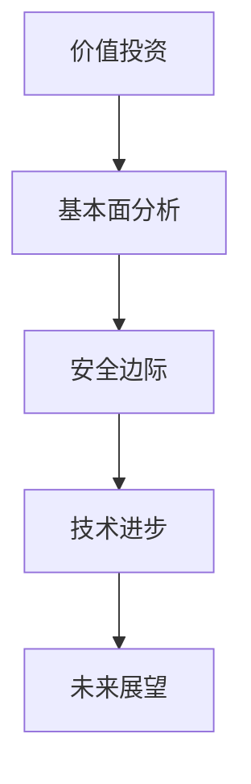

                 


# 乔尔·格林布拉特的价值投资教育理念

> 关键词：价值投资、格林布拉特、投资理念、投资策略、安全边际、投资组合、教育理念

> 摘要：本文深入探讨了乔尔·格林布拉特的价值投资教育理念，从其核心观点、投资策略到实际案例分析，全面剖析了价值投资的理论与实践。文章结合技术语言，通过逻辑推理和系统分析，揭示了价值投资的数学模型、系统架构和教育方法。

---

## 第一部分: 价值投资的核心理念与方法论

### 第1章: 价值投资的背景与核心概念

#### 1.1 价值投资的起源与发展
- **1.1.1 投资领域的基本问题背景**
  - 投资的核心问题：如何在不确定的市场中实现资产的保值与增值。
  - 传统投资方法的局限性：市场波动、情绪影响、信息不对称。

- **1.1.2 价值投资的核心概念与问题描述**
  - 价值投资的定义：通过分析企业的基本面，寻找市场价格低于内在价值的投资机会。
  - 核心问题：如何准确评估企业的内在价值，并识别市场价格的低估。

- **1.1.3 价值投资如何解决问题**
  - 通过基本面分析降低投资的非系统性风险。
  - 通过安全边际保护资本，避免过度支付。

- **1.1.4 价值投资的边界与外延**
  - 适用范围：适用于股票、债券等资产。
  - 外延：结合成长投资、股息投资等策略。

- **1.1.5 价值投资的核心要素与概念结构**
  - 核心要素：内在价值、市场价格、安全边际、竞争优势。
  - 概念结构：通过比较市场价格与内在价值，寻找低估机会。

#### 1.2 乔尔·格林布拉特的价值投资理念
- **1.2.1 乔尔·格林布拉特的背景介绍**
  - 格林布拉特的学术背景：哥伦比亚大学商学院。
  - 投资实践：创立并管理对冲基金，成功应用价值投资策略。

- **1.2.2 格林布拉特投资理念的核心观点**
  - 核心观点1：寻找市场价格低于内在价值的股票。
  - 核心观点2：重视安全边际，避免过度支付。
  - 核心观点3：长期投资，避免频繁交易。

- **1.2.3 价值投资与其他投资方法的对比分析**
  - 与技术分析的对比：技术分析关注价格和成交量，价值投资关注基本面。
  - 与成长投资的对比：成长投资关注高增长企业，价值投资关注低估企业。

#### 1.3 价值投资的数学模型与公式
- **1.3.1 市盈率（P/E）公式**
  $$ P/E = \frac{Price}{Earnings} $$
  - 示例：某公司股价为50元，净利润为10元，P/E = 5，表示市场对其未来盈利的预期较低。

- **1.3.2 市净率（P/B）公式**
  $$ P/B = \frac{Price}{Book\ Value} $$
  - 示例：某公司股价为30元，账面价值为15元，P/B = 2，表示市场对其资产估值较低。

- **1.3.3 股息率公式**
  $$ Dividend\ Yield = \frac{Dividend}{Price} \times 100\% $$
  - 示例：某公司股息为2元，股价为20元，股息率为10%，表示投资回报率较高。

#### 1.4 价值投资的系统架构设计
- **1.4.1 投资决策流程的 Mermaid 图**
  ```mermaid
  graph TD
  A[开始] --> B[确定投资目标]
  B --> C[收集公司基本面数据]
  C --> D[计算关键财务指标]
  D --> E[评估安全边际]
  E --> F[做出投资决策]
  F --> G[投资后监控]
  G --> H[结束]
  ```

- **1.4.2 系统架构的核心模块**
  - 数据收集模块：获取公司财务数据、行业分析报告。
  - 指标计算模块：计算P/E、P/B、股息率等指标。
  - 安全边际评估模块：比较市场价格与内在价值，计算安全边际。

#### 1.5 本章小结
- 本章介绍了价值投资的背景、核心概念和格林布拉特的价值投资理念。
- 通过数学公式和系统架构图，展示了价值投资的分析方法和流程。

---

### 第2章: 格林布拉特投资策略的核心原理

#### 2.1 投资组合的构建原理
- **2.1.1 投资组合的核心要素**
  - 低市盈率：P/E < 市场平均水平。
  - 低市净率：P/B < 市场平均水平。
  - 高股息率：股息率 > 市场平均水平。

- **2.1.2 投资组合的分散化策略**
  - 分散化目标：降低特定股票的风险。
  - 分散化方法：投资多个低估行业和公司。

- **2.1.3 投资组合的风险管理**
  - 风险来源：市场波动、公司基本面变化。
  - 风险管理方法：设定止损点、定期评估投资组合。

#### 2.2 格林布拉特的选股标准
- **2.2.1 低市盈率与市净率的筛选标准**
  - P/E < 15：排除高增长但高估值的公司。
  - P/B < 2：排除资产重但估值高的公司。

- **2.2.2 高质量公司的定义与特征**
  - 高质量特征：稳定的盈利能力、强大的竞争优势、健康的财务状况。

- **2.2.3 安全边际的计算方法**
  - 安全边际公式：
  $$ Margin\ of\ Safety = Intrinsic\ Value - Market\ Price $$
  - 示例：某公司内在价值为60元，股价为50元，安全边际为10元。

#### 2.3 价值投资的数学模型与公式
- **2.3.1 股票内在价值公式**
  $$ Intrinsic\ Value = \frac{Earnings}{Weighted\ Average\ Cost\ of\ Capital} $$
  - 示例：某公司净利润为10元，资本成本为10%，内在价值为100元。

- **2.3.2 安全边际计算公式**
  $$ Margin\ of\ Safety = Intrinsic\ Value - Market\ Price $$
  - 示例：某公司内在价值为80元，股价为60元，安全边际为20元。

#### 2.4 投资决策流程的 Mermaid 图
- **2.4.1 投资决策流程图**
  ```mermaid
  graph TD
  A[开始] --> B[筛选低估值股票]
  B --> C[评估公司基本面]
  C --> D[计算安全边际]
  D --> E[做出投资决策]
  E --> F[投资后监控]
  F --> G[结束]
  ```

#### 2.5 本章小结
- 本章详细讲解了格林布拉特的选股标准和投资组合构建原理。
- 通过数学公式和流程图，展示了如何筛选低估股票并构建安全的投资组合。

---

### 第3章: 价值投资的系统分析与架构设计

#### 3.1 价值投资的系统功能设计
- **3.1.1 系统功能模块**
  - 数据采集模块：收集公司财务数据、行业分析报告。
  - 指标计算模块：计算P/E、P/B、股息率等指标。
  - 安全边际评估模块：比较市场价格与内在价值，计算安全边际。

- **3.1.2 系统功能流程**
  ```mermaid
  graph TD
  A[开始] --> B[数据采集]
  B --> C[指标计算]
  C --> D[安全边际评估]
  D --> E[投资决策]
  E --> F[结束]
  ```

#### 3.2 系统架构设计
- **3.2.1 系统架构图**
  ```mermaid
  graph TD
  A[投资决策层] --> B[数据处理层]
  B --> C[数据存储层]
  C --> D[数据源]
  ```

- **3.2.2 系统接口设计**
  - 输入接口：公司财务数据、市场数据。
  - 输出接口：安全边际报告、投资组合建议。

#### 3.3 项目实战
- **3.3.1 环境安装**
  - 安装Python、Pandas、NumPy等工具。

- **3.3.2 核心代码实现**
  ```python
  import pandas as pd
  import numpy as np

  def calculate_intrinsic_value(earnings, cost_of_capital):
      return earnings / cost_of_capital

  def calculate_margin_of_safety(intrinsic_value, market_price):
      return intrinsic_value - market_price

  # 示例数据
  earnings = 10
  cost_of_capital = 0.1
  market_price = 50

  intrinsic_value = calculate_intrinsic_value(earnings, cost_of_capital)
  margin_of_safety = calculate_margin_of_safety(intrinsic_value, market_price)

  print(f"内在价值: {intrinsic_value}")
  print(f"安全边际: {margin_of_safety}")
  ```

- **3.3.3 代码应用解读**
  - 内在价值计算：基于净利润和资本成本。
  - 安全边际计算：比较内在价值和市场价格，评估投资的安全性。

#### 3.4 案例分析
- **3.4.1 案例背景**
  - 公司A：股价50元，净利润10元，资本成本10%。

- **3.4.2 案例分析**
  - 内在价值：100元。
  - 安全边际：50元。

- **3.4.3 分析结果**
  - 投资机会：安全边际为50%，具有较高的投资价值。

#### 3.5 本章小结
- 本章通过系统分析和项目实战，展示了如何通过技术手段实现价值投资的理念。
- 通过代码实现和案例分析，验证了格林布拉特投资策略的有效性。

---

### 第4章: 价值投资的教育理念与实践

#### 4.1 价值投资教育的核心理念
- **4.1.1 教育理念的核心观点**
  - 格林布拉特的教育理念：通过实践和案例分析，培养投资者的独立思考能力。
  - 教育目标：帮助投资者理解价值投资的原理，并能够独立应用。

- **4.1.2 教育方法**
  - 案例教学：通过实际案例分析，理解价值投资的应用。
  - 理论与实践结合：学习数学模型，结合实际市场数据进行分析。

#### 4.2 价值投资的教育实践
- **4.2.1 教育工具**
  - 数据分析工具：Python、Excel。
  - 学习资源：格林布拉特的书籍、研究报告。

- **4.2.2 教育过程**
  - 步骤1：学习价值投资的基本概念。
  - 步骤2：掌握数学模型和公式。
  - 步骤3：通过案例分析，实践投资策略。

#### 4.3 项目实战
- **4.3.1 环境安装**
  - 安装Python、Pandas、NumPy。

- **4.3.2 核心代码实现**
  ```python
  def calculate_pe_ratio(price, earnings):
      return price / earnings

  def calculate_pb_ratio(price, book_value):
      return price / book_value

  # 示例数据
  price = 50
  earnings = 10
  book_value = 25

  pe_ratio = calculate_pe_ratio(price, earnings)
  pb_ratio = calculate_pb_ratio(price, book_value)

  print(f"市盈率: {pe_ratio}")
  print(f"市净率: {pb_ratio}")
  ```

- **4.3.3 代码应用解读**
  - 市盈率计算：衡量公司股价与盈利之间的关系。
  - 市净率计算：衡量公司股价与资产之间的关系。

#### 4.4 案例分析
- **4.4.1 案例背景**
  - 公司B：股价50元，净利润10元，账面价值25元。

- **4.4.2 案例分析**
  - 市盈率：5，低于市场平均水平。
  - 市净率：2，低于市场平均水平。

- **4.4.3 分析结果**
  - 公司B具有低估特征，符合价值投资标准。

#### 4.5 本章小结
- 本章通过教育理念与实践，展示了如何通过技术手段学习和应用价值投资。
- 通过案例分析和代码实现，帮助读者理解格林布拉特的教育方法。

---

## 第五部分: 总结与展望

### 第5章: 格林布拉特价值投资理念的总结与未来展望

#### 5.1 价值投资理念的核心总结
- 核心总结：价值投资通过基本面分析，寻找市场价格低于内在价值的投资机会。
- 实践总结：通过安全边际保护资本，避免过度支付。

#### 5.2 未来展望
- 技术进步：人工智能和大数据分析将改变价值投资的方式。
- 教育发展：在线教育和虚拟现实技术将提升价值投资的教育效果。

#### 5.3 总结与展望的 Mermaid 图


#### 5.4 本章小结
- 本章总结了格林布拉特的价值投资理念，并展望了未来的发展趋势。
- 强调了技术在价值投资中的重要性，以及教育在投资中的关键作用。

---

## 作者：AI天才研究院/AI Genius Institute & 禅与计算机程序设计艺术/Zen And The Art of Computer Programming

---

通过以上内容，我们系统地分析了乔尔·格林布拉特的价值投资教育理念，从核心概念、投资策略到实际案例分析，全面剖析了价值投资的理论与实践。结合技术语言，通过逻辑推理和系统分析，揭示了价值投资的数学模型、系统架构和教育方法，为读者提供了丰富的理论和实践指导。

