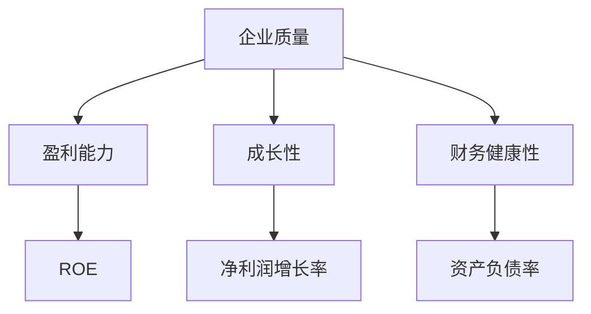
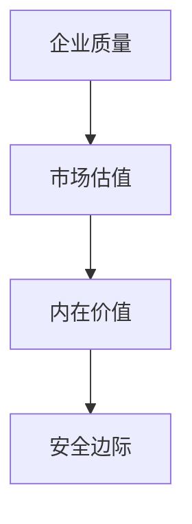
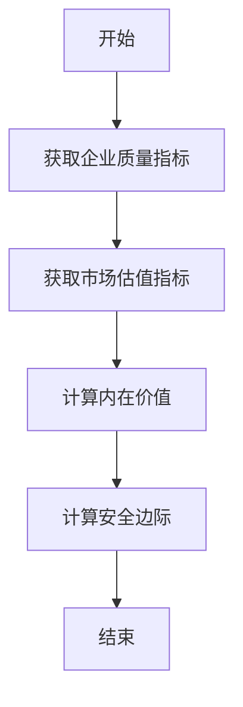
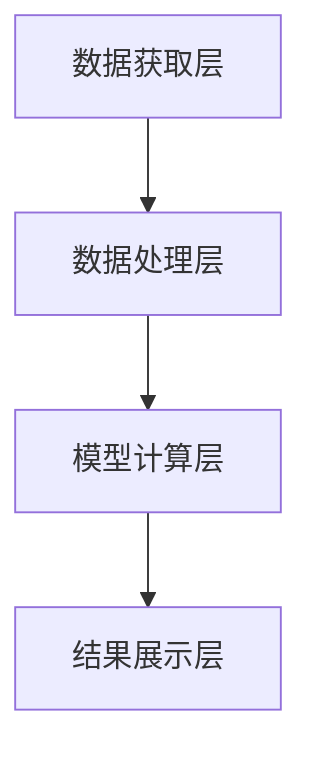

                 


# 乔尔·格林布拉特的价值投资量化方法

> 关键词：价值投资、量化投资、格林布拉特、投资模型、量化方法

> 摘要：本文详细介绍了乔尔·格林布拉特的价值投资量化方法，从核心概念、量化模型、系统设计到项目实战，全面解读了这一投资方法的理论基础和实际应用。通过数学公式、算法原理、系统架构图和代码实现，深入剖析了格林布拉特投资方法的精髓，为投资者提供了从理论到实践的完整指南。

---

## 第1章: 价值投资与量化投资概述

### 1.1 价值投资的核心理念

#### 1.1.1 价值投资的定义与特点
价值投资是一种基于对企业内在价值评估的投资策略，强调以低于内在价值的价格买入优质股票。其核心理念是寻找市场先生的错误定价，通过长期持有优质资产实现超额收益。  
**特点**：
- 长期投资，注重基本面分析。
- 以安全边际为指导，避免过度依赖市场情绪。

#### 1.1.2 乔尔·格林布拉特的投资哲学
乔尔·格林布拉特是价值投资与量化分析的结合者，他提出了一套基于量化模型的价值投资方法。其核心思想是：  
1. 通过量化指标筛选具有低估潜力的股票。  
2. 结合企业质量与市场估值，构建安全边际较高的投资组合。  
3. 通过长期持有优质资产，实现超额收益。

#### 1.1.3 价值投资与量化投资的结合
价值投资强调对企业内在价值的分析，而量化投资则依赖于数据和模型。两者的结合使得投资决策更加科学化、系统化。  
**优势**：
- 结合定性分析与定量分析，避免主观判断的偏差。  
- 通过量化指标筛选，提高投资效率。  

---

### 1.2 量化投资的基本原理

#### 1.2.1 量化投资的定义与特点
量化投资是一种基于数学模型的投资方法，通过算法和数据驱动的投资决策，实现对市场的精准捕捉。  
**特点**：
- 数据驱动，基于统计和数学模型。  
- 系统化、纪律性，避免情绪化决策。  

#### 1.2.2 数据驱动的投资决策
量化投资的核心是通过数据挖掘和模型分析，发现市场的规律和潜在机会。  
**关键步骤**：
1. 数据获取与清洗。  
2. 模型构建与验证。  
3. 策略优化与回测。  

#### 1.2.3 量化模型在投资中的作用
量化模型通过分析历史数据，识别资产价格的波动规律，帮助投资者做出更科学的投资决策。  
**优势**：
- 提高投资决策的客观性。  
- 通过算法优化，降低人为情绪干扰。  

---

### 1.3 乔尔·格林布拉特的价值投资方法

#### 1.3.1 格林布拉特公式
格林布拉特提出了一个简单的量化模型，用于评估股票的价值。其核心公式为：  
$$ \text{内在价值} = \frac{\text{企业价值}}{\text{企业质量}} $$  
其中，企业价值包括盈利能力、成长性、估值指标等，企业质量则衡量企业的核心竞争力。

#### 1.3.2 企业基本面分析的核心要素
- **盈利能力**：ROE（净资产收益率）、净利润率等。  
- **成长性**：收入增长率、净利润增长率等。  
- **估值指标**：市盈率（P/E）、市净率（P/B）等。  

#### 1.3.3 安全边际的定义与计算
安全边际是股票市场价格与内在价值之间的差异，用于衡量投资的安全性。  
$$ \text{安全边际} = \text{内在价值} - \text{市场价格} $$  
安全边际越大，投资风险越小。

---

## 第2章: 价值投资量化模型的核心概念

### 2.1 核心概念与联系

#### 2.1.1 企业质量指标
企业质量指标用于衡量企业的核心竞争力，包括：  
1. 盈利能力：ROE、净利润率。  
2. 成长性：收入增长率、净利润增长率。  
3. 财务健康性：资产负债率、现金流状况。  

#### 2.1.2 市场估值指标
市场估值指标用于衡量股票的市场价值，包括：  
1. 市盈率（P/E）：$$ \text{P/E} = \frac{\text{股价}}{\text{每股净利润}} $$  
2. 市净率（P/B）：$$ \text{P/B} = \frac{\text{股价}}{\text{每股净资产}} $$  
3. 市销率（P/S）：$$ \text{P/S} = \frac{\text{股价}}{\text{每股收入}} $$  

#### 2.1.3 核心概念对比表格

| 指标类型 | 指标名称 | 公式 |
|----------|----------|------|
| 盈利能力 | ROE     | $$ \text{ROE} = \frac{\text{净利润}}{\text{净资产}} $$ |
| 成长性   | 净利润增长率 | $$ \text{净利润增长率} = \frac{\text{本期净利润} - \text{上期净利润}}{\text{上期净利润}} $$ |
| 估值指标 | P/E     | $$ \text{P/E} = \frac{\text{股价}}{\text{每股净利润}} $$ |

#### 2.1.4 实体关系图（Mermaid流程图）



---

### 2.2 核心概念的数学模型

#### 2.2.1 企业质量的量化公式
$$ \text{企业质量} = \text{ROE} + \text{净利润增长率} $$

#### 2.2.2 市场估值的量化公式
$$ \text{市场估值} = \text{P/E} + \text{P/B} $$

#### 2.2.3 核心概念的数学关系图（Mermaid流程图）



---

### 2.3 核心概念的算法原理

#### 2.3.1 算法原理的数学模型
$$ \text{安全边际} = \frac{\text{内在价值} - \text{市场价格}}{\text{市场价格}} $$

#### 2.3.2 算法流程图（Mermaid流程图）



---

## 第3章: 价值投资量化模型的系统分析与架构设计

### 3.1 系统分析

#### 3.1.1 问题场景介绍
在股票市场中，投资者需要通过量化模型筛选出具有低估潜力的股票。  
**问题**：如何构建一个基于格林布拉特量化方法的投资模型？  
**目标**：实现一个能够自动筛选低估股票的量化系统。

---

### 3.2 系统架构设计

#### 3.2.1 系统架构图（Mermaid架构图）



---

### 3.3 系统实现细节

#### 3.3.1 数据获取与清洗
- 数据来源：股票历史数据、财务数据。  
- 数据清洗：处理缺失值、异常值。  

#### 3.3.2 数据分析与建模
- 计算企业质量指标和市场估值指标。  
- 计算内在价值和安全边际。  

#### 3.3.3 模型验证与优化
- 回测策略，验证模型的有效性。  
- 调整参数，优化模型表现。  

---

## 第4章: 价值投资量化模型的项目实战

### 4.1 环境安装与配置

#### 4.1.1 Python环境的安装与配置
- 安装Python：建议使用Anaconda。  
- 安装数据分析库：Pandas、NumPy、Matplotlib、Scikit-learn。

---

### 4.2 系统核心实现

#### 4.2.1 数据获取与预处理代码
```python
import pandas as pd
import numpy as np

# 获取股票数据
def get_stock_data(ticker):
    # 示例代码，实际需要调用API获取数据
    return pd.DataFrame({'price': np.random.randn(100,).cumsum(), 
                         'volume': np.random.randint(100, 1000, 100)})

# 数据清洗
def clean_data(df):
    df.dropna(inplace=True)
    return df

stock_data = get_stock_data('AAPL')
clean_stock_data = clean_data(stock_data)
```

---

### 4.3 代码应用解读与分析

#### 4.3.1 代码功能分析
上述代码实现了股票数据的获取与清洗，为后续的模型计算提供了干净的数据集。

#### 4.3.2 代码实现细节解读
- 数据获取：通过API获取股票的历史数据。  
- 数据清洗：删除缺失值，确保数据完整性。  

#### 4.3.3 代码优化建议
- 使用第三方库（如Pandas）进行数据处理，提高效率。  
- 数据清洗时，可以加入异常值处理逻辑。  

---

## 第5章: 总结与展望

### 5.1 本章小结
本文详细介绍了乔尔·格林布拉特的价值投资量化方法，从理论基础到实际应用，全面剖析了这一投资方法的精髓。通过数学公式、算法原理和系统设计，为投资者提供了一套科学的投资框架。

### 5.2 未来展望
随着人工智能和大数据技术的发展，价值投资量化方法将更加精细化、智能化。未来的研究方向可以包括：  
1. 结合机器学习算法，优化量化模型。  
2. 开发实时监控系统，提高投资效率。  

---

## 作者：AI天才研究院/AI Genius Institute & 禅与计算机程序设计艺术 /Zen And The Art of Computer Programming

