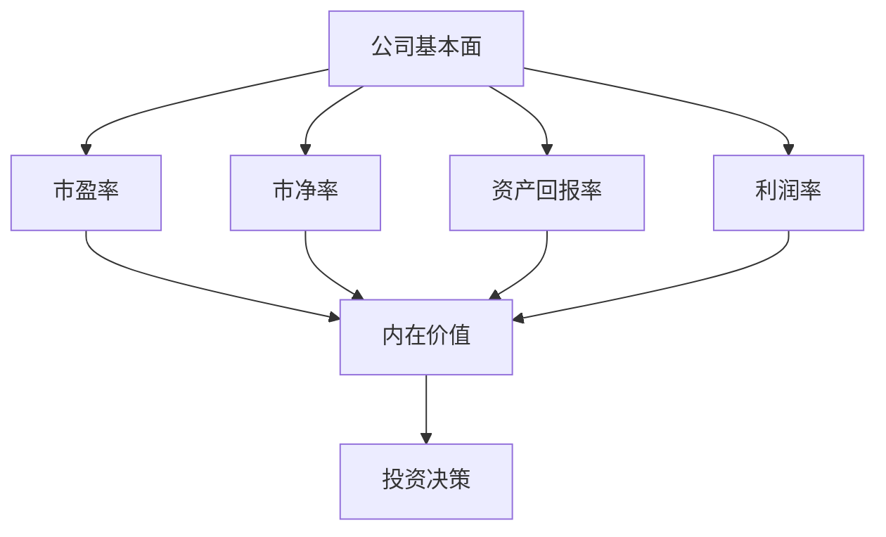
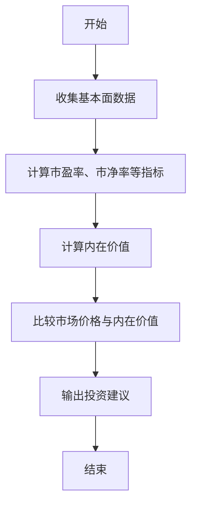
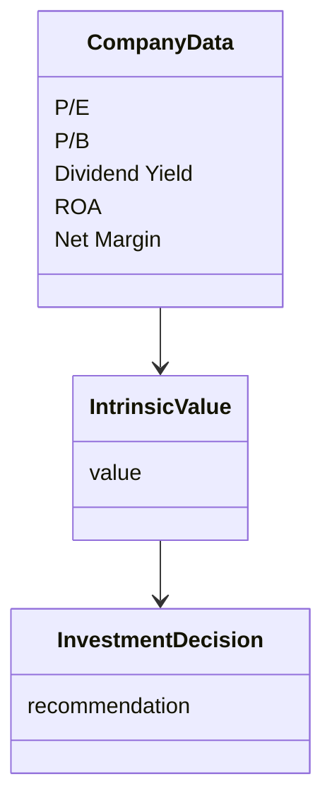
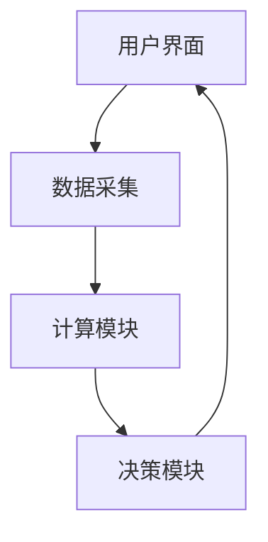

                 


# 乔尔·格林布拉特的价值投资量化模型

> **关键词**: 价值投资，量化模型，乔尔·格林布拉特，股票分析，投资策略

> **摘要**: 本文深入探讨了乔尔·格林布拉特的价值投资量化模型，分析了其核心概念、算法原理、系统架构及实际应用。通过详细的数学推导、代码实现和案例分析，展示了如何利用该模型进行有效的投资决策。

---

## 第一部分: 价值投资与量化模型的背景

### 第1章: 价值投资的起源与发展

#### 1.1 价值投资的核心理念

- **价值投资的定义与起源**  
  价值投资是一种以基本面分析为基础的投资策略，旨在寻找市场中被低估的优质股票。该方法起源于20世纪30年代，由本杰明·格雷厄姆和戴维·多德共同提出，强调安全边际和内在价值。

- **价值投资的基本原则**  
  - 坚持长期投资，避免频繁交易。  
  - 重点关注公司的基本面，如盈利能力、财务状况和竞争优势。  
  - 在市场恐慌时寻找机会，逆向投资。

- **价值投资在现代金融中的地位**  
  尽管传统价值投资依赖主观判断，但其理念为量化模型的发展提供了基础。

#### 1.2 乔尔·格林布拉特的贡献

- **乔尔·格林布拉特的生平简介**  
  乔尔·格林布拉特是美国著名投资家，曾师从彼得·林奇，以其量化投资模型闻名。他的模型结合了基本面分析和量化方法，开创了投资领域的全新思路。

- **格林布拉特模型的提出背景**  
  20世纪80年代，格林布拉特意识到传统价值投资的主观性较强，难以系统化和量化。他尝试将基本面指标量化，以寻找被市场低估的股票。

- **格林布拉特模型的核心思想**  
  该模型通过计算股票的内在价值，结合市场估值指标，筛选出具有投资价值的股票。其核心在于将定性分析转化为定量指标，提高了投资决策的科学性。

#### 1.3 量化模型在投资中的应用

- **传统投资分析的局限性**  
  传统分析依赖个人经验和主观判断，难以避免人为误差，且难以系统化。

- **量化投资的优势与挑战**  
  量化投资利用数学模型，提高了决策效率和准确性。但需要克服数据获取困难、模型过拟合等问题。

- **格林布拉特模型的量化方法**  
  该模型通过量化基本面指标，构建了选股标准，使投资决策更加客观和可操作。

---

## 第二部分: 格林布拉特模型的核心概念

### 第2章: 核心概念与原理

#### 2.1 格林布拉特模型的定义

- **模型的输入变量**  
  - 市盈率（P/E）  
  - 市净率（P/B）  
  - 股息率（Dividend Yield）  
  - 资产回报率（ROA）  
  - 净利润率（Net Margin）

- **模型的输出结果**  
  - 股票的内在价值  
  - 相对于市场的低估程度

- **模型的适用范围**  
  适用于对单个股票的分析，尤其适合中长期投资策略。

#### 2.2 核心概念的属性特征对比

- **模型的输入变量对比表**  
  | 指标 | 定义 | 重要性 |
  |------|------|--------|
  | P/E  | 价格与收益比 | 高 |
  | P/B  | 价格与资产比 | 中 |
  | 股息率 | 股息与股价比 | 中 |
  | ROA  | 资产回报率 | 高 |
  | 净利润率 | 利润与收入比 | 高 |

- **模型的输出结果对比表**  
  | 输出结果 | 定义 | 应用 |
  |----------|------|------|
  | 内在价值 | 公司股票的理论价值 | 与市场价格对比 |
  | 低估程度 | 内在价值与市场价格的差异 | 作为投资决策依据 |

- **模型与其他量化模型的对比**  
  与CAPM、APT等模型相比，格林布拉特模型更注重基本面指标的量化，适合个股分析。

#### 2.3 实体关系图



---

## 第三部分: 格林布拉特模型的算法原理

### 第3章: 算法原理与实现

#### 3.1 算法流程图



#### 3.2 算法实现代码

- **环境安装**  
  需要安装Python、Pandas、NumPy等库。

```python
import pandas as pd
import numpy as np

def calculate_intrinsic_value(financial_data):
    # 假设financial_data为包含基本面指标的DataFrame
    pe = financial_data['P/E']
    pb = financial_data['P/B']
    dividend_yield = financial_data['Dividend Yield']
    roa = financial_data['ROA']
    net_margin = financial_data['Net Margin']
    
    # 计算内在价值的公式
    intrinsic_value = (pe + pb + dividend_yield + roa + net_margin) / 5
    return intrinsic_value

# 示例数据
data = {
    'P/E': [15, 20, 12],
    'P/B': [2.5, 3.0, 1.8],
    'Dividend Yield': [2%, 1.5%, 3%],
    'ROA': [8%, 5%, 10%],
    'Net Margin': [6%, 4%, 7%]
}

financial_data = pd.DataFrame(data)
intrinsic_value = calculate_intrinsic_value(financial_data)
print(intrinsic_value)
```

#### 3.3 数学模型与公式

- **模型的数学表达式**  
  内在价值公式：  
  $$ \text{Intrinsic Value} = \frac{\text{P/E} + \text{P/B} + \text{Dividend Yield} + \text{ROA} + \text{Net Margin}}{5} $$

- **核心公式的详细推导**  
  该公式基于多个基本面指标的加权平均，每个指标权重相同。

- **公式的应用实例**  
  以某公司为例，计算其内在价值，并与市场价格对比，判断是否低估。

---

## 第四部分: 系统架构与设计

### 第4章: 系统架构设计

#### 4.1 系统功能设计



- **系统功能模块划分**  
  - 数据采集模块：收集公司基本面数据。  
  - 计算模块：计算内在价值。  
  - 决策模块：输出投资建议。

#### 4.2 系统架构图



#### 4.3 系统接口设计

- **输入接口设计**  
  接收股票代码和历史数据。

- **输出接口设计**  
  输出内在价值和投资建议。

#### 4.4 系统交互图

```mermaid
sequenceDiagram
    用户 -> 数据采集模块: 提供股票代码
    数据采集模块 -> 数据库: 获取基本面数据
    数据采集模块 -> 计算模块: 传递数据
    计算模块 -> 输出内在价值
    计算模块 -> 决策模块: 传递内在价值
    决策模块 -> 用户: 输出投资建议
```

---

## 第五部分: 项目实战与案例分析

### 第5章: 项目实战

#### 5.1 项目环境安装

```bash
pip install pandas numpy matplotlib
```

#### 5.2 核心代码实现

```python
import pandas as pd
import numpy as np

def calculate_intrinsic_value(data):
    return np.mean(data)

# 示例数据
data = {'P/E': 15, 'P/B': 2.5, 'Dividend Yield': 0.02, 'ROA': 0.08, 'Net Margin': 0.06}
intrinsic_value = calculate_intrinsic_value(data)
print(f'Intrinsic Value: {intrinsic_value}')
```

#### 5.3 实际案例分析

- **案例选择**：某公司基本面数据。
- **分析过程**：计算内在价值，对比市场价格，判断投资价值。
- **结果解读**：根据计算结果，给出投资建议。

---

## 第六部分: 最佳实践与总结

### 第6章: 最佳实践

- **小结**  
  本文详细介绍了格林布拉特模型的核心概念、算法原理和系统设计，展示了其在投资决策中的应用。

- **注意事项**  
  - 数据来源的准确性至关重要。  
  - 模型需定期更新，适应市场变化。  
  - 投资决策应结合市场环境和个股情况。

- **拓展阅读**  
  - 格林布拉特的《证券分析》  
  - 其他量化投资书籍

---

## 结语

通过本文的分析，读者可以深入了解乔尔·格林布拉特的价值投资量化模型，并将其应用于实际投资中。模型的科学性和可操作性使其成为投资领域的重要工具。

---

**作者：AI天才研究院/AI Genius Institute & 禅与计算机程序设计艺术 /Zen And The Art of Computer Programming**

