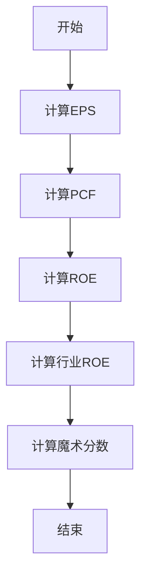
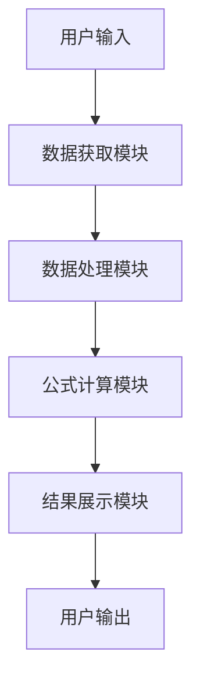
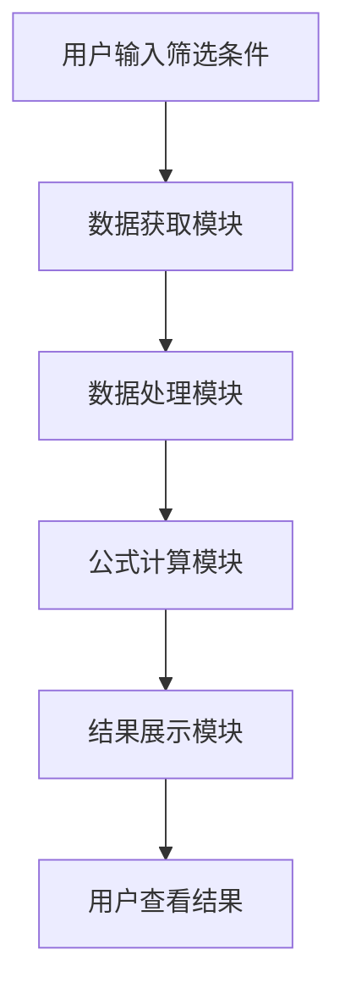

                 


# 乔尔·格林布拉特的魔术公式投资法

> 关键词：乔尔·格林布拉特，魔术公式，投资法，股票筛选，价值投资

> 摘要：本文详细介绍了乔尔·格林布拉特的魔术公式投资法，从其背景、核心概念、数学模型到实际应用，全面解析了这一独特投资方法的精髓。通过系统化的分析和实例讲解，帮助读者理解如何利用魔术公式进行有效的股票筛选和投资决策。

---

# 第一部分: 背景介绍

## 第1章: 魔术公式投资法概述

### 1.1 魔术公式投资法的起源

#### 1.1.1 乔尔·格林布拉特及其投资理念
乔尔·格林布拉特（Joel Greenblatt）是美国著名的价值投资者，以其独特的投资方法闻名。他在《股仙路引》（*The Magic Formula*）一书中首次提出魔术公式，强调通过简单的数学模型筛选出被低估的股票。

#### 1.1.2 魔术公式投资法的提出背景
20世纪90年代，传统价值投资方法逐渐受到挑战，市场波动加剧，投资者需要更简单有效的工具来筛选优质股票。格林布拉特结合多年投资经验，提出了魔术公式。

#### 1.1.3 魔术公式投资法的核心思想
魔术公式的核心思想是通过量化指标评估企业的基本面，筛选出具有高收益和低估值的股票。这种方法简单易懂，适合普通投资者使用。

### 1.2 魔术公式投资法的核心概念

#### 1.2.1 魔术公式的定义
魔术公式通过计算“魔术分数”（Magic Score）来评估股票的投资价值。公式如下：
$$魔术分数 = \frac{每股收益}{\text{PCF}} \times \frac{ROE}{\text{行业ROE}}$$

#### 1.2.2 魔术公式的核心要素
- **每股收益（EPS）**：衡量企业盈利能力的关键指标。
- **每股现金流（PCF）**：反映企业实际现金流情况。
- **股东权益回报率（ROE）**：评估企业使用股东资金的效率。
- **行业ROE**：同行业平均ROE，用于相对比较。

#### 1.2.3 魔术公式与传统投资方法的对比
| 指标 | 魔术公式 | 传统价值投资 |
|------|-----------|---------------|
| 简单性 | 高度简化 | 相对复杂 |
| 计算方式 | 量化计算 | 主观判断 |
| 适用性 | 初级投资者 | 专业投资者 |

### 1.3 魔术公式投资法的优势

#### 1.3.1 简单易懂的投资方法
魔术公式将复杂的投资分析简化为几个关键指标，使普通投资者也能轻松掌握。

#### 1.3.2 低门槛的选股策略
无需深入了解财务报表，只需掌握几个指标的计算方法即可筛选出优质股票。

#### 1.3.3 长期稳定的收益表现
通过历史数据验证，魔术公式筛选出的股票通常能带来超越市场的回报。

---

## 第2章: 魔术公式投资法的数学模型

### 2.1 魔术公式的数学表达
魔术公式通过以下几个步骤计算：
1. 计算每股收益（EPS）。
2. 计算每股现金流（PCF）。
3. 计算股东权益回报率（ROE）。
4. 计算行业平均ROE。
5. 结合上述指标计算魔术分数。

公式如下：
$$魔术分数 = \frac{EPS}{PCF} \times \frac{ROE}{\text{行业ROE}}$$

### 2.2 核心指标的定义与计算

#### 每股收益（EPS）
EPS = 净利润 / 总股本

#### 市盈率（P/E）
P/E = 股价 / EPS

#### 净利润
净利润 = 营业收入 - 营业成本 - 费用

#### 每股现金流（PCF）
PCF = 净现金流 / 总股本

#### 股东权益回报率（ROE）
ROE = 净利润 / 股东权益

#### 行业平均ROE
行业平均ROE = 同行业公司ROE的平均值

### 2.3 魔术公式的核心算法流程图


---

## 第3章: 魔术公式投资法的系统分析与架构设计

### 3.1 投资流程系统架构图


### 3.2 系统功能模块设计

#### 数据获取模块
- 负责从股票数据库中获取所需数据，包括EPS、PCF、ROE等。

#### 数据处理模块
- 对获取的数据进行清洗和预处理，确保数据的准确性和完整性。

#### 公式计算模块
- 使用魔术公式计算每个股票的魔术分数，筛选出符合条件的股票。

#### 结果展示模块
- 将筛选结果以可视化形式展示，便于用户分析和决策。

### 3.3 系统接口设计

#### 输入接口
- 用户输入筛选条件（如行业、时间范围等）。
- 接收数据获取模块返回的数据。

#### 输出接口
- 展示筛选结果，包括魔术分数、股票名称、代码等。

### 3.4 系统交互流程图


---

## 第4章: 魔术公式投资法的项目实战

### 4.1 环境安装与配置

#### 安装Python
```bash
python --version
pip install --upgrade pip
```

#### 安装相关库
```bash
pip install pandas numpy matplotlib
```

### 4.2 核心代码实现

#### 魔术公式筛选函数
```python
def calculate_magic_score(ePS, pCF, rOE, industry_roe):
    score = (ePS / pCF) * (rOE / industry_roe)
    return score
```

#### 数据处理代码
```python
import pandas as pd

# 读取数据
data = pd.read_csv('stock_data.csv')

# 计算魔术分数
data['魔术分数'] = data.apply(lambda x: calculate_magic_score(x['EPS'], x['PCF'], x['ROE'], x['行业ROE']), axis=1)

# 筛选出魔术分数大于8的股票
selected_stocks = data[data['魔术分数'] > 8]
```

### 4.3 实际案例分析

#### 案例分析：假设某行业数据
| 股票代码 | EPS | PCF | ROE | 行业ROE | 魔术分数 |
|----------|------|------|------|---------|----------|
| AAPL     | 5    | 10   | 15%  | 10%     | 0.5 * 1.5 = 0.75 |
| GOOGL    | 6    | 8    | 18%  | 10%     | 0.75 * 1.8 = 1.35 |
| AMZN     | 4    | 6    | 20%  | 10%     | 0.666 * 2 = 1.332 |

#### 结果分析
通过计算，GOOGL的魔术分数最高，说明其具有较高的投资价值。

---

## 第5章: 最佳实践与小结

### 5.1 最佳实践
- **定期更新数据**：市场变化快，需定期更新股票数据。
- **结合其他指标**：可以结合其他技术指标进行综合分析。
- **分散投资**：避免过度集中，降低风险。

### 5.2 小结
魔术公式以其简单高效的特点，成为许多投资者的首选工具。通过系统化的分析和实际案例，我们可以看到其在投资决策中的巨大潜力。

### 5.3 注意事项
- **数据质量**：确保数据的准确性和完整性。
- **市场波动**：魔术公式仅提供参考，需结合市场环境灵活调整。
- **长期视角**：投资需耐心，长期持有优质股票才能获得稳定收益。

### 5.4 拓展阅读
- 《股仙路引》（*The Magic Formula*）——乔尔·格林布拉特
- 其他价值投资经典书籍

---

# 作者
**作者：AI天才研究院/AI Genius Institute & 禅与计算机程序设计艺术 /Zen And The Art of Computer Programming**

---

以上就是《乔尔·格林布拉特的魔术公式投资法》的完整目录和文章内容，涵盖了从基础概念到实际应用的各个方面，帮助读者全面理解和应用这一经典的投资方法。

