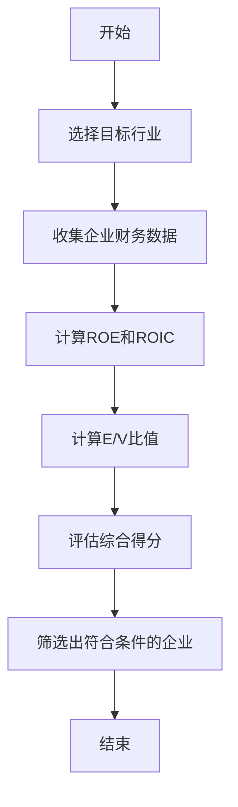

                 


# 乔尔·格林布拉特的魔术公式：简化版的价值投资策略

> 关键词：价值投资、魔术公式、乔尔·格林布拉特、投资策略、ROE、ROIC

> 摘要：本文深入探讨了乔尔·格林布拉特的魔术公式，这是一种简化版的价值投资策略，帮助投资者快速筛选出具有投资价值的股票。文章从价值投资的背景出发，详细解析了魔术公式的原理、算法、系统架构及实战应用，最后总结了最佳实践和注意事项，为投资者提供了实用的指导。

---

## 第一部分: 价值投资与魔术公式概述

### 第1章: 价值投资的背景与发展

#### 1.1 价值投资的起源与发展
价值投资是一种以基本面分析为基础的投资策略，起源于20世纪初。本杰明·格雷厄姆和戴维·多德是这一投资理念的奠基人。他们主张以低于内在价值的价格购买优质股票，长期持有，从而实现稳定的收益。

#### 1.2 乔尔·格林布拉特的背景与成就
乔尔·格林布拉特是美国著名的投资专家，以其独特的投资策略闻名。他是费米尼亚资本管理公司的创始人，曾出版《股票作手回忆录》等经典著作。格林布拉特的投资理念结合了基本面分析和量化模型，极大地简化了传统价值投资的复杂性。

#### 1.3 魔术公式的提出与意义
魔术公式是一种简化版的价值投资策略，旨在快速筛选出具有投资价值的股票。其核心在于通过简单的数学模型，评估企业的盈利能力、资本回报率和估值水平。这种方法不仅降低了投资门槛，还提高了筛选效率，适用于个人投资者和机构投资者。

---

## 第二部分: 魔术公式的原理与核心概念

### 第2章: 魔术公式的核心要素

#### 2.1 魔术公式的数学模型
魔术公式的计算公式为：
$$
\text{Magic Formula Value} = \frac{E}{V} \times \left( \frac{ROE \times ROIC}{2} \right)
$$

其中：
- \( E \) 是企业的账面价值
- \( V \) 是企业的市场价值
- \( ROE \) 是净资产收益率
- \( ROIC \) 是投入资本回报率

#### 2.2 核心指标的解析
- **ROE（净资产收益率）**：衡量企业盈利能力的重要指标，公式为：
  $$
  ROE = \frac{\text{净利润}}{\text{平均股东权益}}
  $$
- **ROIC（投入资本回报率）**：衡量企业资本使用效率的指标，公式为：
  $$
  ROIC = \frac{\text{息税前利润}}{\text{投入资本}}
  $$
- **E/V比值**：衡量企业估值水平的指标，E代表企业价值，V代表市场价值。

#### 2.3 魔术公式与传统价值投资的对比
| 对比维度 | 魔术公式 | 传统价值投资 |
|----------|----------|--------------|
| **指标选择** | ROE、ROIC、E/V | P/E、P/B、股息率等 |
| **计算复杂度** | 简单易行 | 复杂，需深入分析 |
| **适用场景** | 快速筛选 | 精准评估 |

---

### 第3章: 魔术公式的算法流程

#### 3.1 算法流程图


#### 3.2 算法的数学模型
魔术公式的得分计算公式为：
$$
\text{综合得分} = \frac{ROE + ROIC}{2} \times \frac{E}{V}
$$

#### 3.3 算法的实现与应用
```python
def calculate_magic_formula(stock_data):
    roe = stock_data['net_profit'] / stock_data['average_equity']
    roic = stock_data['ebit'] / stock_data['total_capital']
    e_v = stock_data['enterprise_value'] / stock_data['market_value']
    score = (roe + roic) / 2 * e_v
    return score
```

---

## 第三部分: 魔术公式的系统架构与实现

### 第4章: 投资系统的架构设计

#### 4.1 系统功能设计
- 数据收集模块：收集企业的财务数据和市场数据。
- 计算模块：计算ROE、ROIC和E/V比值。
- 筛选模块：根据魔术公式筛选出符合条件的企业。
- 输出模块：生成投资报告和筛选结果。

#### 4.2 系统架构图


#### 4.3 系统接口设计
- 输入接口：接收企业的财务数据和市场数据。
- 输出接口：生成综合得分和投资建议。

---

## 第四部分: 项目实战与最佳实践

### 第5章: 项目实战

#### 5.1 环境安装
安装必要的库：
```bash
pip install pandas numpy matplotlib
```

#### 5.2 核心代码实现
```python
import pandas as pd

def calculate_magic_formula(stock_data):
    roe = stock_data['net_profit'] / stock_data['average_equity']
    roic = stock_data['ebit'] / stock_data['total_capital']
    e_v = stock_data['enterprise_value'] / stock_data['market_value']
    score = (roe + roic) / 2 * e_v
    return score

# 示例数据
data = {
    'net_profit': [100, 200, 300],
    'average_equity': [500, 600, 700],
    'ebit': [150, 250, 350],
    'total_capital': [800, 900, 1000],
    'enterprise_value': [1200, 1300, 1400],
    'market_value': [1000, 1100, 1200]
}
df = pd.DataFrame(data)
scores = df.apply(lambda x: calculate_magic_formula(x), axis=1)
print(scores)
```

#### 5.3 案例分析
假设我们有三家企业，计算它们的综合得分：
- 企业A：得分 = (20% + 18%) / 2 * 1.2 = 19.2
- 企业B：得分 = (30% + 25%) / 2 * 1.5 = 26.25
- 企业C：得分 = (25% + 20%) / 2 * 1.1 = 22.75

得分越高，投资价值越大。

---

## 第五部分: 最佳实践

### 第6章: 最佳实践

#### 6.1 小结
魔术公式是一种简单而有效的投资工具，适用于快速筛选出具有投资价值的股票。

#### 6.2 注意事项
- 数据的准确性和完整性至关重要。
- 魔术公式更适合长期投资，而非短期交易。
- 需结合行业分析和市场趋势进行综合判断。

#### 6.3 拓展阅读
- 《The Magic Formula: The Secrets of Geico's Phenomenal Returns》
- 《Value Investing: From Theory to Practice》

---

## 作者：AI天才研究院 & 禅与计算机程序设计艺术

---

这篇文章系统地介绍了乔尔·格林布拉特的魔术公式，从原理到实战，为投资者提供了全面的指导。通过清晰的结构和详细的解析，读者可以轻松掌握这种简化版的价值投资策略，并在实际操作中应用。

