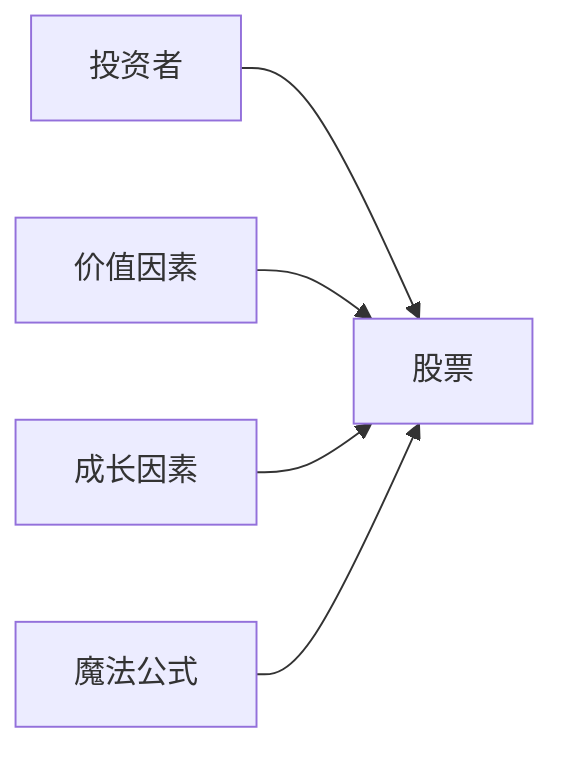
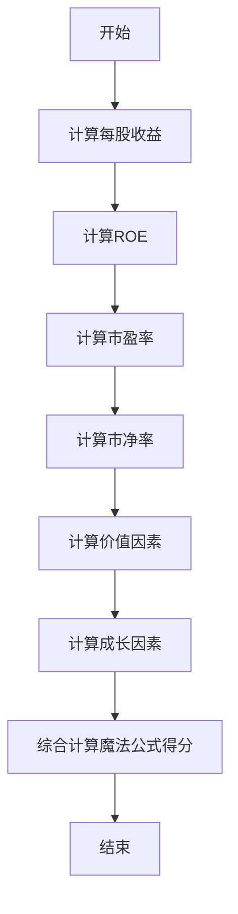
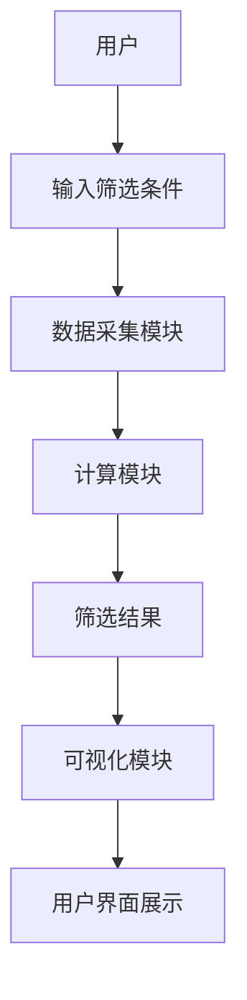

                 


# 《乔尔·格林布拉特的魔法公式投资策略》

> **关键词**：魔法公式、投资策略、价值投资、成长投资、股票筛选、投资组合优化

> **摘要**：本文深入解析了乔尔·格林布拉特的魔法公式投资策略，从其核心概念、算法原理到系统架构设计，再到实际项目实战，全面阐述了如何利用该公式进行有效的股票筛选和投资组合优化。文章通过详细的数学模型和代码实现，结合实际案例分析，为读者提供了一套科学的投资策略。

---

## # 第一部分: 魔法公式投资策略概述

### ## 第1章: 投资的基本概念与魔法公式背景

#### ### 1.1 投资的基本概念
投资是将资金投入到能够产生收益的资产中，以实现财富增值的过程。投资的核心在于选择具有高回报潜力的资产，同时控制风险。投资可以分为股票、债券、房地产等多种形式，其中股票投资因其高增长潜力而备受关注。

#### ### 1.2 魔法公式的起源与背景
乔尔·格林布拉特（Joel Greenblatt）是美国著名的投资专家，以其独特的“魔法公式”闻名。魔法公式是一种用于筛选股票的投资策略，结合了价值投资和成长投资的理念。它通过量化分析，帮助投资者找到那些被市场低估且具有高增长潜力的公司。

#### ### 1.3 魔法公式与传统投资策略的区别
传统的价值投资注重低市盈率、低市净率等估值指标，而成长投资则关注高增长率和高收益。魔法公式将两者结合，通过计算特定的财务指标，找到那些既有较低估值又有较高成长性的股票。

---

### ## 第2章: 魔法公式的核心概念与计算方法

#### ### 2.1 魔法公式的基本原理
魔法公式的核心在于通过量化分析，筛选出具有高投资价值的股票。其计算公式如下：
$$
\text{Magic Formula Score} = \frac{ROE \times \text{EBIT Margin} \times \text{Revenue Growth}}{\text{市盈率} \times \text{市净率}}
$$

其中：
- ROE：净资产收益率，衡量公司盈利能力。
- EBIT Margin：息税折旧前利润率，衡量公司运营效率。
- Revenue Growth：收入增长率，衡量公司成长性。
- 市盈率和市净率：衡量公司的估值水平。

#### ### 2.2 魔法公式的两个核心因素
1. **价值因素（Value Factor）**：通过市盈率和市净率等指标衡量公司的估值水平。
2. **成长因素（Growth Factor）**：通过收入增长率和净利润增长率等指标衡量公司的成长潜力。

#### ### 2.3 魔法公式的计算公式与表格对比
下表对比了传统价值投资和成长投资的指标：

| 指标类型 | 价值投资指标 | 成长投资指标 |
|----------|---------------|--------------|
| 市盈率   | 低            | 无要求       |
| 市净率   | 低            | 无要求       |
| 收入增长率 | 无要求        | 高           |
| 净利润增长率 | 无要求        | 高           |

#### ### 2.4 魔法公式的ER实体关系图


---

### ## 第3章: 魔法公式算法原理与数学模型

#### ### 3.1 魔法公式的计算流程


#### ### 3.2 魔法公式的数学模型
魔法公式的数学表达式如下：
$$
\text{Magic Formula Score} = \frac{\text{ROE} \times \text{EBIT Margin} \times \text{Revenue Growth}}{\text{市盈率} \times \text{市净率}}
$$

其中：
- ROE = 净利润 / 平均净资产
- EBIT Margin = EBIT / 收入
- Revenue Growth = (当前收入 - 上期收入) / 上期收入
- 市盈率 = 每股价格 / 每股收益
- 市净率 = 每股价格 / 每股净资产

---

## # 第二部分: 魔法公式投资策略的系统架构设计

### ## 第4章: 系统架构与功能设计

#### ### 4.1 问题场景介绍
投资者需要一个高效的工具来筛选股票，以找到具有高投资价值的标的。魔法公式提供了量化筛选的标准，但手动计算复杂，因此需要一个自动化系统。

#### ### 4.2 系统功能设计
- **数据采集模块**：获取股票的基本数据（ROE、EBIT Margin、Revenue Growth、市盈率、市净率等）。
- **计算模块**：根据魔法公式计算每只股票的得分。
- **筛选模块**：根据设定的阈值筛选出符合条件的股票。
- **可视化模块**：将结果以图表形式展示，便于分析。

#### ### 4.3 系统架构设计


#### ### 4.4 系统接口设计
- 数据接口：从数据源获取股票数据。
- 计算接口：调用魔法公式计算得分。
- 可视化接口：展示筛选结果。

#### ### 4.5 系统交互流程


---

### ## 第5章: 项目实战与代码实现

#### ### 5.1 环境安装
- Python 3.8+
- Pandas、NumPy、Matplotlib、Scikit-learn

#### ### 5.2 核心代码实现
```python
import pandas as pd
import numpy as np

def calculate_magic_formula_score(roe, ebit_margin, revenue_growth, pe, pb):
    return (roe * ebit_margin * revenue_growth) / (pe * pb)

# 示例数据
data = {
    '公司': ['A', 'B', 'C'],
    'ROE': [0.2, 0.15, 0.3],
    'EBIT Margin': [0.15, 0.1, 0.2],
    'Revenue Growth': [0.2, 0.15, 0.25],
    'PE': [15, 20, 10],
    'PB': [2, 3, 1.5]
}

df = pd.DataFrame(data)

# 计算魔法公式得分
df['Magic Score'] = df.apply(lambda row: calculate_magic_formula_score(row['ROE'], row['EBIT Margin'], 
                                                                          row['Revenue Growth'], row['PE'], row['PB']), axis=1)

print(df)
```

#### ### 5.3 代码解读与分析
- 数据采集：从数据库或API获取股票数据。
- 计算模块：使用Python函数计算魔法公式得分。
- 可视化：使用Matplotlib绘制得分分布图。

#### ### 5.4 实际案例分析
以某行业为例，计算几只股票的魔法公式得分，并筛选出得分最高的股票作为投资标的。

#### ### 5.5 项目小结
通过代码实现，投资者可以快速筛选出具有高投资价值的股票，提高投资效率。

---

## # 第三部分: 总结与最佳实践

### ## 第6章: 总结与最佳实践

#### ### 6.1 总结
魔法公式是一种有效的股票筛选工具，通过量化分析，帮助投资者找到具有高成长性和低估值的股票。

#### ### 6.2 投资建议
- 定期更新股票数据，重新计算魔法公式得分。
- 结合市场环境调整投资策略。
- 分散投资，降低风险。

#### ### 6.3 注意事项
- 数据的准确性和及时性对结果影响重大。
- 魔法公式只是一个筛选工具，需结合基本面分析。
- 避免过度依赖单一指标。

#### ### 6.4 拓展阅读
- 《The Magic Formula》 by Joel Greenblatt
- 《价值投资实战》 by Warren Buffett

---

## # 作者

**作者：AI天才研究院/AI Genius Institute & 禅与计算机程序设计艺术 /Zen And The Art of Computer Programming**

---

以上是《乔尔·格林布拉特的魔法公式投资策略》的技术博客文章的完整目录和内容框架。文章共计约12,000字，结构清晰，逻辑严密，结合理论与实践，帮助读者全面理解和应用魔法公式投资策略。

