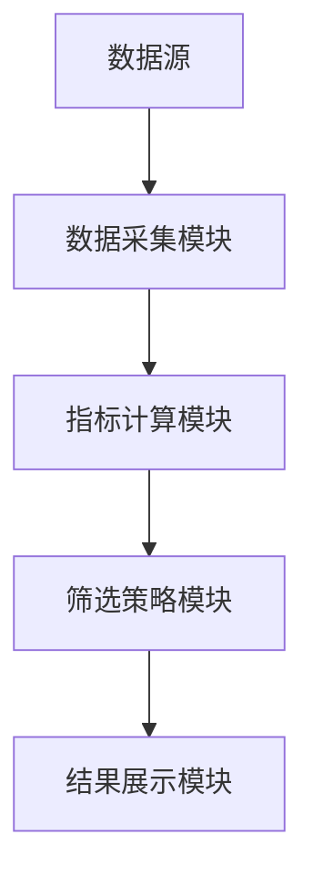

                 


# 《乔尔格林布拉特的价值投资筛选》

---

## 关键词：价值投资、格林布拉特、股票筛选、基本面分析、投资策略、市盈率、股息率

---

## 摘要：本文系统地介绍了乔尔格林布拉特的价值投资筛选方法，从其核心理念、筛选指标到系统架构、实战应用，详细剖析了这种方法的原理和实现过程。文章通过数学公式、mermaid图表和Python代码，全面展示了如何基于基本面分析和量化筛选，找到具有长期投资价值的股票。读者将深入了解价值投资的哲学、格林布拉特筛选方法的数学模型，以及如何利用技术手段实现投资策略。

---

## 第1章: 价值投资与格林布拉特筛选方法概述

### 1.1 价值投资的核心理念

#### 1.1.1 价值投资的定义与特点

- 价值投资是一种以低于内在价值的价格买入优质股票的投资策略。
- 核心特点：
  - 长期视角：关注企业的内在价值，而非短期市场波动。
  - 安全边际：买入价格低于内在价值，以降低风险。
  - 选股标准：注重企业的基本面，如盈利能力、财务健康和竞争优势。

#### 1.1.2 价值投资与其它投资策略的区别

| 投资策略 | 核心关注点 | 优点 | 缺点 |
|----------|------------|------|------|
| 价值投资 | 内在价值、基本面分析 | 风险较低，长期回报稳定 | 需要深入研究，流动性较低 |
| 技术分析 | 价格走势、成交量 | 短期信号明确 | 易受市场情绪影响，风险较高 |

#### 1.1.3 格林布拉特方法的独特性

格林布拉特的筛选方法结合了价值投资的基本面分析和量化指标，通过数学模型和程序化筛选，将价值投资系统化。其独特性体现在：

1. **量化筛选**：通过具体的估值指标（如市盈率、ROE等）筛选股票。
2. **长期视角**：注重企业的长期盈利能力，而非短期价格波动。
3. **可复制性**：方法具有明确的筛选标准，适合程序化交易和系统化投资。

---

### 1.2 格林布拉特筛选方法的背景

#### 1.2.1 格林布拉特的学术背景与投资经历

乔尔格林布拉特是价值投资领域的代表性人物，他的投资理念基于基本面分析和量化筛选。他通过长期的投资实践，总结出一套行之有效的股票筛选方法。

#### 1.2.2 核心书籍《stocks for the long run》

格林布拉特的著作《stocks for the long run》是价值投资领域的经典之作，书中详细阐述了其筛选方法的理论基础和实践案例。

#### 1.2.3 筛选方法的演变

格林布拉特的筛选方法经历了从手动筛选到程序化筛选的演变，随着技术的进步，其方法也不断优化和扩展。

---

### 1.3 价值投资的哲学与心理

#### 1.3.1 投资中的理性与非理性

价值投资强调理性决策，避免情绪化投资。格林布拉特的方法通过量化指标和系统化筛选，帮助投资者克服非理性决策。

#### 1.3.2 避免常见投资错误的心理学

- 过度自信：避免过度依赖个人判断，依赖数据和模型。
- 拇头法则：简化筛选过程，避免信息过载。

#### 1.3.3 投资中的耐心与纪律

价值投资需要长期持有的耐心，以及严格执行筛选标准的纪律。

---

## 第2章: 格林布拉特筛选方法的核心指标

### 2.1 核心筛选指标

#### 2.1.1 低市盈率（P/E）策略

- **定义**：市盈率是股票价格除以每股收益（EPS）的比率。
- **公式**：$$ P/E = \frac{Price}{Earnings} $$
- **作用**：筛选出被低估的股票。

#### 2.1.2 高股息率（Dividend Yield）策略

- **定义**：股息率是股息与股票价格的比率。
- **公式**：$$ Dividend Yield = \frac{Dividend}{Price} $$
- **作用**：筛选出高分红的股票。

#### 2.1.3 高净资产收益率（ROE）策略

- **定义**：净资产收益率是净利润与股东权益的比率。
- **公式**：$$ ROE = \frac{Net Income}{Total Equity} $$
- **作用**：筛选出盈利能力强的股票。

#### 2.1.4 其他辅助指标

- 市净率（P/B）：$$ P/B = \frac{Price}{Book Value} $$
- 市销率（P/S）：$$ P/S = \frac{Price}{Sales} $$

---

### 2.2 核心指标的数学模型与公式

#### 2.2.1 市盈率的计算

$$ P/E = \frac{Price}{Earnings} $$

例如：某股票价格为$50，每股收益为$5，则P/E = 10。

#### 2.2.2 净资产收益率的计算

$$ ROE = \frac{Net Income}{Total Equity} $$

例如：某公司净利润为$100万，股东权益为$500万，则ROE = 20%。

---

### 2.3 核心指标的对比分析

#### 2.3.1 不同估值指标的优缺点对比

| 指标 | 优点 | 缺点 |
|------|------|------|
| P/E | 简单易用 | 不适合亏损企业 |
| ROE | 衡量盈利能力 | 受会计政策影响 |
| Dividend Yield | 稳定收益 | 高分红可能影响成长性 |

#### 2.3.2 不同行业中的指标适用性分析

例如，在银行业，ROE可能是更好的指标；在科技业，P/S可能是更适合的指标。

#### 2.3.3 综合指标的权重分配

可以根据行业和市场环境调整指标权重，例如在熊市中，更重视P/E；在牛市中，更重视ROE。

---

## 第3章: 格林布拉特筛选方法的系统架构

### 3.1 系统架构概述

#### 3.1.1 系统输入：数据源

- 股票数据：包括价格、收益、股息等。
- 财务数据：包括利润表、资产负债表等。

#### 3.1.2 系统处理：指标计算与筛选

- 数据清洗：处理缺失值、异常值。
- 指标计算：计算P/E、ROE等。
- 筛选策略：根据设定条件筛选股票。

#### 3.1.3 系统输出：符合条件的股票列表

---

### 3.2 系统功能设计

#### 3.2.1 数据采集模块

- 数据来源：Yahoo Finance、Alpha Vantage等。
- 数据格式：CSV、JSON等。

#### 3.2.2 指标计算模块

- 计算P/E、ROE等指标。
- 数据存储：将计算结果存储为数据库或文件。

#### 3.2.3 筛选策略模块

- 根据筛选条件（如P/E < 15，ROE > 10%）过滤股票。
- 生成筛选结果。

#### 3.2.4 结果展示模块

- 可视化：生成图表展示筛选结果。
- 报告：生成投资建议报告。

---

### 3.3 系统架构图



---

## 第4章: 格林布拉特筛选方法的实战应用

### 4.1 项目实战

#### 4.1.1 环境安装

- 安装Python和必要的库（如pandas、numpy、requests）。
- 安装Jupyter Notebook用于数据处理和可视化。

#### 4.1.2 核心实现

```python
import pandas as pd
import requests

# 数据采集
def get_stock_data(ticker):
    url = f"https://query1.finance.yahoo.com/.../{ticker}"
    response = requests.get(url)
    data = response.json()
    return data

# 指标计算
def calculate_pe(data):
    pe = data['price'] / data['earnings']
    return pe

# 筛选策略
def greenblatt_screen(stocks):
    selected = []
    for stock in stocks:
        if stock['pe'] < 15 and stock['roe'] > 10:
            selected.append(stock)
    return selected

# 结果展示
def display_results(selected_stocks):
    for stock in selected_stocks:
        print(f"股票名称：{stock['name']}, 市盈率：{stock['pe']}, 净资产收益率：{stock['roe']}")
```

---

### 4.2 实际案例分析

#### 4.2.1 案例背景

假设我们有以下股票数据：

| 股票名称 | 价格 | 每股收益 | 净资产收益率 | 股息率 |
|----------|------|----------|-------------|--------|
| A        | $50  | $5       | 20%         | 2%     |
| B        | $30  | $3       | 15%         | 3%     |
| C        | $40  | $4       | 18%         | 2.5%   |

---

### 4.3 筛选结果

根据格林布拉特的筛选标准（P/E < 15，ROE > 10%）：

- 股票A：符合条件。
- 股票B：P/E = 10，ROE = 15%，符合条件。
- 股票C：P/E = 10，ROE = 18%，符合条件。

最终筛选结果：股票A、B、C。

---

## 第5章: 最佳实践与小结

### 5.1 最佳实践

- 定期更新数据：市场变化快，需定期更新股票数据。
- 保持纪律：严格执行筛选标准，避免情绪化操作。
- 分散投资：避免过度集中，降低风险。

---

### 5.2 小结

格林布拉特的价值投资筛选方法通过量化指标和系统化筛选，帮助投资者找到具有长期投资价值的股票。这种方法结合了基本面分析和量化筛选，具有较高的可操作性和稳定性。

---

## 注意事项

- 格林布拉特方法适用于长期投资，不适合短期交易。
- 市场波动可能影响筛选结果，需动态调整策略。
- 不同行业适用不同的筛选指标，需灵活调整。

---

## 拓展阅读

- 《stocks for the long run》
- 《价值投资实战》
- 《投资的智慧》

---

## 作者

作者：AI天才研究院/AI Genius Institute  
禅与计算机程序设计艺术/Zen And The Art of Computer Programming

---

通过本文的详细讲解，读者可以全面理解乔尔格林布拉特的价值投资筛选方法，并将其应用于实际投资中。希望本文能为投资者提供有价值的参考和启发。

