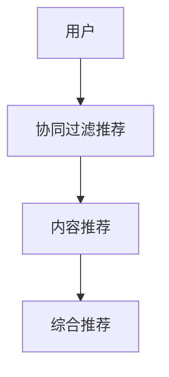
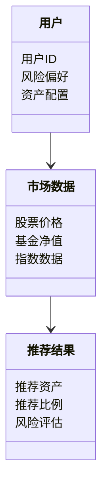
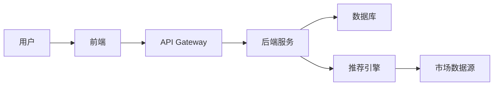
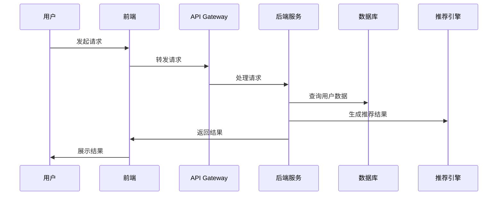

                 


# 《云服务在投资理财智能助手中的高效部署》

> 关键词：云服务，投资理财，智能助手，算法原理，系统架构，项目实战

> 摘要：本文详细探讨了云服务在投资理财智能助手中的高效部署，从背景分析到系统架构设计，再到项目实战，全面解析了如何利用云服务提升投资理财的智能化水平。

---

# 第一部分: 云服务在投资理财智能助手中的背景与核心概念

# 第1章: 投资理财智能助手的背景与需求

## 1.1 问题背景
### 1.1.1 传统投资理财的痛点
传统投资理财方式存在信息不对称、决策效率低、用户体验差等问题。投资者难以快速获取市场动态，缺乏个性化投资建议，且传统金融工具和平台的操作复杂，难以满足现代用户的需求。

### 1.1.2 智能化投资理财的需求
随着人工智能和大数据技术的发展，用户对智能化投资理财的需求日益增长。智能助手需要能够实时分析市场数据，提供个性化的投资建议，并通过用户友好的界面进行交互。

### 1.1.3 云服务在投资理财中的作用
云服务提供了强大的计算能力和数据存储解决方案，能够支持智能助手的高效运行，同时通过弹性扩展满足高并发需求。

## 1.2 问题描述
### 1.2.1 投资理财智能助手的功能需求
智能助手需要具备市场数据实时分析、投资组合优化、风险评估、个性化推荐等功能。

### 1.2.2 云服务在智能助手中的应用场景
云服务可以为智能助手提供后端计算、数据存储、实时通信等支持，确保其高效运行。

### 1.2.3 问题解决的关键点
通过云服务实现投资理财智能助手的高效部署，关键在于选择合适的云服务架构，优化系统性能，并确保数据安全。

## 1.3 问题解决思路
### 1.3.1 云服务的优势
云服务提供了弹性扩展、按需付费、高可用性等优势，能够满足智能助手对计算资源的需求。

### 1.3.2 投资理财智能助手的核心功能
智能助手需要具备数据采集、分析、推荐、交互等功能，这些功能需要依赖云服务的支持。

### 1.3.3 云服务与智能助手的结合点
通过云服务实现智能助手的后端逻辑，利用云存储和云计算能力，提升系统的处理效率和用户体验。

## 1.4 边界与外延
### 1.4.1 云服务的边界
云服务的边界包括计算资源、存储资源和网络资源的提供，但不包括前端界面和用户端的应用。

### 1.4.2 智能助手的边界
智能助手的边界包括数据采集、分析和交互功能，但不包括实际的交易执行。

### 1.4.3 两者结合的外延
云服务与智能助手的结合外延在于通过高效部署，提升投资理财的整体效率和用户体验。

## 1.5 概念结构与核心要素
### 1.5.1 核心概念
云服务、投资理财、智能助手、算法推荐。

### 1.5.2 概念属性
- 云服务：弹性扩展、高可用性、按需付费。
- 智能助手：数据采集、分析、推荐、交互。
- 算法推荐：协同过滤、基于内容的推荐、混合推荐。

### 1.5.3 核心要素组成
- 数据源：市场数据、用户行为数据。
- 算法模型：推荐算法、风险评估模型。
- 系统架构：前端、后端、数据库、API接口。

---

# 第2章: 云服务的核心概念与原理

## 2.1 云服务的基本原理
### 2.1.1 云计算的基本概念
云计算是一种按需提供计算资源的模式，包括IaaS、PaaS、SaaS三种服务模式。

### 2.1.2 云服务的分类
- IaaS：基础设施即服务，提供虚拟机、存储等资源。
- PaaS：平台即服务，提供开发和部署环境。
- SaaS：软件即服务，提供应用程序。

### 2.1.3 云服务的交付模式
- 按需付费：用户根据使用量支付费用。
- 弹性扩展：根据负载自动调整资源。

## 2.2 投资理财智能助手的核心功能
### 2.2.1 数据处理与分析
智能助手需要实时处理大量市场数据，包括股票价格、基金净值等。

### 2.2.2 智能推荐与决策支持
通过算法推荐合适的投资组合，并提供风险评估和决策支持。

### 2.2.3 用户交互与反馈
智能助手需要与用户进行实时交互，根据用户反馈不断优化推荐结果。

## 2.3 云服务与智能助手的关联
### 2.3.1 云服务为智能助手提供计算能力
通过云服务提供的虚拟机和计算资源，智能助手可以高效运行复杂的算法。

### 2.3.2 智能助手利用云服务实现数据存储与分析
云存储和大数据分析技术帮助智能助手处理和存储海量数据。

### 2.3.3 云服务为智能助手提供高可用性和扩展性
通过云服务的负载均衡和自动扩展功能，智能助手可以应对高并发请求。

---

# 第三部分: 云服务在投资理财智能助手中的算法与系统架构

# 第3章: 投资理财智能助手的算法原理

## 3.1 推荐算法
### 3.1.1 协同过滤算法
协同过滤是一种基于用户行为的推荐算法，分为基于用户的协同过滤和基于物品的协同过滤。

#### 3.1.1.1 基于用户的协同过滤
通过分析用户的相似性，推荐相似用户喜欢的内容。

#### 3.1.1.2 基于物品的协同过滤
通过分析物品之间的相似性，推荐相关物品。

### 3.1.2 基于内容的推荐算法
基于内容的推荐算法通过分析物品的属性，推荐相似内容。

### 3.1.3 混合推荐算法
混合推荐算法结合协同过滤和基于内容的推荐，提升推荐的准确性和多样性。

#### 3.1.3.1 混合推荐流程图


#### 3.1.3.2 混合推荐代码示例
```python
def hybrid_recommendation(user_id):
    collaborative_recommendations = get_collaborative_recommendations(user_id)
    content_recommendations = get_content_recommendations(user_id)
    return merge_recommendations(collaborative_recommendations, content_recommendations)
```

---

## 3.2 算法原理的数学模型
### 3.2.1 协同过滤的相似度计算
相似度计算公式：
$$ sim(u, v) = \frac{\sum_{i} (u_i - \bar{u})(v_i - \bar{v})}{\sqrt{\sum_{i} (u_i - \bar{u})^2} \sqrt{\sum_{i} (v_i - \bar{v})^2}} $$

### 3.2.2 基于内容的推荐
基于内容的推荐使用向量空间模型，计算物品的相似度：
$$ sim(item1, item2) = \frac{\sum_{i} item1_i \cdot item2_i}{\sqrt{\sum_{i} item1_i^2} \sqrt{\sum_{i} item2_i^2}} $$

---

## 3.3 算法的实现与优化
### 3.3.1 算法的实现步骤
1. 数据预处理：清洗和归一化数据。
2. 计算相似度：基于协同过滤或内容相似度。
3. 生成推荐列表：根据相似度排序。

### 3.3.2 算法优化
- 使用分布式计算优化协同过滤。
- 引入用户行为特征提升推荐准确度。

---

# 第4章: 系统分析与架构设计

## 4.1 系统分析
### 4.1.1 问题场景介绍
投资理财智能助手需要处理大量数据，支持高并发请求，且需要实时更新市场数据。

### 4.1.2 系统功能设计
- 数据采集模块：实时采集市场数据。
- 数据分析模块：处理和分析数据，生成推荐结果。
- 用户交互模块：与用户进行实时交互，展示推荐结果。

#### 4.1.2.1 领域模型类图


## 4.2 系统架构设计
### 4.2.1 系统架构图


### 4.2.2 系统接口设计
- 前端接口：提供用户交互界面，接收用户请求。
- 后端接口：处理请求，调用推荐引擎生成结果。
- 数据库接口：存储用户数据和推荐结果。

### 4.2.3 系统交互流程图


---

# 第5章: 项目实战

## 5.1 环境安装
### 5.1.1 安装Python和相关库
安装Python和Pandas、NumPy、Scikit-learn等库。

### 5.1.2 安装云服务环境
选择合适的云服务提供商，如AWS、阿里云，并配置相关环境。

## 5.2 系统核心实现
### 5.2.1 数据采集模块
编写代码采集市场数据，例如使用Yahoo Finance API。

```python
import pandas as pd

def get_market_data(tickers):
    data = {}
    for ticker in tickers:
        # 获取数据
        data[ticker] = get_data(ticker)
    return pd.DataFrame(data)
```

### 5.2.2 推荐引擎实现
实现协同过滤推荐算法。

```python
def collaborative_recommendation(user_id):
    # 获取用户数据
    user_data = get_user_data(user_id)
    # 计算相似用户
    similar_users = compute_similar_users(user_data)
    # 获取推荐
    recommendations = get_recommendations(similar_users)
    return recommendations
```

## 5.3 代码应用解读与分析
### 5.3.1 代码解读
详细解读上述代码的功能和实现逻辑。

### 5.3.2 案例分析
通过具体案例分析推荐引擎的输出结果。

## 5.4 项目小结
总结项目实现的关键点和需要注意的问题，展望未来的优化方向。

---

# 第6章: 最佳实践与小结

## 6.1 最佳实践
### 6.1.1 代码规范
遵循Python代码规范，确保代码可读性和可维护性。

### 6.1.2 性能优化
通过缓存和分布式计算优化系统性能。

### 6.1.3 安全性
确保用户数据的安全性和隐私保护。

## 6.2 小结
总结全文内容，强调云服务在投资理财智能助手中的重要性，以及高效部署的关键点。

## 6.3 注意事项
提醒读者在实际应用中需要注意的问题，例如数据源的可靠性、算法的可扩展性等。

## 6.4 拓展阅读
推荐相关的书籍和资源，供读者进一步学习。

---

# 作者：AI天才研究院/AI Genius Institute & 禅与计算机程序设计艺术 /Zen And The Art of Computer Programming

---

通过以上目录大纲，可以清晰地看到文章的结构和内容安排。从背景分析到系统设计，再到项目实战，层层深入，确保读者能够全面理解和掌握云服务在投资理财智能助手中的高效部署方法。

