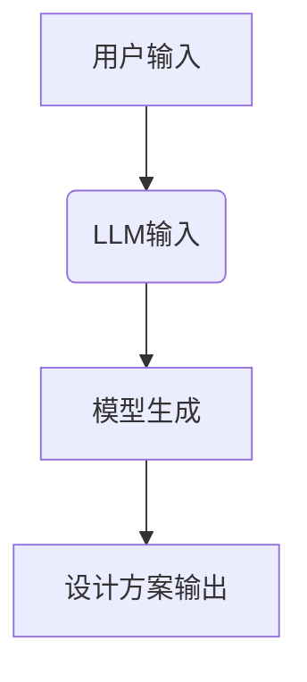
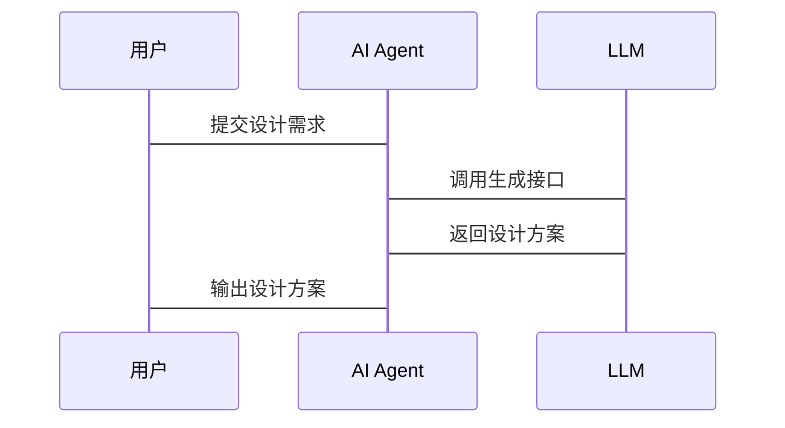

                 


# 产品设计 AI Agent：LLM 辅助创新与概念生成

**关键词**：AI Agent, 大语言模型, 产品设计, 创新, 概念生成, 人机协作, 人工智能

**摘要**：  
随着人工智能技术的快速发展，AI Agent（人工智能代理）在产品设计中的应用日益广泛。本文深入探讨了如何利用大语言模型（LLM）辅助产品设计中的创新与概念生成。通过分析AI Agent的核心原理、LLM的数学模型、系统架构设计以及实际项目实战，本文为读者提供了从理论到实践的全面指导。文章还结合了丰富的案例分析和代码实现，帮助读者理解如何将AI技术应用于实际产品设计中。

---

## 第一部分: 产品设计与AI Agent概述

### 第1章: AI Agent与产品设计的背景介绍

#### 1.1 AI Agent的基本概念
##### 1.1.1 AI Agent的定义
AI Agent（人工智能代理）是指能够感知环境、自主决策并执行任务的智能体。它能够通过与用户的交互或环境的反馈，动态调整行为以实现目标。

##### 1.1.2 AI Agent的核心要素
- **感知能力**：通过传感器或输入数据感知环境。
- **决策能力**：基于感知信息做出决策。
- **执行能力**：通过动作或输出执行决策。
- **学习能力**：通过经验优化自身的决策模型。

##### 1.1.3 AI Agent与传统软件开发的区别
传统的软件开发依赖于明确的逻辑和规则，而AI Agent能够通过数据驱动的方式自适应地优化行为。

---

#### 1.2 LLM在产品设计中的作用
##### 1.2.1 LLM的定义与特点
大语言模型（LLM）是一种基于深度学习的自然语言处理模型，具有以下特点：
- **大规模训练数据**：通常基于海量文本数据进行训练。
- **强大的上下文理解能力**：能够理解复杂的语言结构和语义。
- **生成能力**：可以生成自然流畅的文本。

##### 1.2.2 LLM在产品设计中的应用场景
- **概念生成**：帮助设计师快速生成产品创意和设计方案。
- **创新支持**：通过分析现有数据，提供新的设计思路。
- **协作工具**：作为辅助工具，增强设计团队的协作效率。

##### 1.2.3 LLM如何辅助创新与概念生成
通过分析用户需求、市场趋势和设计规范，LLM能够生成符合要求的产品概念和设计方案。

---

#### 1.3 产品设计中的AI Agent技术背景
##### 1.3.1 AI在产品设计中的历史发展
从简单的规则引擎到复杂的深度学习模型，AI在产品设计中的应用逐步深化。

##### 1.3.2 当前AI技术在产品设计中的应用趋势
- **智能化设计工具**：AI驱动的设计工具能够自动优化设计方案。
- **个性化推荐**：基于用户反馈，推荐个性化的设计方案。
- **自动化测试**：通过AI进行自动化的产品测试和优化。

##### 1.3.3 LLM技术的独特优势
- **强大的自然语言处理能力**：能够理解复杂的语言指令和设计需求。
- **快速生成能力**：能够在短时间内生成大量设计方案。

---

#### 1.4 本书的目标与读者群体
##### 1.4.1 本书的目标
通过理论与实践结合，帮助读者理解AI Agent在产品设计中的应用，并掌握LLM辅助创新与概念生成的技术。

##### 1.4.2 本书的读者群体
- **产品经理**：希望利用AI技术优化产品设计流程。
- **设计师**：希望借助AI工具提高设计效率。
- **AI开发人员**：希望深入了解AI技术在产品设计中的应用。

##### 1.4.3 本书的结构安排
从基础概念到算法原理，再到系统设计和项目实战，帮助读者逐步掌握相关技术。

---

## 第二部分: LLM与AI Agent的核心概念

### 第2章: LLM与AI Agent的核心原理

#### 2.1 LLM的基本原理
##### 2.1.1 大语言模型的训练过程
- **数据预处理**：清洗和标注训练数据。
- **模型训练**：使用大规模数据训练深度学习模型。
- **参数优化**：通过反向传播优化模型参数。

##### 2.1.2 模型的输入输出机制
- **输入**：自然语言指令或设计需求。
- **输出**：生成的设计方案或创意建议。

##### 2.1.3 模型的上下文理解能力
- **上下文感知**：理解输入的上下文信息。
- **语义理解**：分析输入的语义含义。

---

#### 2.2 AI Agent的原理与实现
##### 2.2.1 AI Agent的感知与决策机制
- **感知**：通过输入数据感知环境状态。
- **决策**：基于感知信息做出决策。
- **执行**：执行决策并输出结果。

##### 2.2.2 Agent与用户交互的实现
- **用户输入**：接收用户的指令或需求。
- **生成输出**：根据输入生成设计方案。

##### 2.2.3 Agent的自主学习能力
- **经验学习**：通过经验优化决策模型。
- **持续改进**：不断优化自身的生成能力。

---

#### 2.3 LLM与AI Agent的结合
##### 2.3.1 LLM作为AI Agent的核心模块
- **模型集成**：将LLM作为AI Agent的核心模块。
- **功能扩展**：通过LLM扩展AI Agent的功能。

##### 2.3.2 LLM与Agent的协同工作模式
- **协同生成**：LLM与Agent协同生成设计方案。
- **动态调整**：根据反馈动态调整生成策略。

##### 2.3.3 LLM在Agent中的应用案例
- **概念生成**：生成产品设计的初步概念。
- **方案优化**：优化设计方案的细节。

---

## 第三部分: LLM辅助创新与概念生成的算法原理

### 第3章: LLM的数学模型与算法

#### 3.1 大语言模型的数学基础
##### 3.1.1 词嵌入（Word Embedding）
- **词向量表示**：将词语表示为向量。
- **嵌入空间**：词语在嵌入空间中的位置表示。

##### 3.1.2 注意力机制（Attention）
- **注意力权重**：计算词语之间的注意力权重。
- **注意力模型**：基于权重生成最终的词表示。

##### 3.1.3 概率生成模型
- **概率分布**：生成文本的概率分布。
- **生成过程**：基于概率分布生成文本。

---

#### 3.2 变压器（Transformer）模型的原理
##### 3.2.1 Transformer的结构组成
- **编码器（Encoder）**：将输入序列编码为向量表示。
- **解码器（Decoder）**：根据编码结果生成输出序列。

##### 3.2.2 编码器与解码器的作用
- **编码器**：将输入序列转换为向量表示。
- **解码器**：根据编码结果生成输出序列。

##### 3.2.3 自注意力机制（Self-Attention）
- **自注意力计算**：计算序列中每个位置的注意力权重。
- **注意力聚合**：将注意力权重应用于序列中的词语。

---

### 第4章: 算法原理的数学模型与公式

#### 4.1 Transformer模型的数学公式
- **自注意力机制**：
  $$\text{Attention}(Q, K, V) = \text{softmax}\left(\frac{QK^T}{\sqrt{d_k}}\right)V$$
  其中，$Q$、$K$、$V$分别为查询、键和值向量，$d_k$为向量维度。

- **前馈网络**：
  $$\text{FFN}(x) = \max(0, xW_1 + b_1)W_2 + b_2$$

#### 4.2 模型训练的损失函数
- **交叉熵损失函数**：
  $$\mathcal{L} = -\sum_{i=1}^{n} y_i \log p(y_i|x)$$
  其中，$y_i$为真实标签，$p(y_i|x)$为模型预测的概率。

---

## 第四部分: 系统分析与架构设计方案

### 第5章: 系统架构设计

#### 5.1 系统功能设计
- **输入模块**：接收用户的输入需求。
- **生成模块**：基于输入生成设计方案。
- **优化模块**：优化生成的设计方案。

#### 5.2 系统架构图


#### 5.3 系统交互序列图


---

## 第五部分: 项目实战

### 第6章: 项目实战

#### 6.1 环境安装
- **Python**：安装Python 3.8及以上版本。
- **LLM库**：安装`transformers`库。
  ```bash
  pip install transformers
  ```

#### 6.2 核心代码实现
```python
from transformers import AutoModelForCausalLM, AutoTokenizer

model_name = "gpt2"
tokenizer = AutoTokenizer.from_pretrained(model_name)
model = AutoModelForCausalLM.from_pretrained(model_name)

def generate_design_concept(prompt):
    inputs = tokenizer.encode(prompt, return_tensors="pt")
    outputs = model.generate(inputs, max_length=50, temperature=0.7, do_sample=True)
    return tokenizer.decode(outputs[0], skip_special_tokens=True)

prompt = "设计一个智能家居控制系统，需要具备远程控制功能。"
concept = generate_design_concept(prompt)
print(concept)
```

#### 6.3 代码解读与分析
- **环境安装**：安装所需的Python库。
- **模型加载**：加载预训练的LLM模型。
- **生成函数**：定义生成设计概念的函数。
- **用户输入**：输入设计需求。
- **生成输出**：输出生成的设计方案。

---

## 第六部分: 最佳实践与总结

### 第7章: 最佳实践与总结

#### 7.1 小结
- **理论基础**：理解AI Agent和LLM的基本原理。
- **算法实现**：掌握模型的训练和生成过程。
- **系统设计**：优化系统的架构和交互流程。

#### 7.2 注意事项
- **数据质量**：确保训练数据的质量和多样性。
- **模型调优**：通过实验调优模型参数。
- **用户反馈**：结合用户反馈优化生成结果。

#### 7.3 拓展阅读
- 推荐阅读《Deep Learning》（Ian Goodfellow）和《生成式人工智能：算法与应用》。

---

**作者**：AI天才研究院/AI Genius Institute & 禅与计算机程序设计艺术/Zen And The Art of Computer Programming

