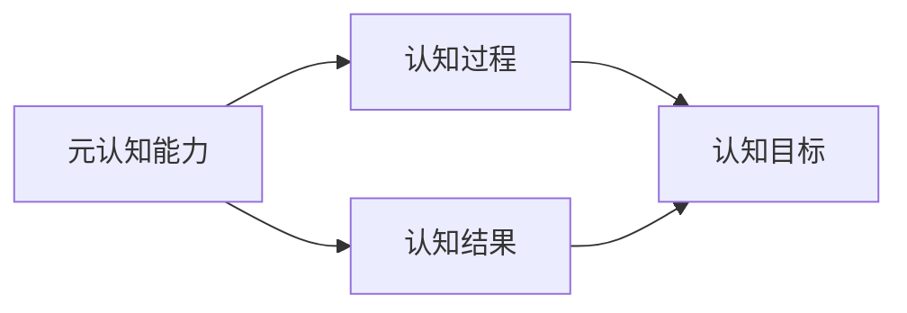
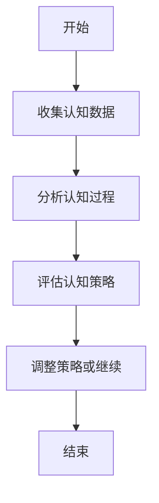
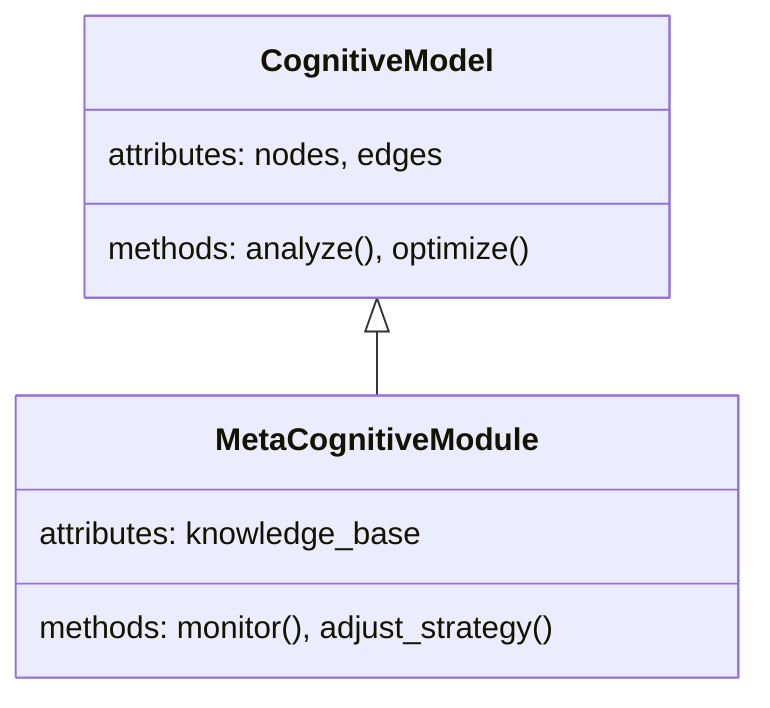
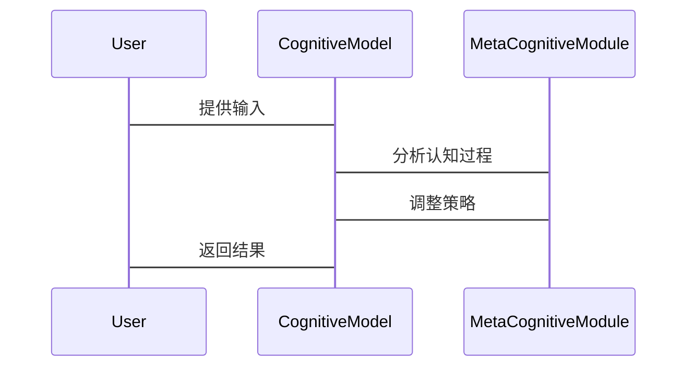

                 


# 《从零开始：AI Agent的元认知能力实现》

---

## 关键词：
AI Agent、元认知能力、认知科学、人工智能、系统架构、算法实现

---

## 摘要：
本文系统地探讨了AI Agent的元认知能力实现，从基础概念到核心算法，再到系统架构与项目实战，逐步揭示元认知能力在AI Agent中的重要性及其应用。文章通过理论分析与实际案例结合，深入浅出地讲解了如何在AI Agent中实现元认知能力，帮助读者从零开始掌握相关技术。

---

# 第1章: AI Agent与元认知能力概述

## 1.1 AI Agent的基本概念

### 1.1.1 AI Agent的定义
AI Agent（人工智能代理）是指能够感知环境、自主决策并执行任务的智能实体。它能够通过传感器获取信息，利用推理能力解决问题，并通过执行器与环境交互。

### 1.1.2 元认知能力的定义
元认知能力是指个体对自身认知过程的认知和调控能力。在AI Agent中，元认知能力使其能够监控、评估和优化自身的思考过程。

### 1.1.3 元认知能力的重要性
元认知能力使AI Agent具备自适应性和灵活性，能够根据环境变化调整策略，提升任务执行效率和准确性。

---

## 1.2 元认知能力的核心要素

### 1.2.1 元认知知识
元认知知识包括关于认知过程、策略和任务的知识。例如，了解不同的推理算法及其适用场景。

### 1.2.2 元认知调控
元认知调控是指对认知过程的监控和调节。例如，在问题解决过程中，AI Agent能够评估当前策略的有效性，并动态调整。

### 1.2.3 元认知监控
元认知监控是指对认知过程的实时监测。例如，在决策过程中，AI Agent能够跟踪自己的推理步骤，识别潜在错误。

---

## 1.3 AI Agent中的元认知能力应用

### 1.3.1 元认知在AI Agent中的作用
元认知能力使AI Agent能够反思自己的决策过程，优化问题解决策略。

### 1.3.2 元认知能力的实现方式
元认知能力可以通过内部监控模块实现，该模块负责收集认知过程的数据，并进行分析和评估。

### 1.3.3 元认知能力的评估标准
元认知能力的评估标准包括准确性、实时性和适应性。例如，评估AI Agent在不同任务中的元认知监控能力。

---

## 1.4 元认知能力与传统AI的区别

### 1.4.1 传统AI的局限性
传统AI依赖固定的规则和数据，缺乏灵活性和自适应性。例如，无法根据任务需求动态调整推理策略。

### 1.4.2 元认知能力的突破点
元认知能力使AI Agent具备动态调整策略的能力，能够更好地应对复杂和不确定性环境。

### 1.4.3 元认知能力的未来发展
元认知能力的研究将推动AI Agent向更智能、更自主的方向发展，使其在复杂任务中表现更出色。

---

## 1.5 本章小结

本章介绍了AI Agent的基本概念和元认知能力的重要性，分析了元认知能力的核心要素及其在AI Agent中的应用。通过对比传统AI与元认知AI的差异，我们看到了元认知能力在提升AI Agent智能水平中的关键作用。

---

# 第2章: 元认知能力的核心概念与联系

## 2.1 元认知能力的理论基础

### 2.1.1 认知科学中的元认知理论
认知科学中的元认知理论认为，元认知是认知过程的监控和调控机制。例如，人脑在解决问题时，会不断反思自己的思考过程。

### 2.1.2 人工智能中的元认知模型
人工智能中的元认知模型通常包括元知识库和元推理模块。元知识库存储认知策略和任务信息，元推理模块负责分析和优化推理过程。

### 2.1.3 元认知能力的层次结构
元认知能力可以分为元认知知识、元认知调控和元认知监控三个层次，每个层次相互关联，共同支持认知过程的优化。

---

## 2.2 元认知能力的属性特征对比

### 2.2.1 元认知能力的属性分析
| 属性 | 描述 |
|------|------|
| 自我监控 | 监控自身的认知过程 |
| 策略调控 | 调控认知策略 |
| 适应性 | 根据环境变化调整认知过程 |

### 2.2.2 元认知能力与其他能力的对比
通过对比表可以看出，元认知能力的独特性在于其对认知过程的监控和调控能力。

### 2.2.3 元认知能力的特征表格
| 特征 | 描述 |
|------|------|
| 动态性 | 元认知能力能够实时监控和调整认知过程 |
| 自我反思性 | 元认知能力能够反思自身的思考过程 |
| 可适应性 | 元认知能力能够适应不同任务和环境 |

---

## 2.3 元认知能力的ER实体关系图



通过上述ER图可以看出，元认知能力（A）通过监控认知过程（B）和认知结果（C）来优化认知目标（D）的实现。

---

## 2.4 本章小结

本章通过理论分析和对比，详细讲解了元认知能力的核心概念及其在AI Agent中的应用。通过ER图展示了元认知能力与认知过程的关系，为后续的实现提供了理论基础。

---

# 第3章: 元认知能力的算法实现

## 3.1 元认知能力的算法原理

### 3.1.1 基于认知模型的元认知算法
基于认知模型的元认知算法通过构建认知模型来监控和优化认知过程。例如，利用图模型表示知识和推理过程。

### 3.1.2 元认知算法的数学模型
元认知算法的数学模型可以通过以下公式表示：

$$
f(x) = \begin{cases}
x & \text{如果 } x \text{ 符合认知策略} \\
\text{调整策略} & \text{否则}
\end{cases}
$$

### 3.1.3 元认知算法的流程图



---

## 3.2 元认知能力的Python实现

### 3.2.1 环境安装
需要安装的Python库包括：numpy、pandas、networkx、matplotlib。

### 3.2.2 核心代码实现

```python
import numpy as np
from networkx import DiGraph

# 创建认知模型
def create_cognitive_model():
    model = DiGraph()
    model.add_nodes_from(['A', 'B', 'C', 'D'])
    model.add_edges_from([('A', 'B'), ('B', 'C'), ('C', 'D')])
    return model

# 元认知监控模块
def meta_monitor(model):
    for node in model.nodes():
        print(f"监控节点：{node}")

# 主函数
def main():
    model = create_cognitive_model()
    meta_monitor(model)

if __name__ == "__main__":
    main()
```

### 3.2.3 代码解读与分析
上述代码创建了一个认知模型，并实现了元认知监控功能。元认知监控模块遍历模型中的每个节点，监控认知过程。

---

## 3.3 本章小结

本章通过算法原理和代码实现，详细讲解了元认知能力在AI Agent中的具体实现方式。通过Python代码，读者可以理解如何在实际项目中应用这些算法。

---

# 第4章: 元认知能力的系统架构与设计

## 4.1 系统分析与设计

### 4.1.1 项目背景
本项目旨在开发具备元认知能力的AI Agent，使其能够自主监控和优化认知过程。

### 4.1.2 系统功能设计



### 4.1.3 系统架构设计


### 4.1.4 系统接口设计
系统接口包括输入接口（接收用户输入）、输出接口（返回推理结果）和元认知接口（监控和调整认知过程）。

### 4.1.5 系统交互流程图



---

## 4.2 本章小结

本章通过系统分析与设计，详细讲解了具备元认知能力的AI Agent的系统架构与设计方法。通过类图和流程图，展示了各模块之间的关系和交互过程。

---

# 第5章: 元认知能力的项目实战

## 5.1 环境安装

安装所需的Python库：

```bash
pip install numpy pandas networkx matplotlib
```

---

## 5.2 核心代码实现

### 5.2.1 认知模型构建

```python
import networkx as nx

def build_cognitive_model():
    model = nx.DiGraph()
    model.add_nodes_from(['A', 'B', 'C', 'D'])
    model.add_edges_from([('A', 'B'), ('B', 'C'), ('C', 'D')])
    return model

# 创建模型
model = build_cognitive_model()
print(model.nodes())
```

### 5.2.2 元认知监控模块

```python
def meta_monitor(model):
    for node in model.nodes():
        print(f"监控节点：{node}")
    for edge in model.edges():
        print(f"监控边：{edge}")
```

### 5.2.3 算法实现

```python
def optimize_model(model):
    for node in model.nodes():
        print(f"优化节点：{node}")
    for edge in model.edges():
        print(f"优化边：{edge}")

# 调用优化函数
optimize_model(model)
```

---

## 5.3 案例分析与解读

通过上述代码，我们可以看到元认知监控模块如何实时监控认知过程，并对其进行优化。这展示了元认知能力在实际项目中的应用。

---

## 5.4 本章小结

本章通过项目实战，展示了如何在实际项目中实现元认知能力。通过代码实现和案例分析，读者可以更好地理解元认知能力在AI Agent中的具体应用。

---

# 第6章: 总结与展望

## 6.1 本章总结

本文系统地探讨了AI Agent的元认知能力实现，从理论基础到算法实现，再到系统设计与项目实战，全面分析了元认知能力在AI Agent中的重要性及其应用。

---

## 6.2 未来展望

随着人工智能技术的不断发展，元认知能力的研究将更加深入。未来的研究方向包括更复杂的认知模型、更高效的元认知算法以及更智能化的系统架构。

---

## 6.3 最佳实践 Tips

1. 在实现元认知能力时，建议先从简单的认知模型入手，逐步增加复杂度。
2. 元认知监控模块的实现需要结合具体任务需求，灵活调整监控策略。
3. 系统架构设计时，建议采用模块化设计，便于后续扩展和优化。

---

## 6.4 本章小结

本文总结了AI Agent的元认知能力实现的核心内容，并展望了未来的研究方向。通过最佳实践 Tips，为读者提供了实用的建议。

---

# 作者：AI天才研究院 & 禅与计算机程序设计艺术

---

通过以上内容，您可以系统地学习AI Agent的元认知能力实现，从基础到应用，逐步掌握相关技术。

