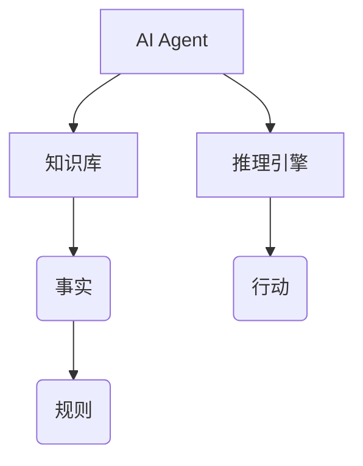
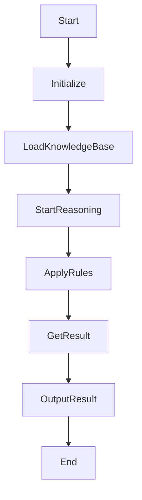
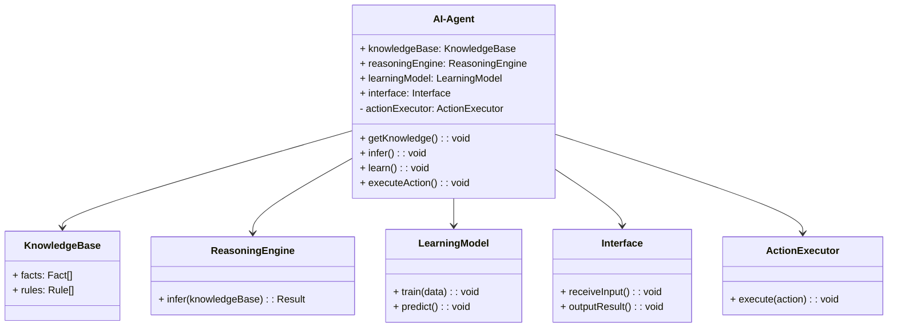
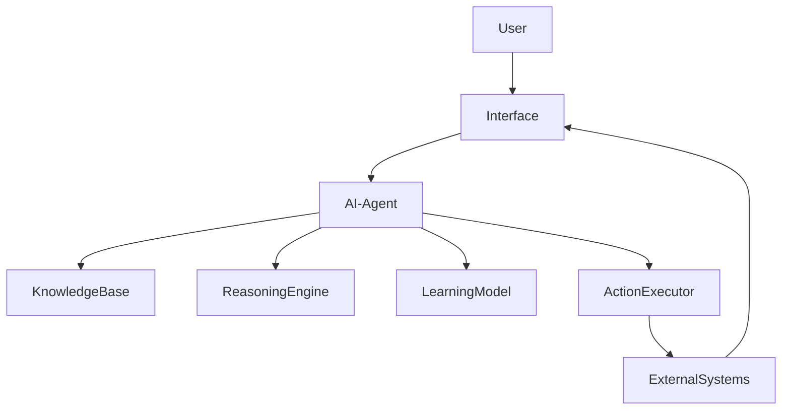
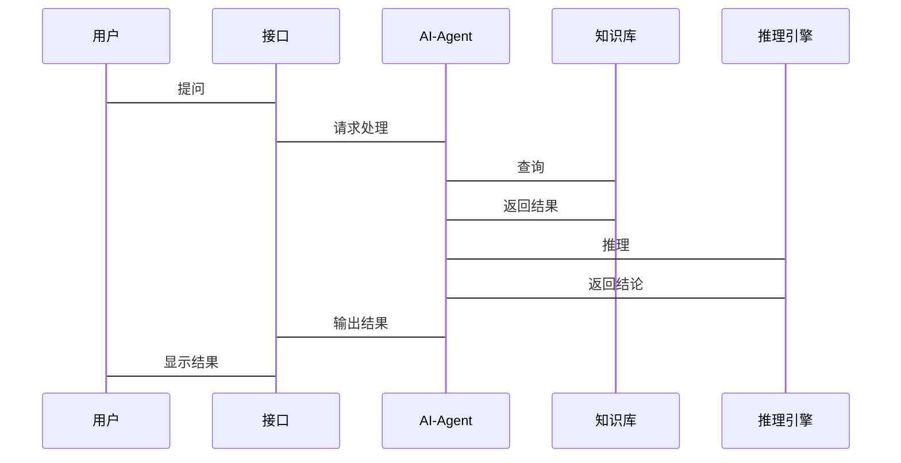

                 


# 从零开始：AI Agent的概念学习系统

> 关键词：AI Agent，知识表示，推理机制，强化学习，系统架构，项目实战

> 摘要：本文将从AI Agent的基本概念出发，详细探讨其核心原理、算法实现、系统设计以及实际应用。通过逐步分析，读者将掌握AI Agent的设计与实现方法，从零开始构建一个完整的AI Agent系统。

---

## 目录大纲：

1. **AI Agent背景与基础**
   - 1.1 AI Agent的基本概念
   - 1.2 AI Agent的应用场景
   - 1.3 问题背景与问题描述
   - 1.4 核心概念与组成要素

2. **AI Agent的核心概念与联系**
   - 2.1 知识表示与推理机制
   - 2.2 学习机制与算法
   - 2.3 核心概念对比表
   - 2.4 实体关系图（ER图）

3. **AI Agent的算法原理**
   - 3.1 知识表示与推理算法
   - 3.2 学习机制的数学模型
   - 3.3 算法流程图（Mermaid）
   - 3.4 算法实现（Python代码示例）

4. **AI Agent的系统分析与架构设计**
   - 4.1 问题场景介绍
   - 4.2 系统功能设计（领域模型Mermaid类图）
   - 4.3 系统架构设计（Mermaid架构图）
   - 4.4 系统接口设计
   - 4.5 系统交互图（Mermaid序列图）

5. **AI Agent的项目实战**
   - 5.1 环境安装与配置
   - 5.2 系统核心实现（Python代码）
   - 5.3 代码应用解读与分析
   - 5.4 实际案例分析
   - 5.5 项目小结

6. **总结与展望**
   - 6.1 最佳实践与小结
   - 6.2 注意事项
   - 6.3 拓展阅读与未来方向

---

## 正文：

### 1. AI Agent背景与基础

#### 1.1 AI Agent的基本概念

**AI Agent**（智能体）是指在计算机系统中，能够感知环境并采取行动以实现目标的实体。AI Agent可以是软件程序，也可以是机器人或其他智能设备。AI Agent的核心在于其自主性、反应性和主动性，能够在复杂环境中做出决策。

**AI Agent的分类**：根据智能水平，AI Agent可以分为简单反射型、基于模型的反射型、目标驱动型和实用驱动型。简单反射型基于固定的规则库，目标驱动型基于目标进行规划。

**发展历程**：AI Agent的概念起源于20世纪60年代的专家系统研究。随着机器学习和大数据技术的发展，AI Agent逐渐从简单的规则驱动向数据驱动和混合驱动方向发展。

---

#### 1.2 AI Agent的应用场景

**智能助手**：如Siri、Alexa等，通过自然语言处理帮助用户完成任务。

**自动交易系统**：在金融市场上，AI Agent可以根据市场数据自动进行买卖决策。

**游戏AI**：在电子游戏中，AI Agent可以控制非玩家角色，提供更智能的游戏体验。

---

#### 1.3 问题背景与问题描述

当前，AI Agent面临的主要问题是知识表示的复杂性、推理的效率以及学习机制的适应性。如何在动态变化的环境中保持高效和准确的决策是AI Agent研究的关键。

**问题解决思路**：通过结合知识表示、推理算法和学习机制，构建一个能够自主学习和适应的AI Agent系统。

**边界与外延**：AI Agent的边界在于其感知和行动能力，外延则涉及与环境和其他智能体的交互。

---

#### 1.4 核心概念与组成要素

**知识表示**：AI Agent需要通过某种形式表示知识，以便进行推理和决策。常用的表示方法包括谓词逻辑、语义网络和描述逻辑。

**推理机制**：基于知识库进行推理，包括演绎推理和归纳推理。演绎推理从一般到特殊，归纳推理从特殊到一般。

**学习机制**：通过监督学习、无监督学习和强化学习等方法，AI Agent能够从经验中学习和改进。

---

### 2. AI Agent的核心概念与联系

#### 2.1 知识表示与推理机制

**知识表示方法**：包括框架表示、描述逻辑和语义网络。框架表示适合表示对象及其属性，描述逻辑适合复杂知识的表达。

**推理算法的实现步骤**：
1. 构建知识库。
2. 定义推理规则。
3. 应用规则进行推理。
4. 输出推理结果。

**优化方法**：通过剪枝和缓存技术提高推理效率。

---

#### 2.2 学习机制与算法

**监督学习**：基于标记数据，训练模型进行分类或回归。常用算法包括支持向量机和决策树。

**强化学习**：通过与环境交互，学习最优策略。Q-learning算法是常用的强化学习方法。

**转移学习**：利用已有的知识库，减少新任务的学习时间。

---

#### 2.3 核心概念对比表

| 比较项        | AI Agent                  | 传统AI                  |
|---------------|---------------------------|--------------------------|
| 自主性         | 高                         | 低                       |
| 适应性         | 强                         | 弱                       |
| 应用场景       | 复杂动态环境                | 简单静态环境             |

---

#### 2.4 实体关系图（ER图）



---

### 3. AI Agent的算法原理

#### 3.1 知识表示与推理算法

**知识图谱的构建**：通过爬取和提取数据，构建结构化的知识库。常用工具包括Ubergraph和Wikidata。

**推理算法的实现**：基于谓词逻辑的推理算法，通过规则库进行推理。

**优化方法**：使用缓存技术减少重复推理，提高效率。

---

#### 3.2 学习机制的数学模型

**监督学习的数学公式**：线性回归模型为 $y = w x + b$，其中 $w$ 和 $b$ 是模型参数。

**强化学习的奖励函数**：$R(s, a) = r$，表示在状态 $s$ 下采取动作 $a$ 后获得的奖励 $r$。

---

#### 3.3 算法流程图（Mermaid）



---

### 4. AI Agent的系统分析与架构设计

#### 4.1 问题场景介绍

假设我们开发一个智能助手AI Agent，用于回答用户的问题并执行任务。用户可以通过自然语言与AI Agent交互，AI Agent需要解析意图并调用相关服务。

---

#### 4.2 系统功能设计（领域模型Mermaid类图）



---

#### 4.3 系统架构设计（Mermaid架构图）



---

#### 4.4 系统接口设计

- 输入接口：接收用户输入，解析意图。
- 输出接口：将推理结果返回给用户。
- 学习接口：接收新数据，更新知识库。
- 执行接口：调用外部服务执行动作。

---

#### 4.5 系统交互图（Mermaid序列图）



---

### 5. AI Agent的项目实战

#### 5.1 环境安装与配置

- 安装Python和必要的库：`pip install numpy pandas scikit-learn`

#### 5.2 系统核心实现（Python代码示例）

```python
class AIAgent:
    def __init__(self):
        self.knowledge_base = KnowledgeBase()
        self.reasoning_engine = ReasoningEngine()
        self.learning_model = LearningModel()
        self.interface = Interface()

    def process_input(self, input_str):
        # 解析输入
        intent = self.interface.receive_input(input_str)
        # 获取知识
        knowledge = self.knowledge_base.get_knowledge(intent)
        # 推理
        result = self.reasoning_engine.infer(knowledge)
        # 输出
        self.interface.output_result(result)

class KnowledgeBase:
    def __init__(self):
        self.facts = []
        self.rules = []

    def get_knowledge(self, intent):
        # 返回与意图相关的知识
        return self.facts + self.rules

class ReasoningEngine:
    def infer(self, knowledge):
        # 简单的推理逻辑
        return "结果"
```

---

#### 5.3 代码应用解读与分析

上述代码展示了AI Agent的核心结构。`AIAgent`类负责协调各个模块，`KnowledgeBase`存储知识，`ReasoningEngine`执行推理。通过接口模块与用户交互。

---

#### 5.4 实际案例分析

假设用户输入“今天北京天气如何？”，AI Agent会解析意图，查询知识库中的天气数据，并通过推理引擎获取结果，最后通过接口返回给用户。

---

#### 5.5 项目小结

通过本项目，读者可以掌握AI Agent的基本实现方法，包括知识表示、推理算法和系统架构设计。

---

### 6. 总结与展望

#### 6.1 最佳实践与小结

- 确保知识表示的简洁性和可扩展性。
- 使用高效的推理算法优化性能。
- 在实际应用中，结合监督学习和强化学习提高学习效率。

---

#### 6.2 注意事项

- 定期更新知识库，保持知识的准确性。
- 设计合理的奖励机制，提高强化学习的效果。
- 注意数据隐私和安全问题。

---

#### 6.3 拓展阅读与未来方向

- 《强化学习入门》
- 《知识图谱构建与应用》
- 未来研究方向：边缘计算中的AI Agent，多智能体协作等。

---

## 作者信息

作者：AI天才研究院/AI Genius Institute & 禅与计算机程序设计艺术 /Zen And The Art of Computer Programming

---

通过以上详细的大纲和内容安排，读者可以系统地学习AI Agent的概念、原理和实现方法，从零开始构建一个完整的AI Agent系统。

