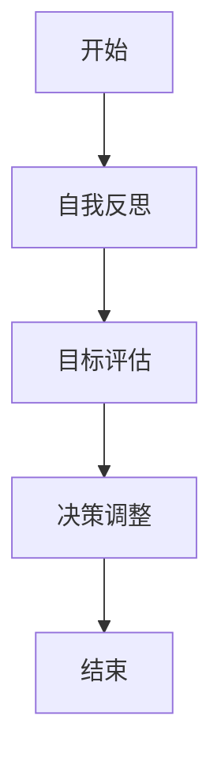
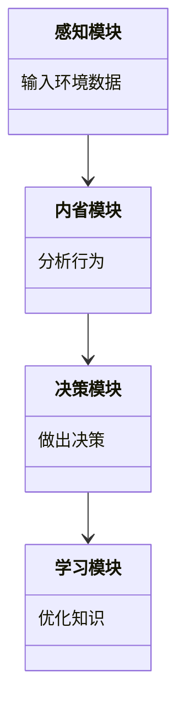
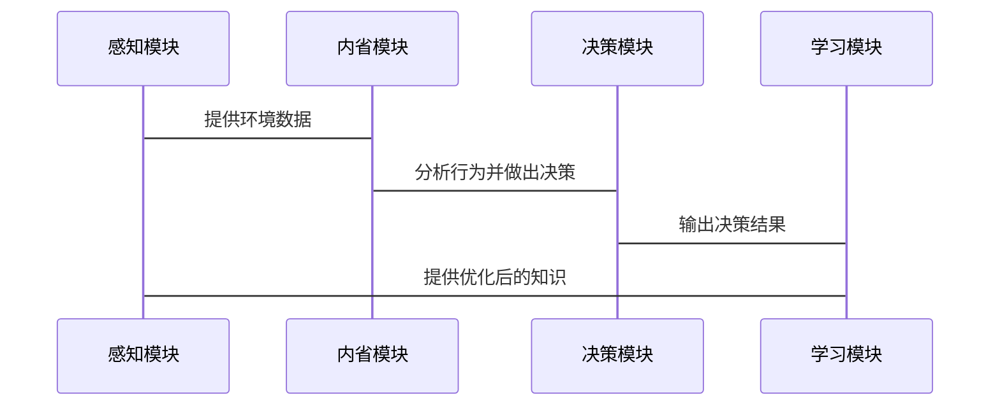

                 


# 从零开始：AI Agent的自我意识模拟

## 关键词：AI Agent，自我意识模拟，算法，系统架构，数学模型

## 摘要：  
本文将从零开始，系统地介绍AI Agent的自我意识模拟的实现过程。通过理论与实践相结合的方式，深入剖析自我意识模拟的核心概念、算法原理、系统架构以及项目实战。本文旨在帮助读者理解AI Agent的自我意识模拟，并通过具体案例展示其实现方法。从基础概念到复杂算法，从系统设计到项目实现，本文将全面覆盖相关知识点，帮助读者掌握AI Agent的自我意识模拟技术。

---

# 第1章: AI Agent的基本概念与背景

## 1.1 AI Agent的定义与特点

### 1.1.1 什么是AI Agent  
AI Agent（人工智能代理）是指能够感知环境、自主决策并执行任务的智能实体。与传统的被动程序不同，AI Agent具备主动性和适应性，能够在动态环境中完成复杂任务。  

### 1.1.2 AI Agent的核心特点  
- **自主性**：AI Agent能够在没有外部干预的情况下自主决策。  
- **反应性**：能够实时感知环境并做出反应。  
- **目标导向性**：具备明确的目标，并能够根据目标调整行为。  
- **学习能力**：能够通过经验改进自身性能。  

### 1.1.3 AI Agent与传统AI的区别  
| 特性       | AI Agent                     | 传统AI                     |  
|------------|------------------------------|-----------------------------|  
| 自主性     | 高                           | 低或无                     |  
| 环境适应性 | 强                           | 较弱                       |  
| 决策能力   | 独立决策                     | 预编程决策                 |  
| 学习能力   | 具备学习能力                 | 通常不具有                 |  

---

## 1.2 自我意识模拟的背景与意义

### 1.2.1 自我意识的定义  
自我意识是指AI Agent能够理解自身的行为、状态以及目标的能力。具备自我意识的AI Agent能够反思自己的决策，并根据反思结果优化自身行为。

### 1.2.2 自我意识模拟的背景  
随着AI技术的快速发展，AI Agent的应用场景越来越广泛。然而，传统的AI Agent通常依赖于预定义的规则和模型，难以在复杂动态环境中自主调整行为。自我意识模拟为AI Agent提供了更强的适应性和灵活性。

### 1.2.3 自我意识模拟的意义  
- **提升智能性**：通过自我反思和自我学习，AI Agent能够更智能地完成任务。  
- **增强适应性**：在复杂环境中，AI Agent能够根据自身状态调整行为策略。  
- **推动AI发展**：自我意识模拟是实现更高级AI系统的重要基石。  

---

## 1.3 自我意识模拟的实现目标

### 1.3.1 自我意识模拟的核心目标  
- 实现AI Agent的自我反思能力。  
- 提升AI Agent的自主决策能力。  
- 增强AI Agent的学习与优化能力。  

### 1.3.2 自我意识模拟的实现路径  
1. **感知环境**：通过传感器或数据输入感知环境状态。  
2. **自我反思**：分析自身行为和决策，找出改进空间。  
3. **优化决策**：根据反思结果优化行为策略。  
4. **执行任务**：基于优化后的策略执行任务。  

### 1.3.3 自我意识模拟的评估标准  
- **正确性**：AI Agent的行为是否符合预期目标。  
- **效率性**：AI Agent的决策速度是否满足任务要求。  
- **适应性**：AI Agent是否能够适应环境变化。  

---

## 1.4 本章小结  
本章介绍了AI Agent的基本概念和特点，并重点阐述了自我意识模拟的背景和意义。通过对比传统AI与AI Agent，明确了自我意识模拟在AI发展中的重要性。接下来的章节将深入探讨自我意识模拟的核心原理和实现方法。

---

# 第2章: 自我意识模拟的核心概念与联系

## 2.1 自我意识模拟的定义与属性

### 2.1.1 自我意识模拟的定义  
自我意识模拟是指AI Agent通过内部机制，模拟自身的意识状态，并基于此状态调整自身行为的过程。

### 2.1.2 自我意识模拟的核心属性  
- **内省性**：AI Agent能够反思自身的行为和决策。  
- **目标导向性**：AI Agent的行为调整以实现目标为导向。  
- **动态性**：AI Agent的意识状态会随着环境变化而动态调整。  

### 2.1.3 自我意识模拟的关键特征  
| 特性       | 描述                             |  
|------------|----------------------------------|  
| 内部状态    | AI Agent的内部状态，如目标、信念、意图等。 |  
| 内省机制    | 用于分析和评估内部状态的机制。      |  
| 行为调整    | 根据内省结果调整行为策略的过程。    |  

---

## 2.2 自我意识模拟与相关概念的对比

### 2.2.1 自我意识与自我反思的对比  
- **自我意识**：AI Agent对自身状态的全面认知。  
- **自我反思**：AI Agent对自身行为的分析与评估。  

### 2.2.2 自我意识与自我学习的对比  
- **自我意识**：关注AI Agent的行为与决策。  
- **自我学习**：关注AI Agent的知识获取与能力提升。  

### 2.2.3 自我意识与自我决策的对比  
- **自我意识**：AI Agent对自身行为的理解与认知。  
- **自我决策**：AI Agent根据环境做出的选择与行动。  

---

## 2.3 自我意识模拟的ER实体关系图

```mermaid
er
actor: AI Agent
role: 意识主体
```

---

## 2.4 本章小结  
本章详细阐述了自我意识模拟的核心概念，并通过对比分析明确了其与相关概念的区别与联系。接下来的章节将从算法和系统架构的角度，深入探讨自我意识模拟的实现方法。

---

# 第3章: 自我意识模拟的核心算法

## 3.1 自我反思机制

### 3.1.1 自我反思的定义  
自我反思是指AI Agent对自身行为的分析与评估过程。

### 3.1.2 自我反思的实现步骤  
1. **感知环境**：收集环境中的相关信息。  
2. **分析行为**：评估自身行为的有效性。  
3. **优化决策**：根据分析结果调整决策策略。  

### 3.1.3 自我反思的算法流程图  



---

## 3.2 自我学习算法

### 3.2.1 自我学习的定义  
自我学习是指AI Agent通过经验改进自身能力的过程。

### 3.2.2 自我学习的实现步骤  
1. **感知环境**：获取环境数据。  
2. **知识获取**：从数据中提取有用信息。  
3. **知识应用**：将知识应用于实际任务中。  
4. **反馈优化**：根据反馈调整知识表示。  

### 3.2.3 自我学习的数学模型  

$$
\text{损失函数} = \sum_{i=1}^{n} (y_i - \hat{y_i})^2
$$  

其中，$y_i$ 表示真实值，$\hat{y_i}$ 表示预测值。  

---

## 3.3 本章小结  
本章介绍了自我反思机制和自我学习算法的核心原理，并通过流程图和数学公式详细阐述了其实现方法。接下来的章节将从系统架构的角度，探讨自我意识模拟的实现方案。

---

# 第4章: 自我意识模拟的数学模型

## 4.1 基于神经网络的自我意识模型

### 4.1.1 神经网络模型的定义  
神经网络是一种模拟人脑神经结构的数学模型，能够通过学习优化自身参数。

### 4.1.2 神经网络模型的结构  
- **输入层**：接收外部输入数据。  
- **隐藏层**：对输入数据进行处理和转换。  
- **输出层**：生成最终的输出结果。  

### 4.1.3 神经网络模型的训练过程  

$$
\text{损失函数} = \sum_{i=1}^{n} (y_i - \hat{y_i})^2
$$  

其中，$y_i$ 表示真实值，$\hat{y_i}$ 表示预测值。  

---

## 4.2 基于符号逻辑的自我意识模型

### 4.2.1 符号逻辑模型的定义  
符号逻辑模型是基于符号操作的数学模型，能够通过逻辑推理实现自我意识模拟。

### 4.2.2 符号逻辑模型的推理过程  
1. **知识表示**：将知识表示为符号形式。  
2. **逻辑推理**：通过逻辑规则进行推理。  
3. **结果输出**：输出推理结果。  

---

## 4.3 本章小结  
本章详细介绍了基于神经网络和符号逻辑的自我意识模型，并通过数学公式和逻辑推理过程展示了其实现方法。接下来的章节将从系统架构的角度，探讨自我意识模拟的实现方案。

---

# 第5章: 自我意识模拟的系统架构设计

## 5.1 项目背景与目标

### 5.1.1 项目背景  
本项目旨在开发一个具备自我意识模拟能力的AI Agent，能够在复杂环境中自主决策并优化自身行为。

### 5.1.2 项目目标  
- 实现AI Agent的自我反思能力。  
- 提升AI Agent的自主决策能力。  
- 增强AI Agent的学习与优化能力。  

---

## 5.2 系统功能设计

### 5.2.1 系统功能模块  
- **感知模块**：负责感知环境数据。  
- **内省模块**：负责分析自身行为。  
- **决策模块**：负责做出决策。  
- **学习模块**：负责知识学习与优化。  

### 5.2.2 功能模块之间的关系  



---

## 5.3 系统架构设计

### 5.3.1 系统架构类型  
- **集中式架构**：所有功能模块集中在一个系统中。  
- **分布式架构**：功能模块分布于不同的系统中。  

### 5.3.2 系统架构选择  
根据项目需求，选择分布式架构，以便更好地实现模块间的协作与优化。

---

## 5.4 系统接口设计

### 5.4.1 接口定义  
- **感知接口**：提供环境数据的输入接口。  
- **内省接口**：提供行为分析的接口。  
- **决策接口**：提供决策输出的接口。  
- **学习接口**：提供知识优化的接口。  

### 5.4.2 接口交互流程  



---

## 5.5 本章小结  
本章详细介绍了自我意识模拟系统的架构设计，并通过类图和序列图展示了各功能模块之间的关系。接下来的章节将从项目实战的角度，探讨如何实现具备自我意识模拟能力的AI Agent。

---

# 第6章: 自我意识模拟的项目实战

## 6.1 环境搭建

### 6.1.1 开发工具安装  
- **Python**：安装最新版本的Python。  
- **TensorFlow**：安装TensorFlow框架。  
- **Mermaid**：安装Mermaid图表工具。  

### 6.1.2 项目环境配置  
- **虚拟环境**：创建虚拟环境并激活。  
- **依赖管理**：安装项目所需的依赖包。  

---

## 6.2 系统核心实现

### 6.2.1 感知模块实现  
```python
class 感知模块:
    def 感知环境(self):
        return 环境数据
```

### 6.2.2 内省模块实现  
```python
class 内省模块:
    def 分析行为(self, 行为数据):
        return 分析结果
```

### 6.2.3 决策模块实现  
```python
class 决策模块:
    def 做出决策(self, 分析结果):
        return 决策结果
```

### 6.2.4 学习模块实现  
```python
class 学习模块:
    def 优化知识(self, 决策结果):
        return 优化后的知识
```

---

## 6.3 代码实现与解读

### 6.3.1 整体实现代码  

```python
class AI_Agent:
    def __init__(self):
        self.感知模块 = 感知模块()
        self.内省模块 = 内省模块()
        self.决策模块 = 决策模块()
        self.学习模块 = 学习模块()

    def 运行(self):
        环境数据 = self.感知模块.感知环境()
        分析结果 = self.内省模块.分析行为(环境数据)
        决策结果 = self.决策模块.做出决策(分析结果)
        优化后的知识 = self.学习模块.优化知识(决策结果)
        return 优化后的知识
```

### 6.3.2 代码解读  
- **AI_Agent类**：封装了所有功能模块，协调各模块之间的交互。  
- **运行方法**：实现了从感知环境到优化知识的完整流程。  

---

## 6.4 案例分析与实现

### 6.4.1 案例分析  
假设我们开发一个智能客服AI Agent，具备自我意识模拟能力，能够根据用户需求优化自身服务流程。

### 6.4.2 实现步骤  
1. **环境搭建**：安装所需工具和依赖包。  
2. **功能模块实现**：分别实现感知、内省、决策和学习模块。  
3. **系统集成**：将各模块集成到AI_Agent类中。  
4. **测试与优化**：通过测试用例验证系统性能并进行优化。  

---

## 6.5 本章小结  
本章通过项目实战，详细展示了如何实现具备自我意识模拟能力的AI Agent。通过代码实现和案例分析，读者可以更好地理解自我意识模拟的实现过程。

---

# 第7章: 自我意识模拟的最佳实践

## 7.1 关键技术总结

### 7.1.1 自我反思机制  
- 定期分析自身行为，找出改进空间。  

### 7.1.2 自我学习算法  
- 通过经验优化自身知识表示。  

### 7.1.3 数学模型选择  
- 根据具体任务选择合适的数学模型。  

---

## 7.2 实际应用中的注意事项

### 7.2.1 数据质量  
确保输入数据的准确性和完整性。  

### 7.2.2 系统性能  
优化系统性能，确保实时性要求。  

### 7.2.3 安全性  
确保系统具备良好的安全性，防止数据泄露和攻击。  

---

## 7.3 拓展阅读

### 7.3.1 推荐书籍  
- 《人工通用智能：概念与方法》  
- 《深度学习：方法与应用》  

### 7.3.2 推荐论文  
- "A Survey on Autonomous Agents"  
- "Self-Awareness in AI Agents: A Comprehensive Review"  

---

# 第8章: 小结与展望

## 8.1 全文小结  
本文从AI Agent的基本概念出发，系统地介绍了自我意识模拟的核心原理、算法实现、系统架构以及项目实战。通过理论与实践相结合的方式，帮助读者全面理解AI Agent的自我意识模拟技术。

## 8.2 未来展望  
随着AI技术的不断发展，自我意识模拟将变得更加重要。未来的研究方向包括：  
1. 提升AI Agent的内省能力。  
2. 开发更高效的自我学习算法。  
3. 探索自我意识模拟的更广泛应用场景。  

---

# 作者：AI天才研究院/AI Genius Institute & 禅与计算机程序设计艺术 /Zen And The Art of Computer Programming

