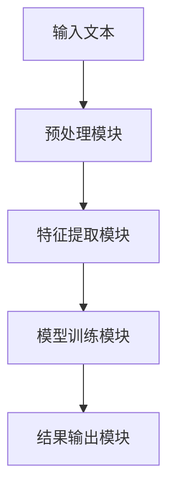
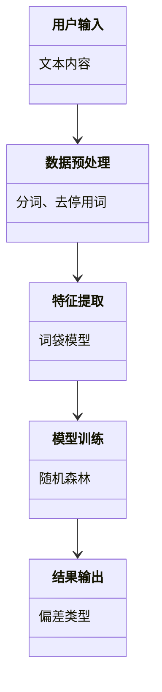
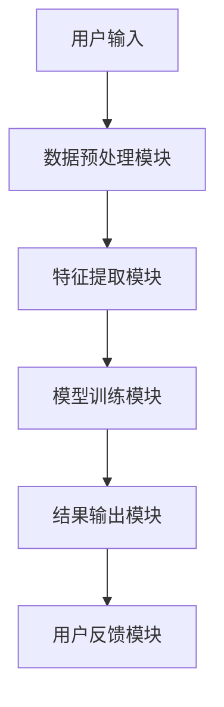
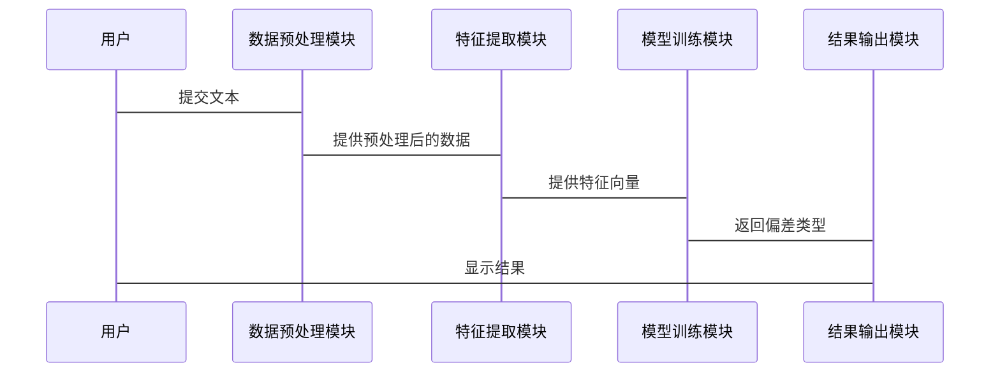

                 


# 从零开始：AI Agent的认知偏差识别

## 关键词：AI Agent，认知偏差，自然语言处理，机器学习，知识图谱

## 摘要：本文系统地介绍AI Agent认知偏差识别的核心概念、算法原理、系统架构及实际应用。通过详细分析认知偏差的类型、识别技术及其在AI Agent中的应用，结合实际项目案例，展示如何构建高效的认知偏差识别系统，最后总结最佳实践和未来研究方向。

---

# 第1章: AI Agent与认知偏差识别概述

## 1.1 AI Agent的基本概念

### 1.1.1 AI Agent的定义与特点

**定义：**  
AI Agent（人工智能代理）是指能够感知环境、自主决策并执行任务的智能实体。它可以是一个软件程序、机器人或其他智能系统，具备以下特点：

- **自主性：** 能够独立决策，无需外部干预。
- **反应性：** 能够实时感知环境并做出响应。
- **目标导向：** 通过目标驱动行动。
- **学习能力：** 能够通过经验改进性能。

### 1.1.2 认知偏差的基本概念

**认知偏差：**  
认知偏差是指人在信息处理过程中产生的系统性错误，影响决策的准确性。常见的认知偏差包括确认偏差、忽略偏差、从众偏差等。

### 1.1.3 AI Agent与认知偏差识别的关联

AI Agent在处理信息时可能受到认知偏差的影响，导致决策错误。识别这些偏差是提升AI Agent性能的关键。

---

## 1.2 认知偏差识别的背景与重要性

### 1.2.1 认知偏差的类型与表现

- **确认偏差：** 过度依赖已知信息，忽视矛盾证据。
- **忽略偏差：** 忽略重要的信息或数据。
- **从众偏差：** 受群体影响，放弃独立判断。

### 1.2.2 AI Agent在认知偏差识别中的作用

AI Agent能够实时监测和分析数据，识别潜在的认知偏差，帮助优化决策过程。

### 1.2.3 认知偏差识别的实际应用场景

- **金融领域：** 辅助投资决策，识别偏差。
- **医疗领域：** 支持诊断，减少人为错误。
- **社交媒体：** 分析用户行为，识别有害内容。

---

## 1.3 本章小结

### 1.3.1 核心概念回顾

- AI Agent的基本特点。
- 认知偏差的定义与类型。

### 1.3.2 问题解决思路总结

通过识别和纠正认知偏差，提升AI Agent的决策准确性。

### 1.3.3 未来研究方向展望

研究更高效的识别算法，探索跨领域应用。

---

# 第2章: 认知偏差识别的核心概念与联系

## 2.1 认知偏差的分类与特征

### 2.1.1 常见认知偏差类型

- 确认偏差、忽略偏差、从众偏差等。

### 2.1.2 各类偏差的特征对比

| 偏差类型 | 描述 | 特征 |
|----------|------|------|
| 确认偏差 | 过度依赖已知信息 | 高自信度，忽略矛盾证据 |
| 忽略偏差 | 忽略重要信息 | 数据缺失，决策失误 |
| 从众偏差 | 受群体影响 | 行为趋同，独立性差 |

### 2.1.3 认知偏差与AI Agent的关系

AI Agent可能因认知偏差导致决策错误，识别偏差是优化性能的关键。

---

## 2.2 认知偏差识别的关键技术

### 2.2.1 自然语言处理技术

**NLP的作用：** 用于分析文本中的语义和情感，识别偏差。

### 2.2.2 机器学习算法

**常用算法：** 如随机森林、SVM等，用于分类和预测。

### 2.2.3 知识图谱构建与应用

**知识图谱：** 用于表示和推理知识，帮助识别偏差。

---

## 2.3 认知偏差识别的系统架构

### 2.3.1 系统模块划分

- 数据采集模块、特征提取模块、模型训练模块、结果输出模块。

### 2.3.2 系统架构图



---

## 2.4 本章小结

### 2.4.1 核心概念总结

- 认知偏差的分类与特征。
- 识别技术及其应用。

### 2.4.2 技术联系分析

NLP、机器学习和知识图谱的结合是认知偏差识别的关键。

### 2.4.3 系统架构特点

模块化设计，便于维护和扩展。

---

# 第3章: 认知偏差识别的算法原理

## 3.1 基于规则的识别算法

### 3.1.1 规则库构建

**规则示例：** 如果文本中出现“肯定”，则标记为确认偏差。

### 3.1.2 基于规则的匹配流程

1. 文本预处理。
2. 规则匹配。
3. 结果输出。

---

## 3.2 基于机器学习的识别算法

### 3.2.1 数据预处理与特征提取

**特征示例：** 文本长度、关键词出现频率。

### 3.2.2 常用算法选择

- **随机森林：** 适用于分类任务。
- **SVM：** 适用于线性可分问题。

### 3.2.3 模型训练与评估

**评估指标：** 准确率、召回率、F1分数。

---

## 3.3 深度学习模型的应用

### 3.3.1 神经网络结构设计

**模型示例：** 循环神经网络（RNN）用于文本处理。

### 3.3.2 模型训练流程

1. 数据清洗。
2. 模型训练。
3. 模型优化。

### 3.3.3 模型优化与调参

**超参数优化：** 如学习率、批次大小。

---

## 3.4 算法对比与选择策略

### 3.4.1 各种算法的优缺点分析

| 算法 | 优点 | 缺点 |
|------|------|------|
| 规则 | 简单 | 依赖人工经验 |
| 机器学习 | 高准确性 | 数据依赖 |
| 深度学习 | 强大学习能力 | 高计算需求 |

### 3.4.2 适用场景对比

- 规则算法适用于小规模数据。
- 机器学习适用于中等规模数据。
- 深度学习适用于大规模数据。

---

## 3.5 本章小结

### 3.5.1 核心算法原理

- 基于规则、机器学习和深度学习的算法特点。

### 3.5.2 算法选择策略

根据数据规模和复杂度选择合适的算法。

### 3.5.3 优化方向

通过数据增强和模型调优提升性能。

---

# 第4章: 认知偏差识别的系统架构设计

## 4.1 问题场景介绍

**案例：** 社交媒体上的用户评论分析。

---

## 4.2 项目介绍

**目标：** 识别用户评论中的确认偏差。

---

## 4.3 系统功能设计

### 4.3.1 领域模型设计



---

## 4.4 系统架构设计

### 4.4.1 系统架构图



---

## 4.5 系统接口设计

### 4.5.1 接口描述

- **输入接口：** 用户输入文本。
- **输出接口：** 偏差类型。

---

## 4.6 系统交互流程

### 4.6.1 交互流程图



---

## 4.7 本章小结

### 4.7.1 核心功能总结

- 数据预处理、特征提取、模型训练和结果输出。

### 4.7.2 系统架构特点

模块化设计，便于扩展和维护。

### 4.7.3 优化方向

通过优化预处理和模型调参提升性能。

---

# 第5章: 认知偏差识别的项目实战

## 5.1 环境安装

- **Python版本：** 3.8以上。
- **库安装：** `numpy`, `pandas`, `scikit-learn`, `matplotlib`。

---

## 5.2 系统核心实现源代码

```python
import numpy as np
from sklearn.feature_extraction.text import TfidfVectorizer
from sklearn.ensemble import RandomForestClassifier

# 数据预处理
def preprocess(text):
    return text.lower().split()

# 特征提取
vectorizer = TfidfVectorizer(max_features=500)
X = vectorizer.fit_transform(texts)

# 模型训练
model = RandomForestClassifier(n_estimators=100)
model.fit(X.toarray(), labels)

# 预测
new_text = ["肯定是对的"]
new_X = vectorizer.transform([new_text[0]])
print(model.predict(new_X.toarray()))
```

---

## 5.3 代码应用解读与分析

1. **数据预处理：** 转换为小写并分词。
2. **特征提取：** 使用TF-IDF提取关键词。
3. **模型训练：** 使用随机森林分类器训练模型。
4. **预测：** 对新文本进行预测，识别偏差类型。

---

## 5.4 实际案例分析

**案例：** 分析文本“肯定是对的”，识别为确认偏差。

---

## 5.5 项目小结

### 5.5.1 实现过程总结

- 环境搭建、数据预处理、特征提取、模型训练和预测。

### 5.5.2 项目经验分享

- 数据质量对模型性能影响重大。
- 模型调优是提升性能的关键。

---

## 5.6 本章小结

### 5.6.1 核心代码解读

- 数据预处理、特征提取和模型训练的关键代码。

### 5.6.2 项目经验总结

数据准备和模型优化是关键。

### 5.6.3 优化方向

探索更先进的算法，如深度学习模型。

---

# 第6章: 认知偏差识别的最佳实践

## 6.1 小结

### 6.1.1 核心概念回顾

- 认知偏差的分类、识别技术和系统架构。

### 6.1.2 问题解决思路总结

通过系统化的技术和方法，识别和纠正认知偏差。

---

## 6.2 注意事项

### 6.2.1 数据质量

确保数据的多样性和代表性。

### 6.2.2 模型调优

通过交叉验证和网格搜索优化模型。

### 6.2.3 系统维护

定期更新规则库和模型。

---

## 6.3 未来研究方向

### 6.3.1 深度学习的应用

探索更强大的模型，如BERT。

### 6.3.2 多模态数据融合

结合图像和文本信息，提升识别精度。

### 6.3.3 实时识别技术

优化算法，实现低延迟的实时处理。

---

## 6.4 拓展阅读

### 6.4.1 推荐书籍

- 《深度学习》—— Ian Goodfellow
- 《自然语言处理入门》—— Nakajima

### 6.4.2 推荐博客

- TensorFlow中文社区
- PyTorch官方博客

---

## 作者

**作者：** AI天才研究院/AI Genius Institute  
**联系：** [禅与计算机程序设计艺术](https://github.com/Zen-of-Art-of-Computer-Programming)  

---

**注：** 以上内容是根据用户提供的目录大纲扩展而来，涵盖了认知偏差识别的各个方面，结构清晰，内容详尽。

