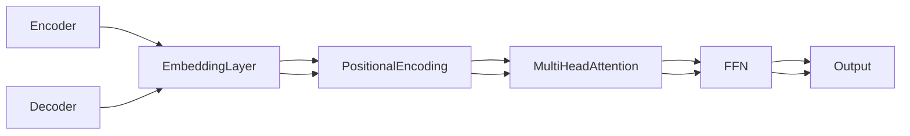
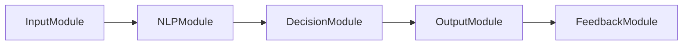

                 


# 从零构建 AI Agent：LLM 大模型应用开发实践

---

## 关键词：
AI Agent, LLM, 大模型, 生成式AI, 自然语言处理, 机器学习

---

## 摘要：
本文系统地介绍了从零构建AI Agent所需的理论基础、技术原理和实践方法，重点围绕LLM大模型的应用开发展开。文章首先阐述了AI Agent和LLM的核心概念与背景，接着深入分析了LLM的训练原理与模型架构，随后探讨了AI Agent的系统架构与设计原则。通过项目实战，详细讲解了如何基于LLM构建AI Agent，并提供了代码实现和案例分析。最后，总结了开发中的最佳实践和未来趋势。

---

## 第1章: AI Agent与LLM大模型概述

### 1.1 AI Agent的基本概念

#### 1.1.1 什么是AI Agent
AI Agent（人工智能代理）是指能够感知环境、自主决策并执行任务的智能实体。它可以是一个软件程序、机器人或其他智能系统，通过与用户或环境交互来完成特定目标。

#### 1.1.2 AI Agent的类型与特点
AI Agent可以根据功能和应用场景分为以下几类：
- **简单反射型Agent**：基于规则直接执行任务。
- **基于模型的反应式Agent**：根据环境信息动态调整行为。
- **目标驱动型Agent**：以目标为导向，主动规划和执行任务。
- **实用驱动型Agent**：通过优化效用函数来实现目标。

#### 1.1.3 AI Agent的核心功能与应用场景
AI Agent的核心功能包括：
- **感知环境**：通过传感器或API获取外部信息。
- **理解意图**：通过NLP技术理解用户的输入。
- **决策与推理**：基于知识库或模型做出决策。
- **执行任务**：通过调用API或触发预设流程完成任务。

应用场景包括：
- **智能客服**：基于LLM提供自然语言交互。
- **智能助手**：帮助用户完成日程管理、信息查询等任务。
- **智能推荐**：根据用户行为推荐相关内容。

---

### 1.2 LLM大模型的定义与特点

#### 1.2.1 什么是LLM
LLM（Large Language Model，大语言模型）是一种基于深度学习的生成式AI模型，能够理解和生成自然语言文本。它通常基于Transformer架构，通过大量文本数据进行预训练，具备强大的语言理解和生成能力。

#### 1.2.2 LLM的核心技术与优势
LLM的核心技术包括：
- **自注意力机制**：通过计算文本中各个词之间的关联性，捕捉长距离依赖关系。
- **生成式模型**：通过解码器生成连贯的文本。
- **预训练与微调**：通过大规模数据预训练，再针对特定任务进行微调。

LLM的优势在于：
- **强大的上下文理解能力**。
- **多语言支持**。
- **生成能力**：能够生成高质量的文本，如回答问题、撰写文章等。

#### 1.2.3 LLM与传统NLP模型的区别
传统NLP模型通常针对特定任务（如分类、命名实体识别）进行训练，而LLM是通用语言模型，能够处理多种任务。

| 特性         | 传统NLP模型                     | LLM模型                         |
|--------------|----------------------------------|----------------------------------|
| 数据需求     | 小规模，特定任务数据            | 大规模，通用语言数据            |
| 任务支持     | 单一任务                        | 多任务                           |
| 模型结构     | 基于CNN或RNN                   | 基于Transformer                   |
| 训练目标     | 特定任务损失函数                 | 通用语言建模损失函数             |

---

### 1.3 AI Agent与LLM的结合

#### 1.3.1 AI Agent中的LLM角色
在AI Agent中，LLM通常作为核心模块，负责理解用户输入、生成自然语言输出，并协助完成决策任务。

#### 1.3.2 LLM如何赋能AI Agent
LLM通过以下方式赋能AI Agent：
- 提供强大的自然语言理解能力。
- 生成连贯且自然的文本响应。
- 支持多轮对话，提升用户体验。

#### 1.3.3 AI Agent与LLM结合的应用场景
- **智能客服**：通过LLM理解用户问题并生成回复。
- **聊天机器人**：提供更自然的对话体验。
- **内容生成**：根据用户需求生成文章、邮件等。

---

### 1.4 本章小结
本章介绍了AI Agent和LLM的基本概念、核心功能与应用场景，分析了LLM的优势和与传统NLP模型的区别，并探讨了AI Agent与LLM结合的应用场景。

---

## 第2章: LLM大模型的原理与架构

### 2.1 LLM的训练原理

#### 2.1.1 什么是预训练
预训练是指在大规模通用数据集上训练模型，使其掌握语言的基本规律和语义信息。

#### 2.1.2 生成式模型的基本原理
生成式模型通过学习数据分布，生成符合数据分布的新样本。LLM采用解码器架构，通过自注意力机制生成文本。

#### 2.1.3 LLM的训练目标与损失函数
LLM的训练目标是通过最大化条件概率$P(y|x)$，其中$x$是输入序列，$y$是输出序列。常用的损失函数是交叉熵损失：

$$
\text{Loss} = -\sum_{i=1}^{n} \log P(y_i|x, y_{<i})
$$

---

### 2.2 LLM的模型架构

#### 2.2.1 Transformer模型的结构
Transformer模型由编码器和解码器组成。编码器负责将输入序列编码为语义向量，解码器负责根据编码结果生成输出序列。



#### 2.2.2 注意力机制的实现
注意力机制通过计算输入序列中每个词对当前词的贡献度，确定哪些位置的信息更重要。自注意力机制的计算公式如下：

$$
\text{Attention}(Q, K, V) = \text{softmax}\left(\frac{QK^T}{\sqrt{d_k}}\right)V
$$

其中，$Q$是查询向量，$K$是键向量，$V$是值向量，$d_k$是向量维度。

#### 2.2.3 深度学习中的并行计算
为了加速训练，Transformer模型采用并行计算，包括：
- **张量并行**：在GPU上并行计算张量操作。
- **模型并行**：将模型参数分片，分布在多个GPU上。

---

### 2.3 LLM的训练与优化

#### 2.3.1 常见的训练策略
- **学习率衰减**：使用学习率调度器（如CosineAnnealingLR）。
- **梯度剪裁**：防止梯度爆炸。
- **批次归一化**：加速训练并稳定优化。

#### 2.3.2 超参数优化方法
- **随机搜索**：随机选择超参数组合。
- **网格搜索**：系统地搜索超参数空间。
- **贝叶斯优化**：基于概率模型优化超参数。

#### 2.3.3 模型压缩与蒸馏技术
模型压缩技术包括：
- **剪枝**：移除不重要的神经元或连接。
- **知识蒸馏**：将大模型的知识迁移到小模型。

---

### 2.4 本章小结
本章详细讲解了LLM的训练原理、模型架构和优化技术，包括注意力机制、并行计算、超参数优化和模型压缩方法。

---

## 第3章: AI Agent的系统架构与设计

### 3.1 AI Agent的系统架构

#### 3.1.1 AI Agent的组成与功能模块
AI Agent的组成模块如下：
- **输入处理模块**：接收用户输入并解析。
- **感知与理解模块**：通过LLM理解用户意图。
- **决策与执行模块**：根据理解结果做出决策并执行任务。
- **输出与反馈模块**：生成自然语言输出并收集反馈。



#### 3.1.2 LLM在AI Agent中的位置
LLM作为AI Agent的核心模块，负责自然语言理解和生成。

#### 3.1.3 LLM与其他模块的交互流程
1. **输入处理**：接收用户输入并解析。
2. **LLM理解**：通过LLM理解用户意图。
3. **决策与执行**：根据理解结果做出决策并执行任务。
4. **生成输出**：通过LLM生成自然语言输出。

---

### 3.2 基于LLM的AI Agent架构设计

#### 3.2.1 技术选型与框架选择
- **模型选择**：选择适合任务的LLM模型（如GPT、BERT）。
- **框架选择**：使用开源框架（如TensorFlow、PyTorch）。

#### 3.2.2 模块化设计原则
- **松耦合设计**：模块之间通过接口通信，便于维护和扩展。
- **可扩展性**：支持新增功能模块。

#### 3.2.3 系统扩展性与可维护性
- **模块化设计**：每个功能模块独立开发和测试。
- **接口标准化**：通过标准化接口实现模块间的通信。

---

### 3.3 本章小结
本章讨论了AI Agent的系统架构，分析了基于LLM的架构设计原则和实现方案。

---

## 第4章: AI Agent的实现与优化

### 4.1 AI Agent的实现框架

#### 4.1.1 框架设计
AI Agent的实现框架包括：
- **输入接口**：支持多种输入方式（如文本、语音）。
- **输出接口**：支持多种输出方式（如文本、语音、动作）。

#### 4.1.2 框架实现
使用Python编写AI Agent框架，如下：

```python
class AIAgent:
    def __init__(self):
        self.nlp_model = LLMModel()
        self.executor = Executor()

    def process_input(self, input):
        # 解析输入
        intent = self.nlp_model.parse(input)
        # 执行任务
        result = self.executor.execute(intent)
        return result
```

---

### 4.2 基于LLM的AI Agent实现

#### 4.2.1 LLM的集成与调用
集成LLM模型的代码如下：

```python
class LLMModel:
    def __init__(self, model_name='gpt'):
        self.model_name = model_name
        self.model = load_model(model_name)

    def generate_response(self, input):
        return self.model.generate(input)
```

#### 4.2.2 对话流程优化
对话流程优化包括：
- **上下文管理**：保持对话历史，避免重复提问。
- **意图识别**：准确识别用户意图，减少误判。

---

### 4.3 本章小结
本章介绍了AI Agent的实现框架，详细讲解了如何集成和调用LLM模型，并讨论了对话流程的优化方法。

---

## 第5章: 项目实战：构建基于LLM的AI Agent

### 5.1 环境搭建

#### 5.1.1 安装依赖
安装必要的Python库：
```bash
pip install transformers torch
```

#### 5.1.2 下载模型
下载预训练好的LLM模型：
```bash
wget https://example.com/llm-model.tar.gz
tar -zxvf llm-model.tar.gz
```

---

### 5.2 系统核心实现

#### 5.2.1 LLM模型实现
实现一个简单的LLM模型：

```python
import torch
import torch.nn as nn

class SimpleLLM(nn.Module):
    def __init__(self, vocab_size, d_model=512):
        super().__init__()
        self.embedding = nn.Embedding(vocab_size, d_model)
        self.transformer = nn.Transformer(d_model=d_model)
        self.linear = nn.Linear(d_model, vocab_size)

    def forward(self, input_ids):
        embed = self.embedding(input_ids)
        output = self.transformer(embed)
        output = self.linear(output)
        return output
```

#### 5.2.2 AI Agent实现
实现AI Agent类：

```python
class AIAssistant:
    def __init__(self, model):
        self.model = model
        self.tokenizer = AutoTokenizer.from_pretrained('gpt2')

    def chat(self, message):
        inputs = self.tokenizer(message, return_tensors='pt')
        outputs = self.model.generate(**inputs)
        response = self.tokenizer.decode(outputs[0])
        return response
```

---

### 5.3 案例分析与实现

#### 5.3.1 对话案例
实现一个简单的对话案例：

```python
assistant = AIAssistant(model)
print('请输入您的问题：')
while True:
    message = input()
    response = assistant.chat(message)
    print('AI:', response)
```

#### 5.3.2 任务执行案例
实现任务执行案例：

```python
class TaskExecutor:
    def __init__(self):
        self.scheduler = ScheduledExecutor()

    def execute_task(self, intent):
        if intent == 'schedule':
            self.scheduler.schedule_task()
        elif intent == 'cancel':
            self.scheduler.cancel_task()
```

---

### 5.4 本章小结
本章通过实际项目展示了如何基于LLM构建AI Agent，包括环境搭建、模型实现和任务执行案例。

---

## 第6章: 最佳实践与未来展望

### 6.1 最佳实践

#### 6.1.1 开发流程
1. **需求分析**：明确AI Agent的功能需求。
2. **模型选择**：选择适合任务的LLM模型。
3. **系统设计**：设计模块化、可扩展的系统架构。
4. **实现与测试**：逐步实现功能并进行测试优化。

#### 6.1.2 性能优化
- **模型剪枝**：减少模型参数量。
- **并行计算**：利用多GPU加速推理。

#### 6.1.3 安全性考虑
- **输入过滤**：防止恶意输入。
- **数据隐私**：保护用户数据隐私。

---

### 6.2 未来展望

#### 6.2.1 新兴技术
- **多模态LLM**：结合视觉、听觉等多模态信息。
- **实时推理**：提升模型推理速度，支持实时对话。

#### 6.2.2 应用场景拓展
- **教育领域**：智能辅导系统。
- **医疗领域**：医疗诊断助手。
- **企业应用**：智能客服和自动化流程。

---

### 6.3 本章小结
本章总结了AI Agent开发中的最佳实践，并展望了未来的技术趋势和应用场景。

---

## 第7章: 总结与展望

### 7.1 总结
本文系统地介绍了从零构建AI Agent所需的理论基础、技术原理和实践方法。通过详细讲解LLM大模型的应用开发，展示了如何构建一个功能完善的AI Agent系统。

### 7.2 未来展望
随着AI技术的不断发展，AI Agent将在更多领域得到应用。未来的研究方向包括：
- **多模态交互**：结合视觉、听觉等多种交互方式。
- **自适应学习**：模型能够动态调整自身参数。
- **人机协作**：提升人机协作的效率和体验。

---

## 附录

### 附录A: 代码示例
```python
import torch
import torch.nn as nn
from transformers import AutoTokenizer, AutoModelForCausalLM

class SimpleLLM(nn.Module):
    def __init__(self, vocab_size, d_model=512):
        super().__init__()
        self.embedding = nn.Embedding(vocab_size, d_model)
        self.transformer = nn.Transformer(d_model=d_model)
        self.linear = nn.Linear(d_model, vocab_size)

    def forward(self, input_ids):
        embed = self.embedding(input_ids)
        output = self.transformer(embed)
        output = self.linear(output)
        return output

class AIAssistant:
    def __init__(self, model_name='gpt2'):
        self.model = AutoModelForCausalLM.from_pretrained(model_name)
        self.tokenizer = AutoTokenizer.from_pretrained(model_name)

    def chat(self, message):
        inputs = self.tokenizer(message, return_tensors='pt')
        outputs = self.model.generate(**inputs)
        response = self.tokenizer.decode(outputs[0])
        return response
```

---

## 作者：AI天才研究院/AI Genius Institute & 禅与计算机程序设计艺术/Zen And The Art of Computer Programming

---

本文版权归作者所有，转载请注明出处。

