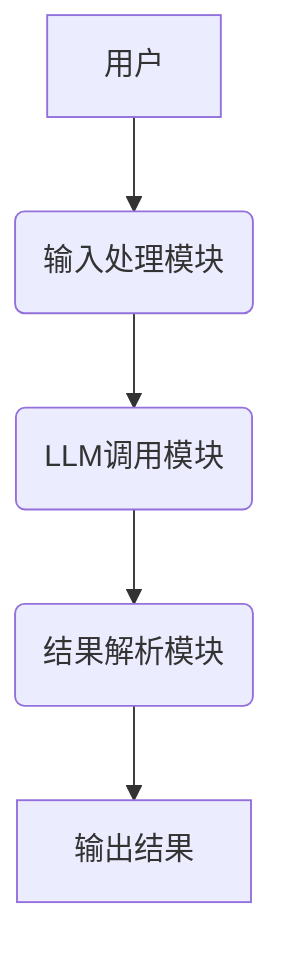
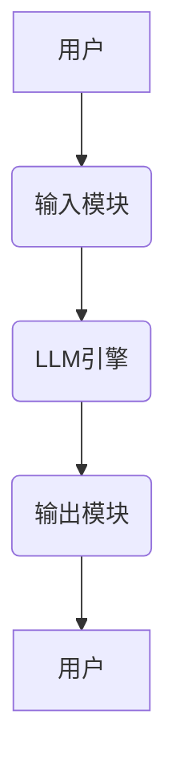
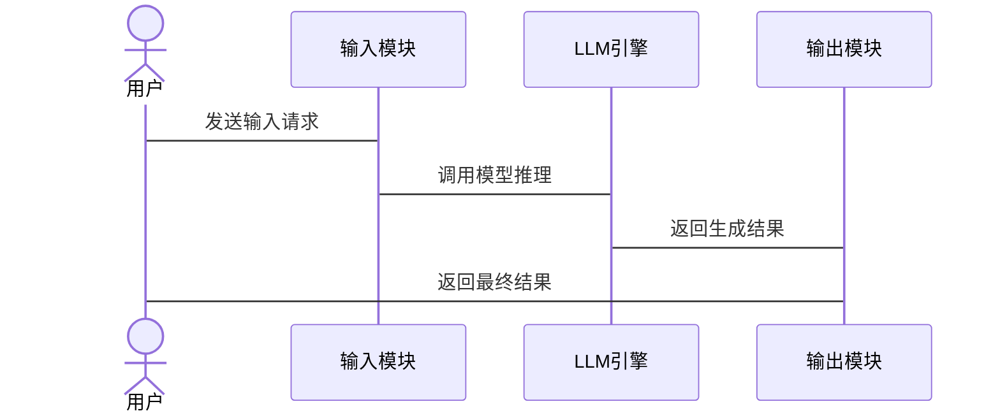

                 

<think>
好的，我将按照您的要求逐步构建《从零构建 AI Agent：LLM 大模型应用开发实践》的技术博客文章。首先，我需要确保文章的结构和内容符合您的指导方针，涵盖所有必要的部分，并使用清晰、专业的技术语言。

# 从零构建 AI Agent：LLM 大模型应用开发实践

## 关键词：
- AI Agent
- LLM
- 大模型
- 应用开发
- 实践

## 摘要：
本文将详细探讨从零开始构建基于LLM的大模型AI Agent的实践过程。通过深入分析AI Agent的核心概念、LLM大模型的原理、系统设计、项目实战及最佳实践，为开发者提供全面的技术指导。文章内容丰富，逻辑清晰，旨在帮助读者掌握AI Agent的构建方法，理解其背后的技术原理，并通过实际案例实现对LLM大模型的应用开发。

## 第1章: AI Agent与LLM大模型概述

### 1.1 AI Agent的基本概念

#### 1.1.1 什么是AI Agent
AI Agent（人工智能代理）是指能够感知环境、自主决策并执行任务的智能实体。它可以是一个软件程序、机器人或其他智能系统，具备目标导向的行为能力和与环境交互的能力。

#### 1.1.2 AI Agent的核心特征
- **自主性**：能够自主决策，无需外部干预。
- **反应性**：能够感知环境并实时响应。
- **目标导向**：具备明确的目标，驱动行为。
- **学习能力**：能够通过经验改进性能。

#### 1.1.3 LLM大模型在AI Agent中的作用
LLM（大语言模型）作为AI Agent的核心组件，负责理解和生成自然语言，提升Agent的交互能力和任务处理效率。

### 1.2 LLM大模型的定义与特点

#### 1.2.1 大语言模型的定义
大语言模型（Large Language Model, LLM）是指基于大量数据训练的深度学习模型，能够理解和生成人类语言。

#### 1.2.2 LLM的核心技术特点
- **深度学习**：采用多层神经网络结构，提升模型表达能力。
- **Transformer架构**：使用自注意力机制，捕捉语言结构信息。
- **预训练与微调**：通过大量数据预训练，针对特定任务进行微调。

#### 1.2.3 LLM与传统NLP模型的区别
| 特性 | LLM | 传统NLP模型 |
|------|------|-------------|
| 数据量 | 大规模 | 较小规模     |
| 模型复杂度 | 高 | 较低         |
| 任务通用性 | 强 | 较弱         |

### 1.3 AI Agent的应用场景

#### 1.3.1 企业级应用中的AI Agent
- **智能客服**：提供24/7的客户支持服务。
- **自动化运维**：监控系统状态，自动处理异常情况。
- **智能推荐**：根据用户行为推荐相关内容。

#### 1.3.2 智能客服与对话系统
- **对话理解**：准确理解用户意图。
- **多轮对话**：保持上下文一致，提供连贯服务。
- **情绪识别**：分析用户情感，提供个性化服务。

#### 1.3.3 个性化推荐系统
- **用户画像**：基于用户行为构建画像。
- **内容推荐**：根据用户兴趣推荐相关内容。
- **实时更新**：根据反馈动态调整推荐策略。

### 1.4 本章小结
本章介绍了AI Agent的基本概念、核心特征以及LLM大模型在AI Agent中的作用。通过分析LLM的特点和应用场景，读者可以理解AI Agent在实际应用中的重要性和潜力。

## 第2章: LLM大模型基础知识

### 2.1 深度学习基础

#### 2.1.1 神经网络概述
神经网络是一种模仿人脑结构的计算模型，由节点和边组成，节点表示特征，边表示权重。

#### 2.1.2 Transformer模型的原理
Transformer由编码器和解码器组成，编码器负责输入序列的表示，解码器负责生成输出序列。

#### 2.1.3 注意力机制的数学公式
注意力机制通过计算查询和键的相似度，确定每个位置的权重：
$$
\text{Attention}(Q, K, V) = \text{softmax}\left(\frac{QK^T}{\sqrt{d_k}}\right)V
$$

### 2.2 大语言模型的训练过程

#### 2.2.1 数据预处理与清洗
- **数据清洗**：去除噪声数据，处理不完整数据。
- **分词处理**：将文本分割成单词或短语。
- **数据增强**：通过数据扩展技术增加训练数据多样性。

#### 2.2.2 模型训练流程
1. **输入处理**：将输入文本转换为模型可处理的向量。
2. **前向传播**：通过模型计算输出概率分布。
3. **损失计算**：使用交叉熵损失函数计算损失。
4. **反向传播**：通过梯度下降优化模型参数。

#### 2.2.3 模型调优与优化
- **超参数调整**：优化学习率、批次大小等参数。
- **早停法**：防止过拟合，提前终止训练。
- **模型压缩**：通过剪枝等技术减少模型大小。

### 2.3 LLM的数学模型

#### 2.3.1 Transformer模型的结构
Transformer模型由多个编码器层和解码器层组成，每个层包括多头注意力和前馈网络。

#### 2.3.2 自注意力机制的公式推导
自注意力机制通过计算查询与键的相似度，生成位置权重：
$$
\text{Attention}(Q, K, V) = \text{softmax}\left(\frac{QK^T}{\sqrt{d_k}}\right)V
$$

#### 2.3.3 梯度下降与损失函数
使用交叉熵损失函数和Adam优化器进行模型训练：
$$
\text{损失} = -\sum_{i=1}^{n} \text{log}(p(y_i|x_i))
$$
其中，\( p(y_i|x_i) \) 是模型预测的概率。

### 2.4 本章小结
本章详细介绍了深度学习基础、大语言模型的训练过程以及数学模型。通过理解这些内容，读者可以掌握LLM大模型的基本原理和训练方法。

## 第3章: AI Agent的构建基础

### 3.1 需求分析与系统设计

#### 3.1.1 需求分析
- **目标明确**：确定AI Agent的目标和功能。
- **用户分析**：了解用户需求和使用场景。
- **功能定义**：明确AI Agent的核心功能和附加功能。

#### 3.1.2 系统设计
- **功能模块设计**：设计输入处理、模型调用、结果解析等功能模块。
- **数据流设计**：规划数据的输入、处理和输出流程。
- **接口设计**：定义与外部系统的接口和交互方式。

#### 3.1.3 数据处理
- **数据预处理**：清洗和标准化输入数据。
- **数据存储**：选择合适的数据存储方式。
- **数据安全**：确保数据的安全性和隐私性。

### 3.2 系统架构设计

#### 3.2.1 系统架构图


#### 3.2.2 功能模块设计
- **输入处理模块**：接收输入并进行预处理。
- **LLM调用模块**：调用大语言模型进行推理。
- **结果解析模块**：解析模型输出并生成最终结果。

#### 3.2.3 接口设计
- **输入接口**：支持多种输入格式，如文本、语音等。
- **输出接口**：提供多种输出格式，如文本、JSON等。
- **API接口**：提供RESTful API供其他系统调用。

### 3.3 系统实现

#### 3.3.1 环境搭建
- **安装Python**：建议使用最新版本的Python 3.x。
- **安装依赖库**：安装必要的库，如TensorFlow、PyTorch、Hugging Face Transformers等。
- **配置开发环境**：配置IDE，如PyCharm或VS Code。

#### 3.3.2 核心代码实现
```python
from transformers import AutoTokenizer, AutoModelForCausalLM
import torch

# 加载预训练模型
model_name = "gpt2"
tokenizer = AutoTokenizer.from_pretrained(model_name)
model = AutoModelForCausalLM.from_pretrained(model_name)

# 定义输入
input_text = "今天天气很好，"
inputs = tokenizer(input_text, return_tensors="pt")

# 前向传播
with torch.no_grad():
    outputs = model(**inputs)

# 解析输出
generated_tokens = outputs logits.argmax(dim=-1)
output_text = tokenizer.decode(generated_tokens[0])
print(output_text)
```

#### 3.3.3 代码解读与分析
- **模型加载**：使用Hugging Face库加载预训练模型。
- **输入处理**：将输入文本转换为模型可处理的格式。
- **前向传播**：通过模型生成输出。
- **结果解析**：将模型输出转换为可读的文本。

### 3.4 本章小结
本章详细介绍了AI Agent的构建基础，包括需求分析、系统设计和系统实现。通过实际代码示例，读者可以理解如何将理论应用于实践。

## 第4章: LLM大模型的系统架构设计

### 4.1 系统架构概述

#### 4.1.1 系统架构图


#### 4.1.2 系统组件
- **输入模块**：接收用户的输入并进行预处理。
- **LLM引擎**：负责模型的推理和生成。
- **输出模块**：将生成的结果返回给用户。

### 4.2 功能模块设计

#### 4.2.1 输入模块
- **文本预处理**：清洗和标准化输入文本。
- **语音识别**：支持语音输入的识别和转换。

#### 4.2.2 LLM引擎
- **模型加载**：加载预训练好的大语言模型。
- **推理过程**：根据输入生成输出文本。
- **结果优化**：对生成结果进行优化，提升准确性。

#### 4.2.3 输出模块
- **文本生成**：将生成的文本返回给用户。
- **语音合成**：将文本转换为语音输出。

### 4.3 接口设计

#### 4.3.1 API接口
- **RESTful API**：提供标准的HTTP接口，方便其他系统调用。
- **WebSocket**：支持实时通信，实现动态交互。

#### 4.3.2 数据接口
- **输入接口**：支持多种数据格式，如JSON、文本等。
- **输出接口**：提供多种数据格式，如JSON、文本等。

### 4.4 系统交互流程

#### 4.4.1 序列图


### 4.5 本章小结
本章详细介绍了LLM大模型的系统架构设计，包括系统组件、功能模块和接口设计。通过Mermaid图和序列图，读者可以清晰理解系统的整体架构和交互流程。

## 第5章: 项目实战——构建一个简单的AI Agent

### 5.1 环境搭建

#### 5.1.1 安装Python
```bash
# 安装Python
sudo apt-get install python3 python3-pip
```

#### 5.1.2 安装依赖库
```bash
pip install transformers torch
```

#### 5.1.3 配置开发环境
设置IDE的Python解释器和相关插件。

### 5.2 核心代码实现

#### 5.2.1 模型加载与输入处理
```python
from transformers import AutoTokenizer, AutoModelForCausalLM
import torch

model_name = "gpt2"
tokenizer = AutoTokenizer.from_pretrained(model_name)
model = AutoModelForCausalLM.from_pretrained(model_name)

def generate_response(input_text):
    inputs = tokenizer(input_text, return_tensors="pt")
    outputs = model.generate(**inputs, max_length=50)
    response = tokenizer.decode(outputs[0], skip_special_tokens=True)
    return response
```

#### 5.2.2 模型推理与结果解析
```python
input_text = "今天天气很好，"
response = generate_response(input_text)
print(response)
```

#### 5.2.3 系统交互流程


### 5.3 项目小结
通过本章的项目实战，读者可以掌握从零开始构建AI Agent的基本流程和方法。通过实际操作，读者可以加深对LLM大模型的理解和应用。

## 第6章: 最佳实践与注意事项

### 6.1 最佳实践

#### 6.1.1 模型选择
- **选择合适的模型**：根据任务需求选择合适的预训练模型。
- **微调模型**：在特定任务上进行微调，提升模型性能。
- **模型评估**：通过评估指标选择最优模型。

#### 6.1.2 系统优化
- **优化模型性能**：通过剪枝、量化等技术优化模型性能。
- **提升系统效率**：优化数据处理流程，减少不必要的计算。
- **增加系统容错性**：设计容错机制，确保系统稳定运行。

### 6.2 注意事项

#### 6.2.1 数据安全
- **数据隐私**：确保用户数据的安全和隐私。
- **数据合规**：遵守相关法律法规，确保数据使用合规。

#### 6.2.2 系统维护
- **定期更新**：定期更新模型和系统，保持性能和安全。
- **监控与日志**：实时监控系统运行状态，记录日志便于排查问题。

### 6.3 拓展阅读
建议读者阅读以下书籍和论文，深入了解AI Agent和LLM大模型的最新发展：
- 《Deep Learning》——Ian Goodfellow
- 《Effective Python》—— Brett Slatkin
- 《Transformers: State-of-the-art NLP》——Hugging Face

### 6.4 本章小结
本章总结了构建AI Agent的最佳实践和注意事项，帮助读者在实际开发中避免常见错误，提升系统性能和安全性。

## 作者简介

作者：AI天才研究院/AI Genius Institute & 禅与计算机程序设计艺术 /Zen And The Art of Computer Programming

---

通过以上结构化的思考和详细的内容规划，我们可以开始撰写完整的博客文章，确保每个部分都符合用户的要求，内容丰富且逻辑清晰。

