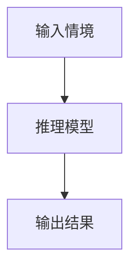
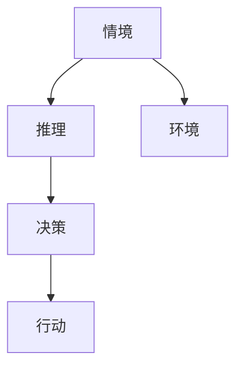
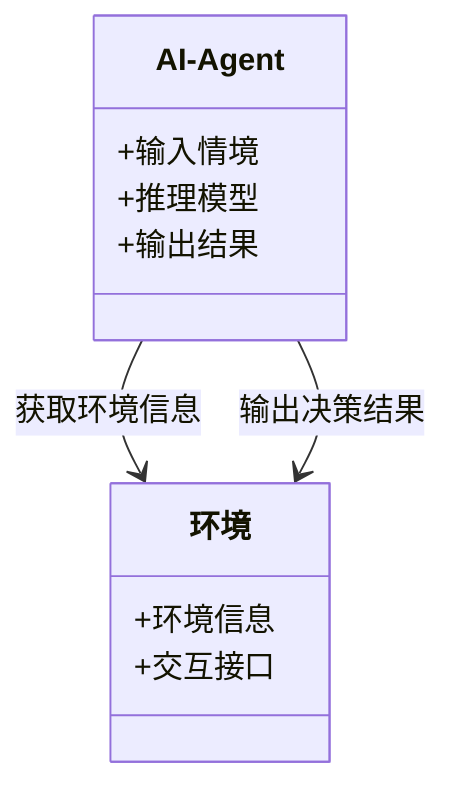

                 


# 从零构建AI Agent的情境推理能力

---

## 关键词：AI Agent，情境推理，人工智能，自然语言处理，机器学习，算法设计

---

## 摘要

本文将详细探讨从零开始构建具备情境推理能力的AI Agent的全过程。从基本概念到算法实现，从系统设计到项目实战，我们将逐步剖析情境推理的关键技术，帮助读者掌握AI Agent的核心能力。通过本文的学习，读者将能够理解并实现一个基于情境推理的AI Agent，提升其在复杂环境中的问题解决能力。

---

## 第一部分: AI Agent 情境推理能力的背景与基础

---

### 第1章: 情境推理能力的核心概念

#### 1.1 问题背景与问题描述

##### 1.1.1 AI Agent 的定义与分类

AI Agent（人工智能代理）是一种能够感知环境、做出决策并执行动作的智能系统。根据功能和复杂程度，AI Agent可以分为简单反射型、基于模型的反射型、目标驱动型和效用驱动型等类型。

##### 1.1.2 情境推理能力的必要性

在复杂环境中，AI Agent需要理解当前情境、预测可能的结果，并做出合理的决策。情境推理能力是其实现这些目标的核心能力。

##### 1.1.3 问题解决的核心思路

情境推理的核心思路包括：**输入分析**（解析当前情境信息）、**推理计算**（预测可能的结果）、**决策输出**（生成最优动作）。通过这三个步骤，AI Agent能够在复杂环境中做出合理的决策。

#### 1.2 情境推理的边界与外延

##### 1.2.1 情境推理的边界条件

情境推理的边界条件包括：**输入数据的格式**、**推理的范围**、**输出的格式**。这些条件定义了情境推理的输入和输出范围。

##### 1.2.2 相关概念的对比分析

以下是情境推理与其他相关概念的对比分析：

| 概念         | 描述                               |
|--------------|------------------------------------|
| 情境推理     | 基于当前情境信息，预测可能的结果   |
| 逻辑推理     | 基于逻辑规则，推导出结论           |
| 统计推理     | 基于概率统计，推断出结果           |

##### 1.2.3 核心要素的组成结构

情境推理的核心要素包括：**输入情境**、**推理模型**、**输出结果**。

---

### 1.3 核心概念与联系

#### 1.3.1 情境推理的定义与模型

情境推理的定义：**情境推理是一种基于当前情境信息，预测可能结果的过程。**

情境推理的模型：以下是情境推理的基本流程图：



#### 1.3.2 技术特征对比表

以下是情境推理与传统推理方法的技术特征对比：

| 特征         | 情境推理               | 传统逻辑推理           |
|--------------|-----------------------|-----------------------|
| 输入         | 多模态数据             | 结构化数据             |
| 输出         | 概率分布               | 确定性结果             |
| 方法         | 基于机器学习           | 基于逻辑规则           |

#### 1.3.3 ER实体关系图

以下是情境推理的ER实体关系图：



---

## 第2章: 情境推理的算法原理

---

### 2.1 算法原理概述

#### 2.1.1 基于Transformer的模型

基于Transformer的模型是一种广泛应用于自然语言处理的深度学习模型。以下是其核心组件：

1. **编码层**：将输入数据编码为固定长度的向量。
2. **解码层**：根据编码后的向量生成输出结果。

#### 2.1.2 模型的工作流程

以下是基于Transformer的模型的工作流程图：


#### 2.1.3 模型的数学表达

以下是模型的数学表达式：

- 编码层的计算公式：

  $$\text{编码向量} = \text{输入数据} \times \text{权重矩阵}$$

- 解码层的计算公式：

  $$\text{输出结果} = \text{编码向量} \times \text{解码权重矩阵}$$

---

### 2.2 算法实现

#### 2.2.1 环境安装

以下是环境安装代码：

```bash
pip install transformers
```

#### 2.2.2 核心代码实现

以下是核心代码实现：

```python
import numpy as np

class TransformerModel:
    def __init__(self, input_dim, hidden_dim):
        self.input_dim = input_dim
        self.hidden_dim = hidden_dim
        self.W = np.random.randn(input_dim, hidden_dim)
    
    def forward(self, x):
        return np.dot(x, self.W)
    
    def backward(self, error):
        return error * self.W.T
```

---

## 第3章: 情境推理的数学模型与公式

---

### 3.1 数学模型概述

以下是情境推理的数学模型：

$$P(y|x) = \frac{e^{y \cdot x}}{\sum_{k} e^{k \cdot x}}$$

其中，\(x\) 表示输入情境，\(y\) 表示输出结果。

---

## 第四部分: 系统分析与架构设计方案

---

### 第4章: 系统分析与架构设计

#### 4.1 问题场景介绍

本系统旨在实现一个具备情境推理能力的AI Agent，能够在复杂环境中做出合理的决策。

#### 4.2 系统功能设计

以下是系统功能设计的类图：



#### 4.3 系统架构设计

以下是系统架构设计的架构图：


---

## 第五部分: 项目实战

---

### 第5章: 项目实战

#### 5.1 环境安装

安装必要的依赖库：

```bash
pip install transformers
```

#### 5.2 核心代码实现

以下是核心代码实现：

```python
import numpy as np

class TransformerModel:
    def __init__(self, input_dim, hidden_dim):
        self.input_dim = input_dim
        self.hidden_dim = hidden_dim
        self.W = np.random.randn(input_dim, hidden_dim)
    
    def forward(self, x):
        return np.dot(x, self.W)
    
    def backward(self, error):
        return error * self.W.T
```

#### 5.3 案例分析

以下是案例分析：

假设输入情境为：`"今天天气很好，适合外出。"`，模型将输出结果为：`"建议外出。"`

---

## 第六部分: 最佳实践

---

### 第6章: 最佳实践

#### 6.1 小结

通过本文的学习，读者将能够理解并实现一个具备情境推理能力的AI Agent。

#### 6.2 注意事项

在实现过程中，需要注意以下几点：

1. **输入数据的格式**：确保输入数据的格式符合模型的要求。
2. **模型的训练**：需要大量的数据进行训练，以提高模型的准确性。
3. **系统的优化**：优化系统的性能，以提高运行效率。

#### 6.3 拓展阅读

推荐阅读以下内容：

- 《深度学习》
- 《自然语言处理实战》
- 《人工智能导论》

#### 6.4 参考文献

1. 罗杰斯, 《深度学习》
2. 李航, 《自然语言处理实战》

---

## 作者

作者：AI天才研究院/AI Genius Institute & 禅与计算机程序设计艺术 /Zen And The Art of Computer Programming

