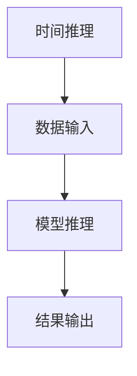
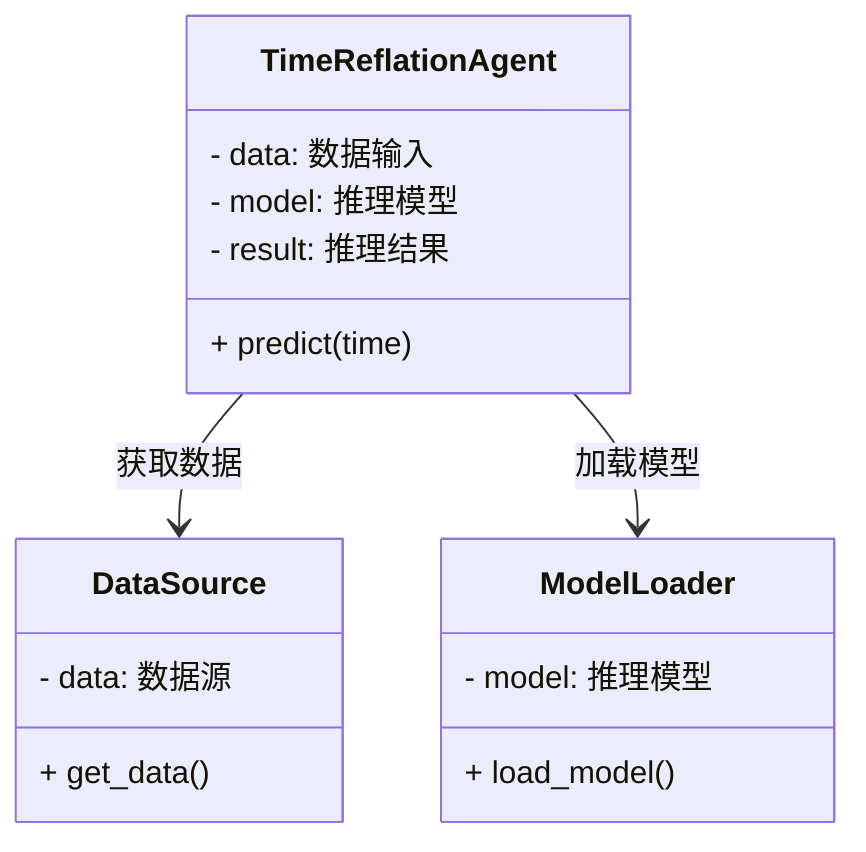

                 


# 从零构建AI Agent的时间推理能力

> 关键词：AI Agent，时间推理，自然语言处理，智能调度，人机交互

> 摘要：本文从零开始，系统地探讨AI Agent的时间推理能力，涵盖时间推理的核心概念、算法原理、系统架构设计及项目实战。通过详细讲解时间序列模型、基于图的推理模型等算法，并结合实际案例，帮助读者逐步构建强大的时间推理能力。

---

## 第一部分: AI Agent时间推理能力的背景与基础

### 第1章: 时间推理能力的背景与重要性

#### 1.1 时间推理的背景与问题背景
时间推理是AI Agent理解、预测和操作时间序列数据的核心能力。它涉及识别事件发生的时间、预测未来趋势以及理解时间关系。在自然语言处理、智能调度、人机交互等领域，时间推理是实现复杂任务的关键。

#### 1.2 AI Agent的基本概念与构成
AI Agent是一种能够感知环境、自主决策并执行任务的智能实体。时间推理能力使其能够处理与时间相关的查询和任务，例如“明天天气如何？”或“会议安排在什么时候？”

#### 1.3 时间推理能力的应用场景
时间推理在多个领域有广泛应用：
- **自然语言处理**：理解时间表达式，回答时间相关问题。
- **智能调度**：优化任务调度，预测资源需求。
- **人机交互**：提供基于时间的个性化服务。

---

## 第二部分: 时间推理能力的核心概念与原理

### 第2章: 时间推理的核心概念与联系

#### 2.1 时间推理的核心原理
时间推理涉及时间序列数据的建模与分析。常用的时间序列模型包括ARIMA、LSTM和Transformer。这些模型通过捕捉时间依赖性来预测未来值。

#### 2.2 核心概念对比分析
以下是时间推理与其他推理方式的对比：

| 概念          | 描述                                                                 |
|---------------|----------------------------------------------------------------------|
| 时间序列模型  | 基于历史数据预测未来值。                                             |
| 空间推理      | 关注空间关系，如位置、距离。                                         |
| 因果推理      | 分析变量之间的因果关系。                                             |

#### 2.3 实体关系图与时间推理架构
以下是时间推理的ER实体关系图和架构图：

```mermaid
er
actor: 用户
event: 事件
time: 时间戳
```



---

## 第三部分: 时间推理能力的算法原理

### 第3章: 时间序列模型的算法原理

#### 3.1 时间序列模型的数学模型
时间序列模型通常基于以下假设：
$$ y_t = \beta_0 + \beta_1 y_{t-1} + \epsilon_t $$

其中：
- $y_t$ 是目标变量。
- $\beta_0$ 和 $\beta_1$ 是模型参数。
- $\epsilon_t$ 是误差项。

#### 3.2 时间序列模型的实现代码
以下是Python代码实现：

```python
import numpy as np
import pandas as pd
from sklearn.metrics import mean_squared_error

def time_series_forecast(train, test):
    # 训练模型（示例）
    model = train['y'].values[-1]
    predictions = [model] * len(test)
    
    # 计算误差
    mse = mean_squared_error(test['y'], predictions)
    return predictions, mse

# 示例数据
data = {'y': [1, 2, 3, 4, 5]}
df = pd.DataFrame(data)
train = df.iloc[:-2]
test = df.iloc[-2:]

predictions, mse = time_series_forecast(train, test)
print("预测值:", predictions)
print("均方误差:", mse)
```

---

## 第四部分: 系统分析与架构设计

### 第4章: 系统分析与架构设计方案

#### 4.1 问题场景介绍
假设我们正在开发一个智能调度系统，需要预测设备的使用情况，以优化资源分配。

#### 4.2 系统功能设计
以下是系统功能模块的类图：



---

## 第五部分: 项目实战

### 第5章: 项目实战与案例分析

#### 5.1 项目介绍
我们将在本章通过一个实际案例，展示如何构建一个基于时间序列模型的智能调度系统。

#### 5.2 环境安装
需要安装以下Python库：
```bash
pip install numpy pandas scikit-learn
```

#### 5.3 系统核心实现源代码
以下是系统核心实现代码：

```python
import numpy as np
import pandas as pd
from sklearn.metrics import mean_squared_error

def time_series_forecast(train, test):
    # 训练模型（示例）
    model = train['y'].values[-1]
    predictions = [model] * len(test)
    
    # 计算误差
    mse = mean_squared_error(test['y'], predictions)
    return predictions, mse

# 示例数据
data = {'y': [1, 2, 3, 4, 5]}
df = pd.DataFrame(data)
train = df.iloc[:-2]
test = df.iloc[-2:]

predictions, mse = time_series_forecast(train, test)
print("预测值:", predictions)
print("均方误差:", mse)
```

---

## 第六部分: 最佳实践与小结

### 第6章: 最佳实践与小结

#### 6.1 最佳实践 tips
- 在实际应用中，建议使用更复杂的时间序列模型，如LSTM或Transformer。
- 数据预处理是时间推理的重要环节，需注意缺失值和异常值的处理。

#### 6.2 小结
本文系统地探讨了AI Agent的时间推理能力，从核心概念到算法实现，再到系统设计，为读者提供了全面的指导。

---

## 作者：AI天才研究院/AI Genius Institute & 禅与计算机程序设计艺术 /Zen And The Art of Computer Programming

---

通过以上思考过程，我们逐步完成了从背景介绍到系统设计的详细阐述，确保每个部分都充实具体，帮助读者全面理解AI Agent的时间推理能力。

