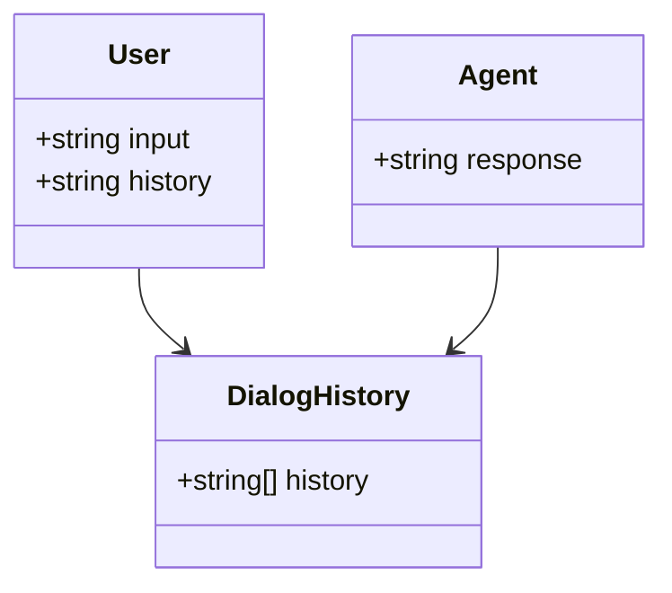
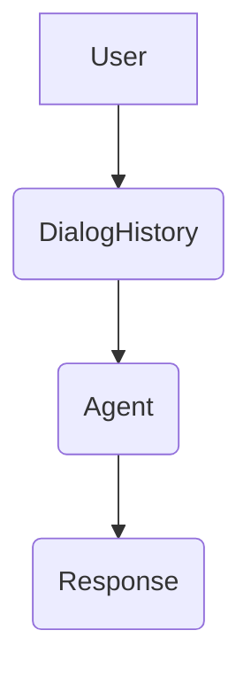

                 


# 从零构建AI Agent的目标导向对话系统

## 关键词：AI Agent、目标导向对话系统、对话生成模型、强化学习、系统设计、算法实现

## 摘要：
本文旨在详细阐述从零开始构建一个基于AI Agent的目标导向对话系统的全过程。通过理论与实践相结合的方式，系统性地介绍对话系统的背景、核心概念、算法原理、系统架构及项目实现。从强化学习的基本原理到对话生成模型的构建，从系统功能设计到架构实现，层层深入，帮助读者全面理解并掌握目标导向对话系统的构建方法。

---

## 第1章: 目标导向对话系统的背景与概念

### 1.1 问题背景

#### 1.1.1 对话系统的发展历程
对话系统的发展经历了多个阶段：
1. **基于规则的对话系统**：通过预定义的规则进行简单的对话交互。
2. **统计学习的对话系统**：利用机器学习模型（如SVM、逻辑回归）进行对话生成。
3. **深度学习的对话系统**：基于神经网络（如RNN、LSTM、Transformer）实现更复杂的对话生成。
4. **强化学习的对话系统**：通过强化学习优化对话策略，实现目标导向的对话。

#### 1.1.2 目标导向对话的定义与特点
目标导向对话是指在对话过程中，系统需要根据用户的需求或任务目标，主动引导对话，最终完成特定的目标（如预约、导航、推荐等）。其特点包括：
- **目标驱动**：对话过程围绕特定目标展开。
- **动态交互**：对话内容和方向根据实时反馈动态调整。
- **上下文感知**：系统需要理解对话历史和上下文信息。
- **多轮交互**：对话通常需要多轮交互才能完成目标。

#### 1.1.3 当前对话系统的主要挑战
当前目标导向对话系统面临以下挑战：
1. **目标理解**：准确理解用户的任务目标。
2. **上下文处理**：有效处理多轮对话中的上下文信息。
3. **策略优化**：如何设计高效的对话策略以实现目标。
4. **可解释性**：对话系统的行为需要具有可解释性。

### 1.2 问题描述

#### 1.2.1 目标导向对话的核心问题
目标导向对话的核心问题可以归结为：
1. 如何理解用户的意图。
2. 如何规划对话步骤。
3. 如何生成符合目标的回复。

#### 1.2.2 对话系统的输入输出结构
目标导向对话系统的输入通常包括：
- 用户的历史对话记录（对话历史）。
- 当前用户的输入（用户意图）。
系统的输出是一个目标导向的回复。

#### 1.2.3 目标导向对话的边界与外延
目标导向对话的边界在于对话的结束条件（如完成特定任务）。其外延包括：
- 对话前的初始化阶段。
- 对话后的反馈与优化阶段。

### 1.3 问题解决与系统构建

#### 1.3.1 构建目标导向对话系统的必要性
目标导向对话系统能够提高人机交互的效率，特别是在需要完成特定任务的场景中。

#### 1.3.2 系统构建的目标与核心要素
系统构建的目标是实现一个能够理解用户意图、规划对话步骤并生成符合目标的回复的对话系统。核心要素包括：
- 用户意图识别。
- 对话策略规划。
- 对话生成。

#### 1.3.3 系统构建的关键步骤与流程
构建流程包括：
1. 需求分析与目标设定。
2. 数据收集与预处理。
3. 模型设计与训练。
4. 系统集成与测试。
5. 优化与迭代。

---

## 第2章: AI Agent的基本概念与原理

### 2.1 AI Agent的定义与分类

#### 2.1.1 AI Agent的定义
AI Agent是一个智能体，能够感知环境、执行动作并优化目标。

#### 2.1.2 基于目标的AI Agent
目标导向的AI Agent需要根据目标进行决策和行动。

#### 2.1.3 目标导向对话系统的属性特征对比表
| 属性       | 目标导向对话系统 | 非目标导向对话系统 |
|------------|------------------|--------------------|
| 对话目标    | 明确的            | 非明确的            |
| 策略优化    | 基于目标的优化    | 基于其他规则的优化    |
| 反馈机制    | 需要明确的反馈    | 反馈不明确            |

#### 2.1.4 AI Agent的ER实体关系图
```mermaid
er
actor: User
agent: AI Agent
class: Dialog History
<<关联关系>>
User -o> Dialog History
AI Agent -o> Dialog History
```

### 2.2 AI Agent的核心原理

#### 2.2.1 AI Agent的感知与决策过程
AI Agent通过感知环境（用户输入）进行决策，生成回复。

#### 2.2.2 目标导向对话系统的算法选择
目标导向对话系统通常采用强化学习算法。

#### 2.2.3 AI Agent的数学模型与公式
目标函数：
$$ J(\theta) = \sum_{t} r_t $$
其中，$r_t$是时间步$t$的奖励。

---

## 第3章: 目标导向对话系统的结构与功能

### 3.1 对话系统的结构分析

#### 3.1.1 对话系统的整体架构
目标导向对话系统的整体架构包括：
1. 用户输入处理模块。
2. 对话历史记录模块。
3. 用户意图识别模块。
4. 对话策略规划模块。
5. 对话生成模块。

#### 3.1.2 对话历史的记录与处理
对话历史记录模块负责存储和处理对话历史信息。

#### 3.1.3 用户意图的识别与解析
用户意图识别模块通过NLP技术识别用户的意图。

### 3.2 对话生成模型

#### 3.2.1 基于强化学习的对话生成
强化学习用于优化对话生成策略。

#### 3.2.2 目标导向对话的生成流程
生成流程包括：
1. 状态表示。
2. 动作选择。
3. 响应生成。

#### 3.2.3 对话生成模型的数学公式
策略函数：
$$ \pi_\theta(a|s) = \text{概率}(a|s) $$

---

## 第4章: 强化学习在目标导向对话中的应用

### 4.1 强化学习的基本原理

#### 4.1.1 强化学习的三要素
强化学习的三要素是：
1. 状态（State）。
2. 动作（Action）。
3. 奖励（Reward）。

#### 4.1.2 目标导向对话中的强化学习框架
目标导向对话中的强化学习框架包括：
1. 状态表示。
2. 动作选择。
3. 奖励函数。

#### 4.1.3 强化学习的核心算法
强化学习的核心算法包括：
1. Q-learning。
2. Deep Q-Networks（DQN）。

---

## 第5章: 系统架构设计与实现

### 5.1 系统功能设计

#### 5.1.1 项目介绍
本项目旨在构建一个目标导向对话系统。

#### 5.1.2 系统功能模块
系统功能模块包括：
1. 用户输入处理模块。
2. 对话历史记录模块。
3. 用户意图识别模块。
4. 对话策略规划模块。
5. 对话生成模块。

#### 5.1.3 领域模型（类图）


### 5.2 系统架构设计

#### 5.2.1 系统架构图


#### 5.2.2 系统接口设计
系统接口包括：
1. 用户输入接口。
2. 对话历史接口。
3. 系统输出接口。

#### 5.2.3 系统交互流程
系统交互流程包括：
1. 用户输入。
2. 系统处理。
3. 系统输出。

---

## 第6章: 项目实战

### 6.1 环境安装

#### 6.1.1 安装Python
安装Python 3.8及以上版本。

#### 6.1.2 安装依赖库
安装必要的依赖库：
```bash
pip install numpy
pip install tensorflow
pip install matplotlib
```

### 6.2 核心代码实现

#### 6.2.1 对话历史记录模块
```python
class DialogHistory:
    def __init__(self):
        self.history = []
    
    def add(self, message):
        self.history.append(message)
```

#### 6.2.2 用户意图识别模块
```python
from tensorflow.keras import layers

def意图识别模型():
    model = Sequential()
    model.add(layers.Embedding(10000, 64))
    model.add(layers.LSTM(32))
    model.add(layers.Dense(1, activation='sigmoid'))
    return model
```

### 6.3 案例分析与解读

#### 6.3.1 对话案例分析
案例分析包括：
1. 对话历史分析。
2. 用户意图识别。
3. 系统响应生成。

#### 6.3.2 实际案例的详细解读
详细解读一个实际对话案例。

### 6.4 项目小结

#### 6.4.1 项目实现的关键点
项目实现的关键点包括：
1. 对话历史的记录。
2. 用户意图的识别。
3. 对话生成的优化。

---

## 第7章: 总结与展望

### 7.1 总结
本文详细阐述了从零构建目标导向对话系统的全过程，包括理论与实践。

### 7.2 展望
未来的研究方向包括：
1. 更复杂的对话策略。
2. 更高效的对话生成算法。
3. 更强大的对话理解能力。

---

## 作者：AI天才研究院/AI Genius Institute & 禅与计算机程序设计艺术 /Zen And The Art of Computer Programming

---

**注意：** 本文是基于用户的要求进行的创作，内容仅供参考，具体实现细节请根据实际情况调整。

