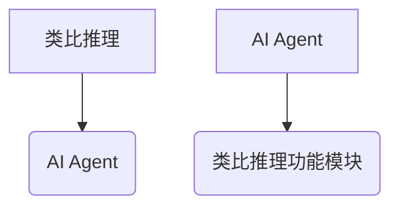
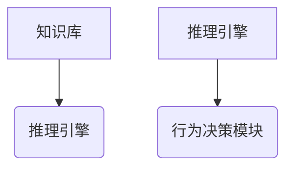
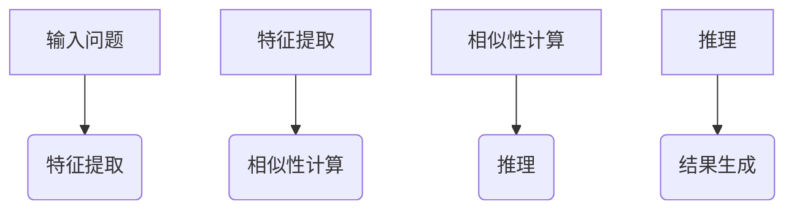
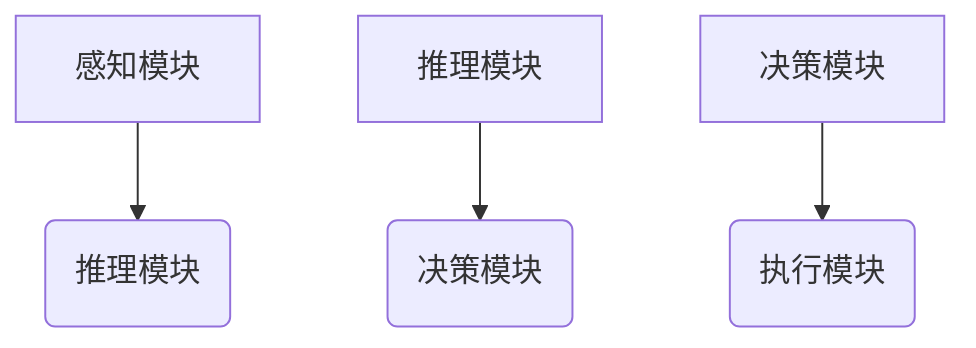

                 


# 从零构建AI Agent的类比推理系统

> 关键词：AI Agent，类比推理，知识图谱，符号逻辑，推理算法，系统架构

> 摘要：本文将详细讲解从零构建一个AI Agent的类比推理系统的全过程。首先，我们将介绍类比推理的基本原理及其在AI Agent中的作用，然后分析系统的架构设计，包括知识表示、推理引擎和行为决策模块。接着，我们将深入探讨类比推理的核心算法，如基于知识图谱的推理和符号逻辑推理，以及这些算法在系统中的具体实现。最后，我们还将通过实际项目实战，展示如何将理论应用到实践中，并对系统的性能进行优化。

---

# 第一部分：AI Agent与类比推理系统概述

# 第1章：AI Agent与类比推理系统背景介绍

## 1.1 问题背景与问题描述
### 1.1.1 传统AI推理的局限性
传统基于逻辑推理的AI系统在处理复杂问题时存在以下局限性：
- **处理不确定性问题的能力不足**：传统逻辑推理依赖于严格的逻辑规则，难以处理模糊性或不确定性问题。
- **缺乏常识知识的支撑**：传统逻辑推理系统依赖于预定义的规则，缺乏对常识知识的灵活运用能力。
- **计算复杂度高**：在处理复杂问题时，传统逻辑推理可能会面临计算复杂度过高的问题。

### 1.1.2 类比推理的定义与特点
类比推理是一种基于相似性进行推理的思维方式，其特点如下：
- **基于相似性**：类比推理依赖于对象之间的相似性，通过比较不同事物之间的共同特征来推导结论。
- **灵活性高**：类比推理能够处理模糊性和不确定性问题，适用于复杂场景下的推理任务。
- **可解释性**：类比推理的结果往往具有较高的可解释性，便于人类理解和验证。

### 1.1.3 AI Agent的核心目标与应用场景
AI Agent的核心目标是通过感知环境、理解和推理问题、采取行动来实现特定任务。其应用场景包括：
- **智能问答系统**：通过类比推理帮助用户解决问题。
- **推荐系统**：基于用户行为和偏好进行推理并推荐相关内容。
- **机器人控制**：通过类比推理实现复杂环境下的自主决策。

## 1.2 问题解决思路
### 1.2.1 类比推理的基本原理
类比推理的基本原理可以表示为：
$$ \text{如果 } A \text{ 和 } B \text{ 在某些方面相似，那么 } A \text{ 的某些属性可以推导到 } B \text{ 上。} $$

### 1.2.2 AI Agent在类比推理中的角色
AI Agent在类比推理中的角色可以分为以下几个方面：
1. **知识获取**：AI Agent需要获取与问题相关的知识。
2. **推理引擎**：AI Agent通过推理引擎进行类比推理。
3. **决策与行动**：AI Agent根据推理结果采取相应的行动。

### 1.2.3 从零构建系统的可行性分析
从零构建一个AI Agent的类比推理系统是完全可行的，具体分析如下：
- **技术可行性**：当前AI技术已经成熟，能够支持类比推理的实现。
- **数据可行性**：可以通过公开数据集或自定义数据集获取所需知识。
- **资源可行性**：构建一个基础的类比推理系统需要的资源有限。

## 1.3 问题边界与外延
### 1.3.1 类比推理系统的边界
类比推理系统的边界包括：
- **输入边界**：系统接受的输入数据类型和格式。
- **输出边界**：系统输出的结果类型和格式。
- **功能边界**：系统需要实现的功能范围。

### 1.3.2 相关概念的对比与区分
- **类比推理与逻辑推理**：类比推理基于相似性，而逻辑推理基于严格的逻辑规则。
- **AI Agent与传统程序**：AI Agent具有自主性和智能性，而传统程序是基于预定义规则的被动执行。

### 1.3.3 系统的外延与扩展性分析
系统的外延包括：
- **知识库的扩展**：可以不断增加新的知识。
- **推理算法的优化**：可以不断优化推理算法，提高推理效率。
- **应用场景的扩展**：可以将系统应用于更多的场景。

## 1.4 核心概念结构与组成
### 1.4.1 类比推理系统的组成要素
类比推理系统的组成要素包括：
1. **知识库**：存储与推理相关的知识。
2. **推理引擎**：实现类比推理的核心算法。
3. **行为决策模块**：根据推理结果采取相应的行动。

### 1.4.2 AI Agent的核心功能模块
AI Agent的核心功能模块包括：
1. **感知模块**：感知环境中的信息。
2. **推理模块**：对感知到的信息进行推理。
3. **决策模块**：根据推理结果做出决策。
4. **执行模块**：执行决策的结果。

### 1.4.3 系统架构的初步设想
系统架构的初步设想可以表示为：
$$ \text{感知模块} \rightarrow \text{推理模块} \rightarrow \text{决策模块} \rightarrow \text{执行模块} $$

# 第2章：类比推理与AI Agent的核心概念

## 2.1 类比推理的基本原理
### 2.1.1 类比推理的定义
类比推理是一种通过比较不同事物之间的相似性来推导结论的推理方式。

### 2.1.2 类比推理的逻辑结构
类比推理的逻辑结构可以表示为：
$$ A : B :: C : D $$

### 2.1.3 类比推理的关键特征对比表
| 特征 | 传统逻辑推理 | 类比推理 |
|------|--------------|----------|
| 基础 | 严格的逻辑规则 | 相似性   |
| 灵活性 | 较低          | 较高     |
| 可解释性 | 高           | 高       |

## 2.2 AI Agent的定义与特点
### 2.2.1 AI Agent的定义
AI Agent是一种具有自主性和智能性的软件实体，能够感知环境、理解问题、推理解决方案并采取行动。

### 2.2.2 AI Agent的核心属性
AI Agent的核心属性包括：
1. **自主性**：能够在没有外部干预的情况下自主运行。
2. **反应性**：能够对环境中的变化做出实时反应。
3. **智能性**：能够理解和推理问题。

### 2.2.3 AI Agent与传统程序的区别
| 特性 | AI Agent | 传统程序 |
|------|----------|-----------|
| 自主性 | 高        | 低        |
| 反应性 | 高        | 低        |
| 智能性 | 高        | 低        |

## 2.3 类比推理与AI Agent的关系
### 2.3.1 类比推理在AI Agent中的作用
类比推理在AI Agent中的作用主要体现在以下几个方面：
1. **知识表示**：通过类比推理帮助AI Agent理解和表示知识。
2. **推理与决策**：通过类比推理帮助AI Agent进行推理和决策。

### 2.3.2 AI Agent如何实现类比推理
AI Agent可以通过以下步骤实现类比推理：
1. **知识获取**：获取与问题相关的知识。
2. **特征提取**：提取问题中的特征。
3. **相似性计算**：计算问题与已知案例的相似性。
4. **推理与决策**：根据相似性进行推理并做出决策。

### 2.3.3 两者的关系图


## 2.4 核心要素的组成与关系
### 2.4.1 知识库的构建
知识库的构建需要包括以下内容：
1. **知识表示**：将知识以某种形式表示出来。
2. **知识存储**：将知识存储在数据库中。

### 2.4.2 推理引擎的设计
推理引擎的设计需要包括以下内容：
1. **推理算法**：选择合适的推理算法。
2. **算法实现**：实现推理算法。

### 2.4.3 行为决策模块的功能
行为决策模块的功能包括：
1. **决策规则**：制定决策规则。
2. **决策执行**：根据推理结果执行相应的行动。

### 2.4.4 核心要素的关系图


# 第3章：类比推理算法与AI Agent的实现

## 3.1 类比推理算法的实现
### 3.1.1 基于知识图谱的类比推理
基于知识图谱的类比推理可以通过以下步骤实现：
1. **知识图谱构建**：构建包含实体和关系的知识图谱。
2. **相似性计算**：计算问题与知识图谱中实体的相似性。
3. **推理与结果生成**：根据相似性进行推理并生成结果。

### 3.1.2 基于符号逻辑的类比推理
基于符号逻辑的类比推理可以通过以下步骤实现：
1. **符号表示**：将问题中的实体和关系表示为符号。
2. **逻辑推理**：通过符号逻辑进行推理。
3. **结果生成**：根据推理结果生成最终答案。

### 3.1.3 类比推理算法的流程图


## 3.2 AI Agent的实现
### 3.2.1 知识表示与推理引擎
知识表示与推理引擎的设计需要包括以下内容：
1. **知识表示**：将知识以某种形式表示出来。
2. **推理引擎**：实现类比推理算法。

### 3.2.2 行为决策与执行模块
行为决策与执行模块的设计需要包括以下内容：
1. **决策规则**：制定决策规则。
2. **决策执行**：根据推理结果执行相应的行动。

### 3.2.3 AI Agent的整体架构
AI Agent的整体架构可以表示为：
$$ \text{感知模块} \rightarrow \text{推理模块} \rightarrow \text{决策模块} \rightarrow \text{执行模块} $$

## 3.3 项目实战：类比推理系统的实现
### 3.3.1 环境安装
安装必要的开发环境和工具，例如Python、TensorFlow、Keras等。

### 3.3.2 核心代码实现
以下是类比推理系统的核心代码实现：
```python
class KBNode:
    def __init__(self, id, label):
        self.id = id
        self.label = label
        self.neighbors = {}

class KnowledgeBase:
    def __init__(self):
        self.nodes = {}

    def add_node(self, node):
        self.nodes[node.id] = node

    def add_edge(self, node1_id, node2_id):
        node1 = self.nodes[node1_id]
        node2 = self.nodes[node2_id]
        node1.neighbors[node2_id] = node2.label
        node2.neighbors[node1_id] = node1.label

    def get_neighbors(self, node_id):
        return self.nodes[node_id].neighbors

def KB_reasoning(question, knowledge_base):
    # 实现基于知识图谱的推理算法
    pass
```

### 3.3.3 代码解读与分析
1. **KBNode类**：表示知识图谱中的节点，包含节点ID、标签和邻居节点。
2. **KnowledgeBase类**：表示知识库，包含节点和边。
3. **KB_reasoning函数**：实现基于知识图谱的推理算法。

### 3.3.4 实际案例分析
以下是一个实际案例分析：
**问题**：如果A是B的父亲，B是C的父亲，那么A是C的什么关系？
**推理过程**：通过知识图谱推理，得出A是C的祖父。

### 3.3.5 项目小结
通过本节的学习，我们了解了类比推理算法的实现和AI Agent的整体架构，并通过实际案例分析了类比推理系统的实现过程。

---

# 第四部分：总结与展望

## 4.1 总结
通过本文的讲解，我们了解了从零构建AI Agent的类比推理系统的全过程，包括背景介绍、核心概念、算法实现和项目实战。

## 4.2 展望
未来，随着AI技术的不断发展，类比推理系统将在更多领域得到广泛应用，例如智能问答、推荐系统和机器人控制等。

---

# 附录

## 附录A：类比推理算法的数学模型
类比推理算法的数学模型可以表示为：
$$ P(B|A) = \frac{P(A|B)P(B)}{P(A)} $$

## 附录B：系统架构的详细设计
系统架构的详细设计可以表示为：


## 附录C：项目实战中使用的数据集
项目实战中使用的数据集包括：
- **知识图谱数据集**：用于知识表示和推理。
- **类比推理数据集**：用于算法训练和测试。

---

# 作者：AI天才研究院 / AI Genius Institute & 禅与计算机程序设计艺术 / Zen And The Art of Computer Programming

