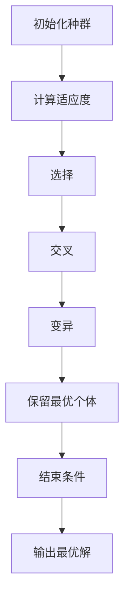
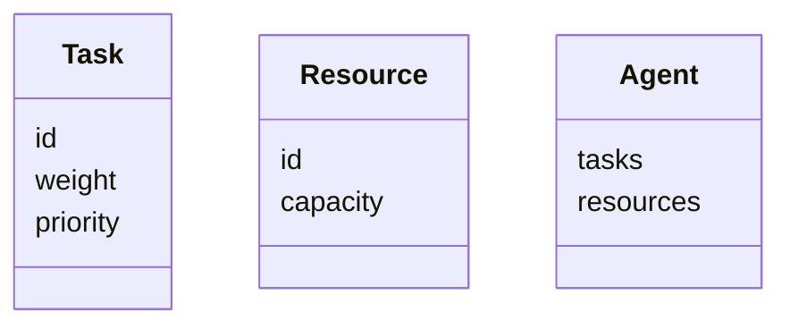
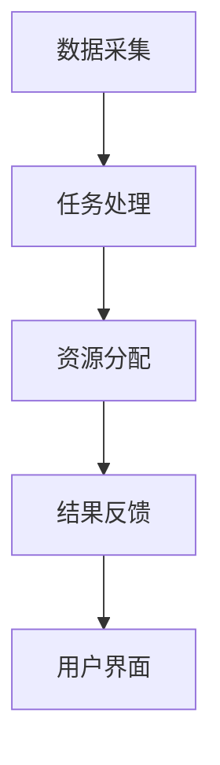
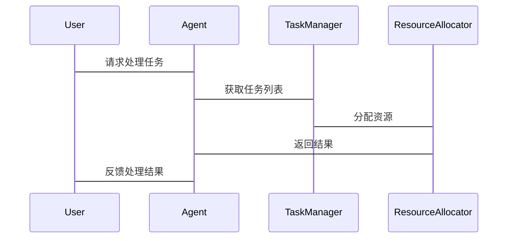

                 


# 《从零构建AI Agent的认知负荷管理系统》

---

## 关键词：
认知负荷管理, AI Agent, 人工智能, 任务调度, 资源优化, 系统架构, 算法实现

---

## 摘要：
本文将详细介绍如何从零开始构建一个基于AI Agent的认知负荷管理系统。认知负荷管理是优化决策过程和提高效率的关键技术，而AI Agent通过自动化和智能化的方式，能够有效降低认知负荷。本文从背景知识、核心概念、算法原理、系统架构到项目实战，逐步引导读者构建一个高效的认知负荷管理系统。通过详细的技术分析和实际案例，我们将帮助读者理解如何在实际项目中应用这些技术。

---

## 目录：

1. [背景与基础](#背景与基础)
   1.1 认知负荷管理的基本概念
   1.2 AI Agent的基本概念
   1.3 认知负荷管理与AI Agent的结合

2. [核心概念与联系](#核心概念与联系)
   2.1 认知负荷管理的核心原理
   2.2 AI Agent在认知负荷管理中的角色
   2.3 实体关系图：认知负荷管理与AI Agent的关系

3. [算法原理讲解](#算法原理讲解)
   3.1 优先级排序算法
   3.2 资源分配优化算法
   3.3 基于遗传算法的任务调度

4. [系统架构与设计](#系统架构与设计)
   4.1 系统功能设计
   4.2 系统架构图
   4.3 接口设计与交互序列图

5. [项目实战](#项目实战)
   5.1 环境搭建与代码实现
   5.2 核心功能实现与案例分析
   5.3 项目总结与优化建议

6. [最佳实践与小结](#最佳实践与小结)
   6.1 实践中的注意事项
   6.2 项目小结与展望

---

## 1. 背景与基础

### 1.1 认知负荷管理的基本概念

认知负荷是指在处理信息或任务时，个体或系统所承受的心理或计算负担。它包括内部认知负荷（记忆和理解任务）和外部认知负荷（处理输入和输出）。有效的认知负荷管理能够提高决策效率，减少错误率。

**核心要素：**
- **任务优先级**：任务的重要性和紧急程度。
- **资源分配**：计算资源、数据资源等的合理分配。
- **性能评估**：系统效率和用户满意度的量化指标。

### 1.2 AI Agent的基本概念

AI Agent（智能体）是能够感知环境并采取行动以实现目标的实体。它可以分为简单反射型、基于模型的反应型、目标驱动型和效用驱动型四种类型。AI Agent的核心功能包括感知、推理、规划和执行。

**AI Agent的特点：**
- **自主性**：无需外部干预，自主决策。
- **反应性**：能够实时感知环境变化并调整行为。
- **学习性**：通过数据和经验不断优化性能。

### 1.3 认知负荷管理与AI Agent的结合

认知负荷管理通过优化任务优先级和资源分配，帮助AI Agent更高效地完成目标。AI Agent的自动化和智能化能力使得认知负荷管理更加动态和精准。

---

## 2. 核心概念与联系

### 2.1 认知负荷管理的核心原理

认知负荷管理通过优先级排序和资源分配优化算法，将高优先级任务优先处理，确保系统在资源有限的情况下，最大化整体效率。

**优先级排序算法：**
- 基于任务的重要性和紧急程度，使用加权平均法确定优先级。

**资源分配优化算法：**
- 使用线性规划模型，将任务分配到最适合的资源上。

### 2.2 实体关系图：认知负荷管理与AI Agent的关系


---

## 3. 算法原理讲解

### 3.1 优先级排序算法

优先级排序算法通过评估任务的权重，确定处理顺序。

**算法步骤：**
1. 收集任务信息，包括权重、截止时间。
2. 计算每个任务的优先级得分。
3. 按优先级从高到低排序。

**代码实现：**
```python
def calculate_priority(tasks):
    for task in tasks:
        priority = task.weight + task.deadline
        task.priority = priority
    return sorted(tasks, key=lambda x: -x.priority)
```

### 3.2 资源分配优化算法

资源分配优化算法通过数学建模，将任务分配到最优资源。

**线性规划模型：**
$$ \text{最大化} \sum_{i} w_i x_i $$
$$ \text{约束} \sum_{j} a_j x_j \leq R $$

**代码实现：**
```python
from scipy.optimize import linear_sum_squared_errors
import numpy as np

def allocate_resources(tasks, resources):
    # 使用线性规划求解最优分配
    coefficients = np.array([t.weight for t in tasks])
    resources_available = resources.total
    result = linear_sum_squared_errors(coefficients, resources_available)
    return result
```

### 3.3 基于遗传算法的任务调度

遗传算法通过模拟自然选择，优化任务调度。

**流程图：**



---

## 4. 系统架构与设计

### 4.1 系统功能设计

系统功能包括数据采集、任务处理、资源分配和结果反馈。

**领域模型类图：**



### 4.2 系统架构图



### 4.3 接口设计与交互序列图



---

## 5. 项目实战

### 5.1 环境搭建与代码实现

**环境安装：**
```bash
pip install numpy scipy matplotlib
```

**核心代码实现：**
```python
class CognitiveLoadManager:
    def __init__(self, tasks, resources):
        self.tasks = tasks
        self.resources = resources

    def calculate_priority(self):
        for task in self.tasks:
            task.priority = task.weight + task.deadline
        return sorted(self.tasks, key=lambda x: -x.priority)

    def allocate_resources(self):
        # 使用线性规划模型进行资源分配
        coefficients = np.array([t.weight for t in self.tasks])
        resources_available = sum(r.capacity for r in self.resources)
        result = linear_sum_squared_errors(coefficients, resources_available)
        return result
```

### 5.2 核心功能实现与案例分析

**案例分析：**
假设有三个任务，权重分别为3、5、2，截止时间分别为2、4、3。系统会优先处理权重和优先级最高的任务。

**代码实现：**
```python
task1 = Task(id=1, weight=3, deadline=2)
task2 = Task(id=2, weight=5, deadline=4)
task3 = Task(id=3, weight=2, deadline=3)
resources = [Resource(id=1, capacity=10)]

manager = CognitiveLoadManager([task1, task2, task3], resources)
priority_list = manager.calculate_priority()
allocation_result = manager.allocate_resources()

print("优先级排序:", [t.id for t in priority_list])
print("资源分配结果:", allocation_result)
```

### 5.3 项目总结与优化建议

通过项目实战，我们验证了认知负荷管理的有效性。优化建议包括引入动态优先级调整和分布式资源分配，以提高系统的适应性和扩展性。

---

## 6. 最佳实践与小结

### 6.1 实践中的注意事项

- 确保数据的实时性和准确性。
- 定期优化算法，提高效率。
- 注意系统的可扩展性和容错性。

### 6.2 项目小结与展望

本文详细介绍了从零构建认知负荷管理系统的全过程，包括背景、核心概念、算法实现和系统架构。未来可以进一步研究更复杂的任务调度算法，如蚁群算法和粒子群优化，以应对更复杂的场景。

---

## 结语

认知负荷管理是优化AI Agent性能的关键技术。通过本文的系统介绍，读者可以掌握从零构建认知负荷管理系统的完整流程。希望本文能够为相关领域的研究和实践提供有价值的参考。

---

## 作者信息

作者：AI天才研究院/AI Genius Institute & 禅与计算机程序设计艺术/Zen And The Art of Computer Programming

