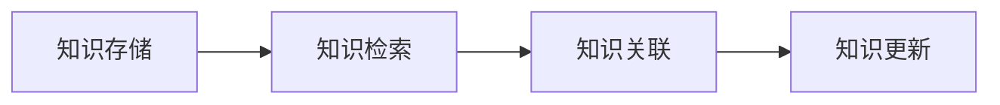
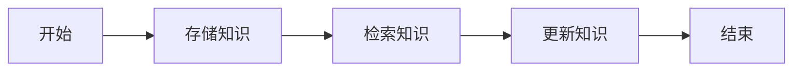
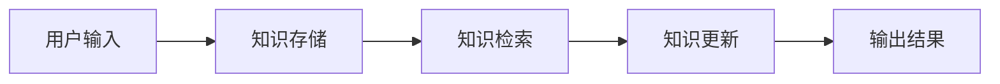

                 


# 从零构建AI Agent的长期记忆机制

> 关键词：AI Agent，长期记忆，知识表示，存储与检索，系统架构

> 摘要：本文从零开始，详细讲解AI Agent的长期记忆机制，涵盖核心概念、算法原理、系统架构及项目实战，帮助读者全面理解并构建高效的AI Agent长期记忆系统。

---

# 第一部分: AI Agent的长期记忆机制概述

## 第1章: 长期记忆机制的背景与问题背景

### 1.1 AI Agent的基本概念
AI Agent（智能体）是指在环境中能够感知并自主行动以实现目标的实体。长期记忆机制是AI Agent实现智能决策的核心模块之一，负责存储和检索知识，支持Agent的持续学习与推理。

### 1.2 长期记忆机制的重要性
- **知识存储**：AI Agent需要存储大量的知识，包括感知到的信息、经验、规则等。
- **知识检索**：在决策过程中，Agent需要快速检索相关知识以支持推理。
- **持续学习**：通过长期记忆机制，Agent可以不断更新知识，提升智能水平。

### 1.3 长期记忆机制的核心问题
- **知识表示**：如何有效地表示和存储知识，以便快速检索和理解。
- **知识关联**：如何建立知识之间的关联，支持复杂的推理任务。
- **知识更新**：如何动态更新知识，保持长期记忆的准确性和完整性。

### 1.4 长期记忆机制的应用场景
- **智能助手**：如Siri、Alexa等，需要存储用户的偏好和历史对话。
- **自动驾驶**：需要存储车辆的历史行为和环境信息。
- **智能客服**：需要存储客户的历史问题和解决方案。

### 1.5 长期记忆机制的边界与外延
- **边界**：专注于知识的存储、检索和更新，不涉及实时感知和短期记忆。
- **外延**：与知识表示、自然语言处理、机器学习等技术密切相关。

---

# 第二部分: 长期记忆机制的核心概念与联系

## 第2章: 长期记忆机制的核心概念

### 2.1 知识表示与存储
#### 2.1.1 知识图谱的构建
- 使用图结构表示知识，节点表示实体，边表示关系。
- 示例：构建“人-地点-时间”三元组图。

#### 2.1.2 知识向量的表示
- 使用向量空间模型，将知识转化为高维向量。
- 示例：使用Word2Vec将单词映射为向量。

#### 2.1.3 知识存储的层次化结构
- 层次化存储：从高层次（如主题）到低层次（如具体实例）。

### 2.2 知识检索与关联
#### 2.2.1 基于关键词的检索
- 使用关键词匹配检索相关知识。

#### 2.2.2 基于上下文的检索
- 根据上下文信息（如时间、地点）进行检索。

#### 2.2.3 基于语义的理解
- 使用语义分析技术理解查询意图。

### 2.3 知识更新与维护
#### 2.3.1 知识的自动补充
- 通过学习新数据自动更新知识库。

#### 2.3.2 知识的动态更新
- 根据新信息实时更新知识库。

#### 2.3.3 知识的版本控制
- 记录知识的变更历史，支持回滚。

### 2.4 核心概念属性特征对比表格
| 概念       | 属性1 | 属性2 | 属性3 |
|------------|-------|-------|-------|
| 知识存储    | 结构化 | 分布式 | 嵌入式 |
| 知识检索    | 关联性 | 语义性 | 效率性 |
| 知识更新    | 及时性 | 完整性 | 可靠性 |

### 2.5 实体关系图（Mermaid）


---

# 第三部分: 长期记忆机制的算法原理

## 第3章: 长期记忆机制的算法原理

### 3.1 知识存储的算法
#### 3.1.1 基于图的存储算法
- 使用图数据库存储知识图谱。

#### 3.1.2 基于向量的存储算法
- 使用向量数据库存储知识向量。

#### 3.1.3 分层存储算法
- 将知识按层次存储，支持高效检索。

### 3.2 知识检索的算法
#### 3.2.1 基于关键词的检索算法
- 使用索引结构（如倒排索引）进行检索。

#### 3.2.2 基于上下文的检索算法
- 使用条件查询（如时间、地点）进行检索。

#### 3.2.3 基于语义的检索算法
- 使用相似度计算（如余弦相似度）进行检索。

### 3.3 知识更新的算法
#### 3.3.1 知识自动补充算法
- 使用爬虫或API获取新知识并更新知识库。

#### 3.3.2 知识动态更新算法
- 根据实时数据流更新知识库。

#### 3.3.3 知识版本控制算法
- 记录每次更新的操作日志。

### 3.4 算法流程图（Mermaid）


---

# 第四部分: 系统分析与架构设计

## 第4章: 长期记忆机制的系统架构

### 4.1 系统功能设计
- **知识存储模块**：负责知识的持久化存储。
- **知识检索模块**：负责知识的快速检索。
- **知识更新模块**：负责知识的动态更新。

### 4.2 系统架构设计


---

# 第五部分: 项目实战

## 第5章: 从零开始构建长期记忆机制

### 5.1 环境安装
- 安装Python和必要的库（如numpy、pandas、networkx）。

### 5.2 核心代码实现
```python
# 知识存储模块
class KnowledgeStorage:
    def __init__(self):
        self.storage = {}

    def store(self, key, value):
        self.storage[key] = value

    def retrieve(self, key):
        return self.storage.get(key, None)
```

### 5.3 代码应用解读与分析
- **知识存储**：使用字典存储知识，键为知识标识，值为知识内容。
- **知识检索**：根据键快速检索知识。

### 5.4 实际案例分析
- 示例：构建一个简单的知识图谱，存储人物、地点、事件的关系。

### 5.5 项目总结
- 通过实现简单的长期记忆机制，理解其核心概念和算法原理。

---

# 第六部分: 总结与展望

## 第6章: 总结与展望

### 6.1 本章小结
- 本文详细讲解了AI Agent的长期记忆机制，涵盖核心概念、算法原理和系统架构。

### 6.2 未来展望
- 结合分布式计算和边缘计算，优化长期记忆机制的性能。
- 探索更高效的知识表示和检索方法。

---

# 作者

作者：AI天才研究院/AI Genius Institute & 禅与计算机程序设计艺术 /Zen And The Art of Computer Programming

