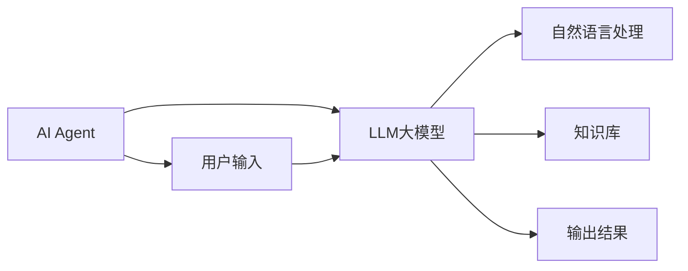
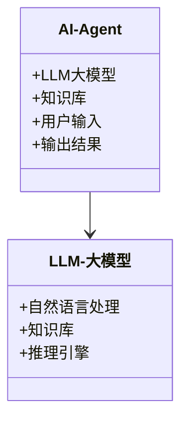

                 


# 《从零构建AI Agent：LLM大模型应用开发实践》

---

## 关键词：
AI Agent, LLM大模型, 自然语言处理, 人工智能, 智能系统, 应用开发, 项目实战

---

## 摘要：
本文从零开始，系统地讲解如何构建基于LLM大模型的AI Agent。通过理论与实践相结合的方式，深入剖析AI Agent的核心概念、算法原理、系统架构及应用场景。文章内容涵盖AI Agent与LLM大模型的基本概念、LLM大模型的算法原理、AI Agent的系统设计与架构、项目实战与实现，以及实际案例分析。读者将通过本文掌握从零到一构建AI Agent的完整流程，并能够实际操作开发属于自己的AI Agent系统。

---

# 第一部分：AI Agent与LLM大模型基础

# 第1章：AI Agent与LLM大模型概述

## 1.1 AI Agent的基本概念

### 1.1.1 AI Agent的定义与特点
- AI Agent的定义
- AI Agent的核心特点
- AI Agent的应用场景

### 1.1.2 AI Agent的核心要素
- 感知与决策模块
- 执行与反馈机制
- 知识库与数据源

### 1.1.3 LLM大模型在AI Agent中的作用
- 提供自然语言处理能力
- 支持多任务学习与泛化能力
- 实现实时对话与交互

## 1.2 LLM大模型的定义与特点

### 1.2.1 LLM大模型的定义
- 大型语言模型的定义
- LLM的核心技术特点
- LLM与传统NLP模型的区别

### 1.2.2 LLM大模型的核心特点
- 强大的自然语言处理能力
- 多任务学习与泛化能力
- 实时对话与交互能力

### 1.2.3 LLM大模型与传统NLP模型的区别
- 模型规模与参数量
- 多任务学习能力
- 实时推理能力

## 1.3 AI Agent与LLM大模型的关系

### 1.3.1 AI Agent的智能决策能力
- AI Agent的决策过程
- LLM大模型在决策中的作用

### 1.3.2 LLM大模型在AI Agent中的应用
- 作为AI Agent的核心决策模块
- 提供自然语言处理能力
- 支持多任务学习与泛化能力

### 1.3.3 两者的结合与协同
- AI Agent与LLM大模型的协同工作流程
- 通过LLM大模型实现智能对话
- 通过AI Agent实现任务规划与执行

## 1.4 本章小结

---

# 第2章：AI Agent的背景与应用前景

## 2.1 AI Agent的发展背景

### 2.1.1 AI技术的演进历程
- 从专家系统到深度学习
- 大模型技术的突破与应用
- AI Agent的兴起与发展

### 2.1.2 大模型技术的突破与应用
- 大模型在自然语言处理中的应用
- 大模型在智能对话中的应用
- 大模型在AI Agent中的应用

### 2.1.3 AI Agent在各领域的潜在应用
- 智能客服
- 智能推荐系统
- 智能监控与预警

## 2.2 AI Agent的应用场景

### 2.2.1 智能客服
- AI Agent在智能客服中的应用
- 通过LLM大模型实现智能对话
- 通过AI Agent实现任务自动分配

### 2.2.2 智能推荐系统
- AI Agent在智能推荐中的应用
- 通过LLM大模型实现个性化推荐
- 通过AI Agent实现任务规划与执行

### 2.2.3 智能监控与预警
- AI Agent在智能监控中的应用
- 通过LLM大模型实现智能预警
- 通过AI Agent实现任务自动处理

## 2.3 LLM大模型在AI Agent中的优势

### 2.3.1 强大的自然语言处理能力
- LLM大模型在自然语言处理中的优势
- 通过LLM大模型实现智能对话
- 通过LLM大模型实现多语言支持

### 2.3.2 实时对话与交互能力
- LLM大模型在实时对话中的优势
- 通过LLM大模型实现高效交互
- 通过AI Agent实现任务自动执行

### 2.3.3 多任务学习与泛化能力
- LLM大模型的多任务学习能力
- 通过LLM大模型实现任务泛化
- 通过AI Agent实现多任务协调

## 2.4 本章小结

---

# 第3章：AI Agent的核心概念与联系

## 3.1 AI Agent的核心概念

### 3.1.1 智能体的基本结构
- AI Agent的基本结构
- 感知与决策模块
- 执行与反馈机制

### 3.1.2 感知与决策模块
- 通过LLM大模型实现感知
- 通过AI Agent实现决策

### 3.1.3 执行与反馈机制
- 通过AI Agent实现任务执行
- 通过反馈机制优化决策

## 3.2 LLM大模型的核心原理

### 3.2.1 大模型的训练机制
- LLM大模型的训练过程
- 通过训练数据实现模型优化
- 通过损失函数实现模型优化

### 3.2.2 大模型的推理过程
- LLM大模型的推理机制
- 通过推理过程实现智能对话
- 通过推理过程实现任务规划

### 3.2.3 大模型的优化策略
- LLM大模型的优化策略
- 通过优化策略提升模型性能
- 通过优化策略降低计算成本

## 3.3 AI Agent与LLM大模型的实体关系图



---

## 3.4 本章小结

---

# 第4章：LLM大模型的算法原理与数学模型

## 4.1 LLM大模型的基本算法

### 4.1.1 变压器模型的结构
- 变压器模型的基本结构
- 通过变压器模型实现自然语言处理
- 通过变压器模型实现多任务学习

### 4.1.2 自注意力机制
- 自注意力机制的定义与原理
- 通过自注意力机制实现智能对话
- 通过自注意力机制实现任务规划

### 4.1.3 前馈网络
- 前馈网络的定义与原理
- 通过前馈网络实现任务执行
- 通过前馈网络实现结果输出

## 4.2 LLM大模型的训练过程

### 4.2.1 损失函数的计算
- 损失函数的定义与计算
- 通过损失函数实现模型优化
- 通过损失函数实现模型训练

### 4.2.2 优化器的选择
- 优化器的定义与选择
- 通过优化器实现模型训练
- 通过优化器实现模型优化

## 4.3 LLM大模型的推理机制

### 4.3.1 解码策略
- 解码策略的定义与原理
- 通过解码策略实现智能对话
- 通过解码策略实现任务规划

### 4.3.2 概率生成模型
- 概率生成模型的定义与原理
- 通过概率生成模型实现任务执行
- 通过概率生成模型实现结果输出

### 4.3.3 前缀树搜索算法
- 前缀树搜索算法的定义与原理
- 通过前缀树搜索算法实现任务规划
- 通过前缀树搜索算法实现结果优化

## 4.4 本章小结

---

# 第5章：AI Agent的系统分析与架构

## 5.1 AI Agent的系统设计

### 5.1.1 项目场景介绍
- 项目背景与目标
- 项目需求与功能
- 项目约束与限制

### 5.1.2 系统功能设计
- 领域模型类图
- 通过领域模型类图实现系统功能
- 通过系统功能设计实现任务规划



### 5.1.3 系统架构设计
- 系统架构图
- 通过系统架构图实现系统设计
- 通过系统架构设计实现任务执行


### 5.1.4 系统接口设计
- 系统接口的设计
- 通过系统接口设计实现任务执行
- 通过系统接口设计实现结果输出

### 5.1.5 系统交互流程图
- 系统交互流程图
- 通过系统交互流程图实现任务规划
- 通过系统交互流程图实现结果优化

## 5.2 本章小结

---

# 第6章：AI Agent的项目实战

## 6.1 环境搭建与配置

### 6.1.1 环境需求分析
- 硬件配置要求
- 软件配置要求
- 网络配置要求

### 6.1.2 环境搭建步骤
- 安装操作系统
- 安装开发工具
- 安装必要的库与框架

## 6.2 核心代码实现

### 6.2.1 AI Agent的核心代码
- AI Agent的主程序
- 通过核心代码实现任务执行
- 通过核心代码实现结果输出

```python
class AI-Agent:
    def __init__(self, llm_model):
        self.llm_model = llm_model
        self.knowledge_base = knowledge_base
    def process_input(self, input_text):
        # 处理用户输入
        # 通过LLM大模型实现智能对话
        # 通过知识库实现任务规划
        pass
    def execute_task(self, task_description):
        # 执行任务
        # 通过任务描述实现任务执行
        # 通过反馈机制优化任务执行
        pass
```

### 6.2.2 LLM大模型的代码实现
- LLM大模型的主程序
- 通过核心代码实现自然语言处理
- 通过核心代码实现任务规划

```python
class LLM-Model:
    def __init__(self, tokenizer, model):
        self.tokenizer = tokenizer
        self.model = model
    def encode(self, text):
        # 编码输入文本
        # 通过编码实现自然语言处理
        # 通过编码实现任务规划
        pass
    def decode(self, encoded_text):
        # 解码编码文本
        # 通过解码实现智能对话
        # 通过解码实现任务执行
        pass
```

## 6.3 实际案例分析

### 6.3.1 案例背景与需求分析
- 案例背景介绍
- 案例需求分析
- 案例目标设定

### 6.3.2 案例实现过程
- 通过核心代码实现任务执行
- 通过系统架构设计实现任务优化
- 通过系统交互流程图实现任务完成

## 6.4 项目总结与优化建议

### 6.4.1 项目总结
- 项目实现的主要成果
- 项目实现的关键点
- 项目实现的经验总结

### 6.4.2 优化建议
- 优化系统架构设计
- 优化核心代码实现
- 优化系统交互流程

---

# 第7章：总结与展望

## 7.1 本章总结
- AI Agent的核心概念与联系
- LLM大模型的算法原理与数学模型
- AI Agent的系统设计与架构
- AI Agent的项目实战与实现

## 7.2 未来展望
- AI Agent的未来发展
- LLM大模型的未来发展方向
- AI Agent与LLM大模型的结合与协同
- AI Agent在更多领域的潜在应用

---

# 作者：AI天才研究院/AI Genius Institute & 禅与计算机程序设计艺术 /Zen And The Art of Computer Programming

