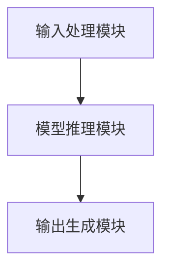
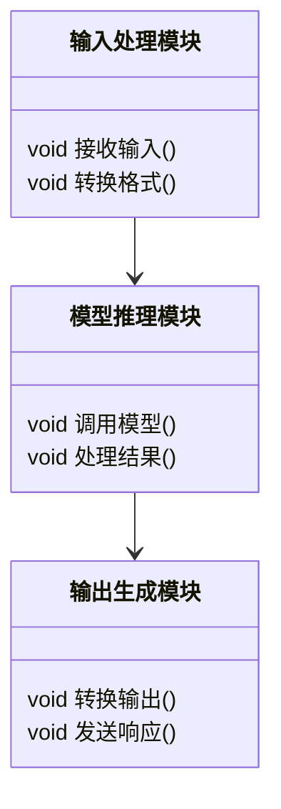
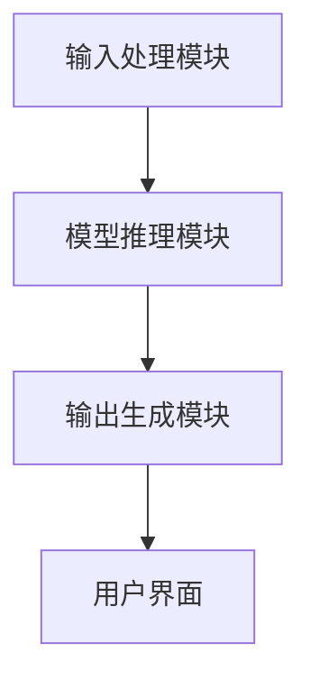
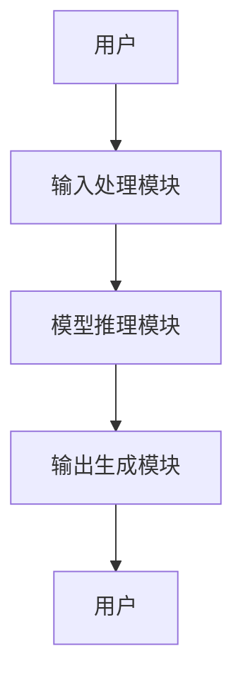

                 


# 从零构建AI Agent：LLM大模型应用开发实践概述

> **关键词**：AI Agent，LLM大模型，应用开发，系统架构，项目实战

> **摘要**：本文将详细介绍从零开始构建AI Agent的过程，重点探讨大语言模型（LLM）在实际应用中的开发实践。通过系统的背景介绍、核心概念解析、算法原理分析、系统架构设计、项目实战演示，以及优化与部署方案，本文旨在为读者提供一个全面的视角，帮助他们掌握AI Agent的开发精髓。

---

# 第1章: AI Agent与LLM大模型概述

## 1.1 AI Agent的基本概念

### 1.1.1 什么是AI Agent
AI Agent（人工智能代理）是一种能够感知环境、自主决策并执行任务的智能体。它可以理解为一个软件或实体，通过与用户的交互或环境的反馈，完成特定的目标。AI Agent的核心在于其智能性，能够根据输入的信息做出合理的决策和响应。

### 1.1.2 AI Agent的核心特征
AI Agent具有以下几个关键特征：
- **自主性**：能够在没有外部干预的情况下自主运行。
- **反应性**：能够实时感知环境并做出响应。
- **目标导向性**：具有明确的目标，并通过行为来实现这些目标。
- **学习能力**：能够通过数据和经验不断优化自身的性能。

### 1.1.3 AI Agent与传统AI的区别
传统的AI系统通常是基于规则的，依赖于预定义的逻辑和数据，而AI Agent则更加灵活和智能，能够根据动态环境调整自己的行为。AI Agent的核心在于其自主决策和问题解决能力。

## 1.2 LLM大模型的定义与特点

### 1.2.1 大语言模型的定义
大语言模型（LLM, Large Language Model）是一种基于深度学习的自然语言处理模型，通常使用Transformer架构，通过大量数据进行预训练，能够生成自然流畅的文本。

### 1.2.2 LLM的核心特点
- **大规模数据训练**：LLM通过海量数据进行预训练，能够理解和生成多种语言。
- **上下文理解**：能够处理长上下文，理解复杂的语义关系。
- **多任务能力**：通过微调，可以应用于多种任务，如文本生成、问答系统、机器翻译等。

### 1.2.3 LLM与AI Agent的关系
LLM可以作为AI Agent的核心组件，负责理解和生成自然语言文本。AI Agent通过调用LLM模型，能够与用户进行自然的语言交互，完成复杂的任务。

## 1.3 AI Agent的典型应用场景

### 1.3.1 智能客服
AI Agent可以作为智能客服，通过自然语言处理技术，帮助用户解决问题，提供咨询和服务。

### 1.3.2 智能助手
AI Agent可以作为个人助手，帮助用户管理日程、提醒任务、查找信息等。

### 1.3.3 智能推荐系统
AI Agent可以根据用户的偏好和行为，推荐个性化的内容，如文章、视频、产品等。

## 1.4 本章小结
本章介绍了AI Agent和LLM大模型的基本概念、特点及其应用场景，为后续章节的深入探讨奠定了基础。

---

# 第2章: LLM大模型的原理与训练方法

## 2.1 大语言模型的训练目标

### 2.1.1 预训练的目标
LLM的预训练目标是通过大量未标注数据，学习语言的结构和语义。模型的目标是预测给定上下文中缺失的单词或句子。

### 2.1.2 损失函数的定义
常用的损失函数是交叉熵损失函数：
$$ \text{Loss} = -\sum_{i=1}^{n} \log P(y_i|x_{<i}) $$
其中，$y_i$ 是预测的标签，$x_{<i}$ 是输入的前缀。

### 2.1.3 优化策略
使用随机梯度下降（SGD）或Adam优化器来优化模型参数。

## 2.2 模型结构与训练方法

### 2.2.1 模型架构的选择
常用的模型架构包括BERT、GPT、T5等。本章以GPT为例，其模型结构包括编码器和解码器。

### 2.2.2 分布式训练技术
为了提高训练效率，通常采用分布式训练，将数据分片并行处理。使用数据并行或模型并行技术。

### 2.2.3 参数优化策略
采用学习率衰减和早停技术，防止过拟合。

## 2.3 LLM的数学模型与公式

### 2.3.1 概率分布公式
$$ P(y|x) = \frac{P(x,y)}{P(x)} $$

### 2.3.2 损失函数公式
$$ \text{Loss} = -\sum_{i=1}^{n} \log P(y_i|x_{<i}) $$

## 2.4 本章小结
本章详细讲解了LLM大模型的训练目标、模型结构和优化策略，为后续章节的系统设计和项目实践提供了理论基础。

---

# 第3章: AI Agent的系统架构设计

## 3.1 系统功能模块划分

### 3.1.1 输入处理模块
负责接收用户的输入，并将其转换为模型可理解的格式。

### 3.1.2 模型推理模块
调用LLM模型，生成响应文本。

### 3.1.3 输出生成模块
将模型生成的文本转换为用户友好的输出形式。

## 3.2 系统架构设计图


## 3.3 系统功能设计

### 3.3.1 领域模型


## 3.4 系统架构图


## 3.5 本章小结
本章详细设计了AI Agent的系统架构，包括功能模块划分、系统架构图和交互流程，为后续的项目实现提供了明确的方向。

---

# 第4章: 从零开始构建AI Agent

## 4.1 环境安装与配置

### 4.1.1 安装Python
```bash
python --version
pip install --upgrade pip
```

### 4.1.2 安装LLM框架
```bash
pip install transformers
pip install torch
```

## 4.2 核心代码实现

### 4.2.1 导入库
```python
from transformers import GPT2LMHeadModel, GPT2Tokenizer
import torch
```

### 4.2.2 初始化模型
```python
model_name = 'gpt2'
tokenizer = GPT2Tokenizer.from_pretrained(model_name)
model = GPT2LMHeadModel.from_pretrained(model_name)
```

### 4.2.3 定义输入处理函数
```python
def process_input(input_text):
    inputs = tokenizer.encode(input_text, return_tensors='pt')
    return inputs
```

### 4.2.4 定义推理函数
```python
def generate_response(inputs):
    with torch.no_grad():
        outputs = model.generate(inputs, max_length=100, do_sample=True)
        response = tokenizer.decode(outputs[0], skip_special_tokens=True)
    return response
```

## 4.3 项目实战演示

### 4.3.1 简单对话系统
```python
input_text = "今天天气怎么样？"
response = generate_response(process_input(input_text))
print(response)
```

### 4.3.2 功能扩展
```python
# 添加上下文记忆功能
def remember_context(context):
    global current_context
    current_context = context
```

## 4.4 本章小结
本章通过具体的代码实现，展示了如何从零开始构建一个简单的AI Agent，为后续的优化和扩展奠定了基础。

---

# 第5章: LLM大模型的优化与部署

## 5.1 模型调优策略

### 5.1.1 微调模型
```python
from transformers import AutoTokenizer, AutoModelForFine Tuning
tokenizer = AutoTokenizer.from_pretrained('gpt2')
model = AutoModelForFineTuning.from_pretrained('gpt2')
```

### 5.1.2 调整参数
```python
# 调整学习率
optimizer = torch.optim.Adam(model.parameters(), lr=1e-5)
```

## 5.2 推理优化技巧

### 5.2.1 使用缓存
```python
# 缓存生成结果
cache = {}
def generate_response(inputs):
    if inputs in cache:
        return cache[inputs]
    # 生成并缓存结果
    response = generate_response(inputs)
    cache[inputs] = response
    return response
```

### 5.2.2 并行推理
```python
import concurrent.futures
def generate_responses(batch_inputs):
    with concurrent.futures.ThreadPoolExecutor() as executor:
        futures = {executor.submit(generate_response, input) for input in batch_inputs}
        return [future.result() for future in concurrent.futures.as_completed(futures)]
```

## 5.3 实际部署方案

### 5.3.1 使用云服务
```bash
gunicorn --workers 4 app:app
```

### 5.3.2 部署API
```python
from flask import Flask, request, jsonify

app = Flask(__name__)

@app.route('/generate', methods=['POST'])
def generate():
    data = request.json
    inputs = process_input(data['input'])
    response = generate_response(inputs)
    return jsonify({'response': response})
```

## 5.4 本章小结
本章介绍了如何优化和部署LLM大模型，包括模型调优、推理优化和实际部署方案，为AI Agent的高效运行提供了保障。

---

# 第6章: AI Agent的实际应用案例

## 6.1 智能客服系统

### 6.1.1 系统架构


### 6.1.2 功能实现
```python
# 实现问题分类
def classify_question(question):
    # 使用预训练模型进行分类
    pass
```

## 6.2 智能教育助手

### 6.2.1 系统功能
- 提供学习建议
- 解答学术问题
- 自动评估作业

### 6.2.2 代码实现
```python
# 实现作业评估
def evaluate_assignment(assignment):
    # 使用NLP模型进行评估
    pass
```

## 6.3 金融智能助手

### 6.3.1 功能模块
- 股票分析
- 财务建议
- 风险评估

### 6.3.2 代码示例
```python
# 实现风险评估
def assess_risk(profile):
    # 使用LLM模型生成风险报告
    pass
```

## 6.4 本章小结
本章通过具体的案例分析，展示了AI Agent在不同领域的广泛应用，为读者提供了实践参考。

---

# 第7章: 总结与展望

## 7.1 总结
本文从AI Agent和LLM大模型的基本概念出发，详细探讨了系统的架构设计、开发实践和优化部署。通过具体的代码实现和案例分析，为读者提供了一个全面的视角。

## 7.2 未来展望
随着技术的不断进步，AI Agent将变得更加智能和高效。未来的开发方向包括更复杂的任务处理、多模态交互、以及更高的安全性和隐私保护。

---

# 作者

**作者：AI天才研究院/AI Genius Institute & 禅与计算机程序设计艺术 /Zen And The Art of Computer Programming**

---

以上是《从零构建AI Agent：LLM大模型应用开发实践概述》的完整目录和内容框架，涵盖从基础到实践的各个方面，结合理论与代码实现，帮助读者全面掌握AI Agent的开发精髓。

