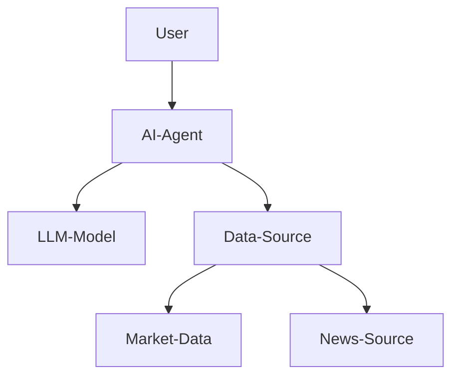
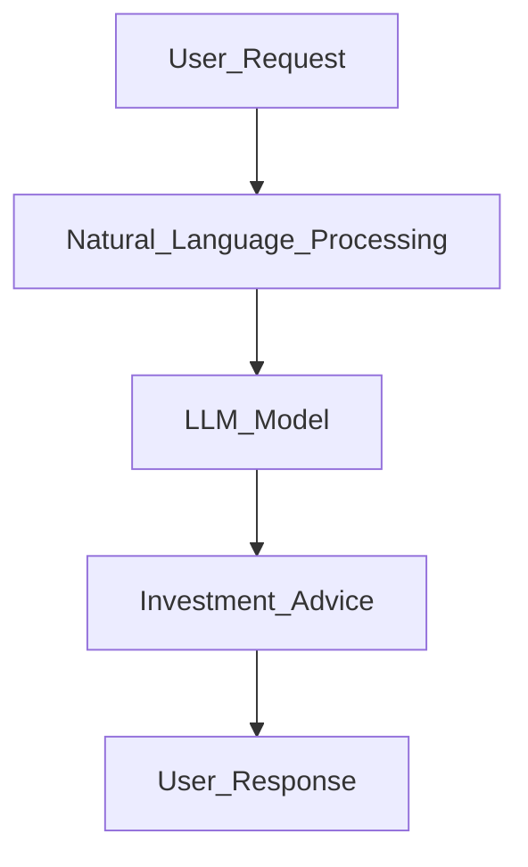
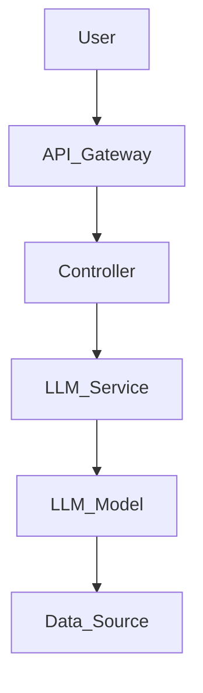

                 


# 从零构建投资理财智能助手AI Agent：基于LLM大模型投资理财AI应用开发实践

> 关键词：AI Agent，LLM大模型，投资理财，自然语言处理，系统架构设计，项目实战

> 摘要：本文将从零开始构建一个基于大语言模型（LLM）的投资理财智能助手AI Agent，涵盖从需求分析、系统设计到实现与优化的完整过程。通过详细的技术分析和实际案例，本文深入探讨了AI Agent在投资理财领域的应用潜力，并提供了从理论到实践的全面指导。

---

## 第1章：投资理财智能助手AI Agent的背景与问题背景

### 1.1 问题背景

#### 1.1.1 投资者的需求与痛点
现代投资者在面对复杂多变的金融市场时，面临着诸多挑战。投资者通常需要处理海量信息，包括市场数据、新闻资讯、财务报表等，这些信息往往分散且难以快速分析。此外，普通投资者缺乏专业的投资知识和工具，难以制定科学的投资策略。

#### 1.1.2 传统投资工具的局限性
传统的投资工具，如金融软件和在线平台，虽然提供了基本的市场数据和交易功能，但难以根据个体需求提供个性化的建议。这些工具通常缺乏深度学习和自然语言处理能力，无法理解和解析非结构化数据，也无法根据实时市场变化动态调整投资策略。

#### 1.1.3 AI技术在投资理财中的应用潜力
随着大语言模型（LLM）技术的快速发展，AI Agent在投资理财领域的应用前景广阔。LLM能够处理海量文本数据，理解上下文，并生成自然语言的建议，这使得AI Agent能够为投资者提供个性化的投资建议、市场分析和风险评估。

---

### 1.2 问题描述

#### 1.2.1 投资者的核心需求
投资者的核心需求包括：
- 实时市场监控与分析
- 个性化投资建议
- 风险评估与预警
- 动态投资策略调整

#### 1.2.2 当前投资工具的不足
- 数据处理能力有限
- 缺乏智能化的交互方式
- 个性化服务成本高
- 难以应对非结构化数据

#### 1.2.3 AI Agent的核心价值
AI Agent通过整合自然语言处理、大数据分析和机器学习技术，能够实时处理海量信息，为投资者提供实时的市场分析、个性化的投资建议和动态的策略调整。

---

### 1.3 问题解决与边界

#### 1.3.1 AI Agent的解决思路
AI Agent通过以下方式解决投资理财问题：
1. **数据处理**：整合多源异构数据，包括文本、表格、图像等。
2. **智能分析**：利用LLM进行文本分析和语义理解，生成投资建议。
3. **动态调整**：根据市场变化和用户反馈，实时优化投资策略。

#### 1.3.2 AI Agent的边界
AI Agent的边界包括：
- **功能边界**：仅提供投资建议和市场分析，不直接进行交易操作。
- **数据边界**：仅处理公开市场数据，不涉及内部或敏感信息。
- **用户边界**：适用于个人投资者，暂不支持机构投资者。

#### 1.3.3 核心概念与要素
- **用户**：投资者，通过自然语言与AI Agent交互。
- **数据源**：金融市场数据、新闻资讯、公司财报等。
- **模型**：大语言模型，用于文本理解和生成。
- **推理引擎**：基于模型的分析和决策逻辑。

---

## 第2章：投资理财智能助手AI Agent的核心概念与联系

### 2.1 AI大模型与投资理财的结合

#### 2.1.1 大模型的核心原理
大语言模型（LLM）通过大量的训练数据，学习语言的结构和语义，能够生成与上下文相关的文本。其核心原理包括：
- **预训练**：模型通过大规模的无监督学习，掌握语言的分布规律。
- **微调**：针对特定任务（如投资理财）进行有监督训练，优化模型性能。

#### 2.1.2 大模型在投资理财中的应用
- **市场分析**：分析新闻、财报，预测市场趋势。
- **投资建议**：根据用户需求，生成个性化的投资策略。
- **风险评估**：识别潜在风险，提供预警。

#### 2.1.3 AI Agent的定义与特点
AI Agent是一种智能体，通过与用户交互，理解用户需求，并利用大模型的能力提供投资建议。其特点包括：
- **智能化**：基于自然语言处理，理解用户需求。
- **动态性**：能够实时更新市场信息，提供动态建议。
- **个性化**：根据用户资产、风险偏好等提供定制化服务。

---

### 2.2 系统架构设计

#### 2.2.1 系统的核心要素
- **用户**：投资者，通过自然语言与系统交互。
- **数据源**：金融市场数据、新闻、财报等。
- **模型**：大语言模型，用于文本分析和生成。
- **推理引擎**：基于模型的分析逻辑，生成投资建议。

#### 2.2.2 系统的实体关系图



---

## 第3章：投资理财智能助手AI Agent的技术基础

### 3.1 自然语言处理技术

#### 3.1.1 NLP的基本原理
NLP通过处理文本数据，理解语义和意图。其核心步骤包括：
- **分词**：将文本分割为有意义的词或短语。
- **词性标注**：为每个词标注其词性。
- **句法分析**：分析句子的语法结构。
- **语义理解**：理解文本的语义含义。

#### 3.1.2 大模型在NLP中的应用
大语言模型在NLP中的应用包括文本生成、问答系统、情感分析等。这些技术为投资理财AI Agent提供了强大的文本处理能力。

---

### 3.2 大模型的训练与优化

#### 3.2.1 大模型的训练方法
- **预训练**：使用大规模通用数据进行无监督学习。
- **微调**：在特定领域（如投资理财）进行有监督训练。

#### 3.2.2 模型优化策略
- **参数调整**：优化模型的超参数，如学习率、批量大小。
- **模型剪裁**：减少模型的参数数量，降低计算成本。

---

## 第4章：投资理财智能助手AI Agent的系统分析与架构设计

### 4.1 系统功能设计

#### 4.1.1 功能模块划分
- **数据获取模块**：从数据源获取市场数据和新闻。
- **自然语言处理模块**：解析用户需求。
- **模型推理模块**：生成投资建议。
- **用户交互模块**：与用户进行自然语言对话。

#### 4.1.2 功能实现流程


---

### 4.2 系统架构设计

#### 4.2.1 系统架构图


---

## 第5章：投资理财智能助手AI Agent的项目实战

### 5.1 环境搭建

#### 5.1.1 工具安装
- **Python**：安装Python 3.8及以上版本。
- **Hugging Face**：安装`transformers`库。
- **LLM 模型**：使用Hugging Face的预训练模型（如GPT-3.5）。

---

### 5.2 核心代码实现

#### 5.2.1 数据获取与处理
```python
import requests

def get_market_data(ticker):
    url = f"https://api.example.com/stock/{ticker}"
    response = requests.get(url)
    return response.json()
```

#### 5.2.2 自然语言处理与生成
```python
from transformers import pipeline

llm_pipeline = pipeline("text-generation", model="gpt2-large")
response = llm_pipeline("当前市场环境下，建议投资哪些股票？")
print(response[0]['generated_text'])
```

---

## 第6章：最佳实践与小结

### 6.1 项目总结
通过本项目，我们成功构建了一个基于大语言模型的投资理财智能助手AI Agent，实现了从数据获取、自然语言处理到投资建议生成的完整流程。

### 6.2 注意事项
- **数据隐私**：确保用户数据的安全性。
- **模型调优**：持续优化模型性能。
- **用户体验**：注重交互的自然性和流畅性。

### 6.3 未来展望
未来，AI Agent可以在以下方面进行优化和扩展：
- **多模态交互**：结合图像和语音识别技术。
- **个性化服务**：根据用户行为动态调整建议。

---

## 附录

### 附录A：工具安装指南
```bash
pip install transformers requests
```

### 附录B：数据集介绍
- **市场数据**：包括股票价格、财务报表等。
- **新闻数据**：包括财经新闻、公司公告等。

---

## 作者：AI天才研究院/AI Genius Institute & 禅与计算机程序设计艺术 /Zen And The Art of Computer Programming

---

通过以上思考，我们可以看到，构建一个投资理财智能助手AI Agent是一个复杂但极具潜力的工程。从需求分析到系统设计，再到实现与优化，每一步都需要仔细思考和实践。希望本文能为读者提供有价值的指导和启发。

