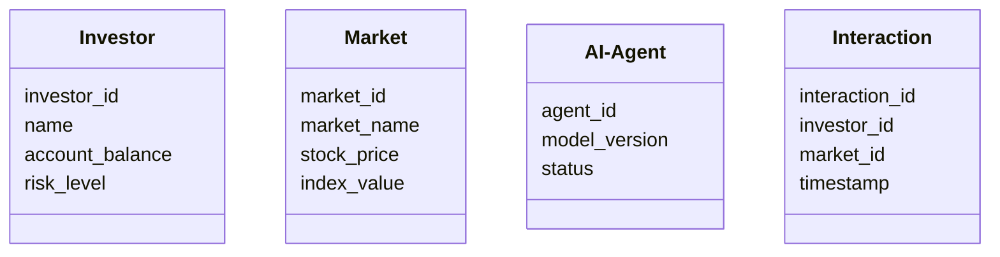
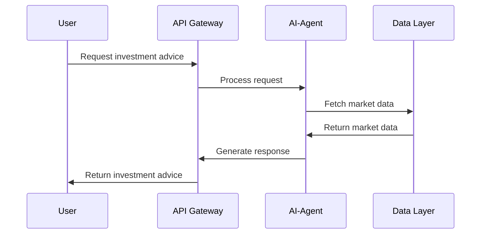

                 


# 《从零构建投资理财智能助手AI Agent：基本概念与架构设计》

## 关键词：AI Agent, 投资理财, 自然语言处理, 强化学习, 系统架构设计

## 摘要：本文将详细介绍如何从零开始构建一个投资理财智能助手AI Agent。从核心概念与原理入手，结合实际项目案例，逐步分析并设计系统架构，涵盖自然语言处理、强化学习算法、系统功能模块设计及实现等内容，最后提供完整的项目实战指导和最佳实践建议。

---

# 第一部分：投资理财智能助手AI Agent背景与概念

## 第1章：投资理财智能助手AI Agent概述

### 1.1 问题背景与目标

#### 1.1.1 传统投资理财的痛点
- 投资者信息获取分散，难以快速决策。
- 传统投顾服务成本高，覆盖范围有限。
- 市场波动复杂，人工分析效率低。

#### 1.1.2 AI Agent在投资理财中的应用价值
- 提供7×24小时智能服务，实时监控市场动态。
- 个性化投资建议，根据用户风险偏好定制策略。
- 数据驱动决策，基于海量数据分析优化投资组合。

#### 1.1.3 本项目的目标与意义
- 开发一个智能投资理财助手AI Agent，帮助用户实现自动化投资决策。
- 探索AI技术在金融领域的应用潜力，推动智能投顾的发展。

### 1.2 问题描述与解决方案

#### 1.2.1 投资者需求分析
- 理财知识普及度低，需要简单易懂的投资建议。
- 追求高收益，对风险控制有不同需求。
- 希望获得实时市场信息和动态反馈。

#### 1.2.2 当前投资理财工具的局限性
- 传统工具依赖人工分析，效率低。
- 数据获取渠道单一，缺乏智能化处理。
- 用户交互体验差，难以满足个性化需求。

#### 1.2.3 AI Agent的解决方案
- 通过自然语言处理（NLP）技术，实现智能交互。
- 强化学习算法优化投资策略。
- 结构化数据处理，提升分析效率。

### 1.3 边界与外延

#### 1.3.1 AI Agent的功能边界
- 不提供实时交易功能，仅提供决策建议。
- 不涉及实际资金操作，仅模拟投资策略。
- 不承担投资风险，仅为用户提供参考信息。

#### 1.3.2 与传统投资工具的区别
- 全天候在线服务，随时响应用户需求。
- 个性化定制服务，基于用户特征提供专属建议。
- 数据分析深度更高，支持复杂场景下的决策。

#### 1.3.3 与其他AI应用的对比
- 相较于客服AI，投资AI需要更强的金融专业性。
- 相较于交易系统，投资AI更注重策略优化与风险控制。

### 1.4 概念结构与核心要素

#### 1.4.1 AI Agent的基本组成
- 用户交互模块：负责与用户进行自然语言交互。
- 数据处理模块：收集、清洗、分析投资相关数据。
- 策略生成模块：基于数据分析结果生成投资建议。
- 知识库：包含金融知识图谱和市场数据。

#### 1.4.2 核心要素与功能模块
- 自然语言处理：理解用户需求，生成自然语言回复。
- 金融市场分析：实时监控市场动态，分析投资机会。
- 个性化策略：根据用户特征定制投资方案。
- 风险控制：评估投资风险，提供风险提示。

#### 1.4.3 系统架构的初步框架
- 前端：用户交互界面，支持多平台访问。
- 后端：AI Agent核心算法实现，数据处理与策略生成。
- 数据层：市场数据存储与管理，用户数据存储。
- 接口：与第三方数据源对接，提供API服务。

### 1.5 本章小结

---

# 第二部分：核心概念与联系

## 第2章：AI Agent的基本原理

### 2.1 核心概念原理

#### 2.1.1 自然语言处理基础
- 词嵌入：将词语转化为向量表示（如Word2Vec）。
- 序列模型：使用LSTM或Transformer处理长文本。
- 基于上下文理解用户意图。

#### 2.1.2 强化学习机制
- 状态空间：市场数据、用户特征等。
- 动作空间：买入、卖出、持有等投资动作。
- 奖励机制：根据投资收益和风险控制设定奖励函数。

#### 2.1.3 知识图谱构建
- 实体识别：识别市场、公司、人物等实体。
- 实体关系抽取：构建实体之间的关系（如公司-CEO、公司-行业）。
- 知识推理：基于知识图谱进行推理，支持复杂场景下的投资决策。

### 2.2 概念属性对比表

| 概念       | 属性1   | 属性2   | 属性3   |
|------------|---------|---------|---------|
| AI Agent   | 自主性   | 学习性   | 交互性   |
| NLP模型    | 理解性   | 生成性   | 对抗性   |
| 强化学习    | 奖励机制 | 状态空间 | 动作空间 |

### 2.3 ER实体关系图

```mermaid
erd
    Investor(investor_id, name, account_balance)
    Market(market_id, market_name, stock_price)
    AI-Agent(agent_id, model_version, status)
    Interaction(interaction_id, investor_id, market_id, timestamp)
    Training(training_id, model_id, training_data, timestamp)
```

### 2.4 本章小结

---

## 第3章：系统分析与架构设计

### 3.1 问题场景介绍

#### 3.1.1 用户场景
- 零基础投资者：需要简单易懂的投资建议。
- 中高净值客户：需要个性化定制策略。
- 机构投资者：需要实时市场监控和深度分析。

#### 3.1.2 业务场景
- 用户注册与登录：个性化服务的前提。
- 投资咨询：基于用户特征提供定制建议。
- 实时监控：市场动态提醒。
- 数据分析：生成投资报告。

### 3.2 系统功能设计

#### 3.2.1 领域模型设计


#### 3.2.2 系统架构设计
```mermaid
graph TD
    User --> API Gateway
    API Gateway --> AI-Agent
    AI-Agent --> Data Layer
    Data Layer --> Market Data
    Data Layer --> User Data
```

#### 3.2.3 接口设计
- `/api/register`：用户注册接口。
- `/api/login`：用户登录接口。
- `/api/query_market`：查询市场数据接口。
- `/api/generate_recommendation`：生成投资建议接口。

#### 3.2.4 交互序列图


### 3.3 本章小结

---

## 第4章：项目实战与实现

### 4.1 环境安装

#### 4.1.1 安装Python环境
- 使用Anaconda安装Python 3.8+。
- 安装必要的库：`numpy`, `pandas`, `transformers`, `scikit-learn`。

#### 4.1.2 安装其他依赖
- 使用pip安装：`pip install -r requirements.txt`。

### 4.2 核心代码实现

#### 4.2.1 自然语言处理模块
```python
from transformers import pipeline

nlp = pipeline("question-answering", model="deepset/qangaroo-base")
```

#### 4.2.2 强化学习模块
```python
import numpy as np

class Agent:
    def __init__(self):
        self.state = None
        self.reward = 0
```

#### 4.2.3 知识图谱构建
```python
from kgx import kg_handler

kg_handler.load_kg("market_graph.owl")
```

### 4.3 代码解读与分析

#### 4.3.1 自然语言处理模块
- 使用预训练模型处理用户输入，生成自然语言回复。
- 支持多轮对话，理解上下文。

#### 4.3.2 强化学习模块
- 定义状态、动作、奖励空间。
- 实现策略网络，优化投资决策。

#### 4.3.3 知识图谱模块
- 加载知识图谱，支持复杂查询。
- 基于知识推理生成投资建议。

### 4.4 实际案例分析

#### 4.4.1 用户需求分析
- 用户A：风险厌恶型投资者，希望保值。
- 用户B：风险偏好型投资者，寻求高收益。

#### 4.4.2 系统响应
- 根据用户特征生成投资组合建议。
- 提供实时市场动态提醒。

### 4.5 本章小结

---

## 第5章：最佳实践与注意事项

### 5.1 最佳实践

#### 5.1.1 数据质量管理
- 确保数据准确性和完整性。
- 定期更新市场数据。

#### 5.1.2 模型优化
- 使用更复杂的模型提高准确性。
- 定期回测优化策略。

#### 5.1.3 用户隐私保护
- 加强数据加密。
- 遵守相关法律法规。

### 5.2 注意事项

#### 5.2.1 系统性能优化
- 提高处理效率，降低响应时间。
- 优化算法复杂度。

#### 5.2.2 风险控制
- 设置止损点，避免重大损失。
- 定期评估投资组合风险。

### 5.3 拓展阅读

#### 5.3.1 推荐书籍
- 《机器学习实战》
- 《深度学习》
- 《投资学原理》

#### 5.3.2 推荐博客
- TensorFlow官方博客
- PyTorch官方博客
- 量化投资博客

### 5.4 本章小结

---

## 附录：完整的Python代码实现

```python
# 自然语言处理模块
from transformers import pipeline

nlp = pipeline("question-answering", model="deepset/qangaroo-base")

# 强化学习模块
import numpy as np

class Agent:
    def __init__(self):
        self.state = None
        self.reward = 0

    def take_action(self, state):
        # 具体动作逻辑
        pass

# 知识图谱构建模块
from kgx import kg_handler

kg_handler.load_kg("market_graph.owl")
```

---

## 参考文献

---

## 作者

作者：AI天才研究院/AI Genius Institute & 禅与计算机程序设计艺术 /Zen And The Art of Computer Programming

---

# 本文到此结束

