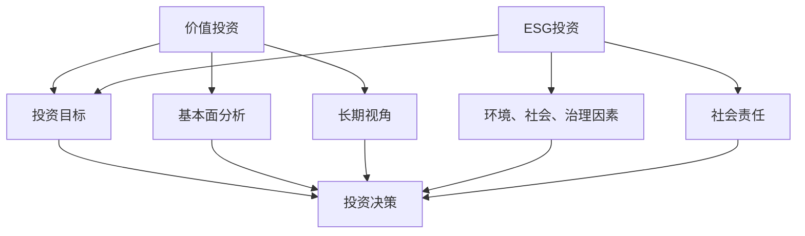
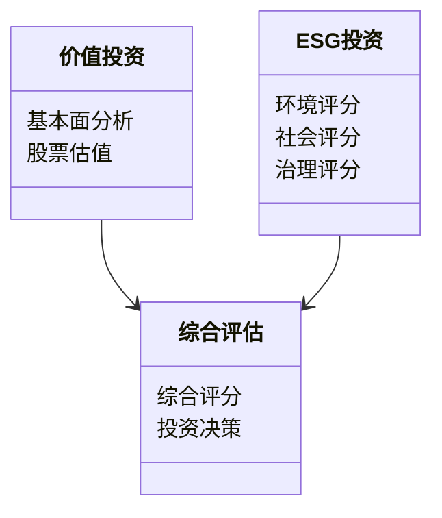
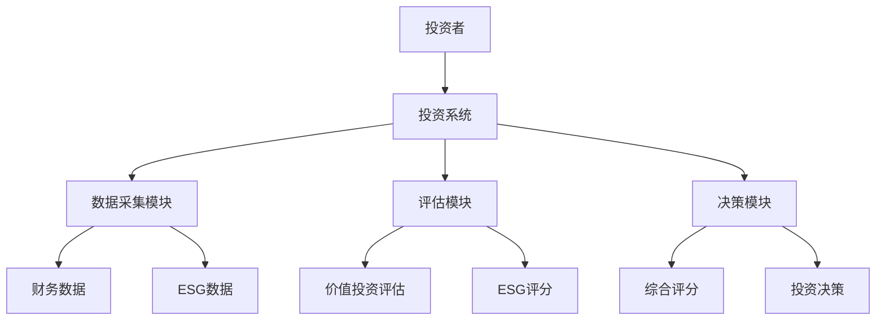

                 


# 价值投资与ESG投资的结合

> 关键词：价值投资、ESG投资、投资策略、可持续发展、金融创新

> 摘要：本文从价值投资和ESG投资的核心理念出发，分析了两者结合的背景、动机与方法。通过详细阐述价值投资与ESG投资的核心概念、算法原理、系统架构设计以及实际案例，探讨了如何在投资决策中实现财务回报与社会责任的统一。文章还结合了数学模型、Mermaid图表和Python代码，展示了价值投资与ESG投资结合的实际应用。

---

# 第一部分: 价值投资与ESG投资的结合概述

## 第1章: 价值投资的核心理念与实践

### 1.1 价值投资的定义与历史发展

价值投资是一种以基本面分析为核心的长期投资策略，其核心理念是通过分析企业的内在价值，寻找市场价格低于内在价值的投资标的。价值投资的起源可以追溯到20世纪初，本杰明·格雷厄姆和戴维·多德是这一投资理念的奠基人。

- **核心原则**：
  - **安全边际**：买入价格低于内在价值，以降低投资风险。
  - **长期视角**：关注企业的长期盈利能力，而非短期市场波动。
  - **逆向思维**：在市场恐慌时寻找被低估的机会。

- **现代发展**：
  - 价值投资已从传统的低估值策略扩展到质量价值、深度价值等多种形式。
  - 投资范围从传统行业扩展到科技、医疗等新兴领域。

---

## 第2章: ESG投资的核心理念与实践

### 2.1 ESG投资的定义与历史发展

ESG投资是一种关注环境、社会和公司治理因素的投资策略，其核心理念是通过评估企业对可持续发展的影响，选择符合社会责任的投资标的。ESG投资起源于20世纪60年代的社会责任投资（SRI），并在21世纪得到快速发展。

- **核心原则**：
  - **环境因素**：关注企业的碳排放、资源利用效率等环境表现。
  - **社会责任**：关注企业的员工权益、社区贡献等社会影响。
  - **公司治理**：关注企业的董事会结构、高管薪酬等治理问题。

- **现代发展**：
  - ESG投资已成为全球金融市场的主流策略之一。
  - 各大指数公司（如MSCI、标普道琼斯）推出了ESG指数，为投资者提供了丰富的投资工具。

---

## 第3章: 价值投资与ESG投资的结合动机与方法

### 3.1 结合的背景与必要性

- **传统价值投资的局限性**：
  - 过度关注财务指标，忽视企业的社会责任和环境影响。
  - 可能导致投资组合与可持续发展趋势脱节。

- **ESG投资的局限性**：
  - 仅关注环境、社会和治理因素，忽视企业的财务健康。
  - 可能导致投资组合在财务回报上的不足。

- **结合的动机**：
  - 提升投资的可持续性，兼顾财务回报和社会价值。
  - 符合全球可持续发展的趋势，满足机构投资者的需求。

---

### 3.2 价值投资与ESG投资的结合方法

- **理论基础**：
  - 将ESG因素纳入价值投资的分析框架，形成“价值+ESG”的双维度评估体系。

- **实施步骤**：
  1. 筛选基本面良好、估值合理的标的。
  2. 对筛选出的标的进行ESG评分，排除不符合社会责任的企业。
  3. 结合ESG评分和财务数据，最终确定投资标的。

---

# 第二部分: 价值投资与ESG投资的结合分析

## 第4章: 价值投资与ESG投资的核心概念与联系

### 4.1 核心概念对比与分析

| **维度** | **价值投资** | **ESG投资** |
|----------|--------------|-------------|
| 核心目标 | 追求超额收益 | 追求可持续发展 |
| 关注点   | 财务指标、估值 | 环境、社会、治理 |
| 投资期限 | 长期 | 长期 |
| 风险控制 | 通过安全边际控制 | 通过ESG评分控制 |

---

### 4.2 价值投资与ESG投资的内在联系

- **投资目标的统一性**：
  - 两者都追求长期稳定的回报，但价值投资更注重财务回报，ESG投资更注重社会回报。

- **投资策略的互补性**：
  - 价值投资提供估值框架，ESG投资提供筛选标准。
  - 结合两者可以避免单一策略的局限性。

- **投资效果的协同性**：
  - 通过ESG筛选，降低投资组合的声誉风险。
  - 通过价值投资的估值框架，提升投资组合的收益潜力。

---

### 4.3 价值投资与ESG投资的ER实体关系图



---

## 第5章: 价值投资与ESG投资的算法原理

### 5.1 价值投资的算法原理

#### 5.1.1 基本面分析的数学模型

价值投资的核心是通过基本面分析估算企业的内在价值。以下是常用的两种估值模型：

1. **股息折扣模型（DDM）**：
   $$ V = \frac{D}{r - g} $$
   其中，\( V \) 是股票的内在价值，\( D \) 是预期股息，\( r \) 是折现率，\( g \) 是股息增长率。

2. **现金流折现模型（DCF）**：
   $$ V = \sum_{t=1}^{n} \frac{CF_t}{(1 + r)^t} $$
   其中，\( CF_t \) 是第 \( t \) 年的自由现金流，\( r \) 是折现率，\( n \) 是预测期数。

#### 5.1.2 算法实现的步骤与流程

```python
def value_investment_analysis(financial_data):
    # 计算自由现金流
    FCFF = financial_data['经营现金流'] - financial_data['资本支出']
    # 计算折现率
    WACC = financial_data['无风险利率'] + financial_data['风险溢价']
    # 计算未来现金流现值
    PV = sum(FCFF / (1 + WACC)**t for t in range(1, 5))
    # 计算内在价值
    V = PV / (1 - 1 / (1 + WACC)**5)
    return V
```

---

### 5.2 ESG投资的算法原理

#### 5.2.1 ESG评分模型

ESG评分通常基于环境、社会和治理三个维度的指标进行加权计算。以下是常见的ESG评分公式：

$$ ESG\_Score = \alpha \cdot E + \beta \cdot S + \gamma \cdot G $$

其中，\( \alpha, \beta, \gamma \) 是各维度的权重，\( E, S, G \) 是各维度的评分。

---

## 第6章: 价值投资与ESG投资的系统架构设计

### 6.1 系统功能设计

#### 6.1.1 领域模型



---

### 6.2 系统架构设计



---

## 第7章: 价值投资与ESG投资的项目实战

### 7.1 项目背景

以某行业为例，假设我们希望筛选出具有长期增长潜力且符合ESG标准的企业。

---

### 7.2 核心实现

```python
import pandas as pd
import numpy as np

def esg_value_strategy(data):
    # 计算价值投资评分
    value_score = data['市盈率'].rank(pct=True) + data['市净率'].rank(pct=True)
    # 计算ESG评分
    esg_score = data['环境评分'] * 0.4 + data['社会评分'] * 0.3 + data['治理评分'] * 0.3
    # 综合评分
    total_score = value_score * 0.6 + esg_score * 0.4
    # 筛选Top 10标的
    selected = data.sort_values(by='total_score', ascending=False).head(10)
    return selected
```

---

## 第8章: 最佳实践与小结

### 8.1 最佳实践

- **数据质量**：确保使用的财务数据和ESG数据来源可靠。
- **模型优化**：根据市场变化不断优化价值投资和ESG评分模型。
- **风险管理**：通过分散投资降低单一策略的风险。

### 8.2 小结

价值投资与ESG投资的结合不仅能够提升投资的可持续性，还能够增强投资组合的长期回报能力。通过将ESG因素纳入价值投资的分析框架，投资者可以在追求财务回报的同时，实现社会责任的履行。

---

作者：AI天才研究院/AI Genius Institute & 禅与计算机程序设计艺术 /Zen And The Art of Computer Programming

