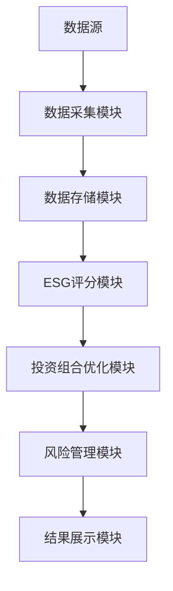

                 


# 价值投资与ESG：社会责任投资的融合

> 关键词：价值投资，ESG，社会责任投资，投资策略，可持续发展

> 摘要：本文探讨了价值投资与ESG（环境、社会、治理）如何在社会责任投资中融合，分析了它们的内在联系、融合机制以及实际应用，提出了构建ESG评分模型和优化投资组合的方法，并通过案例分析展示了其在实际投资中的应用。

---

## 第一部分: 价值投资与ESG的背景与概念

### 第1章: 价值投资的核心理念

#### 1.1 价值投资的定义与历史发展
价值投资是一种以企业内在价值为核心的投资策略，起源于20世纪20年代，由本杰明·格雷厄姆和戴维·多德提出。它基于对企业基本面的深入分析，寻找市场价格低于内在价值的股票。

- **内在价值**：企业未来现金流的现值，反映了企业的真正价值。
- **安全边际**：买入价格低于内在价值，以降低投资风险。
- **长期视角**：关注企业的长期盈利能力和社会贡献，而非短期市场波动。

#### 1.2 价值投资的哲学与方法
价值投资强调“以合理价格买入优秀企业”，注重企业的财务健康、行业地位和竞争优势。

- **财务健康**：关注企业的盈利能力、负债情况和现金流状况。
- **竞争优势**：寻找具有护城河的企业，确保长期竞争优势。
- **长期视角**：投资于能够持续为社会创造价值的企业。

### 第2章: ESG投资的定义与内涵

#### 2.1 ESG的定义与构成
ESG是环境、社会和治理三个维度的统称，反映了企业在可持续发展方面的表现。

- **环境（E）**：关注企业的环保表现，如碳排放、资源利用效率。
- **社会（S）**：关注企业对员工、消费者和社会的贡献，如劳动权益保护。
- **治理（G）**：关注企业治理结构和透明度，如董事会结构和高管薪酬。

#### 2.2 ESG投资的兴起与发展趋势
随着全球对可持续发展的关注，ESG投资逐渐成为主流。

- **全球趋势**：越来越多的机构投资者将ESG因素纳入投资决策。
- **中国现状**：中国ESG投资快速发展，相关政策和标准逐步完善。
- **未来展望**：ESG投资将更加注重企业的社会责任和长期价值。

---

## 第二部分: 价值投资与ESG的融合机制

### 第3章: 价值投资与ESG的内在联系

#### 3.1 价值投资与ESG的契合点
价值投资关注企业的长期价值，而ESG因素直接影响企业的长期盈利能力和社会认可度。

- **企业价值的影响**：良好的ESG表现通常与企业稳健的财务表现相关。
- **社会责任的体现**：企业通过履行社会责任，增强品牌形象和社会信任度。

#### 3.2 价值投资与ESG融合的逻辑框架
将ESG因素纳入价值投资分析，可以帮助投资者更全面地评估企业价值。

- **企业基本面分析**：将ESG指标作为企业基本面分析的重要组成部分。
- **风险管理**：通过ESG指标识别潜在风险，优化投资组合。
- **长期投资决策**：基于ESG表现，选择具有长期增长潜力的企业。

### 第4章: 价值投资与ESG融合的实现路径

#### 4.1 ESG指标在价值投资中的应用
ESG指标可以作为价值投资者筛选标的的重要依据。

- **ESG评分体系**：通过构建ESG评分模型，对企业的ESG表现进行量化评估。
- **数据获取与处理**：从公开数据源获取ESG相关数据，进行清洗和预处理。
- **权重分配**：根据行业特点和投资目标，确定各ESG维度的权重。

#### 4.2 价值投资与ESG融合的策略选择
结合ESG因素的价值投资策略，可以提升投资组合的可持续性和抗风险能力。

- **基于ESG的选股策略**：优先选择ESG表现优异的企业。
- **投资组合优化**：在满足ESG约束条件下，优化投资组合的收益和风险。
- **风险管理**：通过ESG指标识别和规避高风险企业。

---

## 第三部分: 价值投资与ESG融合的数学模型与算法

### 第5章: ESG评分模型的构建

#### 5.1 ESG评分模型的数学框架
基于因子分析的ESG评分模型，可以量化企业的ESG表现。

- **因子分析模型**：通过因子分析提取ESG指标的公共因子，计算各企业的ESG评分。
- **机器学习模型**：使用回归或分类算法，预测企业的ESG评分。

#### 5.2 ESG评分模型的实现代码
以下是基于Python的ESG评分模型实现：

```python
import pandas as pd
from sklearn.decomposition import FactorAnalysis

# 假设esg_data是一个包含ESG指标的数据框
esg_data = pd.DataFrame(...)

# 使用因子分析提取ESG因子
fa = FactorAnalysis(n_components=3)
esg_factors = fa.fit_transform(esg_data)

# 计算各企业的ESG评分（简化示例）
esg_scores = pd.DataFrame(esg_factors, index=esg_data.index, columns=['E', 'S', 'G'])
```

### 第6章: 价值投资与ESG融合的优化算法

#### 6.1 基于数学优化的投资组合构建
基于均值-方差优化的投资组合，加入ESG约束条件。

- **均值-方差优化模型**：目标是最小化投资组合的波动率，同时满足收益目标。
- **ESG约束条件**：设定投资组合中ESG评分低于一定值的企业权重为零。

#### 6.2 投资组合优化的数学公式
以下是一个带ESG约束的优化模型：

$$
\min_{w} \frac{1}{2}w^T \Sigma w \\
s.t. \\
w^T \mu = target\_return \\
w^T ESG\_mask = 0 \\
w^T 1 = 1 \\
w \geq 0
$$

其中，$\Sigma$ 是协方差矩阵，$\mu$ 是收益向量，$ESG\_mask$ 是ESG约束向量。

---

## 第四部分: 系统分析与架构设计

### 第7章: 系统功能设计

#### 7.1 系统功能模块
- 数据采集模块：获取企业ESG数据。
- ESG评分模块：计算企业的ESG评分。
- 投资组合优化模块：基于ESG评分构建投资组合。
- 风险管理模块：监控投资组合的ESG风险。

#### 7.2 系统架构设计
以下是系统的架构图：



---

## 第五部分: 项目实战与案例分析

### 第8章: 项目实战

#### 8.1 项目环境安装
需要安装以下Python库：

```bash
pip install pandas numpy scikit-learn matplotlib
```

#### 8.2 核心代码实现
以下是构建ESG评分模型的代码：

```python
import pandas as pd
import numpy as np
from sklearn.decomposition import FactorAnalysis

# 数据预处理
def preprocess_data(data):
    # 假设data是一个包含ESG相关指标的DataFrame
    # 这里进行数据清洗和标准化
    data = data.dropna()
    data = (data - data.mean()) / data.std()
    return data

# ESG评分模型
def build_esg_model(data):
    fa = FactorAnalysis(n_components=3, random_state=42)
    esg_factors = fa.fit_transform(data)
    esg_scores = pd.DataFrame(esg_factors, columns=['E', 'S', 'G'])
    return esg_scores

# 应用案例
if __name__ == "__main__":
    # 假设data是包含ESG数据的DataFrame
    esg_data = pd.DataFrame({
        'CO2排放': [100, 200, 150],
        '员工满意度': [80, 70, 90],
        '董事会多样性': [0.3, 0.5, 0.4]
    })
    
    # 数据预处理
    processed_data = preprocess_data(esg_data)
    # 构建ESG评分模型
    esg_scores = build_esg_model(processed_data)
    print(esg_scores)
```

#### 8.3 案例分析
以某行业的三家企业为例，构建ESG评分模型，并基于评分结果进行投资组合优化。

- **企业A**：ESG评分为（E=0.8，S=0.7，G=0.6）。
- **企业B**：ESG评分为（E=0.6，S=0.8，G=0.7）。
- **企业C**：ESG评分为（E=0.7，S=0.6，G=0.8）。

---

## 第六部分: 最佳实践与小结

### 第9章: 最佳实践

#### 9.1 投资策略建议
- **长期视角**：关注企业的长期价值和可持续发展。
- **ESG筛选**：将ESG指标作为选股的重要依据。
- **风险管理**：定期评估投资组合的ESG风险。

#### 9.2 注意事项
- **数据质量**：确保ESG数据的准确性和完整性。
- **模型优化**：根据市场变化不断优化ESG评分模型。
- **监管合规**：遵守相关监管要求，确保投资行为的合规性。

### 第10章: 小结

通过将价值投资与ESG理念相结合，投资者可以在追求超额收益的同时，承担社会责任，实现可持续发展。未来，随着ESG投资的深入发展，价值投资与ESG的融合将更加紧密，为投资者提供更优的选择。

---

## 作者

作者：AI天才研究院/AI Genius Institute & 禅与计算机程序设计艺术 /Zen And The Art of Computer Programming

---

这篇文章详细探讨了价值投资与ESG的融合，从理论到实践，结合数学模型和实际案例，为投资者提供了清晰的指导和深刻的理解。

