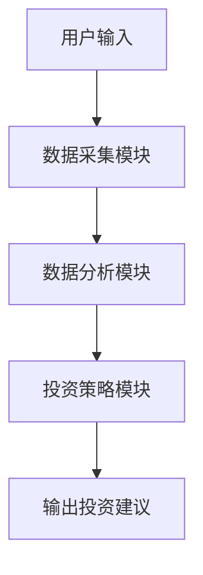

                 


# 《价值投资与人口统计学：把握人口结构变化带来的机遇》

---

## 关键词：  
价值投资，人口统计学，人口结构，投资策略，数据分析，人口老龄化，经济增长  

---

## 摘要：  
本文从价值投资与人口统计学的结合出发，深入分析人口结构变化对经济发展和投资机会的影响。通过数学建模、算法分析和系统设计，探讨如何利用人口统计数据优化投资决策，抓住人口结构变化带来的投资机遇。文章结合实际案例，提供详细的系统架构和实现方案，帮助读者掌握如何在价值投资中应用人口统计学原理。

---

## 第一章：价值投资与人口统计学概述

### 1.1 价值投资的核心概念

#### 1.1.1 价值投资的定义与特点  
价值投资是一种基于对公司内在价值的评估，寻找市场价格低于内在价值的投资策略。其核心在于寻找被市场低估的资产，并长期持有，等待其价值回归。  

**特点：**  
- 长期投资，注重公司基本面。  
- 依赖于对经济、行业和公司的深入分析。  
- 强调安全边际，即买入价格与内在价值的差距。  

#### 1.1.2 价值投资的基本原理  
价值投资的理论基础来源于格雷厄姆的价值投资体系，强调“安全边际”和“市场先生”的概念。  

**公式：**  
$$ \text{内在价值} = \sum_{t=1}^{\infty} \frac{\text{现金流}}{(1 + r)^t} $$  
其中，$r$为折现率，代表投资者要求的回报率。  

#### 1.1.3 价值投资与人口统计学的关联  
人口结构的变化会影响经济的供需关系，进而影响企业的盈利能力。例如，人口老龄化可能导致医疗需求增加，从而推动相关行业的发展。  

---

### 1.2 人口统计学的基本概念

#### 1.2.1 人口统计学的定义与研究范围  
人口统计学是研究人口数量、结构和分布的科学，涉及出生率、死亡率、迁移率、年龄结构等核心指标。  

**核心指标：**  
- 总人口数。  
- 年龄结构（0-14岁、15-64岁、65岁以上）。  
- 性别比例。  
- 城市化率。  

#### 1.2.2 人口结构的核心要素  
人口结构由年龄、性别、职业、教育程度等因素构成，其中年龄结构是最重要的变量。  

**年龄结构模型：**  
$$ \text{年龄分布} = \sum_{i=1}^{n} p_i \times a_i $$  
其中，$p_i$为第$i$个年龄段的人口比例，$a_i$为对应年龄。  

#### 1.2.3 人口统计学与经济发展的关系  
人口统计学是研究经济发展的重要工具，例如，劳动力供给、消费市场和创新活力均与人口结构密切相关。  

---

### 1.3 价值投资与人口统计学的结合

#### 1.3.1 人口结构变化对投资的影响  
人口结构变化会影响行业的兴衰。例如，老龄化社会将推动医疗、养老产业的发展。  

#### 1.3.2 价值投资视角下的人口统计学应用  
通过分析人口结构，投资者可以预测未来的消费趋势和行业机会。例如，年轻人口增长可能推动科技和消费行业的发展。  

#### 1.3.3 人口统计学在投资决策中的作用  
人口统计学为投资提供了数据支持和决策依据。例如，通过分析人口流动数据，可以判断区域经济的潜力。  

---

## 第二章：人口结构变化的分析与建模

### 2.1 人口结构变化的背景与趋势

#### 2.1.1 全球人口结构的变化趋势  
全球人口结构呈现老龄化趋势，尤其是发达国家。  

#### 2.1.2 不同国家或地区的人口结构特点  
发展中国家通常以年轻人口为主，而发达国家面临老龄化问题。  

#### 2.1.3 人口老龄化与年轻化趋势的对比  
老龄化社会面临劳动力不足和社保压力，而年轻化社会更具创新活力。  

---

### 2.2 人口结构变化的核心分析

#### 2.2.1 人口老龄化的影响  
老龄化可能导致医疗需求增加，同时也会减少劳动力供给。  

#### 2.2.2 年轻人口增长的影响  
年轻人口的增长推动消费和科技行业的快速发展。  

#### 2.2.3 人口流动与城市化的影响  
人口流动影响城市的经济发展和房地产市场的供需关系。  

---

### 2.3 人口结构变化的数学建模

#### 2.3.1 人口年龄分布模型  
$$ P(t) = \sum_{i=1}^{n} p_i \times e^{-r_i t} $$  
其中，$P(t)$为$t$时刻的年龄分布，$r_i$为人口增长率。  

#### 2.3.2 人口增长预测模型  
$$ \text{预测人口} = \text{当前人口} \times (1 + \text{增长率})^t $$  

---

## 第三章：人口统计学与价值投资的关联模型

### 3.1 人口结构变化与投资机会的关系

#### 3.1.1 人口老龄化与医疗健康投资  
老龄化社会将推动医疗、养老和健康管理行业的发展。  

#### 3.1.2 年轻人口增长与科技、消费投资  
年轻人口的增长为科技和消费行业提供了增长动力。  

#### 3.1.3 人口流动与区域经济发展  
人口流动影响区域经济的潜力，例如，人口流入的城市通常具有更高的经济增长潜力。  

---

### 3.2 人口统计学在价值投资中的应用模型

#### 3.2.1 人口结构变化的量化分析模型  
$$ \text{投资价值} = \text{公司基本面} \times \text{人口结构影响因子} $$  

#### 3.2.2 人口统计数据与投资标的的相关性分析  
通过回归分析，确定人口结构与投资标的之间的相关性。  

#### 3.2.3 人口结构驱动的投资机会预测模型  
$$ \text{投资机会} = \sum_{i=1}^{n} w_i \times x_i $$  
其中，$w_i$为权重，$x_i$为人口统计数据。  

---

### 3.3 人口统计学与价值投资的案例分析

#### 3.3.1 典型国家或地区的人口结构与投资策略  
以日本为例，老龄化社会推动医疗和养老产业的投资。  

#### 3.3.2 人口变化对行业龙头公司的影响  
以科技公司为例，年轻人口的增长推动了技术创新和消费增长。  

#### 3.3.3 人口流动对房地产市场的影响  
人口流入城市通常会带动房地产价格上涨。  

---

## 第四章：价值投资与人口统计学的系统架构设计

### 4.1 系统功能设计

#### 4.1.1 数据采集模块  
- 收集人口统计数据（如年龄、性别、城市化率）。  
- 数据来源包括政府统计数据和市场调研数据。  

#### 4.1.2 数据分析模块  
- 使用Python进行数据清洗和建模。  
- 应用机器学习算法预测人口结构变化对经济的影响。  

#### 4.1.3 投资策略模块  
- 根据人口结构变化调整投资组合。  
- 结合公司基本面分析和人口统计数据制定投资策略。  

---

### 4.2 系统架构设计

#### 4.2.1 系统架构图  


#### 4.2.2 系统接口设计  
- 数据接口：与政府统计局和市场调研机构对接。  
- 投资接口：与证券交易平台和投资管理系统对接。  

---

## 第五章：价值投资与人口统计学的案例分析

### 5.1 案例背景

#### 5.1.1 案例选择  
选择一个典型国家（如中国）进行分析。  

#### 5.1.2 数据来源  
使用国家统计局的人口数据和相关行业的市场数据。  

---

### 5.2 系统实现

#### 5.2.1 数据清洗与预处理  
```python
import pandas as pd
data = pd.read_csv('population.csv')
data_clean = data.dropna()
```

#### 5.2.2 数据建模  
```python
from sklearn.linear_model import LinearRegression
model = LinearRegression()
model.fit(X, y)
```

---

### 5.3 案例分析

#### 5.3.1 投资策略制定  
根据人口结构变化预测医疗行业的投资机会。  

#### 5.3.2 投资效果评估  
通过回测分析验证投资策略的有效性。  

---

## 第六章：总结与展望

### 6.1 本章总结  
通过人口统计学分析，投资者可以更好地把握经济趋势和投资机会。  

### 6.2 未来展望  
随着技术进步，人口统计学在价值投资中的应用将更加广泛和深入。  

---

## 参考文献  
1. 格雷厄姆《证券分析》  
2. 贝莱德《全球投资报告》  
3. 世界银行《全球经济展望》  

---

## 作者：AI天才研究院 & 禅与计算机程序设计艺术

