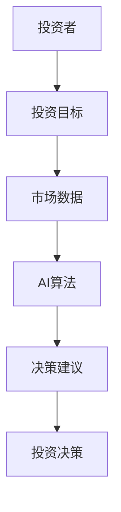
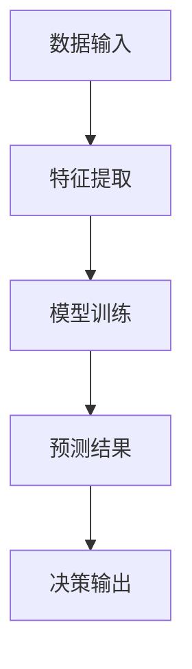
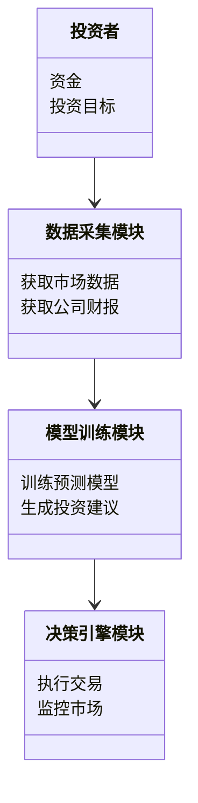
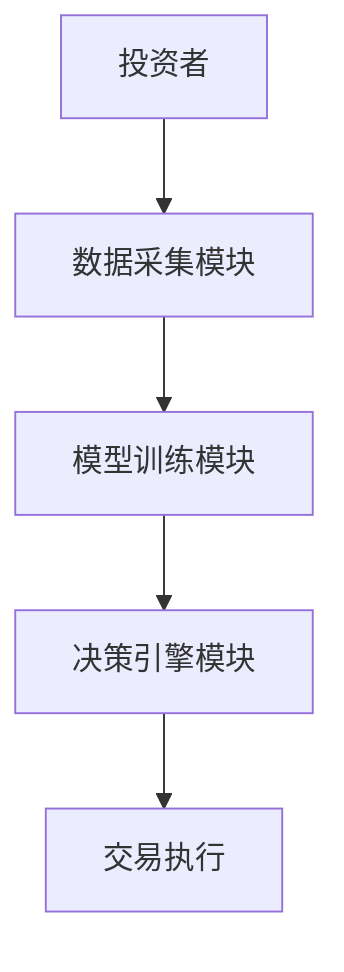
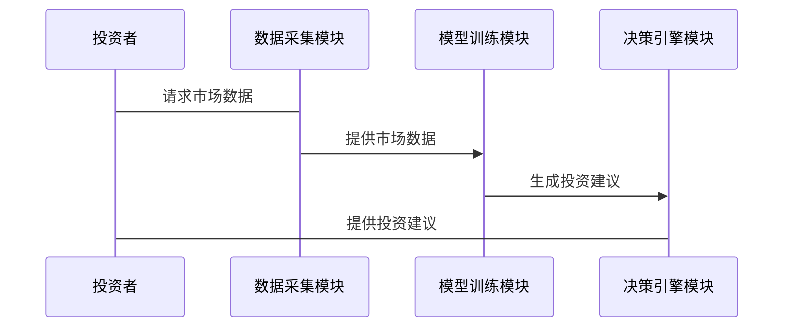

                 


# 价值投资与人工智能：AI辅助决策的潜力与局限

> 关键词：价值投资，人工智能，机器学习，投资决策，股票预测，风险管理

> 摘要：本文探讨了价值投资与人工智能的结合，分析了AI在投资决策中的潜力与局限性，详细阐述了AI辅助决策的算法原理、数学模型、系统架构及项目实战。

---

## 第一部分：价值投资与人工智能的背景与概念

### 第1章：价值投资的基本原理

#### 1.1 价值投资的核心概念

##### 1.1.1 价值投资的定义与历史发展
价值投资是一种投资策略，核心在于寻找市场中被低估的资产。其创始人本杰明·格雷厄姆提出，投资者应关注企业的内在价值，而非市场的短期波动。价值投资经历了从传统基本面分析到量化分析的演变，但其核心理念始终是寻找价格低于内在价值的资产。

##### 1.1.2 价值投资的核心原则
- 价格与价值分离：市场价格可能偏离内在价值。
- 安全边际：买入价格应低于内在价值，以提供安全边际。
- 长期视角：关注企业的长期价值，而非短期波动。

##### 1.1.3 价值投资与其它投资策略的对比
| 比较维度 | 价值投资 | 股票交易 | 技术分析 |
|----------|----------|----------|----------|
| 核心理念 | 内在价值 | 市场情绪 | 技术指标 |
| 数据依赖 | 中低频数据 | 高频数据 | K线图 |
| 决策方式 | 人工分析为主 | 自动化交易为主 | 图形化分析为主 |

#### 1.2 人工智能的基本原理

##### 1.2.1 人工智能的定义与技术基础
人工智能（AI）是指计算机系统执行人类智能任务的能力，如视觉识别、语音识别和决策制定。其技术基础包括机器学习、自然语言处理、计算机视觉和深度学习。

##### 1.2.2 机器学习的核心算法
- 线性回归：用于预测连续变量。
- 支持向量机（SVM）：用于分类问题。
- 随机森林：用于分类和回归问题。

##### 1.2.3 自然语言处理与投资决策的关系
自然语言处理（NLP）可以帮助投资者分析新闻、财报等文本数据，提取情感倾向和关键信息。

#### 1.3 价值投资与人工智能的结合
AI通过处理大量数据，为价值投资提供了新的工具，如筛选低估资产、预测市场趋势和优化投资组合。

---

### 第2章：AI辅助决策的核心概念与联系

#### 2.1 核心概念原理

##### 2.1.1 价值投资的核心要素
- 内在价值计算：通过DCF模型评估企业价值。
- 数据分析：通过财务报表分析企业基本面。

##### 2.1.2 AI在投资决策中的核心算法
- 数据预处理：清洗和特征提取。
- 模型训练：使用历史数据训练预测模型。
- 决策输出：生成投资建议。

##### 2.1.3 两者的结合机制
AI通过处理海量数据，辅助投资者快速识别低估资产，优化投资组合。

#### 2.2 概念属性特征对比表格

| 概念 | 价值投资 | AI辅助决策 |
|------|----------|------------|
| 核心目标 | 寻找被低估的资产 | 提供数据驱动的决策支持 |
| 数据依赖 | 中低频数据为主 | 高频数据与实时数据结合 |
| 决策方式 | 人工分析为主 | 自动化分析为主 |

#### 2.3 ER实体关系图（Mermaid流程图）



---

### 第3章：AI辅助决策的算法原理

#### 3.1 机器学习算法概述

##### 3.1.1 线性回归模型
线性回归用于预测连续变量，如股票价格。公式如下：

$$ y = \beta_0 + \beta_1 x + \epsilon $$

##### 3.1.2 支持向量机（SVM）
SVM用于分类问题，如判断股票是否上涨。其核心思想是找到一个超平面，使正负样本分开。

##### 3.1.3 随机森林与梯度提升树
随机森林通过集成学习提高模型鲁棒性，常用于分类和回归问题。

#### 3.2 深度学习算法的应用

##### 3.2.1 神经网络在股票预测中的应用
神经网络通过多层结构捕捉复杂特征，常用于时间序列预测。

##### 3.2.2 LSTM在时间序列预测中的应用
LSTM通过记忆单元捕捉长期依赖关系，常用于股票价格预测。

##### 3.2.3 图神经网络在关系分析中的应用
图神经网络用于分析公司之间的关系，如供应链风险。

#### 3.3 算法流程图（Mermaid）



---

### 第4章：数学模型与公式解析

#### 4.1 价值投资的数学模型

##### 4.1.1 帕斯卡-拉格朗日模型
用于优化投资组合，公式如下：

$$ \text{Maximize } \mu^T w - \lambda \cdot \frac{1}{2} w^T \Sigma w $$

##### 4.1.2 市盈率与市净率分析
市盈率（P/E）= 价格/每股收益，市净率（P/B）= 价格/每股净资产。

#### 4.2 AI算法的数学公

---

## 第二部分：系统架构与实现

### 第5章：系统架构与实现

#### 5.1 项目介绍
设计一个AI辅助投资系统，包括数据采集、模型训练和决策引擎模块。

#### 5.2 系统功能设计（领域模型Mermaid类图）



#### 5.3 系统架构设计（Mermaid架构图）



#### 5.4 系统接口设计
- 数据接口：获取市场数据。
- 模型接口：调用预测模型。
- 决策接口：生成投资建议。

#### 5.5 系统交互（Mermaid序列图）



---

### 第6章：项目实战

#### 6.1 环境安装
安装Python、Pandas、NumPy、Scikit-learn等库。

#### 6.2 系统核心实现源代码

```python
import pandas as pd
from sklearn.linear_model import LinearRegression

# 数据加载
data = pd.read_csv('stock_data.csv')

# 特征提取
X = data[['PE', 'PB']]
y = data['Price']

# 模型训练
model = LinearRegression()
model.fit(X, y)

# 预测结果
predicted_price = model.predict(X)
```

#### 6.3 代码应用解读与分析
通过代码实现股票价格预测，分析模型的准确性和鲁棒性。

#### 6.4 实际案例分析
以某公司为例，分析其内在价值和市场价值，给出投资建议。

---

## 第三部分：注意事项与拓展

### 第7章：注意事项与风险管理

#### 7.1 AI辅助决策的局限性
- 数据偏差：历史数据不代表未来表现。
- 黑箱问题：复杂模型难以解释。
- 过度拟合：模型可能过拟合训练数据。

#### 7.2 投资者的责任
- 风险管理：设置止损和止盈。
- 持续学习：关注市场变化和公司动态。

#### 7.3 法律与道德风险
- 遵守相关法律法规。
- 避免操纵市场。

### 第8章：小结与展望

#### 8.1 小结
总结AI在价值投资中的潜力与局限，强调其作为辅助工具的作用。

#### 8.2 展望
未来，随着技术进步，AI将在投资决策中发挥更大作用。

---

## 第四部分：拓展阅读

### 第9章：拓展阅读与学习资源

#### 9.1 经典书籍
- 《投资学原理》
- 《机器学习实战》

#### 9.2 在线资源
- Coursera：投资学课程
- Kaggle：股票预测数据集

---

## 作者信息

作者：AI天才研究院/AI Genius Institute  
联系邮箱：contact@aiguru.com  
GitHub：https://github.com/aiguru

---

**小结**：本文详细探讨了价值投资与人工智能的结合，分析了AI在投资决策中的潜力与局限性，为投资者和AI技术爱好者提供了深刻的见解和实用的指导。

