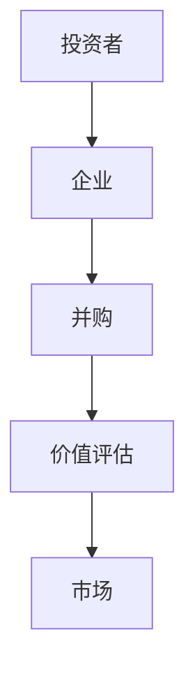

                 


# 价值投资与公司并购策略

## 关键词：
价值投资、公司并购、战略协同、资源配置、风险控制、净现值法、DCF模型

## 摘要：
本文深入探讨了价值投资与公司并购策略的核心概念、策略方法及其协同效应。通过分析基本面评估、安全边际和并购整合，结合数学模型和实际案例，展示了如何利用这些策略实现企业价值最大化。

---

# 第一部分: 价值投资与公司并购概述

## 第1章: 价值投资的核心概念

### 1.1 价值投资的定义与背景
价值投资是一种长期投资策略，注重通过深入分析企业的基本面，寻找被市场低估的投资标的。其核心在于关注企业的内在价值，而非短期市场波动。

#### 1.1.1 价值投资的基本定义
- 价值投资：通过分析企业的财务状况、行业地位和竞争优势，寻找市场价格低于内在价值的投资机会。
- 核心理念：安全边际，即买入价格低于内在价值，以降低风险并确保长期收益。

#### 1.1.2 价值投资的历史发展
- 起源：20世纪初，本杰明·格雷厄姆和戴维·多德提出价值投资理论。
- 发展：现代投资学结合价值投资与成长投资，形成多种策略。

#### 1.1.3 价值投资的核心要素
| 核心要素 | 描述 |
|----------|------|
| 安全边际 | 购买价格低于内在价值的部分，确保投资的安全性。 |
| 内在价值 | 企业未来现金流的现值，基于财务状况和行业地位计算。 |
| 长期视角 | 注重长期收益，而非短期市场波动。 |

### 1.2 公司并购的基本概念

#### 1.2.1 并购的基本定义
- 公司并购：企业通过购买其他企业部分或全部股权，实现战略扩张和资源优化。

#### 1.2.2 并购的主要类型
| 类型 | 描述 |
|------|------|
| 横向并购 | 同行业竞争对手的并购，旨在扩大市场份额。 |
| 纵向并购 | 上下游企业的并购，优化供应链。 |
| 混合并购 | 不同行业或业务的并购，寻求协同效应。 |

#### 1.2.3 并购的动机与目的
- 市场扩展：进入新市场或地区。
- 资源整合：获取技术、人才或生产能力。
- 成本优势：通过规模效应降低生产成本。

### 1.3 价值投资与公司并购的联系

#### 1.3.1 价值投资的视角
价值投资者在并购中注重企业长期价值，而非短期股价波动。他们寻找具有强大竞争优势和良好管理的企业，通过并购实现价值提升。

#### 1.3.2 并购中的价值评估
- 评估目标企业：分析财务状况、行业地位和未来盈利能力。
- 计算协同效应：评估并购后的成本节约和收入增长潜力。

#### 1.3.3 并购后的整合策略
- 组织整合：优化管理结构，提高运营效率。
- 文化整合：统一企业文化和价值观，确保团队和谐。

---

## 第二章: 价值投资的核心策略

### 2.1 基本面分析

#### 2.1.1 财务指标分析
- 利润能力：ROE（净资产收益率）、净利润率。
- 资产状况：资产负债率、流动比率。
- 现金流：自由现金流，评估企业造血能力。

#### 2.1.2 行业分析
- 行业生命周期：朝阳行业或成熟行业。
- 市场竞争格局：集中度、主要竞争对手分析。

#### 2.1.3 竞争优势分析
- 核心竞争力：技术、品牌、成本优势。
- 技术创新：研发能力、专利数量。

### 2.2 安全边际与投资组合

#### 2.2.1 安全边际的重要性
- 安全边际 = 内在价值 - 市场价格。
- 确保在市场波动中避免重大损失。

#### 2.2.2 投资组合的构建
- 分散投资：降低单一投资的风险。
- 风险控制：设定止损点，避免重大亏损。

---

## 第三章: 公司并购的策略与分析

### 3.1 并购动因分析

#### 3.1.1 市场扩展
- 进入新市场：通过并购快速拓展市场。
- 获取新客户：通过并购获得稳定的客户群。

#### 3.1.2 资源整合
- 技术获取：并购具有先进技术的企业。
- 降低成本：通过规模效应降低生产成本。

### 3.2 并购评估方法

#### 3.2.1 净现值法（NPV）
- NPV = 现金流入的现值 - 初始投资。
- 用于评估并购后的收益是否超过成本。

#### 3.2.2 投资回收期
- 投资回收期 = 初始投资 / 年均现金流。
- 用于评估并购的回收速度。

### 3.3 并购整合中的风险

#### 3.3.1 文化冲突
- 不同企业文化可能导致管理混乱。
- 解决方法：提前制定整合计划，逐步融合文化。

#### 3.3.2 业务整合
- 业务协同：确保并购后业务的高效运作。
- 管理整合：统一管理流程，避免重复劳动。

---

## 第四章: 价值投资与公司并购的协同效应

### 4.1 战略协同效应

#### 4.1.1 资源优化配置
- 并购实现资源的最优分配。
- 通过协同效应降低成本。

#### 4.1.2 竞争优势强化
- 并购增强企业的核心竞争力。
- 通过规模效应提升市场地位。

### 4.2 风险控制与竞争优势

#### 4.2.1 风险控制
- 并购前进行充分的尽职调查。
- 并购后建立风险监控机制。

#### 4.2.2 竞争优势
- 并购带来技术和市场的优势。
- 通过协同效应提升整体竞争力。

---

## 第五章: 算法与数学模型

### 5.1 贴现现金流模型（DCF）

#### 5.1.1 DCF模型公式
$$
DCF = \sum_{t=1}^{n} \frac{CF_t}{(1 + r)^t} + \frac{TV}{(1 + r)^n}
$$
其中，CF_t为第t年的现金流，r为折现率，TV为终值。

#### 5.1.2 DCF模型代码示例
```python
def calculate_dcf(cash_flows, discount_rate, terminal_value):
    dcf = 0
    for t, cf in enumerate(cash_flows, 1):
        dcf += cf / (1 + discount_rate) ** t
    dcf += terminal_value / (1 + discount_rate) ** len(cash_flows)
    return dcf

# 示例数据
cash_flows = [100, 200, 300]  # 前三年现金流
discount_rate = 0.1  # 折现率10%
terminal_value = 1000  # 终值
dcf = calculate_dcf(cash_flows, discount_rate, terminal_value)
print(f"DCF 值为：{dcf}")
```

### 5.2 净现值法（NPV）

#### 5.2.1 NPV公式
$$
NPV = \sum_{t=1}^{n} \frac{CF_t}{(1 + r)^t}
$$
其中，CF_t为第t年的现金流，r为贴现率。

#### 5.2.2 NPV代码示例
```python
def calculate_npv(cash_flows, discount_rate):
    npv = 0
    for t, cf in enumerate(cash_flows, 1):
        npv += cf / (1 + discount_rate) ** t
    return npv

# 示例数据
cash_flows = [-500, 200, 200, 200]  # 初始投资-500，后续三年每年200
discount_rate = 0.1  # 折现率10%
npv = calculate_npv(cash_flows, discount_rate)
print(f"NPV 值为：{npv}")
```

---

## 第六章: 系统分析与架构设计方案

### 6.1 项目介绍

#### 6.1.1 项目背景
- 通过构建系统化投资框架，实现价值投资与公司并购的协同效应。

### 6.2 系统功能设计

#### 6.2.1 领域模型（Mermaid类图）


### 6.3 系统架构设计

#### 6.3.1 系统架构图


---

## 第七章: 项目实战

### 7.1 并购案例分析

#### 7.1.1 案例介绍
- 某公司并购一家技术领先的上游企业。

#### 7.1.2 并购过程
- 尽职调查：评估目标企业的财务状况和竞争优势。
- 价值评估：计算DCF模型确定合理价格。
- 整合计划：制定组织和文化的整合方案。

### 7.2 代码实现与解读

#### 7.2.1 DCF模型实现
```python
def calculate_dcf(cash_flows, discount_rate, terminal_value):
    dcf = 0
    for t, cf in enumerate(cash_flows, 1):
        dcf += cf / (1 + discount_rate) ** t
    dcf += terminal_value / (1 + discount_rate) ** len(cash_flows)
    return dcf

# 示例数据
cash_flows = [100, 200, 300]
discount_rate = 0.1
terminal_value = 1000
dcf = calculate_dcf(cash_flows, discount_rate, terminal_value)
print(f"DCF 值为：{dcf}")
```

---

## 第八章: 最佳实践与总结

### 8.1 总结

#### 8.1.1 关键点总结
- 价值投资与公司并购策略的协同效应。
- 并购中的估值模型和风险控制。

### 8.1.2 小结
通过系统化的分析和案例研究，本文展示了如何在价值投资与公司并购中实现协同效应，提升企业价值。

### 8.2 注意事项

#### 8.2.1 风险提示
- 并购后的整合风险。
- 市场波动对企业价值的影响。

### 8.3 拓展阅读
- 格雷厄姆《安全边际》
- 罗斯柴尔德《并购的艺术》

---

作者：AI天才研究院 & 禅与计算机程序设计艺术

