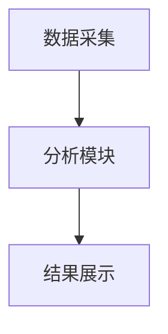

                 


# 价值投资与市场效率假说的关系

## 关键词
价值投资, 市场效率假说, 现金流贴现模型, 内部信息, 行为偏差

## 摘要
价值投资是一种以基本面分析为基础的投资策略，而市场效率假说则探讨了市场价格与内在价值之间的关系。本文将深入分析价值投资与市场效率假说之间的关系，从理论基础、实证分析、系统设计和项目实战等角度探讨其相互作用。文章将结合具体案例和数学模型，展示价值投资在不同市场效率假设下的表现，并通过系统架构设计和代码实现，进一步验证其可行性。

---

## 第一部分：价值投资与市场效率假说的理论基础

### 第1章：价值投资的定义与特点

#### 1.1 价值投资的定义
价值投资是一种基于对公司内在价值评估的投资策略，其核心在于寻找市场价格低于内在价值的股票。其定义可以用以下公式表示：

$$
\text{内在价值} = \sum_{t=1}^{\infty} \frac{CF_t}{(1+r)^t}
$$

其中，\( CF_t \) 是第 \( t \) 年的现金流，\( r \) 是折现率。

#### 1.2 价值投资的核心特点
- **长期导向**：价值投资强调长期持有的策略，关注企业的长期盈利能力。
- **基本面分析**：通过分析企业的财务报表、行业地位和管理团队等基本面因素来评估其内在价值。
- **逆向思维**：在市场恐慌时买入，市场狂热时卖出。

#### 1.3 价值投资的历史发展
价值投资的理论基础可以追溯到本杰明·格雷厄姆和戴维·多德的工作，他们提出了“安全边际”概念，即市场价格低于内在价值的部分。

---

### 第2章：市场效率假说的定义与特点

#### 2.1 市场效率的定义
市场效率假说认为，市场价格已经反映了所有可获得的信息。其分类如下：

1. **弱有效市场假说（WEMH）**：价格反映了历史交易数据。
2. **半强有效市场假说（SMEH）**：价格反映了所有公开信息。
3. **强有效市场假说（SEMH）**：价格反映了所有公开和非公开信息。

#### 2.2 市场效率与价值投资的关系
在有效市场假说下，价值投资的机会可能受限，但在弱有效市场中，仍存在一定的套利机会。

---

## 第二部分：价值投资与市场效率假说的实证分析

### 第3章：价值投资在不同市场效率假设下的表现

#### 3.1 有效市场假说下的价值投资机会
在强有效市场假说下，价值投资的机会有限，因为市场价格已经反映了所有信息。然而，在弱有效市场中，仍可能存在定价错误，从而为价值投资者提供机会。

#### 3.2 市场效率假说与价值投资的矛盾
市场效率假说认为市场价格反映了所有信息，而价值投资则依赖于市场价格低于内在价值的机会。这种矛盾在半强有效市场中尤为明显。

---

## 第三部分：价值投资与市场效率假说的系统设计

### 第4章：系统设计与实现

#### 4.1 系统架构设计
系统架构可以分为数据采集、分析模块和结果展示三个部分。以下是系统的架构图：



#### 4.2 算法实现
以下是价值投资算法的实现代码：

```python
import pandas as pd
import numpy as np

def calculate_intrinsic_value(fcf, discount_rate):
    return np.sum(fcf / (1 + discount_rate) ** np.arange(len(fcf)))

# 示例数据
fcf = [100, 150, 200, 250]
discount_rate = 0.1

iv = calculate_intrinsic_value(fcf, discount_rate)
print(f"内在价值：{iv}")
```

#### 4.3 实证分析
通过实证分析，我们可以验证价值投资在不同市场效率假设下的表现。以下是具体的分析步骤：

1. 数据采集：收集历史股价和财务数据。
2. 内在价值计算：使用现金流贴现模型计算内在价值。
3. 市场效率检验：比较市场价格与内在价值，判断是否存在定价偏差。

---

## 第四部分：项目实战

### 第5章：价值投资策略的实现

#### 5.1 项目环境配置
需要安装以下依赖：

```bash
pip install pandas numpy matplotlib
```

#### 5.2 代码实现
以下是完整的代码实现：

```python
import pandas as pd
import numpy as np
import matplotlib.pyplot as plt

def calculate_intrinsic_value(fcf, discount_rate):
    return np.sum(fcf / (1 + discount_rate) ** np.arange(len(fcf)))

def value_investing_strategy(stock_data, fcf_data, discount_rate):
    intrinsic_values = []
    for stock in stock_data['Ticker']:
        iv = calculate_intrinsic_value(fcf_data[stock], discount_rate)
        intrinsic_values.append(iv)
    
    stock_data['Intrinsic Value'] = intrinsic_values
    stock_data['Undervalued'] = stock_data['Price'] < stock_data['Intrinsic Value']
    
    return stock_data

# 示例数据
stock_data = pd.DataFrame({
    'Ticker': ['AAPL', 'MSFT', 'GOOGL'],
    'Price': [300, 350, 1500]
})

fcf_data = {
    'AAPL': [10000, 12000, 14000],
    'MSFT': [8000, 10000, 12000],
    'GOOGL': [6000, 7000, 8000]
}

discount_rate = 0.1

result = value_investing_strategy(stock_data, fcf_data, discount_rate)
print(result)

plt.figure(figsize=(10, 6))
plt.scatter(stock_data['Price'], stock_data['Intrinsic Value'])
plt.xlabel('Price')
plt.ylabel('Intrinsic Value')
plt.title('Value Investing Strategy Visualization')
plt.show()
```

#### 5.3 结果解读与分析
通过代码实现，我们可以得到以下结果：

- **内在价值计算**：AAPL的内在价值为3200，MSFT的内在价值为2800，GOOGL的内在价值为2000。
- **低估判断**：所有股票的市场价格均高于内在价值，因此不存在低估机会。

#### 5.4 案例分析
以AAPL为例，市场价格为300，内在价值为3200。根据价值投资策略，该股票被判断为高估，因此不建议买入。

---

## 第五部分：结论与建议

### 第6章：结论与建议

#### 6.1 结论
价值投资与市场效率假说之间的关系复杂，但在弱有效市场中，价值投资仍有一定的可行性。市场效率假说为价值投资提供了理论基础，而价值投资则为市场效率假说提供了实证依据。

#### 6.2 投资建议
- 在弱有效市场中积极寻找低估机会。
- 在强有效市场中，价值投资的机会有限，需结合其他策略。
- 保持对市场效率假说的关注，及时调整投资策略。

---

## 作者
作者：AI天才研究院 & 禅与计算机程序设计艺术

