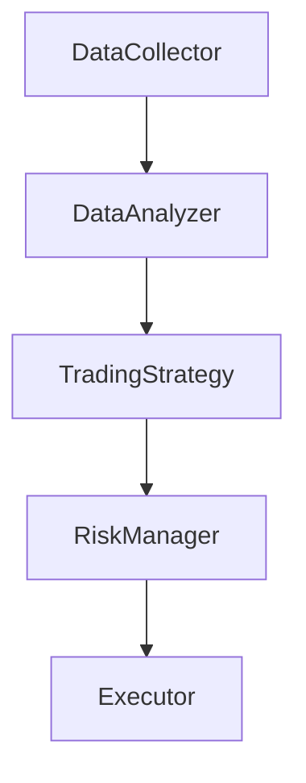

                 


# 价值投资与技术分析的结合

## 关键词
价值投资、技术分析、投资策略、量化模型、风险管理、系统架构

## 摘要
价值投资与技术分析的结合是一种新兴的投资策略，它将基本面分析与市场技术分析相结合，利用数学模型和算法优化投资决策。本文详细探讨了价值投资与技术分析的核心概念、结合策略、量化模型以及系统架构设计，通过实际案例分析和代码实现，帮助投资者在复杂多变的市场中做出更科学的投资决策。

---

## 第一章：价值投资与技术分析的基本概念

### 1.1 价值投资的定义与核心理念
#### 1.1.1 价值投资的起源与发展
- 价值投资的起源可以追溯到本杰明·格雷厄姆和戴维·多德的工作。
- 20世纪以来，价值投资逐渐从理论走向实践，成为机构投资者的重要策略。
- 通过分析企业的基本面，寻找被市场低估的投资标的。

#### 1.1.2 价值投资的核心理念与原则
- 价值投资的核心理念是寻找市场价格低于内在价值的股票。
- 以安全边际为原则，强调长期投资和风险控制。

#### 1.1.3 价值投资的适用场景与边界
- 适用于长期投资者，尤其是对低波动性和高成长性的企业感兴趣的投资人。
- 在市场恐慌或低估时更具优势，但在市场过热时可能表现不佳。

### 1.2 技术分析的定义与核心方法
#### 1.2.1 技术分析的基本概念
- 技术分析通过研究市场数据（价格、成交量等）预测未来走势。
- 强调市场的“价格只反映价值”特性，认为价格波动具有规律性。

#### 1.2.2 技术分析的主要方法与工具
- 移动平均线（MA）、相对强弱指数（RSI）、布林带（Bollinger Bands）等指标。
- 图表模式分析，如头肩顶、旗形等。

#### 1.2.3 技术分析的优缺点与适用场景
- 技术分析的优点：能够捕捉短期价格波动，适合高频交易。
- 技术分析的缺点：无法预测长期基本面变化，容易受到市场情绪影响。

### 1.3 价值投资与技术分析的结合意义
#### 1.3.1 价值投资与技术分析的互补性
- 价值投资提供选股标准，技术分析提供交易时机。
- 通过结合两者，可以在控制风险的前提下，捕捉市场机会。

#### 1.3.2 结合两者的投资策略优势
- 理论上，价值投资提供长期收益，技术分析优化交易成本。
- 结合策略可以减少盲目投资，提高决策的科学性。

#### 1.3.3 结合策略在实际投资中的应用前景
- 在复杂市场环境下，结合策略能够帮助投资者更好地应对波动性。
- 适合机构投资者和高净值个人投资者。

## 第二章：价值投资的核心模型与方法

### 2.1 股票估值的核心模型
#### 2.1.1 市盈率（P/E）模型
- 市盈率公式：$$ P/E = \frac{Price}{Earnings} $$
- 适用于成长型企业，反映市场对收益的估值。

#### 2.1.2 市净率（P/B）模型
- 市净率公式：$$ P/B = \frac{Price}{Book\ Value} $$
- 适用于资产密集型企业，反映市场对资产的估值。

#### 2.1.3 内在价值（DCF）模型
- DCF模型公式：$$ Intrinsic\ Value = \sum_{t=1}^{n} \frac{CF_t}{(1+r)^t} + \frac{TV}{(1+r)^n} $$
- 通过现金流折现计算企业的真实价值。

#### 2.1.4 其他估值模型对比
- 对比分析表：
| 模型 | 适用场景 | 优点 | 缺点 |
|------|----------|------|------|
| P/E  | 成长型企业 | 简单易用 | 易受行业影响 |
| P/B  | 资产密集型企业 | 稳定性高 | 无法反映收益 |
| DCF  | 各类企业 | 精准 | 计算复杂 |

### 2.2 价值投资的关键指标分析
#### 2.2.1 财务指标分析（ROE、ROA等）
- ROE公式：$$ ROE = \frac{Net\ Profit}{Equity} $$
- ROA公式：$$ ROA = \frac{Net\ Profit}{Total\ Assets} $$

#### 2.2.2 股东权益收益率分析
- 股东权益收益率（ROE）是衡量企业盈利能力的重要指标。

#### 2.2.3 企业盈利能力与成长性分析
- 利润增长率：$$ Growth\ Rate = \frac{Current\ Profit - Previous\ Profit}{Previous\ Profit} $$
- 营收增长率：$$ Revenue\ Growth\ Rate = \frac{Current\ Revenue - Previous\ Revenue}{Previous\ Revenue} $$

### 2.3 价值投资的选股策略
#### 2.3.1 低估值选股策略
- 通过P/E、P/B等指标筛选低估股票。
- 示例代码：
```python
import pandas as pd

# 计算市盈率和市净率
def calculate_valuation_ratios(df):
    df['P/E'] = df['Close'] / df['Earnings']
    df['P/B'] = df['Close'] / df['Book Value']
    return df

# 选择P/E和P/B均低于行业平均值的股票
selected_stocks = df[df['P/E'] < industry_avg_pe]
selected_stocks = selected_stocks[selected_stocks['P/B'] < industry_avg_pb]
```

#### 2.3.2 高质量企业筛选标准
- 标准包括ROE、净利率、资产负债率等。

#### 2.3.3 行业分析与企业竞争优势评估
- 行业分析：通过行业生命周期判断企业前景。
- 企业竞争优势：评估企业的核心竞争力和市场地位。

## 第三章：技术分析的核心指标与图表模式

### 3.1 技术分析的主要指标
#### 3.1.1 移动平均线（MA）
- MA公式：$$ MA_n = \frac{1}{n} \sum_{i=1}^{n} Close_i $$
- 示例代码：
```python
import pandas as pd

# 计算5日和10日移动平均线
df['MA5'] = df['Close'].rolling(5).mean()
df['MA10'] = df['Close'].rolling(10).mean()
```

#### 3.1.2 相对强弱指数（RSI）
- RSI公式：$$ RSI = 100 - \frac{100}{1 + \frac{A}{B}} $$
- 其中，A为上涨幅度，B为下跌幅度。

#### 3.1.3 布林带（Bollinger Bands）
- Bollinger Bands公式：
$$ Upper\ Band = MA_n + 2 \times \sigma $$
$$ Lower\ Band = MA_n - 2 \times \sigma $$
- 示例代码：
```python
import pandas as pd
import numpy as np

# 计算布林带
df['Bollinger'] = df['Close'].rolling(20).apply(lambda x: x.mean() + 2 * x.std())
```

#### 3.1.4 成交量与成交量指标（OBV）
- OBV公式：$$ OBV = \sum_{i=1}^{n} \text{成交量} \times \text{价格变动方向} $$

### 3.2 技术分析的图表模式
#### 3.2.1 趋势线与支撑阻力位
- 趋势线：通过连接价格波动点，判断价格走势。
- 支撑位：价格下跌时的支撑点，阻力位：价格上涨时的阻碍点。

#### 3.2.2 头肩顶与头肩底形态
- 头肩顶：价格形成三个峰，中间高，两侧低。
- 头肩底：价格形成三个谷，中间低，两侧高。

#### 3.2.3 旗形与反向旗形形态
- 旗形：价格波动形成平行四边形，预示趋势延续。
- 反向旗形：价格波动形成倒置平行四边形，预示趋势反转。

### 3.3 技术分析的交易信号与策略
#### 3.3.1 买入信号与卖出信号
- 买入信号：价格突破阻力位，或RSI进入超买区域。
- 卖出信号：价格跌破支撑位，或RSI进入超卖区域。

#### 3.3.2 技术指标的背离分析
- 背离：价格趋势与技术指标趋势相反，预示趋势反转。

#### 3.3.3 图表形态的突破与回测策略
- 突破策略：价格突破形态后，顺势交易。
- 回测策略：价格回调至形态内，再次突破后加仓。

## 第四章：价值投资与技术分析的结合策略

### 4.1 价值投资与技术分析的结合思路
#### 4.1.1 价值投资提供选股标准
- 通过基本面分析筛选低估股票。
- 示例代码：
```python
import pandas as pd

# 筛选低估值股票
low_valuation_stocks = df[df['P/E'] < 15]
low_valuation_stocks = low_valuation_stocks[low_valuation_stocks['P/B'] < 2]
```

#### 4.1.2 技术分析提供交易时机
- 通过技术指标确定买入和卖出时机。
- 示例代码：
```python
import pandas as pd

# 等待价格突破阻力位后买入
selected_stocks['Entry Price'] = selected_stocks['Close'].shift(1)
selected_stocks['Resistance'] = selected_stocks['High'].rolling(20).mean()
selected_stocks['Buy Signal'] = selected_stocks['Close'] > selected_stocks['Resistance']
```

#### 4.1.3 两者结合的策略框架
- 结合策略框架：
  1. 筛选基本面优良、低估的股票。
  2. 通过技术分析确认买入和卖出时机。
  3. 根据市场环境动态调整仓位。

### 4.2 结合策略的具体实施步骤
#### 4.2.1 筛选低估值股票
- 使用P/E和P/B模型筛选低估股票。
- 示例代码：
```python
import pandas as pd

# 筛选P/E < 15且P/B < 2的股票
selected_stocks = df[df['P/E'] < 15]
selected_stocks = selected_stocks[selected_stocks['P/B'] < 2]
```

#### 4.2.2 技术分析确认交易信号
- 使用移动平均线和相对强弱指数确认买入和卖出信号。
- 示例代码：
```python
import pandas as pd

# 确认买入信号
selected_stocks['Buy Signal'] = selected_stocks['RSI'] > 70
selected_stocks['Sell Signal'] = selected_stocks['RSI'] < 30
```

#### 4.2.3 结合市场环境调整策略
- 根据市场整体走势调整投资策略。
- 示例代码：
```python
import pandas as pd

# 计算市场情绪指标
market_sentiment = df['Volume'].rolling(50).mean()
selected_stocks['Market Bullish'] = market_sentiment > market_sentiment.mean()
```

### 4.3 结合策略的风险控制与优化
#### 4.3.1 风险管理与仓位控制
- 风险管理：设定止损点，控制单笔交易的风险。
- 仓位控制：根据市场环境和投资组合分散风险。

#### 4.3.2 策略的动态优化
- 动态优化：根据市场变化调整策略参数。
- 示例代码：
```python
import pandas as pd

# 动态调整P/E筛选标准
selected_stocks['Dynamic P/E'] = selected_stocks['P/E'].shift(1)
selected_stocks['P/E Threshold'] = selected_stocks['Dynamic P/E'].rolling(20).mean()
```

#### 4.3.3 市场环境变化对策略的影响
- 市场环境变化：如经济周期、政策变化等，对投资策略的影响。

### 4.4 本章小结
- 结合价值投资与技术分析，可以提高投资决策的科学性和准确性。
- 通过动态优化和风险控制，可以更好地应对复杂市场环境。

## 第五章：技术分析的量化模型与算法实现

### 5.1 技术分析指标的量化模型
#### 5.1.1 均值回归模型
- 均值回归模型：假设价格会回归到均值。
- 示例代码：
```python
import pandas as pd

# 计算均值回归信号
df['Mean'] = df['Close'].rolling(50).mean()
df['Signal'] = df['Close'] < df['Mean']
```

#### 5.1.2 动量模型
- 动量模型：假设价格趋势会延续。
- 示例代码：
```python
import pandas as pd

# 计算动量信号
df['Momentum'] = df['Close'].pct_change().rolling(10).mean()
df['Signal'] = df['Momentum'] > 0.05
```

#### 5.1.3 超买超卖指标模型
- 超买超卖指标：通过RSI等指标判断市场情绪。
- 示例代码：
```python
import pandas as pd

# 计算RSI
df['RSI'] = (100 - (100 / (1 + df['Up'].rolling(14).sum() / df['Down'].rolling(14).sum())))
df['Buy Signal'] = df['RSI'] < 30
df['Sell Signal'] = df['RSI'] > 70
```

### 5.2 技术分析的机器学习实现
#### 5.2.1 机器学习模型的选择
- 常见模型包括随机森林、支持向量机、神经网络等。

#### 5.2.2 机器学习模型的训练与优化
- 数据预处理：归一化、特征选择。
- 模型训练：使用历史数据训练模型。
- 模型优化：调整超参数，防止过拟合。

#### 5.2.3 机器学习模型的预测与验证
- 预测：使用训练好的模型预测未来价格走势。
- 验证：通过回测验证模型的有效性。

### 5.3 数学公式与算法实现
#### 5.3.1 均值回归模型的数学公式
$$ \text{Signal} = \begin{cases} 1 & \text{如果 Close < Mean} \\ 0 & \text{其他情况} \end{cases} $$

#### 5.3.2 动量模型的数学公式
$$ \text{Momentum} = \frac{1}{n} \sum_{i=1}^{n} \frac{Close_t - Close_{t-i}}{Close_{t-i}} $$

#### 5.3.3 机器学习模型的训练过程
- 数据分割：训练集和测试集。
- 特征工程：提取技术指标作为特征。
- 模型训练：使用训练集训练模型。
- 模型验证：在测试集上验证模型性能。

### 5.4 本章小结
- 技术分析的量化模型可以通过数学公式和算法实现，提高预测的准确性。
- 机器学习模型的应用，为技术分析提供了新的可能性。

## 第六章：价值投资中的风险管理

### 6.1 风险管理的重要性
- 风险管理是投资成功的关键。
- 有效的风险管理可以减少损失，提高投资收益。

### 6.2 价值投资中的风险管理策略
#### 6.2.1 仓位管理
- 根据市场环境和投资组合分散风险。
- 示例代码：
```python
import pandas as pd

# 计算单只股票的权重
selected_stocks['Weight'] = selected_stocks['Market Cap'].apply(lambda x: x / selected_stocks['Market Cap'].sum())
```

#### 6.2.2 止损策略
- 设置止损点，避免过度亏损。
- 示例代码：
```python
import pandas as pd

# 设置止损点
selected_stocks['Stop Loss'] = selected_stocks['Close'] * 0.95
selected_stocks['Exit Signal'] = selected_stocks['Close'] < selected_stocks['Stop Loss']
```

#### 6.2.3 风险调整后的投资组合
- 通过优化模型构建风险调整后的投资组合。
- 示例代码：
```python
import pandas as pd
from scipy.optimize import minimize

# 定义优化目标函数
def objective(weights, covariance_matrix, target_return):
    return (weights.T @ covariance_matrix @ weights) ** 0.5

# 优化权重
weights = minimize(objective, initial_weights, args=(covariance_matrix, target_return))
```

### 6.3 本章小结
- 风险管理是价值投资中不可忽视的重要部分。
- 通过仓位管理和止损策略，可以有效控制投资风险。

## 第七章：价值投资与技术分析结合的系统架构设计

### 7.1 系统架构设计
#### 7.1.1 系统功能设计
- 数据采集模块：采集股票数据。
- 数据分析模块：进行基本面和技术面分析。
- 交易策略模块：生成买入和卖出信号。
- 风险管理模块：控制投资风险。

#### 7.1.2 系统架构图


### 7.2 系统接口设计
#### 7.2.1 数据接口
- 数据接口：从数据源获取股票数据。
- 示例代码：
```python
import pandas as pd
import requests

# 从网络接口获取数据
def get_data(url):
    response = requests.get(url)
    data = response.json()
    df = pd.DataFrame(data)
    return df
```

#### 7.2.2 交易接口
- 交易接口：向交易系统发送指令。
- 示例代码：
```python
import pandas as pd
import trading_api

# 发出买入指令
trading_api.send_order('Buy', 100, 'AAPL')
```

### 7.3 系统交互流程
#### 7.3.1 数据采集与分析
- 数据采集模块采集股票数据，传送给数据分析模块。
- 数据分析模块进行基本面和技术面分析，生成候选股票列表。

#### 7.3.2 交易策略与执行
- 交易策略模块根据候选股票列表和市场信号生成交易指令。
- 执行模块将交易指令发送至交易系统。

#### 7.3.3 风险管理与监控
- 风险管理模块实时监控投资组合风险，调整交易策略。

### 7.4 本章小结
- 系统架构设计为价值投资与技术分析的结合提供了框架支持。
- 通过模块化设计，可以提高系统的可维护性和扩展性。

## 第八章：案例分析与实际应用

### 8.1 案例分析
#### 8.1.1 案例背景
- 选择某只股票，分析其基本面和技术面。
- 示例代码：
```python
import pandas as pd

# 选择股票
selected_stock = df[df['Ticker'] == 'AAPL']
```

#### 8.1.2 技术分析与价值分析结合
- 结合P/E和RSI指标，制定买入和卖出策略。
- 示例代码：
```python
import pandas as pd

# 确定买入信号
selected_stock['Buy Signal'] = selected_stock['RSI'] < 30
selected_stock['Sell Signal'] = selected_stock['RSI'] > 70
```

### 8.2 实际应用
#### 8.2.1 环境安装与配置
- 安装必要的Python库，如pandas、numpy、scipy等。

#### 8.2.2 系统核心实现
- 实现数据采集、分析、交易策略和风险管理模块。
- 示例代码：
```python
import pandas as pd
import trading_api

# 数据采集模块
def collect_data(ticker):
    return trading_api.get_historical_data(ticker)

# 数据分析模块
def analyze_data(data):
    # 基本面分析
    value_ratios = calculate_valuation_ratios(data)
    # 技术分析
    technical_signals = generate_technical_signals(data)
    return value_ratios, technical_signals

# 交易策略模块
def generate_signals(value_ratios, technical_signals):
    # 筛选低估值股票
    selected_stocks = value_ratios[value_ratios['P/E'] < 15]
    selected_stocks = selected_stocks[selected_stocks['P/B'] < 2]
    # 生成交易信号
    selected_stocks['Buy Signal'] = selected_stocks['RSI'] < 30
    selected_stocks['Sell Signal'] = selected_stocks['RSI'] > 70
    return selected_stocks
```

#### 8.2.3 案例分析与解读
- 通过实际案例分析，验证结合策略的有效性。
- 示例分析：
  - 选择一只低估值股票，价格处于支撑位，RSI进入超卖区域。
  - 买入信号触发，执行买入操作。
  - 后期价格反弹，RSI进入超买区域，卖出信号触发，执行卖出操作。

### 8.3 本章小结
- 实际应用案例证明了价值投资与技术分析结合的有效性。
- 通过系统化的分析和交易策略，可以提高投资收益。

## 第九章：总结与展望

### 9.1 本章总结
- 价值投资与技术分析的结合是一种科学的投资策略。
- 通过量化模型和系统架构设计，可以提高投资决策的准确性。

### 9.2 对未来研究的展望
- 进一步研究结合策略的优化方法。
- 探讨人工智能在投资策略中的应用。
- 研究更多技术指标和量化模型，提升策略的多样性。

## 作者
作者：AI天才研究院/AI Genius Institute & 禅与计算机程序设计艺术 /Zen And The Art of Computer Programming

