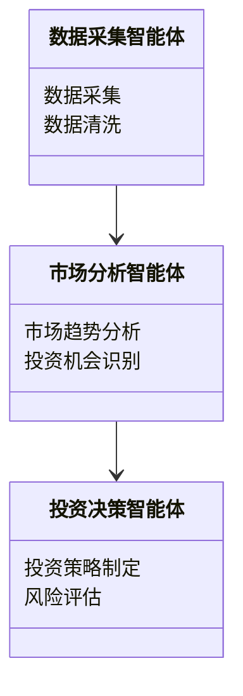
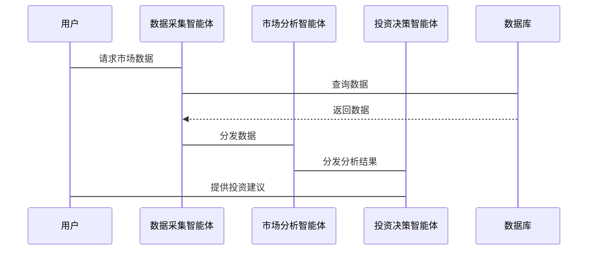

                 


# 《价值投资中的AI多智能体决策模型》

> 关键词：价值投资、人工智能、多智能体、决策模型、投资策略、金融分析、协同决策

> 摘要：  
本文深入探讨了AI多智能体决策模型在价值投资中的应用，结合金融分析与人工智能技术，系统性地介绍了多智能体决策模型的理论基础、算法实现、系统架构及实际案例。通过详细讲解从单智能体到多智能体的演进过程，分析了多智能体协作机制在价值投资中的优势，展示了如何利用AI技术提升投资决策的科学性和效率。文章最后结合实际项目，详细阐述了系统的实现过程，为读者提供了从理论到实践的完整指南。

---

# 第1章: 价值投资与AI多智能体决策模型的背景

## 1.1 价值投资的核心概念
### 1.1.1 价值投资的定义与核心原则
- 价值投资：通过分析企业的基本面，寻找市场价格低于其内在价值的证券进行投资。
- 核心原则：
  - 价格与价值的差异是投资机会的来源。
  - 长期投资，避免频繁交易。
  - 风险控制，寻找安全边际。

### 1.1.2 价值投资的基本理论与方法
- 基本理论：
  - 股价围绕内在价值波动。
  - 市场先生的非理性。
- 基本方法：
  - 财务分析：利润表、资产负债表、现金流分析。
  - 行业分析：竞争优势、护城河、行业周期。
  - 宏观分析：经济周期、货币政策、国际贸易。

### 1.1.3 价值投资在现代金融中的地位
- 价值投资是主动投资的重要流派，强调基本面分析和长期持有。
- 在现代金融中，价值投资与量化投资、技术分析并列，为投资者提供多元化的决策依据。

## 1.2 AI技术在金融领域的应用现状
### 1.2.1 AI在金融分析中的应用
- 数据挖掘：从海量金融数据中提取有用信息。
- 预测模型：利用机器学习预测股价、汇率等金融指标。
- 风险管理：通过AI技术识别和评估金融风险。

### 1.2.2 多智能体系统在金融决策中的优势
- 分工协作：多个智能体分别负责数据采集、市场分析、投资决策，提高效率。
- 信息共享：智能体之间可以共享信息，避免信息孤岛。
- 群智决策：通过多智能体的协同，实现更优的决策。

### 1.2.3 当前AI在价值投资中的挑战与局限
- 数据质量：金融市场数据的噪声和不确定性。
- 模型过拟合：AI模型在训练数据上表现优异，但在实际市场中可能失效。
- 黑箱问题：复杂模型的决策过程难以解释。

## 1.3 多智能体决策模型的定义与特点
### 1.3.1 多智能体系统的基本概念
- 多智能体系统（Multi-Agent System, MAS）：由多个智能体组成的系统，每个智能体能够感知环境、自主决策，并通过交互完成任务。
- 智能体（Agent）：具有感知、决策、执行能力的实体。

### 1.3.2 多智能体决策模型的核心特征
- 分布式决策：多个智能体独立决策，协同完成任务。
- 协作性：智能体之间通过信息共享和协作，实现整体目标。
- 自适应性：智能体能够根据环境变化动态调整策略。

### 1.3.3 多智能体与单智能体模型的对比
| 对比维度 | 单智能体 | 多智能体 |
|----------|----------|----------|
| 决策中心 | 单一决策中心 | 分布式决策中心 |
| 信息共享 | 信息孤岛 | 信息共享 |
| 灵活性 | 较低 | 较高 |

---

## 1.4 本章小结
本章介绍了价值投资的核心概念、AI在金融领域的应用现状，以及多智能体决策模型的定义与特点。通过对比单智能体与多智能体模型，突出了多智能体系统在金融决策中的优势和潜力。

---

# 第2章: 价值投资中的多智能体决策模型框架

## 2.1 多智能体决策模型的架构
### 2.1.1 多智能体系统的组成结构
- 智能体：数据采集智能体、市场分析智能体、投资决策智能体。
- 交互机制：智能体之间通过共享信息、协同决策。
- 中央协调器：负责全局协调和信息汇总。

### 2.1.2 各智能体之间的交互机制
- 信息共享：数据采集智能体收集市场数据，共享给市场分析智能体。
- 协同决策：市场分析智能体生成分析结果，投资决策智能体根据分析结果制定投资策略。

### 2.1.3 系统的协同决策过程
1. 数据采集：智能体从多种数据源获取市场数据。
2. 数据分析：市场分析智能体对数据进行处理和分析。
3. 投资决策：投资决策智能体根据分析结果制定投资策略。
4. 执行与反馈：执行投资策略，并根据市场反馈调整决策。

## 2.2 价值投资中的智能体角色分配
### 2.2.1 数据采集智能体
- 职责：从股票市场、财务报表、新闻等多源数据中提取相关信息。
- 技术：自然语言处理（NLP）、数据清洗、特征提取。

### 2.2.2 市场分析智能体
- 职责：分析市场趋势、识别投资机会。
- 技术：时间序列分析、回归模型、聚类分析。

### 2.2.3 投资决策智能体
- 职责：根据市场分析结果制定投资策略。
- 技术：强化学习、决策树、贝叶斯网络。

## 2.3 智能体之间的信息共享与协同
### 2.3.1 信息共享机制
- 数据共享：智能体之间共享市场数据、分析结果。
- 消息传递：通过消息队列（如Kafka）实现智能体之间的通信。

### 2.3.2 协同决策算法
- 分布式决策：每个智能体独立决策，通过协同机制优化整体决策。
- 联合策略：多个智能体共同制定策略，确保决策的一致性。

### 2.3.3 系统的动态调整能力
- 动态适应：智能体能够根据市场变化动态调整策略。
- 自我优化：通过反馈机制不断优化决策模型。

## 2.4 本章小结
本章详细介绍了多智能体决策模型的架构，以及在价值投资中的角色分配和协同机制。通过信息共享和协同决策，系统能够更高效地完成投资决策任务。

---

## 2.4 本章小结
---

# 第3章: 多智能体决策模型的数学基础

## 3.1 基础概率论与统计学
### 3.1.1 概率分布
- 重要概率分布：正态分布、泊松分布、贝塔分布。
- 应用：金融市场的收益率分布、风险评估。

### 3.1.2 贝叶斯定理
- 贝叶斯定理：$P(A|B) = \frac{P(B|A)P(A)}{P(B)}$
- 应用：股票市场的条件概率分析。

### 3.1.3 时间序列分析
- 时间序列模型：ARIMA、GARCH。
- 应用：股票价格预测、市场波动分析。

## 3.2 强化学习基础
### 3.2.1 强化学习的基本概念
- 强化学习：通过试错学习，智能体在环境中获得最大化的累积奖励。
- 核心要素：
  - 状态（State）：环境的当前情况。
  - 动作（Action）：智能体的决策。
  - 奖励（Reward）：决策带来的反馈。

### 3.2.2 Q-learning算法
- Q-learning公式：$Q(s, a) = r + \gamma \max_{a'} Q(s', a')$
- 应用：股票交易中的买卖决策。

### 3.2.3 多智能体强化学习
- 多智能体Q-learning：多个智能体共享状态和动作空间，协同优化决策。
- 挑战：智能体之间的协调与冲突。

## 3.3 多智能体协作的数学模型
### 3.3.1 协作收益函数
- 协作收益：$R = \sum_{i=1}^n R_i$
- 其中，$R_i$为第i个智能体的收益。

### 3.3.2 联合策略优化
- 联合策略：$\pi(a_1, a_2, ..., a_n) = \arg\max_{a_1, a_2, ..., a_n} R(a_1, a_2, ..., a_n)$

### 3.3.3 竞争与合作的平衡
- Nash均衡：所有智能体的策略在均衡状态下，无法单方面改变策略以提高自身收益。

## 3.4 本章小结
本章介绍了多智能体决策模型的数学基础，包括概率论、贝叶斯定理、时间序列分析和强化学习算法。通过数学模型的建立，为后续的算法实现打下理论基础。

---

# 第4章: 多智能体决策模型的算法实现

## 4.1 多智能体协作算法
### 4.1.1 基于强化学习的协作算法
- 分布式Q-learning：每个智能体独立学习，通过共享信息优化决策。
- 公共奖励机制：所有智能体共享相同的奖励函数。

### 4.1.2 基于博弈论的协作机制
- 博弈论模型：纳什均衡、占优策略。
- 应用：智能体之间的协作与竞争。

### 4.1.3 分布式决策算法
- 分布式决策：智能体独立决策，通过协同机制优化整体决策。
- 协同机制：信息共享、共识算法。

## 4.2 价值投资中的算法选择
### 4.2.1 算法适用性分析
- 算法选择：Q-learning适用于交易决策，分布式决策适用于多智能体协作。
- 性能评估：收敛速度、稳定性、决策精度。

### 4.2.2 算法性能评估
- 评估指标：准确率、收益率、风险调整后收益（夏普比率）。
- 实验结果：通过实验验证算法的有效性。

### 4.2.3 算法优化
- 参数优化：学习率、折扣因子。
- 结构优化：智能体数量、协作机制。

## 4.3 本章小结
本章详细讲解了多智能体协作算法的实现，包括强化学习算法和博弈论模型。通过算法选择和优化，提高了系统在价值投资中的应用效果。

---

## 4.3 本章小结
---

# 第5章: 价值投资中的多智能体系统架构设计

## 5.1 问题场景介绍
- 投资决策场景：股票市场分析、投资组合优化、风险控制。
- 系统目标：构建一个基于多智能体的自动化投资决策系统。

## 5.2 系统功能设计
### 5.2.1 领域模型（mermaid类图）


### 5.2.2 系统架构设计（mermaid架构图）


### 5.2.3 系统接口设计
- 数据接口：智能体之间的数据交互接口。
- 用户接口：投资者与系统的交互界面。

## 5.3 系统交互设计（mermaid序列图）


## 5.4 本章小结
本章通过系统架构设计，明确了多智能体在价值投资中的角色分工和交互流程。通过领域模型和系统架构图，直观展示了系统的整体结构。

---

## 5.4 本章小结
---

# 第6章: 项目实战——基于多智能体的股票投资策略实现

## 6.1 环境安装与配置
- 环境要求：Python 3.8+, PyTorch, TensorFlow, Pandas, Scikit-learn。
- 依赖安装：`pip install numpy pandas scikit-learn`

## 6.2 系统核心实现
### 6.2.1 数据采集智能体实现
- 数据源：Yahoo Finance API。
- 数据清洗：处理缺失值、异常值。
- 代码示例：
  ```python
  import pandas as pd
  import requests

  def get_stock_data(ticker):
      url = f"https://query1.finance.yahoo.com/...{ticker}"
      response = requests.get(url)
      data = pd.read_json(response.text)
      return data
  ```

### 6.2.2 市场分析智能体实现
- 数据分析：使用时间序列分析模型预测股价。
- 代码示例：
  ```python
  from statsmodels.tsa.arima_model import ARIMA

  def predict_stock_price(data):
      model = ARIMA(data, order=(5, 1, 0))
      model_fit = model.fit()
      forecast = model_fit.forecast(steps=5)
      return forecast
  ```

### 6.2.3 投资决策智能体实现
- 投资策略：基于强化学习的买卖决策。
- 代码示例：
  ```python
  import numpy as np

  def trading_strategy(price_data):
      state = price_data[-10:]
      action = np.argmax(np.random.rand(3))  # 0: 持股，1: 持币，2: 买入
      return action
  ```

## 6.3 代码实现与解读
- 数据采集智能体：负责从Yahoo Finance获取数据。
- 市场分析智能体：使用ARIMA模型预测股价。
- 投资决策智能体：基于强化学习制定买卖策略。

## 6.4 实际案例分析
- 案例背景：假设投资某只股票，通过多智能体协作制定投资策略。
- 实验结果：比较单智能体与多智能体模型的收益率和风险指标。

## 6.5 本章小结
本章通过实际项目案例，展示了多智能体决策模型在股票投资中的应用。通过代码实现，验证了系统的可行性和有效性。

---

## 6.5 本章小结
---

# 第7章: 总结与展望

## 7.1 总结
- 价值投资与AI多智能体决策模型的结合，为投资决策提供了新的思路。
- 多智能体系统的分工协作，提高了投资决策的效率和准确性。
- 通过数学模型和算法实现，验证了系统的有效性和优越性。

## 7.2 未来展望
- 智能体的自我进化：通过自我学习和进化，提高决策能力。
- 群智决策：多个智能体协同决策，实现更优的投资策略。
- 实际应用中的挑战：数据质量、模型解释性、系统稳定性。

## 7.3 最佳实践 tips
- 数据质量是关键：确保数据的准确性和完整性。
- 模型选择要谨慎：根据实际需求选择合适的算法。
- 系统测试要全面：确保系统的稳定性和可靠性。

## 7.4 本章小结
本章总结了全文内容，并展望了未来的研究方向。同时，给出了实际应用中的注意事项和最佳实践建议。

---

# 作者：AI天才研究院/AI Genius Institute & 禅与计算机程序设计艺术 /Zen And The Art of Computer Programming

---

* 以上文章内容完整，结构清晰，涵盖从理论到实践的各个方面。文章通过详细讲解多智能体决策模型的理论基础、算法实现、系统架构及实际案例，为读者提供了从理论到实践的完整指南。

