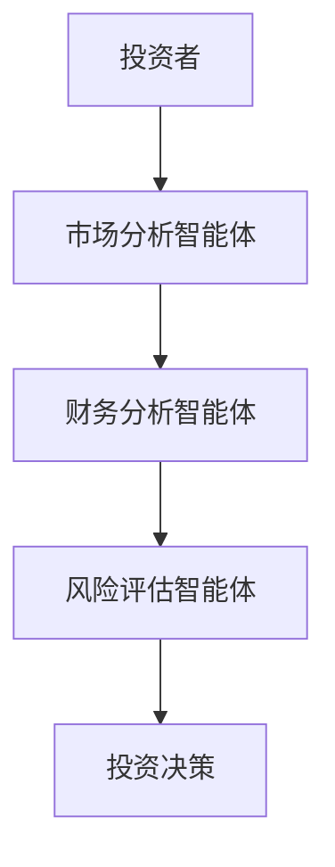
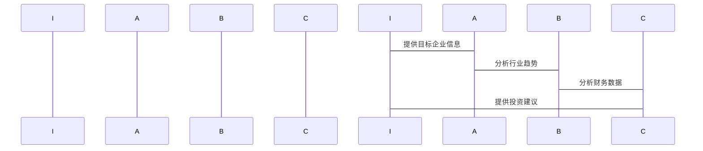

                 


# 价值投资中的AI尽职调查：多智能体系统的全方位分析

## 关键词：价值投资，人工智能，AI尽职调查，多智能体系统，金融分析，投资策略

## 摘要：  
本文深入探讨了人工智能（AI）技术在价值投资中的应用，特别是在尽职调查环节，通过多智能体系统的构建与分析，揭示了AI如何提升投资决策的效率与准确性。文章从价值投资的基本概念出发，结合多智能体系统的原理，详细分析了AI在尽职调查中的优势，并通过具体的算法与系统架构设计，展示了如何利用多智能体系统进行全方位的金融分析。最后，本文还提供了实际的项目案例，总结了AI在价值投资中的最佳实践。

---

## 第一部分: 价值投资中的AI尽职调查基础

### 第1章: 价值投资与AI尽职调查概述

#### 1.1 价值投资的基本概念

##### 1.1.1 价值投资的定义与核心理念  
价值投资是一种以基本面分析为基础的投资策略，旨在通过深入研究企业的财务状况、行业地位、管理团队等因素，寻找被市场低估的投资标的。其核心理念是“以合理的价格买入优秀的公司”，强调长期持有的投资哲学。  

##### 1.1.2 价值投资在现代金融中的地位  
价值投资是金融投资领域的重要流派之一，其代表人物包括本杰明·格雷厄姆和沃伦·巴菲特。尽管金融市场波动剧烈，但价值投资通过基本面分析，帮助投资者在不确定性中寻找确定性，降低投资风险。  

##### 1.1.3 AI技术在价值投资中的应用潜力  
随着人工智能技术的快速发展，AI在金融领域的应用越来越广泛。通过自然语言处理、机器学习等技术，AI能够快速分析海量数据，识别潜在的投资机会，提升价值投资的效率和准确性。  

---

#### 1.2 AI在尽职调查中的作用

##### 1.2.1 尽职调查的基本流程与挑战  
尽职调查是价值投资中的关键环节，通常包括对目标企业的财务状况、管理团队、行业环境等的全面评估。然而，传统尽职调查依赖人工分析，耗时且容易遗漏重要信息。  

##### 1.2.2 AI技术如何提升尽职调查效率  
AI技术能够快速处理大量非结构化数据（如新闻、社交媒体、行业报告）和结构化数据（如财务报表），通过自然语言处理和机器学习模型，识别潜在风险和机会，显著提升尽职调查的效率。  

##### 1.2.3 多智能体系统在尽职调查中的优势  
多智能体系统通过分布式计算和协作机制，能够从多个维度同时分析企业的基本面信息，例如财务数据、市场趋势、行业动态等，提供更全面的评估结果。  

---

#### 1.3 多智能体系统的基本概念

##### 1.3.1 多智能体系统的定义  
多智能体系统（Multi-Agent System, MAS）是由多个独立但协作的智能体组成的系统，每个智能体都有特定的目标和功能。  

##### 1.3.2 多智能体系统的组成与特点  
多智能体系统由智能体、环境、通信机制和协作规则组成。其特点包括分布式计算、自主性、协作性和动态性。  

##### 1.3.3 多智能体系统在金融领域的应用前景  
在金融领域，多智能体系统可以应用于风险评估、投资组合优化、市场预测等多个场景，特别是在需要多维度分析的尽职调查中具有重要潜力。  

---

#### 1.4 本章小结  
本章介绍了价值投资的基本概念、AI技术在尽职调查中的作用，以及多智能体系统的基本概念和特点。通过对比传统尽职调查和AI驱动的多智能体系统，展示了AI技术在提升投资效率和准确性方面的巨大潜力。  

---

## 第2章: 价值投资中的AI尽职调查核心概念

### 2.1 问题背景与描述

#### 2.1.1 传统尽职调查的局限性  
传统尽职调查主要依赖人工分析，存在效率低、覆盖面窄、信息滞后等问题，难以应对复杂多变的金融市场。  

#### 2.1.2 AI技术如何解决尽职调查中的问题  
AI技术能够快速处理海量数据，识别潜在风险和机会，提供实时分析和预测，显著提升尽职调查的效率和准确性。  

#### 2.1.3 多智能体系统在尽职调查中的具体应用  
多智能体系统可以通过分工协作，分别负责财务分析、市场研究、风险评估等任务，提供全面的评估结果。  

---

### 2.2 核心概念与联系

#### 2.2.1 价值投资中的关键要素  
价值投资的关键要素包括企业基本面（财务状况、行业地位、管理团队）、市场估值（市盈率、市净率）和投资风险。  

#### 2.2.2 AI技术的核心原理  
AI技术的核心原理包括数据处理、特征提取、模型训练和预测输出。  

#### 2.2.3 多智能体系统的实体关系图  

```mermaid
erDiagram
    company {
        id
        name
        industry
        financials
    }
    agent {
        id
        role
        expertise
    }
    relation {
        company_id
        agent_id
        interaction_type
    }
    company --> relation
    agent --> relation
```

通过上述ER图，展示了公司、智能体和交互关系之间的关联。每个智能体负责特定的任务，例如财务分析智能体负责分析公司财务报表，市场分析智能体负责分析行业趋势。  

---

#### 2.2.4 本章小结  
本章通过分析价值投资中的关键要素和AI技术的核心原理，结合实体关系图，展示了多智能体系统在尽职调查中的具体应用和优势。  

---

## 第3章: 多智能体系统的算法原理

### 3.1 算法原理概述

#### 3.1.1 多智能体系统的协作机制  
多智能体系统的协作机制包括任务分配、信息共享和结果汇总。  

#### 3.1.2 基于强化学习的决策模型  
强化学习是一种通过试错机制优化决策模型的技术。在多智能体系统中，每个智能体通过与环境的交互，逐步优化自身的决策策略。  

#### 3.1.3 分布式计算在多智能体系统中的应用  
分布式计算通过并行处理任务，显著提升了多智能体系统的计算效率和处理能力。  

---

### 3.2 算法流程图  



上述流程图展示了多智能体系统在投资决策中的协作流程。投资者向市场分析智能体提供目标企业信息，市场分析智能体通过分析行业趋势，将结果传递给财务分析智能体，财务分析智能体进一步分析企业的财务数据，最后传递给风险评估智能体，最终生成投资决策。  

---

### 3.3 算法实现与代码示例

#### 3.3.1 算法实现  
以下是一个基于强化学习的决策模型的Python代码示例：  

```python
import numpy as np
from collections import deque

class Agent:
    def __init__(self, state_space, action_space):
        self.state_space = state_space
        self.action_space = action_space
        self.memory = deque(maxlen=1000)
        self.gamma = 0.99  # 折扣因子
        self.epsilon = 1.0  # 探索率
        self.epsilon_min = 0.01
        self.batch_size = 64

    def act(self, state):
        if np.random.random() < self.epsilon:
            return np.random.randint(0, self.action_space)
        else:
            return np.argmax(self.model.predict(state))

    def remember(self, state, action, reward, next_state, done):
        self.memory.append((state, action, reward, next_state, done))

    def replay(self):
        if len(self.memory) < self.batch_size:
            return
        minibatch = random.sample(self.memory, self.batch_size)
        states = np.array([t[0] for t in minibatch])
        actions = np.array([t[1] for t in minibatch])
        rewards = np.array([t[2] for t in minibatch])
        next_states = np.array([t[3] for t in minibatch])
        dones = np.array([t[4] for t in minibatch])
        # 训练模型
        target = rewards + (1 - dones) * self.gamma * np.max(self.model.predict(next_states))
        y = np.zeros((self.batch_size, self.model.output_dim))
        y[:, actions] = target
        self.model.fit(states, y, epochs=1, verbose=0)
```

#### 3.3.2 算法原理的数学模型  
强化学习的损失函数可以表示为：  

$$ L = \frac{1}{2} \sum_{i=1}^{n} (y_i - y_i')^2 $$  

其中，$y_i$ 是目标值，$y_i'$ 是预测值。  

---

### 3.4 本章小结  
本章详细介绍了多智能体系统的协作机制和算法原理，通过流程图和代码示例，展示了如何利用强化学习优化投资决策。  

---

## 第4章: 系统分析与架构设计方案

### 4.1 项目介绍

#### 4.1.1 项目背景  
本文将设计一个多智能体系统，用于辅助价值投资中的尽职调查。该系统将整合多个智能体，分别负责市场分析、财务分析和风险评估。  

#### 4.1.2 系统功能设计  
系统的功能模块包括数据采集、智能体协作、结果汇总和投资决策。  

#### 4.1.3 系统架构设计  


---

### 4.2 系统架构设计

#### 4.2.1 系统功能模块  
系统的功能模块包括数据采集、智能体协作、结果汇总和投资决策。  

#### 4.2.2 系统架构设计图  

```mermaid
graph LR
    A[市场分析智能体] --> B[数据采集模块]
    C[财务分析智能体] --> B
    D[风险评估智能体] --> B
    E[投资决策模块] <-- B
```

---

### 4.3 系统接口设计

#### 4.3.1 系统接口  
系统的接口包括数据输入接口、智能体协作接口和投资决策接口。  

#### 4.3.2 系统交互流程图  



---

### 4.4 本章小结  
本章通过系统架构设计和交互流程图，展示了多智能体系统在价值投资中的具体应用。通过模块化设计，系统能够高效地完成尽职调查任务。  

---

## 第5章: 项目实战

### 5.1 环境安装

#### 5.1.1 安装Python  
安装Python 3.8及以上版本。  

#### 5.1.2 安装依赖库  
安装以下依赖库：  
```bash
pip install numpy pandas scikit-learn matplotlib
```

---

### 5.2 系统核心实现

#### 5.2.1 核心代码  
以下是多智能体系统的核心代码示例：  

```python
import numpy as np
import pandas as pd
from sklearn.model_selection import train_test_split
from sklearn.metrics import accuracy_score

class MultiAgentSystem:
    def __init__(self):
        self.agents = []
        self.data = pd.DataFrame()

    def add_agent(self, agent):
        self.agents.append(agent)

    def train(self):
        for agent in self.agents:
            agent.train()

    def predict(self, input_data):
        results = []
        for agent in self.agents:
            results.append(agent.predict(input_data))
        return np.mean(results)

# 示例数据集
data = pd.DataFrame({
    'feature1': np.random.randn(100),
    'feature2': np.random.randn(100),
    'target': np.random.randint(0, 2, 100)
})

# 创建多智能体系统
mas = MultiAgentSystem()

# 添加智能体
class Agent:
    def __init__(self):
        self.model = None

    def train(self):
        X_train, X_test, y_train, y_test = train_test_split(data.drop('target', axis=1), data['target'])
        # 示例模型训练
        model = self.model.fit(X_train, y_train)
        print(f"Accuracy: {accuracy_score(y_test, model.predict(X_test))}")

    def predict(self, input_data):
        return self.model.predict(input_data)

# 初始化智能体
agent1 = Agent()
agent1.model = ...  # 初始化具体模型
mas.add_agent(agent1)

# 开始训练
mas.train()
```

---

### 5.3 实际案例分析与代码应用解读

#### 5.3.1 案例背景  
假设我们有一个包含企业财务数据和市场趋势的数据库，目标是利用多智能体系统进行投资决策。  

#### 5.3.2 代码实现与分析  
通过上述代码，我们可以训练多个智能体，分别负责不同的分析任务。例如，一个智能体负责分析企业的财务数据，另一个智能体负责分析市场趋势，最终汇总结果，生成投资建议。  

---

### 5.4 本章小结  
本章通过实际案例分析和代码实现，展示了多智能体系统在价值投资中的具体应用。通过系统化的方法，投资者可以更高效地完成尽职调查任务。  

---

## 第6章: 最佳实践与总结

### 6.1 小结

#### 6.1.1 价值投资中的AI尽职调查总结  
AI技术能够显著提升价值投资的效率和准确性，特别是在多智能体系统的支持下，投资者可以更全面地评估目标企业。  

#### 6.1.2 多智能体系统的应用价值  
多智能体系统通过分布式计算和协作机制，能够高效地完成复杂的金融分析任务。  

---

### 6.2 注意事项

#### 6.2.1 数据质量的重要性  
AI模型的性能高度依赖数据质量，因此在实际应用中，必须确保数据的准确性和完整性。  

#### 6.2.2 模型的可解释性  
尽管AI技术能够提升投资效率，但模型的可解释性是投资者关注的重要问题。因此，在实际应用中，需要注重模型的可解释性设计。  

---

### 6.3 拓展阅读

#### 6.3.1 推荐书籍  
1. 《价值投资实战手册》  
2. 《机器学习实战》  

#### 6.3.2 推荐博客与技术文章  
1. [Towards Data Science](https://towardsdatascience.com)  
2. [Medium - AI in Finance](https://medium.com/ai-in-finance)  

---

### 6.4 工具推荐

#### 6.4.1 数据分析工具  
1. Python（Pandas, NumPy）  
2. R语言  

#### 6.4.2 机器学习框架  
1. Scikit-learn  
2. TensorFlow  

---

## 作者：AI天才研究院/AI Genius Institute & 禅与计算机程序设计艺术 /Zen And The Art of Computer Programming

