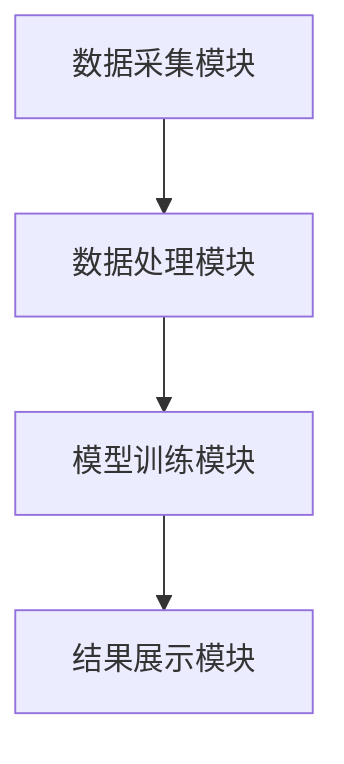

                 


# 价值投资中的AI智能体保险业务价值评估系统

## 关键词：
- 价值投资
- AI智能体
- 保险业务
- 价值评估系统
- 机器学习
- 系统架构
- 项目实战

## 摘要：
本文探讨了在保险业务价值评估中应用AI智能体的系统设计与实现。通过分析保险业务的核心要素和价值投资的基本原理，结合AI技术的优势，构建了一个基于机器学习的保险业务价值评估系统。本文详细阐述了系统的背景、核心概念、算法原理、系统架构，并通过项目实战展示了系统的实现过程和应用案例，为价值投资者提供了有力的技术支持。

---

# 第一部分：保险业务价值评估的背景与现状

## 第1章：保险业务价值评估的基本概念

### 1.1 保险业务的基本概念
#### 1.1.1 保险的定义与分类
保险是一种通过分散风险来保障经济安全的机制。常见的保险类型包括人寿保险、财产保险、健康保险和责任保险等。每种保险类型都有其独特的风险评估和价值计算方式。

#### 1.1.2 保险业务的价值构成
保险产品的价值主要体现在保障金额、保费收入、赔付率、投资收益和风险管理能力等方面。准确评估保险业务的价值对于投资者来说至关重要。

#### 1.1.3 保险业务价值评估的重要性
在价值投资中，准确评估保险业务的价值可以帮助投资者识别潜在的投资机会，降低投资风险，并实现长期稳定的收益。

### 1.2 价值投资的核心理念
#### 1.2.1 价值投资的定义
价值投资是一种通过深入分析企业的基本面，寻找被市场低估的投资标的，以实现长期收益的投资策略。

#### 1.2.2 价值投资与保险业务的结合
保险业务作为金融市场的核心组成部分，其内在价值可以通过价值投资的方法进行评估。通过AI技术辅助，可以提高评估的准确性和效率。

---

## 第2章：AI技术在保险业务价值评估中的应用

### 2.1 AI智能体的基本概念
#### 2.1.1 AI智能体的定义
AI智能体是一种能够感知环境、自主决策并执行任务的智能系统。它能够通过数据学习和优化算法，提高决策的准确性。

#### 2.1.2 AI智能体的分类
AI智能体可以分为基于规则的智能体、基于机器学习的智能体和基于深度学习的智能体。不同类型智能体适用于不同的应用场景。

#### 2.1.3 AI智能体在保险业务中的应用
AI智能体可以通过分析海量数据，识别潜在风险，优化保险产品设计，并为投资者提供决策支持。

### 2.2 AI技术在保险业务价值评估中的优势
#### 2.2.1 数据处理能力
AI技术能够快速处理海量数据，提取有价值的信息，帮助评估保险业务的潜在价值。

#### 2.2.2 预测能力
通过机器学习模型，AI可以预测保险业务的未来表现，为价值投资提供依据。

#### 2.2.3 自动化决策
AI智能体可以实现自动化决策，提高评估效率，降低人工成本。

---

## 第3章：保险业务价值评估系统的算法原理

### 3.1 机器学习模型的选择
#### 3.1.1 线性回归模型
线性回归模型适用于简单线性关系的预测，但在复杂场景中表现有限。

#### 3.1.2 支持向量机（SVM）
SVM适用于小样本数据的分类和回归问题，但在处理高维数据时性能较低。

#### 3.1.3 随机森林
随机森林是一种基于树的集成方法，具有较高的准确性和鲁棒性，适合保险业务的多维度数据分析。

#### 3.1.4 神经网络
神经网络在处理复杂非线性关系时表现优异，但在保险业务中需要大量标注数据支持。

### 3.2 算法实现步骤
#### 3.2.1 数据预处理
数据清洗、特征提取和标准化是机器学习模型的前提条件。

#### 3.2.2 模型训练
通过训练数据集对模型进行参数优化，确保模型具有良好的泛化能力。

#### 3.2.3 模型评估
使用测试数据集对模型进行评估，计算准确率、召回率和F1分数等指标。

---

## 第4章：系统架构设计

### 4.1 系统应用场景
#### 4.1.1 保险业务分析
系统可以用于分析不同保险产品的市场表现和风险特征。

#### 4.1.2 投资决策支持
通过系统提供的评估结果，投资者可以做出更明智的投资决策。

#### 4.1.3 风险管理
系统可以帮助保险公司识别和管理潜在风险，优化资本配置。

### 4.2 系统功能设计
#### 4.2.1 数据采集模块
从多种数据源获取保险业务相关的数据，包括保费收入、赔付率、投资收益等。

#### 4.2.2 数据处理模块
对采集到的数据进行清洗、转换和特征提取，为模型训练提供高质量数据。

#### 4.2.3 模型训练模块
基于处理后的数据，选择合适的机器学习模型进行训练，优化模型参数。

#### 4.2.4 结果展示模块
将模型的评估结果以可视化的方式展示，帮助用户更好地理解和应用。

### 4.3 系统架构图


---

## 第5章：项目实战

### 5.1 环境安装
#### 5.1.1 安装Python和相关库
安装Python 3.8及以上版本，并安装numpy、pandas、scikit-learn和matplotlib等库。

#### 5.1.2 安装Jupyter Notebook
用于数据处理和模型训练的交互式编程环境。

### 5.2 核心代码实现
#### 5.2.1 数据预处理
```python
import pandas as pd
import numpy as np

# 数据加载
data = pd.read_csv('insurance_data.csv')

# 数据清洗
data = data.dropna()
data = pd.get_dummies(data)
```

#### 5.2.2 模型训练
```python
from sklearn.ensemble import RandomForestRegressor
from sklearn.model_selection import train_test_split

# 数据分割
X = data.drop('value', axis=1)
y = data['value']

X_train, X_test, y_train, y_test = train_test_split(X, y, test_size=0.2)

# 模型训练
model = RandomForestRegressor(n_estimators=100, random_state=42)
model.fit(X_train, y_train)

# 模型评估
score = model.score(X_test, y_test)
print(f'模型得分：{score}')
```

### 5.3 实际案例分析
以某保险公司为例，分析其保费收入、赔付率和投资收益等数据，使用训练好的模型进行价值评估，并生成可视化报告。

---

## 第6章：总结与展望

### 6.1 总结
本文详细探讨了AI智能体在保险业务价值评估中的应用，通过构建基于机器学习的评估系统，帮助投资者实现价值投资目标。

### 6.2 展望
未来，随着AI技术的不断发展，保险业务价值评估系统将更加智能化和个性化，为投资者提供更精准的支持。

---

## 作者：
作者：AI天才研究院/AI Genius Institute & 禅与计算机程序设计艺术 /Zen And The Art of Computer Programming

