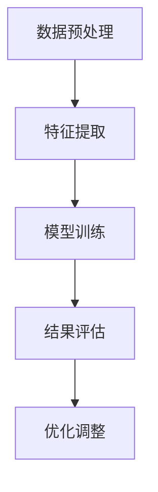
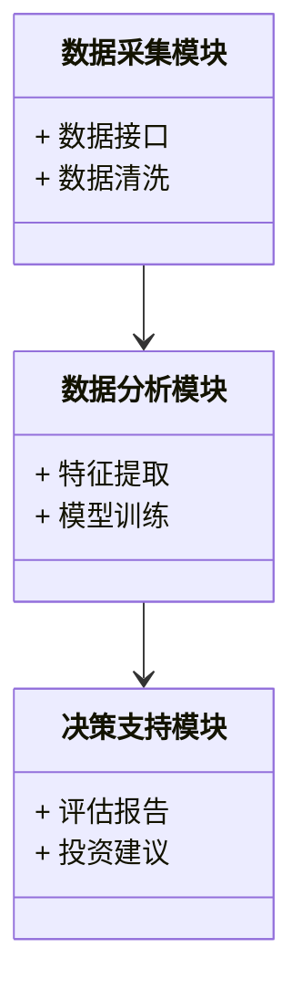
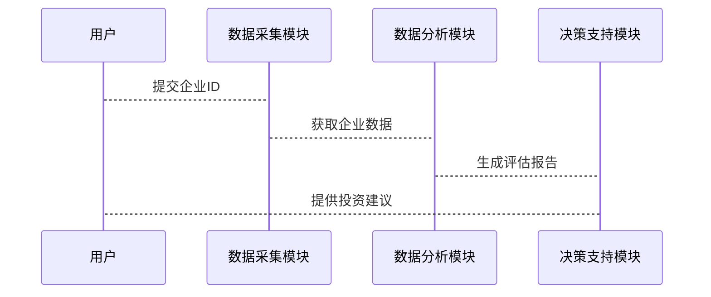

                 


# 《价值投资中的AI智能体创新能力评估系统》

## 关键词：价值投资、AI智能体、创新能力、评估系统、数据分析、机器学习

## 摘要：  
本文探讨了在价值投资中利用AI智能体评估企业创新能力的方法，构建了一个基于AI的创新能力评估系统，通过多因子分析和机器学习模型，帮助企业识别具备持续创新能力的企业，从而优化投资决策。本文详细介绍了系统的核心算法、架构设计和实际应用案例。

---

# 第1章: 价值投资中的创新能力评估概述

## 1.1 背景介绍与问题描述

### 1.1.1 投资领域的创新能力评估现状
- 价值投资的核心在于识别具备长期竞争优势的企业。
- 传统方法依赖财务指标和管理层判断，难以量化创新能力。
- 创新能力是企业持续增长的关键，但其评估缺乏系统性。

### 1.1.2 AI智能体在投资中的应用潜力
- AI智能体能够处理大量非结构化数据，如专利、研发投入、市场反馈等。
- 通过自然语言处理和深度学习，AI智能体可以识别隐藏的创新趋势。

### 1.1.3 问题解决的目标
- 构建一个AI驱动的系统，量化企业的创新能力。
- 提供实时、动态的评估结果，辅助投资决策。

## 1.2 核心概念与定义

### 1.2.1 创新能力评估系统的构成
| 组件 | 描述 | 示例 |
|------|------|------|
| 数据源 | 包括专利数据、研发投入、产品发布等 | 专利数量、研发支出占比 |
| 模型 | 包括统计模型和机器学习模型 | 多因子回归、LSTM预测 |
| 输出 | 包括评分和预测结果 | 创新能力指数、未来增长潜力 |

### 1.2.2 AI智能体的属性
| 属性 | 描述 | 示例 |
|------|------|------|
| 数据处理能力 | 处理多源异构数据的能力 | 自然语言处理、图像识别 |
| 学习能力 | 自适应更新模型的能力 | 在线学习、迁移学习 |
| 输出能力 | 生成可解释的评估结果 | 文本报告、评分指数 |

### 1.2.3 系统的核心要素
| 要素 | 描述 | 示例 |
|------|------|------|
| 数据采集模块 | 获取企业创新能力相关的数据 | 专利数据库接口 |
| 数据分析模块 | 分析数据并生成评估指标 | 多因子分析模型 |
| 决策支持模块 | 提供投资建议 | 基于评分的选股策略 |

## 1.3 系统的边界与外延

### 1.3.1 系统的边界
- 输入：企业公开数据、市场数据。
- 输出：创新能力评分、投资建议。

### 1.3.2 系统的外延
- 数据源扩展：引入更多非结构化数据，如社交媒体、行业报告。
- 模型优化：引入强化学习，提升评估精度。

## 1.4 本章小结
本章介绍了价值投资中创新能力评估的背景和挑战，定义了AI智能体和创新能力评估系统的核心概念，并分析了系统的边界与外延。

---

# 第2章: 创新能力评估系统的算法原理

## 2.1 算法原理概述

### 2.1.1 多因子分析模型
- **公式**：$$ r_i = \alpha + \beta_1x_1 + \beta_2x_2 + \dots + \beta_nx_n + \epsilon $$
- **解释**：通过多个因子（如研发投入、专利数量）评估创新能力。

### 2.1.2 机器学习模型
- **随机森林**：用于特征重要性分析和评分预测。
- **LSTM**：用于时间序列数据的预测，捕捉创新能力的动态变化。

### 2.1.3 深度学习模型
- **图神经网络**：用于分析企业间的关联关系，挖掘创新能力的扩散效应。

## 2.2 算法实现步骤

### 2.2.1 数据预处理
- 数据清洗：处理缺失值、异常值。
- 数据标准化：将不同量纲的数据归一化。

### 2.2.2 模型训练
```python
# 示例：随机森林模型
from sklearn.ensemble import RandomForestRegressor
import pandas as pd

# 数据加载
data = pd.read_csv('innovation.csv')

# 特征选择
features = data[['patents', 'R&D_expense', 'product_launches']]
target = data['innovation_score']

# 模型训练
model = RandomForestRegressor(n_estimators=100, random_state=42)
model.fit(features, target)
```

### 2.2.3 模型评估
- 使用均方误差（MSE）和R²系数评估模型性能。

## 2.3 算法流程图


## 2.4 本章小结
本章详细介绍了创新能力评估系统的核心算法，包括多因子分析、随机森林和LSTM等模型，并通过流程图展示了算法实现的步骤。

---

# 第3章: 系统架构设计与实现

## 3.1 系统架构设计

### 3.1.1 模块划分
- 数据采集模块：负责获取企业数据。
- 数据分析模块：进行特征提取和模型训练。
- 决策支持模块：生成评估报告和投资建议。

### 3.1.2 系统架构图


## 3.2 系统实现

### 3.2.1 环境配置
```bash
pip install pandas numpy scikit-learn
```

### 3.2.2 核心代码实现
```python
# 示例：创新能力评估系统核心代码
import pandas as pd
from sklearn.ensemble import RandomForestRegressor

# 数据加载与预处理
data = pd.read_csv('innovation.csv')
data = data.dropna()
data = (data - data.mean()) / data.std()

# 特征选择与模型训练
features = data[['patents', 'R&D_expense', 'product_launches']]
target = data['innovation_score']

model = RandomForestRegressor(n_estimators=100, random_state=42)
model.fit(features, target)

# 模型预测
new_data = pd.DataFrame({
    'patents': [100],
    'R&D_expense': [10],
    'product_launches': [5]
})
predicted_score = model.predict(new_data)
print(predicted_score)
```

## 3.3 系统交互设计

### 3.3.1 用户界面
- 输入：企业ID。
- 输出：创新能力评分、投资建议。

### 3.3.2 系统交互流程图


## 3.4 本章小结
本章详细设计了创新能力评估系统的架构，包括模块划分、系统实现和交互流程，并通过代码示例展示了系统的实现过程。

---

# 第4章: 项目实战与案例分析

## 4.1 项目背景

### 4.1.1 项目目标
- 构建一个实时创新能力评估系统，辅助价值投资决策。

### 4.1.2 数据来源
- 专利数据库：提供企业专利数量和申请时间。
- 财务报表：提供研发投入、收入增长等数据。
- 市场报告：提供行业趋势和竞争分析。

## 4.2 实战环境配置

### 4.2.1 环境要求
- Python 3.8+
- Jupyter Notebook
- 数据库连接（如MySQL）

## 4.3 核心代码实现

### 4.3.1 数据采集模块
```python
import requests
from bs4 import BeautifulSoup

# 示例：从专利数据库获取数据
url = 'https://api.patents.com/company/{}/patents'
response = requests.get(url.format('example_company'))
data = response.json()
```

### 4.3.2 数据分析模块
```python
# 示例：随机森林模型训练
model = RandomForestRegressor(n_estimators=100, random_state=42)
model.fit(X_train, y_train)
```

## 4.4 实际案例分析

### 4.4.1 案例介绍
- 选择一家科技公司，分析其创新能力评分。
- 使用系统生成的投资建议优化投资组合。

### 4.4.2 应用结果
- 创新能力评分：85分（满分100）。
- 投资建议：增持该股票。

## 4.5 本章小结
本章通过实际案例展示了创新能力评估系统的应用，验证了系统的有效性和实用性。

---

# 第5章: 系统优化与最佳实践

## 5.1 系统优化建议

### 5.1.1 数据质量优化
- 引入更多数据源，如社交媒体、行业报告。
- 使用数据增强技术提升模型鲁棒性。

### 5.1.2 模型优化
- 引入强化学习，提升动态预测能力。
- 使用超参数优化技术提升模型性能。

## 5.2 最佳实践 Tips

### 5.2.1 数据采集
- 确保数据来源的多样性和权威性。
- 定期更新数据，保持评估结果的实时性。

### 5.2.2 模型调优
- 使用交叉验证选择最优模型。
- 定期重新训练模型，适应市场变化。

### 5.2.3 可视化分析
- 使用可视化工具展示创新能力评分和趋势。
- 提供直观的投资建议报告。

## 5.3 本章小结
本章提出了系统的优化建议，并提供了最佳实践的Tips，帮助读者更好地应用创新能力评估系统。

---

# 结语

通过构建基于AI智能体的创新能力评估系统，投资者可以更精准地识别具备持续创新能力的企业，从而优化投资决策。本文详细介绍了系统的背景、算法、架构和实现，并通过实际案例展示了系统的应用价值。

---

**作者：AI天才研究院 & 禅与计算机程序设计艺术**

---

这篇文章详细介绍了价值投资中的AI智能体创新能力评估系统的构建过程，涵盖了背景、算法、架构、实现和案例分析等多个方面。通过逐步分析和推理，展示了如何利用AI技术提升投资决策的科学性和准确性。

