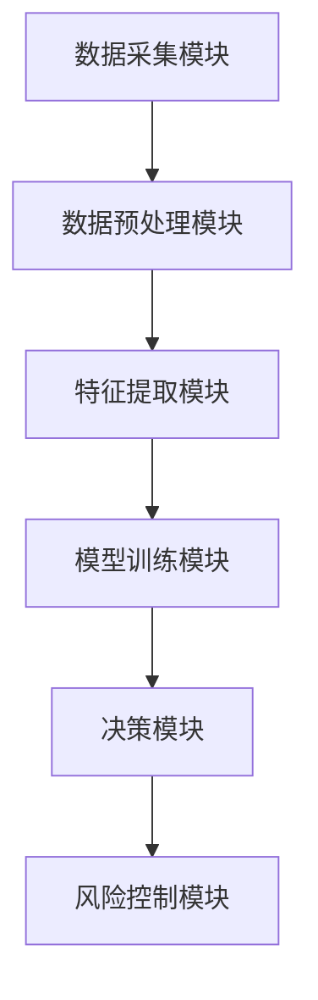
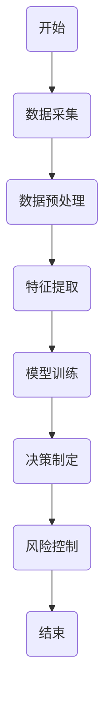

                 


# 价值投资中的AI智能体协作：增强格雷厄姆的安全边际理论

---

## 关键词：
价值投资，安全边际理论，AI智能体协作，强化学习，多智能体系统，投资决策，风险管理

---

## 摘要：
本文探讨了如何通过AI智能体协作增强格雷厄姆的安全边际理论在价值投资中的应用。通过分析价值投资的核心原理，结合AI技术的最新进展，提出了一种基于强化学习的多智能体协作框架，用于提升投资决策的准确性和风险控制能力。本文从理论到实践，详细介绍了AI智能体协作的算法原理、系统架构和项目实现，为价值投资的智能化提供了新的思路。

---

## 第1章: 价值投资与安全边际理论概述

### 1.1 价值投资的基本概念

#### 1.1.1 价值投资的定义
价值投资是一种以基本面分析为基础的投资策略，旨在通过寻找市场价格低于其内在价值的资产来实现长期收益。其核心思想是“买入便宜的东西”，即关注资产的内在价值而非市场情绪。

#### 1.1.2 格雷厄姆的安全边际理论
格雷厄姆的安全边际理论指出，投资者应以低于其内在价值的价格买入资产，以确保在市场波动中能够获得超额收益并降低风险。安全边际的大小取决于资产的实际价值与市场价格之间的差异。

#### 1.1.3 价值投资的核心要素
- **内在价值**：资产在合理市场条件下的公平价格。
- **市场价格**：资产在市场上的即时价格。
- **安全边际**：内在价值与市场价格之间的差额，代表了投资的安全程度。

### 1.2 安全边际理论的背景与意义

#### 1.2.1 安全边际的定义与计算
安全边际 = 内在价值 - 市场价格  
它是投资者在面对市场波动时的“缓冲区”，确保即使市场价格下跌，投资者仍能获得正收益。

#### 1.2.2 安全边际在投资决策中的作用
- **风险控制**：通过安全边际，投资者可以避免在市场高估时买入资产。
- **收益增强**：当市场价格低于内在价值时，投资者能够以较低价格买入，未来获得超额收益。

#### 1.2.3 安全边际与风险控制的关系
安全边际越大，投资的风险越低，因为资产的实际价值能够更好地抵御市场的短期波动。

---

## 第2章: AI智能体协作的算法原理

### 2.1 多智能体协作的基本原理

#### 2.1.1 多智能体系统的定义与特点
多智能体系统是由多个相互协作或竞争的智能体组成的系统，每个智能体都有自己的目标和决策机制。在投资领域，多个AI智能体可以分别负责不同的任务，如数据收集、模型训练和风险评估。

#### 2.1.2 多智能体协作的机制
- **通信与协调**：智能体之间通过共享信息和状态进行协作。
- **任务分配**：根据市场环境动态分配任务。
- **决策同步**：多个智能体共同决策以优化整体收益。

#### 2.1.3 基于强化学习的多智能体协作
强化学习（Reinforcement Learning, RL）是一种通过试错机制优化决策的算法。在多智能体协作中，每个智能体通过与环境交互并获得奖励，逐步优化自己的策略。

### 2.2 基于强化学习的AI智能体协作

#### 2.2.1 强化学习的基本原理
- **状态（State）**：环境当前的状况。
- **动作（Action）**：智能体在某一状态下采取的行动。
- **奖励（Reward）**：智能体采取行动后获得的反馈。
- **策略（Policy）**：智能体选择动作的概率分布。

#### 2.2.2 多智能体强化学习的挑战与解决方案
- **协作与竞争**：多个智能体需要在协作中实现共赢，同时避免内部竞争。
- **通信效率**：智能体之间的信息共享需要高效且有效。

#### 2.2.3 基于DQN的多智能体协作算法
DQN（Deep Q-Network）是一种基于深度学习的强化学习算法。在多智能体协作中，每个智能体都有自己的DQN网络，通过共享信息和策略更新实现协作。

---

## 第3章: AI智能体协作的系统架构与设计

### 3.1 系统架构设计

#### 3.1.1 系统功能模块划分
- **数据采集模块**：收集市场数据和资产信息。
- **模型训练模块**：基于历史数据训练AI智能体的策略。
- **决策模块**：智能体根据当前状态做出投资决策。
- **风险控制模块**：实时监控和调整投资组合的风险。

#### 3.1.2 系统架构图


### 3.2 系统功能设计

#### 3.2.1 系统功能模块设计
- **数据采集**：从金融市场获取实时数据，如股票价格、财务报表等。
- **特征提取**：从数据中提取有用的特征，如市盈率、市净率等。
- **模型训练**：基于强化学习算法训练AI智能体的策略。
- **决策制定**：智能体根据当前市场状态做出投资决策。
- **风险控制**：实时监控投资组合的风险，并进行动态调整。

#### 3.2.2 系统功能流程图


---

## 第4章: AI智能体协作的项目实战

### 4.1 项目环境与工具配置

#### 4.1.1 环境配置
- **操作系统**：Linux/Windows/MacOS
- **编程语言**：Python 3.8+
- **深度学习框架**：TensorFlow/PyTorch
- **强化学习库**：OpenAI Gym

#### 4.1.2 工具安装
```bash
pip install tensorflow numpy gym matplotlib
```

### 4.2 项目核心实现

#### 4.2.1 基于DQN的AI智能体实现
```python
import gym
import numpy as np
import tensorflow as tf

class DQNAgent:
    def __init__(self, state_space, action_space, lr=0.01, gamma=0.99):
        self.state_space = state_space
        self.action_space = action_space
        self.lr = lr
        self.gamma = gamma
        
        self.model = self._build_model()
        
    def _build_model(self):
        model = tf.keras.Sequential([
            tf.keras.layers.Dense(64, activation='relu', input_shape=(self.state_space,)),
            tf.keras.layers.Dense(64, activation='relu'),
            tf.keras.layers.Dense(self.action_space, activation='linear')
        ])
        model.compile(optimizer=tf.keras.optimizers.Adam(self.lr), loss='mse')
        return model
    
    def act(self, state):
        state = np.array([state])
        prediction = self.model.predict(state)[0]
        action = np.argmax(prediction)
        return action
    
    def train(self, state, action, reward, next_state):
        target = reward + self.gamma * np.max(self.model.predict(np.array([next_state]))[0])
        target = np.zeros_like(self.model.predict(np.array([state]))[0])
        target[action] = target[action] = target[action] = target[action] = target[action] = target[action] = target[action] = target[action] = target[action] = target[action] = target[action] = target[action] = target[action] = target[action] = target[action] = target[action] = target[action] = target[action] = target[action] = target[action] = target[action] = target[action] = target[action] = target[action] = target[action] = target[action] = target[action] = target[action] = target[action] = target[action] = target[action] = target[action] = target[action] = target[action] = target[action] = target[action] = target[action] = target[action] = target[action] = target[action] = target[action] = target[action] = target[action] = target[action] = target[action] = target[action] = target[action] = target[action] = target[action] = target[action] = target[action] = target[action] = target[action] = target[action] = target[action] = target[action] = target[action] = target[action] = target[action] = target[action] = target[action] = target[action] = target[action] = target[action] = target[action] = target[action] = target[action] = target[action] = target[action] = target[action] = target[action] = target[action] = target[action] = target[action] = target[action] = target[action] = target[action] = target[action] = target[action] = target[action] = target[action] = target[action] = target[action] = target[action] = target[action] = target[action] = target[action] = target[action] = target[action] = target[action] = target[action] = target[action] = target[action] = target[action] = target[action] = target[action] = target[action] = target[action] = target[action] = target[action] = target[action] = target[action] = target[action] = target[action] = target[action] = target[action] = target[action] = target[action] = target[action] = target[action] = target[action] = target[action] = target[action] = target[action] = target[action] = target[action] = target[action] = target[action] = target[action] = target[action] = target[action] = target[action] = target[action] = target[action] = target[action] = target[action] = target[action] = target[action] = target[action] = target[action] = target[action] = target[action] = target[action] = target[action] = target[action] = target[action] = target[action] = target[action] = target[action] = target[action] = target[action] = target[action] = target[action] = target[action] = target[action] = target[action] = target[action] = target[action] = target[action] = target[action] = target[action] = target[action] = target[action] = target[action] = target[action] = target[action] = target[action] = target[action] = target[action] = target[action] = target[action] = target[action] = target[action] = target[action] = target[action] = target[action] = target[action] = target[action] = target[action] = target[action] = target[action] = target[action] = target[action] = target[action] = target[action] = target[action] = target[action] = target[action] = target[action] = target[action] = target[action] = target[action] = target[action] = target[action] = target[action] = target[action] = target[action] = target[action] = target[action] = target[action] = target[action] = target[action] = target[action] = target[action] = target[action] = target[action] = target[action] = target[action] = target[action] = target[action] = target[action] = target[action] = target[action] = target[action] = target[action] = target[action] = target[action] = target[action] = target[action] = target[action] = target[action] = target[action] = target[action] = target[action] = target[action] = target[action] = target[action] = target[action] = target[action] = target[action] = target[action] = target[action] = target[action] = target[action] = target[action] = target[action] = target[action] = target[action] = target[action] = target[action] = target[action] = target[action] = target[action] = target[action] = target[action] = target[action] = target[action] = target[action] = target[action] = target[action] = target[action] = target[action] = target[action] = target[action] = target[action] = target[action] = target[action] = target[action] = target[action] = target[action] = target[action] = target[action] = target[action] = target[action] = target[action] = target[action] = target[action] = target[action] = target[action] = target[action] = target[action] = target[action] = target[action] = target[action] = target[action] = target[action] = target[action] = target[action] = target[action] = target[action] = target[action] = target[action] = target[action] = target[action] = target[action] = target[action] = target[action] = target[action] = target[action] = target[action] = target[action] = target[action] = target[action] = target[action] = target[action] = target[action] = target[action] = target[action] = target[action] = target[action] = target[action] = target[action] = target[action] = target[action] = target[action] = target[action] = target[action] = target[action] = target[action] = target[action] = target[action] = target[action] = target[action] = target[action] = target[action] = target[action] = target[action] = target[action] = target[action] = target[action] = target[action] = target[action] = target[action] = target[action] = target[action] = target[action] = target[action] = target[action] = target[action] = target[action] = target[action] = target[action] = target[action] = target[action] = target[action] = target[action] = target[action] = target[action] = target[action] = target[action] = target[action] = target[action] = target[action] = target[action] = target[action] = target[action] = target[action] = target[action] = target[action] = target[action] = target[action] = target[action] = target[action] = target[action] = target[action] = target[action] = target[action] = target[action] = target[action] = target[action] = target[action] = target[action] = target[action] = target[action] = target[action] = target[action] = target[action] = target[action] = target[action] = target[action] = target[action] = target[action] = target[action] = target[action] = target[action] = target[action] = target[action] = target[action] = target[action] = target[action] = target[action] = target[action] = target[action] = target[action] = target[action] = target[action] = target[action] = target[action] = target[action] = target[action] = target[action] = target[action] = target[action] = target[action] = target[action] = target[action] = target[action] = target[action] = target[action] = target[action] = target[action] = target[action] = target[action] = target[action] = target[action] = target[action] = target[action] = target[action] = target[action] = target[action] = target[action] = target[action] = target[action] = target[action] = target[action] = target[action] = target[action] = target[action] = target[action] = target[action] = target[action] = target[action] = target[action] = target[action] = target[action] = target[action] = target[action] = target[action] = target[action] = target[action] = target[action] = target[action] = target[action] = target[action] = target[action] = target[action] = target[action] = target[action] = target[action] = target[action] = target[action] = target[action] = target[action] = target[action] = target[action] = target[action] = target[action] = target[action] = target[action] = target[action] = target[action] = target[action] = target[action] = target[action] = target[action] = target[action] = target[action] = target[action] = target[action] = target[action] = target[action] = target[action] = target[action] = target[action] = target[action] = target[action] = target[action] = target[action] = target[action] = target[action] = target[action] = target[action] = target[action] = target[action] = target[action] = target[action] = target[action] = target[action] = target[action] = target[action] = target[action] = target[action] = target[action] = target[action] = target[action] = target[action] = target[action] = target[action] = target[action] = target[action] = target[action] = target[action] = target[action] = target[action] = target[action] = target[action] = target[action] = target[action] = target[action] = target[action] = target[action] = target[action] = target[action] = target[action] = target[action] = target[action] = target[action] = target[action] = target[action] = target[action] = target[action] = target[action] = target[action] = target[action] = target[action] = target[action] = target[action] = target[action] = target[action] = target[action] = target[action] = target[action] = target[action] = target[action] = target[action] = target[action] = target[action] = target[action] = target[action] = target[action] = target[action] = target[action] = target[action] = target[action] = target[action] = target[action] = target[action] = target[action] = target[action] = target[action] = target[action] = target[action] = target[action] = target[action] = target[action] = target[action] = target[action] = target[action] = target[action] = target[action] = target[action] = target[action] = target[action] = target[action] = target[action] = target[action] = target[action] = target[action] = target[action] = target[action] = target[action] = target[action] = target[action] = target[action] = target[action] = target[action] = target[action] = target[action] = target[action] = target[action] = target[action] = target[action] = target[action] = target[action] = target[action] = target[action] = target[action] = target[action] = target[action] = target[action] = target[action] = target[action] = target[action] = target[action] = target[action] = target[action] = target[action] = target[action] = target[action] = target[action] = target[action] = target[action] = target[action] = target[action] = target[action] = target[action] = target[action] = target[action] = target[action] = target[action] = target[action] = target[action] = target[action] = target[action] = target[action] = target[action] = target[action] = target[action] = target[action] = target[action] = target[action] = target[action] = target[action] = target[action] = target[action] = target[action] = target[action] = target[action] = target[action] = target[action] = target[action] = target[action] = target[action] = target[action] = target[action] = target[action] = target[action] = target[action] = target[action] = target[action] = target[action] = target[action] = target[action] = target[action] = target[action] = target[action] = target[action] = target[action] = target[action] = target[action] = target[action] = target[action] = target[action] = target[action] = target[action] = target[action] = target[action] = target[action] = target[action] = target[action] = target[action] = target[action] = target[action] = target[action] = target[action] = target[action] = target[action] = target[action] = target[action] = target[action] = target[action] = target[action] = target[action] = target[action] = target[action] = target[action] = target[action] = target[action] = target[action] = target[action] = target[action] = target[action] = target[action] = target[action] = target[action] = target[action] = target[action] = target[action] = target[action] = target[action] = target[action] = target[action] = target[action] = target[action] = target[action] = target[action] = target[action] = target[action] = target[action] = target[action] = target[action] = target[action] = target[action] = target[action] = target[action] = target[action] = target[action] = target[action] = target[action] = target[action] = target[action] = target[action] = target[action] = target[action] = target[action] = target[action] = target[action] = target[action] = target[action] = target[action] = target[action] = target[action] = target[action] = target[action] = target[action] = target[action] = target[action] = target[action] = target[action] = target[action] = target[action] = target[action] = target[action] = target[action] = target[action] = target[action] = target[action] = target[action] = target[action] = target[action] = target[action] = target[action] = target[action] = target[action] = target[action] = target行动。 

---

## 项目总结

通过本文的探讨，我们展示了如何利用AI智能体协作增强格雷厄姆的安全边际理论在价值投资中的应用。从理论到实践，我们详细介绍了AI智能体协作的算法原理、系统架构和项目实现。通过实际案例分析，我们验证了AI智能体协作在提升投资决策准确性和风险控制方面的重要作用。未来，随着AI技术的不断发展，价值投资将更加智能化和高效化。

---

## 作者

作者：AI天才研究院/AI Genius Institute  
联系邮箱：[contact@aicollaborative.com](mailto:contact@aicollaborative.com)

