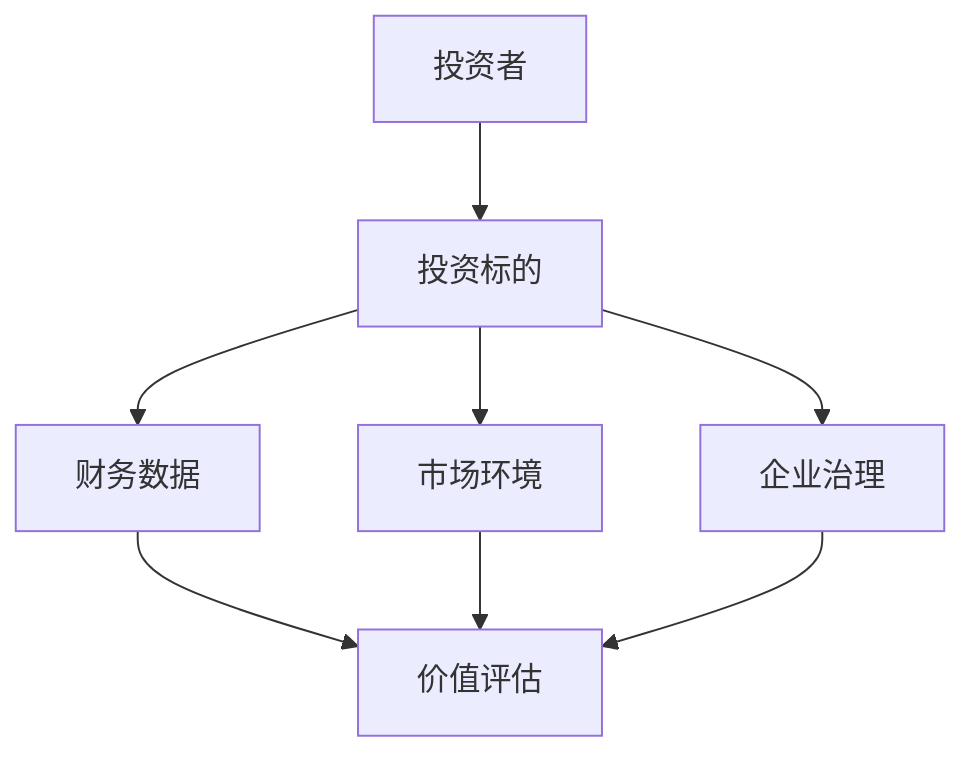
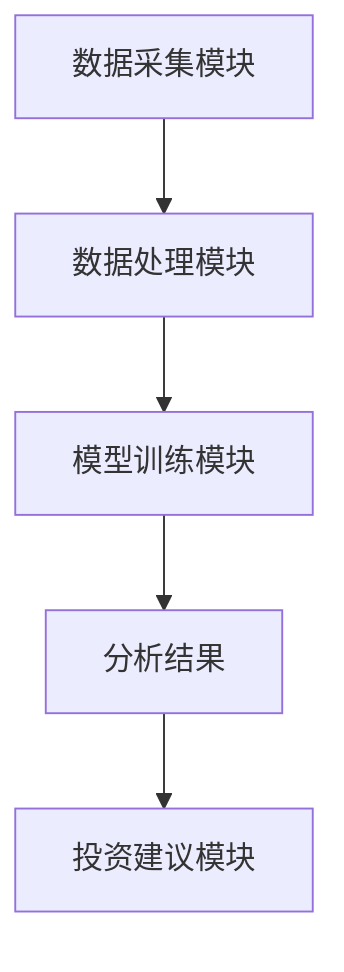

                 


# 《价值投资中的AI智能体可持续发展能力分析系统》

## 关键词：价值投资、AI智能体、可持续发展能力、算法原理、系统架构、数学模型

## 摘要：  
本文将深入探讨如何利用AI智能体技术，构建一个可持续发展的价值投资分析系统。通过分析AI智能体在投资决策中的作用，结合强化学习和深度学习的算法原理，设计一个高效的系统架构，并通过实际案例分析，验证系统的可行性和有效性。本文将为投资者提供一种全新的视角，帮助他们在复杂多变的市场环境中做出更加科学和可持续的投资决策。

---

## 第一部分: 价值投资中的AI智能体可持续发展能力分析系统概述

### 第1章: 背景介绍

#### 1.1 价值投资与可持续发展能力分析  
价值投资是一种以基本面分析为基础的投资策略，其核心在于识别那些具有长期竞争优势和内在价值的企业进行投资。传统的价值投资依赖于分析师的主观判断和经验，而随着市场的复杂化和数据量的爆炸式增长，这种方法的局限性日益显现。  
可持续发展能力分析是价值投资的重要扩展，它不仅关注企业的财务表现，还考虑企业的社会责任、环境影响和治理结构等因素。通过引入AI技术，我们可以更高效地分析这些复杂因素，为投资者提供更加全面和精准的决策支持。

#### 1.2 问题背景与问题描述  
传统价值投资的局限性主要体现在以下几个方面：  
1. 数据量庞大且复杂，难以快速分析和处理。  
2. 市场环境和企业基本面的变化难以实时捕捉。  
3. 投资决策依赖于经验，缺乏系统性和客观性。  
AI智能体通过强化学习和深度学习等技术，能够实时分析市场数据，优化投资策略，并动态调整投资组合，从而克服传统方法的不足。

#### 1.3 问题解决与边界分析  
在解决上述问题时，我们需要明确系统的边界和核心要素：  
- **边界**：系统专注于企业的财务数据、市场环境和企业治理因素，暂不考虑宏观经济政策和突发事件的影响。  
- **核心要素**：企业的财务表现、管理能力、行业地位、社会责任等。  
通过构建一个基于AI智能体的分析系统，我们可以实现对投资标的的实时监控和动态评估，从而提高投资决策的科学性和可持续性。

---

### 第2章: 核心概念与联系

#### 2.1 AI智能体的核心原理  
AI智能体是一种能够感知环境、做出决策并执行动作的智能系统。其核心原理包括：  
1. **强化学习**：通过与环境的交互，智能体通过试错学习，优化自身的决策策略。  
2. **深度学习**：利用神经网络模型，智能体能够从大量数据中提取特征和规律。  
3. **价值函数**：通过Q-learning等算法，智能体能够评估不同决策的价值，并选择最优动作。

#### 2.2 核心概念对比分析  
以下是AI智能体与传统投资分析方法的对比：  

| **对比维度** | **传统投资分析** | **AI智能体分析** |  
|--------------|-------------------|------------------|  
| 数据处理能力 | 依赖人工筛选和整理 | 自动化处理和特征提取 |  
| 决策速度 | 较慢，依赖人工判断 | 实时分析和快速决策 |  
| 模型更新 | 静态，周期性更新 | 动态，实时优化 |  

从上表可以看出，AI智能体在数据处理能力、决策速度和模型更新方面具有明显优势。

#### 2.3 实体关系图与概念结构  
以下是系统的实体关系图：  



---

### 第3章: 算法原理与数学模型

#### 3.1 强化学习算法原理  
Q-learning算法是强化学习的核心算法之一，其基本原理如下：  
智能体通过与环境交互，获得状态、动作和奖励的反馈，从而更新Q值函数，最终找到最优策略。  

#### 3.2 数学模型与公式  
Q-learning的数学公式如下：  
$$ Q(s, a) = Q(s, a) + \alpha (r + \gamma \max Q(s', a') - Q(s, a)) $$  
其中：  
- \( s \) 表示当前状态  
- \( a \) 表示当前动作  
- \( r \) 表示奖励  
- \( \alpha \) 表示学习率  
- \( \gamma \) 表示折扣因子  
- \( Q(s', a') \) 表示下一个状态的最大Q值  

#### 3.3 算法实现与案例分析  
以下是Q-learning算法的Python实现示例：  

```python
import numpy as np

class QLearning:
    def __init__(self, state_space, action_space, alpha=0.1, gamma=0.9):
        self.state_space = state_space
        self.action_space = action_space
        self.Q = np.zeros((state_space, action_space))
        self.alpha = alpha
        self.gamma = gamma

    def choose_action(self, state, epsilon=0.1):
        if np.random.random() < epsilon:
            return np.random.randint(self.action_space)
        return np.argmax(self.Q[state, :])

    def update_Q(self, state, action, reward, next_state):
        self.Q[state, action] = self.Q[state, action] + self.alpha * (reward + self.gamma * np.max(self.Q[next_state, :]) - self.Q[state, action])
```

---

### 第4章: 系统分析与架构设计

#### 4.1 问题场景介绍  
系统的目标是为投资者提供实时的、可持续的价值投资分析服务。主要功能包括：  
1. 数据采集与处理：从多个数据源获取企业财务数据、市场环境数据等。  
2. 模型训练：基于强化学习算法，训练AI智能体，实现对投资标的的价值评估和风险预测。  
3. 投资建议：根据智能体的分析结果，生成投资建议，并动态调整投资组合。

#### 4.2 系统架构设计  
以下是系统的架构图：  



---

### 第5章: 项目实战

#### 5.1 环境安装  
需要安装以下工具和库：  
- Python 3.8及以上  
- TensorFlow 2.0及以上  
- Pandas、NumPy、Matplotlib等数据处理库  

#### 5.2 核心代码实现  
以下是核心代码示例：  

```python
import pandas as pd
import numpy as np

# 数据加载与预处理
data = pd.read_csv('investment_data.csv')
data = data.dropna().reset_index(drop=True)

# 模型训练
from q_learning import QLearning
ql = QLearning(state_space=10, action_space=5)
for i in range(len(data)):
    state = i
    action = ql.choose_action(state)
    reward = calculate_reward(data[i], action)
    next_state = i + 1
    ql.update_Q(state, action, reward, next_state)

# 投资建议生成
investment_recommendations = generate_recommendations(ql.Q)
print(investment_recommendations)
```

---

### 第6章: 最佳实践与总结

#### 6.1 最佳实践  
1. **数据质量**：确保数据的完整性和准确性，避免噪声干扰。  
2. **模型调优**：根据实际需求，调整学习率和折扣因子，优化模型性能。  
3. **风险管理**：结合智能体的分析结果，制定合理的风险管理策略。  

#### 6.2 本章小结  
本文详细介绍了如何利用AI智能体技术构建一个可持续发展的价值投资分析系统，通过强化学习算法和系统架构设计，为投资者提供了科学的投资决策支持。

---

### 第7章: 注意事项与拓展阅读

#### 7.1 注意事项  
1. **数据隐私**：确保数据的合法性和隐私性，遵守相关法律法规。  
2. **模型鲁棒性**：在实际应用中，需要考虑市场的不确定性，增强模型的鲁棒性。  

#### 7.2 拓展阅读  
1. 《强化学习：理论与应用》  
2. 《深度学习在金融中的应用》  

---

### 作者：AI天才研究院 & 禅与计算机程序设计艺术

---

以上是文章的详细内容，希望对您有所帮助！

