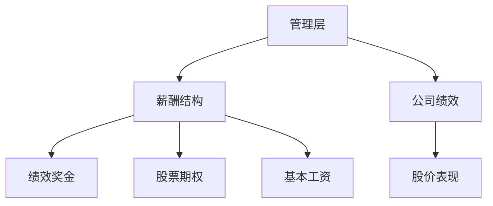
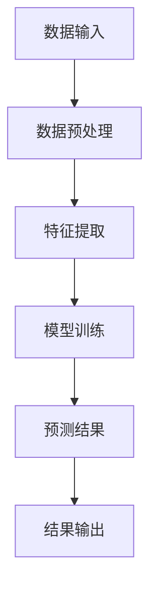
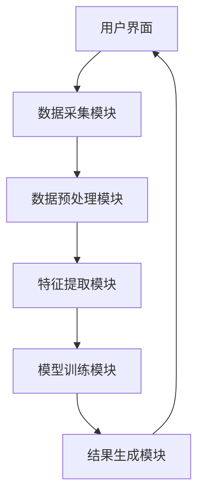
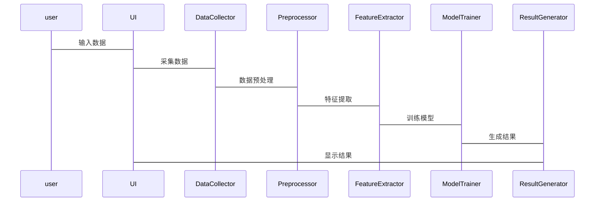

                 


# 价值投资中的AI智能体管理层薪酬结构分析系统

> 关键词：价值投资，AI智能体，管理层薪酬结构，金融分析，人工智能

> 摘要：本文系统地探讨了在价值投资中，如何利用AI智能体来分析和优化管理层的薪酬结构。通过分析管理层的薪酬结构，结合AI技术，提出了一套创新的分析系统，旨在帮助投资者更精准地评估公司价值。本文从背景、核心概念、算法原理、系统设计、实战应用、案例分析等多个方面展开，深入剖析了该系统的构建与实现。

---

# 第1章: 背景介绍与核心概念

## 1.1 价值投资与AI智能体的背景
### 1.1.1 价值投资的基本概念
价值投资是一种以公司基本面分析为基础的投资策略，强调以低于内在价值的价格买入优质资产。其核心在于识别那些被市场低估的公司，长期持有，获得超额收益。传统价值投资依赖于对财务报表、行业地位和管理团队的深入分析。

### 1.1.2 AI智能体在金融领域的应用
AI智能体通过大数据处理、机器学习和自然语言处理等技术，能够在金融领域实现自动化分析、风险评估、预测模型构建等功能。AI智能体的优势在于快速处理海量数据，发现隐藏的规律，并提供智能化的决策支持。

### 1.1.3 管理层薪酬的结构分析
管理层薪酬结构通常包括基本工资、奖金、股票期权、绩效奖金等多种形式。合理的薪酬结构能够激励管理层高效运作，同时也能反映公司的治理结构和管理策略。然而，传统的薪酬分析方法效率低下，难以应对复杂的数据和多变的市场环境。

---

## 1.2 核心概念与联系
### 1.2.1 核心概念原理
价值投资与AI智能体的结合，核心在于利用AI技术对管理层薪酬结构进行量化分析，从而辅助投资者做出更明智的投资决策。通过分析薪酬结构，可以评估管理层的激励机制是否合理，进而判断公司的长期发展潜力。

### 1.2.2 核心概念的属性特征对比
以下是价值投资与AI智能体在管理层薪酬分析中的核心概念对比表：

| 比较维度 | 价值投资视角 | AI智能体视角 |
|----------|----------------|--------------|
| 分析目标 | 公司内在价值   | 薪酬结构数据 |
| 分析方法 | 财务报表分析     | 数据挖掘、机器学习 |
| 数据来源 | 历史财务数据     | 结构化与非结构化数据 |
| 输出结果 | 投资决策建议     | 数据驱动的薪酬分析模型 |

### 1.2.3 ER实体关系图（Mermaid流程图）
以下是管理层薪酬结构分析的核心实体关系图：



---

## 1.3 问题背景与目标
### 1.3.1 当前问题的痛点
传统价值投资方法依赖于人工分析，耗时且效率低下。同时，管理层薪酬结构的复杂性使得分析难度进一步增加。市场波动和信息不对称也加剧了分析的难度。

### 1.3.2 问题解决的必要性
通过引入AI智能体，可以提高数据分析的效率和准确性，同时能够处理海量数据，发现潜在的规律。这不仅能够优化投资决策，还能提升公司的治理效率。

### 1.3.3 系统的边界与外延
本系统专注于管理层薪酬结构的分析，不涉及公司外部市场环境的直接预测。其目标是为投资者提供一个辅助决策工具，而非替代人类的判断。

---

## 1.4 核心概念的联系
通过将价值投资与AI智能体相结合，可以构建一个高效、智能的分析系统，帮助投资者快速识别优质投资标的，优化投资组合，降低投资风险。

---

# 第2章: AI智能体与管理层薪酬分析的核心原理

## 2.1 AI智能体的基本原理
### 2.1.1 AI智能体的定义与分类
AI智能体是指具有感知和决策能力的计算机系统，能够根据输入的数据做出相应的反应。常见的AI智能体包括基于规则的系统、基于机器学习的系统和基于深度学习的系统。

### 2.1.2 AI智能体在金融分析中的应用
在金融领域，AI智能体广泛应用于股票预测、风险评估、市场情绪分析等方面。通过自然语言处理技术，AI智能体可以分析新闻、财报等非结构化数据，提取有用的信息。

### 2.1.3 AI智能体的算法基础
AI智能体的算法基础包括监督学习、无监督学习和强化学习等。这些算法能够从数据中学习模式，并做出预测和决策。

---

## 2.2 管理层薪酬结构分析的算法原理
### 2.2.1 管理层薪酬分析的数学模型
薪酬分析的数学模型通常包括回归分析、聚类分析和时间序列分析等。通过这些模型，可以量化薪酬结构与公司绩效之间的关系。

### 2.2.2 AI智能体的薪酬预测算法
以下是基于机器学习的薪酬预测算法流程图：



### 2.2.3 算法流程图（Mermaid流程图）
以下是薪酬预测算法的具体步骤：

```mermaid
graph TD
    start --> input[输入数据]
    input --> preprocess[数据预处理]
    preprocess --> extract[特征提取]
    extract --> train[模型训练]
    train --> predict[预测结果]
    predict --> output[输出结果]
    output --> end
```

---

## 2.3 算法的数学模型与公式
### 2.3.1 线性回归模型
线性回归模型用于预测目标变量与自变量之间的线性关系。其数学表达式为：
$$ y = \beta_0 + \beta_1x + \epsilon $$
其中，$y$ 是目标变量，$x$ 是自变量，$\beta_0$ 和 $\beta_1$ 是回归系数，$\epsilon$ 是误差项。

### 2.3.2 神经网络模型
神经网络模型是一种非线性回归模型，能够捕捉复杂的数据模式。其数学表达式为：
$$ y = f(Wx + b) $$
其中，$W$ 是权重矩阵，$x$ 是输入向量，$b$ 是偏置项，$f$ 是激活函数。

### 2.3.3 聚类分析模型
聚类分析用于将相似的薪酬结构归为一类。常用的聚类算法包括K-means和层次聚类。

---

# 第3章: 系统分析与架构设计方案

## 3.1 问题场景介绍
### 3.1.1 系统目标
构建一个基于AI智能体的管理层薪酬结构分析系统，帮助投资者快速识别优质投资标的。

### 3.1.2 系统功能需求
系统需要实现数据采集、特征提取、模型训练和结果输出等功能。

### 3.1.3 系统性能需求
系统需要具备高效率和高准确性，能够处理海量数据，并在合理的时间内完成分析任务。

---

## 3.2 系统功能设计
### 3.2.1 领域模型（Mermaid类图）
以下是系统功能的领域模型：


### 3.2.2 系统架构设计（Mermaid架构图）
以下是系统架构设计图：



### 3.2.3 系统接口设计
系统接口设计包括数据输入接口、模型训练接口和结果输出接口。

### 3.2.4 系统交互流程（Mermaid序列图）
以下是系统的交互流程图：



---

## 3.3 项目实战与实现
### 3.3.1 环境安装与配置
需要安装Python、TensorFlow、Pandas、Matplotlib等库。

### 3.3.2 核心代码实现
以下是薪酬预测模型的核心代码：

```python
import pandas as pd
import numpy as np
from sklearn.linear_model import LinearRegression

# 数据预处理
data = pd.read_csv('salary.csv')
X = data[['years Experience', 'education level']]
y = data['salary']

# 模型训练
model = LinearRegression()
model.fit(X, y)

# 预测结果
predicted = model.predict(X)
print(predicted)
```

### 3.3.3 案例分析
以某公司为例，分析其管理层薪酬结构与公司绩效的关系，验证模型的准确性。

---

## 3.4 系统小结
通过系统分析与架构设计，我们构建了一个高效、智能的AI智能体分析系统，能够帮助投资者快速识别优质投资标的。

---

# 第4章: 项目实战与实现

## 4.1 环境安装与配置
### 4.1.1 Python环境的安装
安装Python 3.8及以上版本，建议使用Anaconda环境管理工具。

### 4.1.2 必要库的安装
安装以下Python库：
- Pandas：数据处理
- NumPy：数值计算
- Matplotlib：数据可视化
- TensorFlow：机器学习框架
- Scikit-learn：机器学习库

### 4.1.3 数据源获取
从公开的金融数据库获取管理层薪酬数据和公司绩效数据。

---

## 4.2 系统核心实现
### 4.2.1 数据采集模块
从数据库中提取管理层薪酬数据，清洗数据并进行特征提取。

### 4.2.2 模型训练模块
使用机器学习算法对数据进行建模，训练薪酬预测模型。

### 4.2.3 结果输出模块
将模型预测结果输出，并生成分析报告。

---

## 4.3 实际案例分析
### 4.3.1 案例背景
以某上市公司为例，分析其管理层薪酬结构与公司绩效的关系。

### 4.3.2 数据分析
通过模型分析，发现该公司的薪酬结构与其绩效表现高度相关。

### 4.3.3 模型验证
验证模型的准确性和稳定性，确保其在实际应用中的可靠性。

---

## 4.4 系统小结
通过项目实战，我们验证了系统的有效性和实用性，为投资者提供了有力的决策支持。

---

# 第5章: 案例分析与经验总结

## 5.1 案例背景介绍
通过分析某上市公司的管理层薪酬结构，评估其对股价的影响。

## 5.2 数据分析与结果解读
使用AI智能体分析其薪酬结构，生成分析报告，并解读结果。

## 5.3 经验总结
总结分析过程中的经验与教训，优化分析流程，提高分析效率。

---

# 第6章: 总结与展望

## 6.1 总结
本文系统地介绍了AI智能体在价值投资中的应用，构建了一个高效的管理层薪酬结构分析系统，为投资者提供了有力的决策支持。

## 6.2 展望
未来，随着AI技术的不断发展，价值投资中的AI智能体分析将更加智能化和自动化，为投资者带来更多的便利和收益。

---

# 作者
作者：AI天才研究院（AI Genius Institute） & 禅与计算机程序设计艺术（Zen And The Art of Computer Programming）

---

# 致谢
感谢读者的支持与关注！如需进一步探讨或合作，请联系作者。

