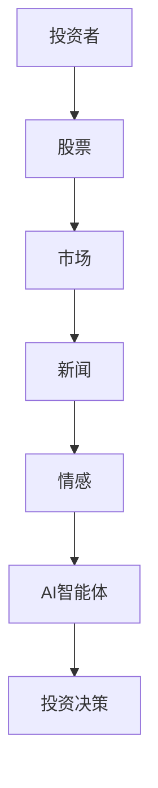
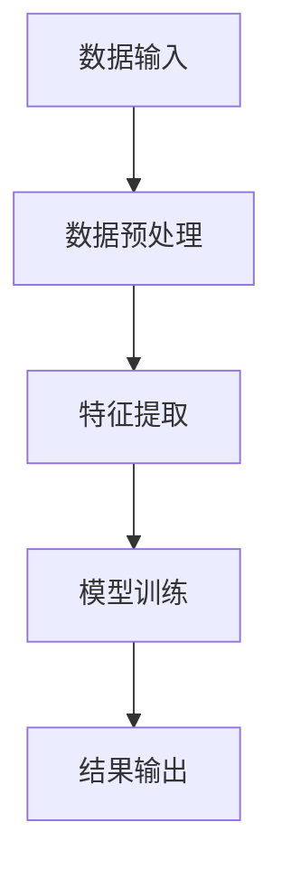
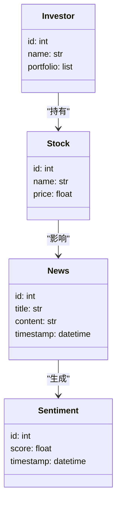
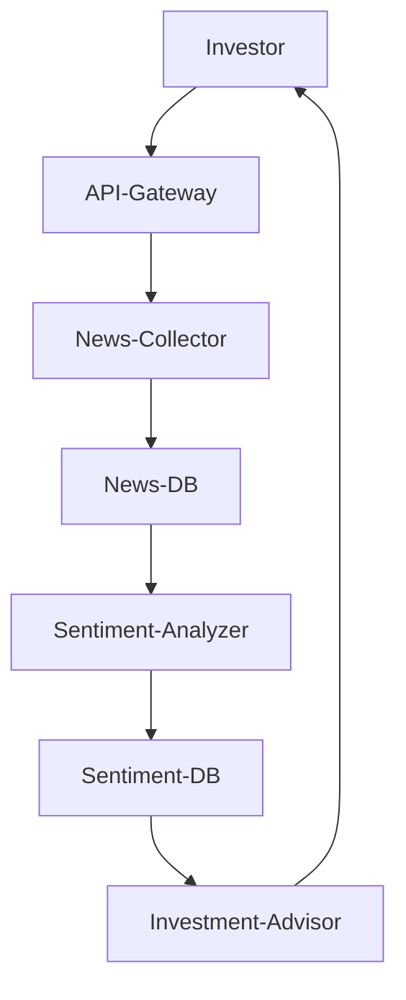
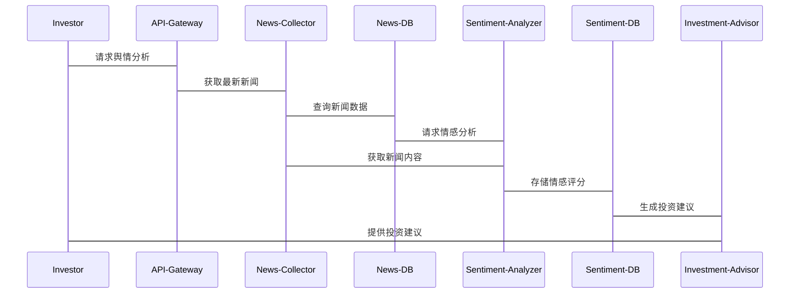

                 


# 价值投资中的AI智能体舆情监测与分析系统

> 关键词：价值投资，AI智能体，舆情监测，NLP，情感分析，系统架构

> 摘要：本文深入探讨了如何利用AI智能体技术对金融市场的舆情进行实时监测与分析，从而辅助价值投资者做出更明智的投资决策。文章从背景介绍、核心概念、算法原理、系统架构设计到项目实战，全面解析了AI智能体在价值投资中的应用。通过结合NLP和情感分析技术，构建了一个高效的舆情监测系统，为投资者提供了强有力的数据支持。

---

## 第一部分: 背景介绍

### 1.1 价值投资与AI的结合

#### 1.1.1 价值投资的核心理念

价值投资是一种长期投资策略，强调通过深入分析企业的基本面，寻找具有持续竞争优势和良好治理结构的公司，以低于其内在价值的价格买入并长期持有。这种投资理念的核心在于“寻找市场的不合理性”，即在市场恐慌或非理性时找到被低估的投资标的。

随着科技的发展，AI技术逐渐渗透到金融领域，为价值投资提供了新的工具和方法。通过AI智能体，投资者可以更高效地处理海量信息，发现市场中的潜在机会。

#### 1.1.2 AI技术在金融领域的应用前景

AI技术在金融领域的应用广泛，包括股票预测、风险控制、量化交易、舆情分析等。其中，舆情分析是AI在金融领域的重要应用之一。通过对新闻、社交媒体、论坛等公开信息的分析，AI智能体能够提取市场情绪，预测市场的短期波动，为投资者提供决策支持。

#### 1.1.3 舆情监测在价值投资中的作用

舆情监测是价值投资中不可忽视的一部分。市场情绪的变化往往会影响股价的短期波动，而通过AI智能体对舆情的实时监测和分析，投资者可以更好地把握市场的脉搏，避免情绪化决策。此外，舆情分析还可以帮助投资者发现市场中的潜在风险和机会，从而优化投资组合。

### 1.2 舆情监测的定义与作用

#### 1.2.1 舆情监测的定义

舆情监测是指通过收集和分析各种公开信息（如新闻、社交媒体、论坛等），了解市场参与者的情绪、态度和观点，从而预测市场走势的过程。舆情监测的核心在于从海量信息中提取有用的数据，帮助投资者做出更明智的决策。

#### 1.2.2 舆情监测在金融投资中的作用

1. **情绪分析**：通过分析市场参与者的言论，判断市场的乐观或悲观情绪，预测短期股价波动。
2. **风险预警**：及时发现潜在的市场风险，帮助投资者规避损失。
3. **机会发现**：通过分析市场情绪的变化，发现被低估的投资标的。

#### 1.2.3 舆情监测的边界与外延

舆情监测的边界在于其分析的信息来源和范围。虽然AI智能体可以处理海量信息，但舆情监测并不能完全替代传统的基本面分析。舆情监测的外延包括对非结构化数据（如文本、图像）的分析，以及对结构化数据（如财务报表）的整合分析。

### 1.3 问题背景与问题描述

#### 1.3.1 传统舆情监测的局限性

传统舆情监测主要依赖人工分析，存在效率低、覆盖面窄、实时性差等问题。此外，传统舆情分析难以量化市场情绪，无法为投资决策提供精确的数据支持。

#### 1.3.2 价值投资中的信息不对称问题

在价值投资中，信息不对称是影响投资决策的重要因素。优质的信息来源和高效的分析能力往往掌握在少数机构投资者手中，普通投资者难以获得相同的信息和分析工具。

#### 1.3.3 AI智能体在舆情监测中的解决方案

通过AI智能体技术，投资者可以实时监测和分析海量信息，提取市场情绪，预测市场走势。AI智能体不仅可以提高舆情监测的效率，还能通过量化分析提供更精确的投资决策支持。

### 1.4 问题解决与核心要素

#### 1.4.1 AI智能体在舆情监测中的核心作用

AI智能体通过自然语言处理（NLP）技术，对海量文本信息进行分析，提取关键词、主题和情感倾向，为投资决策提供数据支持。

#### 1.4.2 系统的核心要素组成

1. **数据采集**：从新闻网站、社交媒体、论坛等渠道获取相关文本数据。
2. **数据预处理**：清洗数据，去除噪声，提取关键词和主题。
3. **情感分析**：通过NLP技术对文本进行情感分析，判断市场情绪。
4. **舆情预测**：基于情感分析结果，预测市场走势，生成投资建议。

#### 1.4.3 系统的边界与功能模块

系统的边界在于其分析的范围和深度。功能模块包括数据采集、数据预处理、情感分析、舆情预测和投资建议生成。

---

## 第二部分: 核心概念与联系

### 2.1 核心概念原理

#### 2.1.1 智能体的基本原理

智能体是一种能够感知环境并采取行动以实现目标的实体。在舆情监测中，AI智能体通过感知市场信息，采取行动（如分析、预测）来辅助投资决策。

#### 2.1.2 自然语言处理（NLP）的核心技术

NLP技术包括文本分词、关键词提取、主题建模、情感分析等。这些技术帮助AI智能体从文本数据中提取有用的信息。

#### 2.1.3 情感分析与舆情判断的算法原理

情感分析是通过计算文本中的情感倾向，判断市场情绪的过程。常用的算法包括基于规则的分类和深度学习模型（如LSTM、BERT）。

### 2.2 核心概念属性特征对比

#### 2.2.1 情感分析与文本分类的对比

| 对比维度 | 情感分析 | 文本分类 |
|----------|----------|----------|
| 数据类型 | 文本数据 | 文本数据 |
| 目标 | 判断情感倾向 | 分类到预定义类别 |
| 算法 | LSTM、BERT | SVM、随机森林 |

#### 2.2.2 不同舆情分析模型的性能对比

| 模型名称 | 基准准确率 | F1分数 | 优势 |
|----------|------------|--------|------|
| LSTM     | 75%        | 0.76   | 长文本处理 |
| BERT     | 85%        | 0.86   | 上下文理解 |
| SVM      | 70%        | 0.72   | 简单高效 |

#### 2.2.3 智能体与传统算法的优劣势分析

| 对比维度 | 智能体 | 传统算法 |
|----------|--------|----------|
| 复杂度 | 高     | 较低     |
| 实时性 | 高     | 一般     |
| 可解释性 | 较低   | 较高     |

### 2.3 ER实体关系图架构



---

## 第三部分: 算法原理讲解

### 3.1 算法流程与工作原理



### 3.2 算法实现代码

#### 3.2.1 LSTM情感分析模型

```python
import numpy as np
from tensorflow.keras.models import Sequential
from tensorflow.keras.layers import LSTM, Dense, Dropout

# 示例代码
def build_model():
    model = Sequential()
    model.add(LSTM(units=128, return_sequences=True, input_shape=(None, 1)))
    model.add(Dropout(0.5))
    model.add(Dense(1, activation='sigmoid'))
    model.compile(loss='binary_crossentropy', optimizer='adam', metrics=['accuracy'])
    return model

# 模型训练
model = build_model()
model.fit(X_train, y_train, epochs=10, batch_size=32, validation_data=(X_val, y_val))
```

#### 3.2.2 情感分析的数学模型

情感分析的目标是将文本映射到情感类别（如积极、消极、中性）。常用的模型包括基于词嵌入（如Word2Vec、GloVe）和深度学习模型（如LSTM、BERT）。

情感分析的数学模型可以表示为：

$$
y = f(x)
$$

其中，\( x \) 是输入文本的向量表示，\( y \) 是输出的情感类别，\( f \) 是神经网络模型。

---

## 第四部分: 系统分析与架构设计方案

### 4.1 问题场景介绍

价值投资者需要实时监测市场舆情，以捕捉投资机会和规避风险。然而，传统舆情监测工具效率低，无法满足投资者的需求。

### 4.2 系统功能设计

#### 4.2.1 领域模型



#### 4.2.2 系统架构设计



#### 4.2.3 系统接口设计

1. **数据接口**：从新闻网站、社交媒体获取文本数据。
2. **分析接口**：对文本进行情感分析，生成舆情报告。
3. **投资建议接口**：根据舆情报告生成投资建议。

#### 4.2.4 系统交互设计



---

## 第五部分: 项目实战

### 5.1 环境安装

1. **Python环境**：建议使用Python 3.8及以上版本。
2. **依赖库**：
   - `numpy`
   - `pandas`
   - `tensorflow`
   - `nltk`
   - `requests`

安装命令：
```bash
pip install numpy pandas tensorflow nltk requests
```

### 5.2 系统核心实现源代码

#### 5.2.1 数据采集

```python
import requests
from bs4 import BeautifulSoup

def scrape_news(url):
    response = requests.get(url)
    soup = BeautifulSoup(response.text, 'html.parser')
    articles = soup.find_all('article')
    news_list = []
    for article in articles:
        title = article.find('h2').text
        content = article.find('p').text
        news_list.append({'title': title, 'content': content})
    return news_list
```

#### 5.2.2 数据预处理

```python
from nltk.corpus import stopwords
from nltk.tokenize import word_tokenize

def preprocess(text):
    words = word_tokenize(text.lower())
    filtered_words = [word for word in words if word not in stopwords.words('english')]
    return ' '.join(filtered_words)
```

#### 5.2.3 情感分析模型

```python
from tensorflow.keras.models import load_model
import pickle

model = load_model('sentiment_model.h5')
tokenizer = pickle.load(open('tokenizer.pkl', 'rb'))
```

#### 5.2.4 投资建议生成

```python
def generate_recommendation(score):
    if score > 0.7:
        return "买入"
    elif score < 0.3:
        return "卖出"
    else:
        return "观望"
```

### 5.3 实际案例分析

假设我们对苹果公司的新闻进行分析：

```python
news = scrape_news('https://finance.yahoo.com/apple')
sentences = [article['content'] for article in news]
processed_sentences = [preprocess(sentence) for sentence in sentences]
scores = model.predict(tokenizer.text_to_sequence(processed_sentences))
recommendations = [generate_recommendation(score) for score in scores]
```

### 5.4 项目小结

通过上述代码实现，我们可以实时监测市场舆情，生成投资建议。在实际应用中，需要不断优化模型和算法，以提高分析的准确性和实时性。

---

## 第六部分: 最佳实践

### 6.1 小结

本文详细介绍了如何利用AI智能体技术进行舆情监测与分析，为价值投资提供了新的工具和方法。通过结合NLP和情感分析技术，构建了一个高效的舆情监测系统，为投资者提供了强有力的数据支持。

### 6.2 注意事项

1. **数据隐私**：在采集和处理数据时，需注意保护用户隐私。
2. **模型优化**：需要不断优化模型，提高分析的准确性和实时性。
3. **风险管理**：舆情分析只是投资决策的一部分，需结合其他因素进行综合判断。

### 6.3 拓展阅读

1. 《Python机器学习实战》
2. 《自然语言处理入门》
3. 《深度学习入门》

---

## 作者

作者：AI天才研究院/AI Genius Institute & 禅与计算机程序设计艺术 /Zen And The Art of Computer Programming

---

以上是文章的详细内容，涵盖了从背景介绍到项目实战的各个方面。希望这篇文章能够为价值投资者提供新的思路和工具，帮助他们在复杂多变的市场中做出更明智的投资决策。

